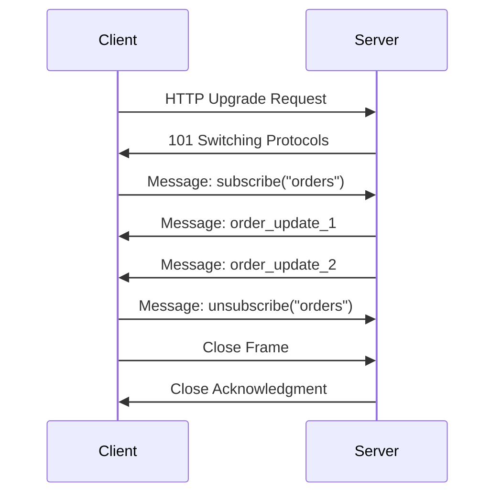
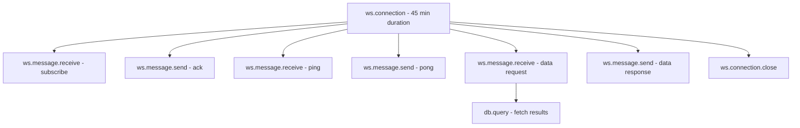

# How to Trace WebSocket Connections and Real-Time Events with OpenTelemetry

Author: [nawazdhandala](https://www.github.com/nawazdhandala)

Tags: OpenTelemetry, WebSocket, Tracing, Real-Time, Observability

Description: Learn how to instrument WebSocket connections and trace real-time events using OpenTelemetry for full observability into persistent connections.

---

WebSocket connections behave very differently from traditional HTTP requests. They're long-lived, bidirectional, and carry dozens or even thousands of messages over a single connection. That makes them tricky to observe. Standard HTTP instrumentation won't capture what's happening inside a WebSocket session, so you need a deliberate approach to tracing these connections with OpenTelemetry.

In this guide, we'll walk through how to instrument WebSocket servers and clients, trace individual messages flowing through those connections, and tie everything together with proper span hierarchies and context propagation.

## Why WebSocket Tracing Is Different

HTTP request tracing is straightforward: one request, one response, one span. WebSockets break that model entirely. A single connection can stay open for hours, and during that time, the client and server exchange messages asynchronously in both directions.

Here's how a typical WebSocket lifecycle looks:



Because of this, you can't just wrap the whole connection in a single span. You need a connection-level span as the parent, and then child spans for each message or event that flows through the connection.

## Setting Up the OpenTelemetry SDK

Before instrumenting WebSocket code, you need the OpenTelemetry SDK configured and ready. Here's a basic setup for a Node.js application using the `ws` library.

```javascript
// tracing.js - Initialize OpenTelemetry before your app starts
const { NodeSDK } = require('@opentelemetry/sdk-node');
const { OTLPTraceExporter } = require('@opentelemetry/exporter-trace-otlp-http');
const { Resource } = require('@opentelemetry/resources');
const { ATTR_SERVICE_NAME } = require('@opentelemetry/semantic-conventions');

// Create the SDK with OTLP exporter pointing to your collector
const sdk = new NodeSDK({
  resource: new Resource({
    [ATTR_SERVICE_NAME]: 'websocket-server',
  }),
  traceExporter: new OTLPTraceExporter({
    url: 'http://localhost:4318/v1/traces', // OTLP HTTP endpoint
  }),
});

// Start the SDK before anything else runs
sdk.start();
```

Run this file as a preload or require it at the top of your entry point so the SDK initializes before your WebSocket server starts accepting connections.

## Tracing WebSocket Connection Lifecycle

The first thing to trace is the connection lifecycle itself. When a client connects, you create a parent span that lives as long as the connection. When the connection closes, you end that span.

```javascript
const { trace, SpanKind, SpanStatusCode } = require('@opentelemetry/api');
const WebSocket = require('ws');

const tracer = trace.getTracer('websocket-server', '1.0.0');
const wss = new WebSocket.Server({ port: 8080 });

wss.on('connection', (ws, req) => {
  // Create a long-lived span for the entire WebSocket connection
  const connectionSpan = tracer.startSpan('ws.connection', {
    kind: SpanKind.SERVER,
    attributes: {
      'ws.client.ip': req.socket.remoteAddress,
      'ws.url': req.url,
      'ws.protocol': ws.protocol || 'none',
    },
  });

  // Store the span context so child spans can reference it
  const connectionContext = trace.setSpan(
    require('@opentelemetry/api').context.active(),
    connectionSpan
  );

  ws.on('message', (data) => {
    // Each incoming message gets its own child span
    const messageSpan = tracer.startSpan(
      'ws.message.receive',
      {
        kind: SpanKind.SERVER,
        attributes: {
          'ws.message.type': typeof data === 'string' ? 'text' : 'binary',
          'ws.message.size': data.length,
        },
      },
      connectionContext // Link this span to the connection span
    );

    try {
      handleMessage(ws, data); // Your business logic here
      messageSpan.setStatus({ code: SpanStatusCode.OK });
    } catch (error) {
      messageSpan.setStatus({
        code: SpanStatusCode.ERROR,
        message: error.message,
      });
      messageSpan.recordException(error);
    } finally {
      messageSpan.end();
    }
  });

  ws.on('close', (code, reason) => {
    // Record the close reason and end the connection span
    connectionSpan.setAttribute('ws.close.code', code);
    connectionSpan.setAttribute('ws.close.reason', reason.toString());
    connectionSpan.setStatus({ code: SpanStatusCode.OK });
    connectionSpan.end();
  });

  ws.on('error', (error) => {
    // Mark the connection span as errored
    connectionSpan.setStatus({
      code: SpanStatusCode.ERROR,
      message: error.message,
    });
    connectionSpan.recordException(error);
  });
});
```

This gives you a clear hierarchy: one parent span per connection, with child spans for every message received.

## Tracing Outbound Messages

You'll also want to trace messages your server sends back to clients. This is especially useful for debugging latency in real-time applications like chat systems, live dashboards, or multiplayer games.

```javascript
// Helper function to send a message with tracing
function sendTracedMessage(ws, payload, parentContext) {
  const tracer = trace.getTracer('websocket-server');

  // Create a span for the outbound message
  const sendSpan = tracer.startSpan(
    'ws.message.send',
    {
      kind: SpanKind.CLIENT,
      attributes: {
        'ws.message.type': 'text',
        'ws.message.size': JSON.stringify(payload).length,
        'ws.message.event': payload.event || 'unknown',
      },
    },
    parentContext
  );

  const serialized = JSON.stringify(payload);

  ws.send(serialized, (error) => {
    if (error) {
      // Capture send failures - these often indicate dropped connections
      sendSpan.setStatus({ code: SpanStatusCode.ERROR, message: error.message });
      sendSpan.recordException(error);
    } else {
      sendSpan.setStatus({ code: SpanStatusCode.OK });
    }
    sendSpan.end();
  });
}
```

## Propagating Context Across WebSocket Messages

One of the trickiest parts of WebSocket tracing is context propagation. With HTTP, trace context travels in headers automatically. With WebSockets, you need to embed it in the message payload yourself.

The idea is simple: inject the trace context into outgoing messages and extract it from incoming messages. This lets you connect a trace that starts on the client all the way through the server and back.

```javascript
const { propagation, context } = require('@opentelemetry/api');

// Inject trace context into an outgoing WebSocket message
function injectTraceContext(message, activeContext) {
  const carrier = {};
  // Propagation API injects traceparent and tracestate into the carrier
  propagation.inject(activeContext, carrier);
  return {
    ...message,
    _trace: carrier, // Attach trace headers as a nested object
  };
}

// Extract trace context from an incoming WebSocket message
function extractTraceContext(message) {
  if (message._trace) {
    // Reconstruct the remote context from the embedded trace headers
    return propagation.extract(context.active(), message._trace);
  }
  return context.active(); // Fall back to current context if no trace data
}
```

When you receive a message on the server, call `extractTraceContext` and use the returned context as the parent for your processing span. This creates an unbroken trace from client to server.

## Span Hierarchy for WebSocket Tracing

Here's how the span hierarchy should look for a well-instrumented WebSocket application:



The connection span acts as the root, and every message or event hangs off it as a child. If processing a message triggers downstream calls (database queries, API calls, etc.), those show up as grandchildren of the connection span.

## Adding Custom Attributes for Real-Time Events

Real-time applications usually have domain-specific event types. Adding those as span attributes makes it much easier to filter and search traces later.

```javascript
// Parse the incoming message and set meaningful attributes
function handleMessage(ws, raw, messageSpan) {
  const message = JSON.parse(raw);

  // Tag the span with the event type for easy filtering
  messageSpan.setAttribute('ws.event.type', message.event);
  messageSpan.setAttribute('ws.event.channel', message.channel || 'default');

  switch (message.event) {
    case 'subscribe':
      messageSpan.setAttribute('ws.subscription.topic', message.topic);
      messageSpan.updateName(`ws.subscribe.${message.topic}`);
      break;
    case 'unsubscribe':
      messageSpan.setAttribute('ws.subscription.topic', message.topic);
      messageSpan.updateName(`ws.unsubscribe.${message.topic}`);
      break;
    case 'broadcast':
      // Track how many clients will receive this broadcast
      messageSpan.setAttribute('ws.broadcast.recipients', wss.clients.size);
      messageSpan.updateName('ws.broadcast');
      break;
  }
}
```

Renaming spans dynamically based on the event type is a powerful trick. Instead of seeing hundreds of generic `ws.message.receive` spans, you'll see `ws.subscribe.orders`, `ws.broadcast`, etc. That's much more useful when you're debugging.

## Metrics to Complement Tracing

Traces alone won't give you the full picture. You should also track WebSocket-specific metrics using the OpenTelemetry Metrics API.

```javascript
const { metrics } = require('@opentelemetry/api');

const meter = metrics.getMeter('websocket-server');

// Track the number of currently active connections
const activeConnections = meter.createUpDownCounter('ws.connections.active', {
  description: 'Number of active WebSocket connections',
});

// Track total messages sent and received
const messagesReceived = meter.createCounter('ws.messages.received.total', {
  description: 'Total WebSocket messages received',
});

const messagesSent = meter.createCounter('ws.messages.sent.total', {
  description: 'Total WebSocket messages sent',
});

// Track message processing latency
const processingDuration = meter.createHistogram('ws.message.processing.duration', {
  description: 'Time to process a WebSocket message in milliseconds',
  unit: 'ms',
});
```

Increment these counters alongside your tracing code. The combination of traces (for individual request debugging) and metrics (for aggregate health monitoring) gives you complete observability over your WebSocket infrastructure.

## Common Pitfalls to Avoid

There are a few mistakes that come up often when tracing WebSockets:

**Don't forget to end connection spans.** If a client disconnects unexpectedly and you miss the `close` or `error` event, you'll leak spans that never end. Always handle both events.

**Don't create too many spans.** If your WebSocket server handles thousands of messages per second, creating a span for every single one can overwhelm your collector. Consider sampling or only tracing messages that match specific event types.

**Keep message payloads out of span attributes.** It's tempting to dump the full message body into a span attribute, but that creates huge traces and can leak sensitive data. Stick to metadata like event type, message size, and channel name.

## Wrapping Up

Tracing WebSocket connections requires a different mindset than tracing HTTP. You need long-lived connection spans, child spans for individual messages, manual context propagation in message payloads, and careful attention to connection lifecycle events. But once you set it up, the visibility you get into your real-time systems is worth the effort. You'll be able to trace a user action from the moment they click a button, through the WebSocket message, into your backend processing, and back again.
