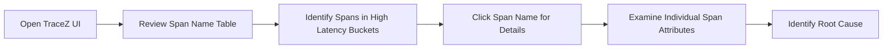
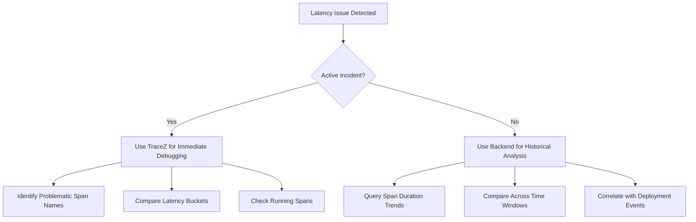

# How to Use the TraceZ Debug Interface to Diagnose Latency Issues

Author: [nawazdhandala](https://www.github.com/nawazdhandala)

Tags: OpenTelemetry, TraceZ, Debugging, Latency, zPages, Performance

Description: Learn how to use the OpenTelemetry TraceZ debug interface to identify and diagnose latency issues in your services with real-time span inspection.

---

When a service starts responding slowly, the first question is always "where is the time going?" Traditional approaches involve adding timing logs, shipping them to a log aggregator, and piecing together what happened. The TraceZ debug interface gives you a faster path. It is a built-in web page served by the OpenTelemetry Collector or SDK that shows you live span data, grouped by latency buckets, so you can immediately see which operations are taking too long.

TraceZ is part of the zPages extension. Unlike an external observability backend that involves network hops and processing delays, TraceZ runs inside the instrumented process itself. You get zero-latency access to span data, which is exactly what you need when diagnosing an active incident.

## What TraceZ Shows You

TraceZ organizes spans into three categories: running spans (in-flight operations that have not completed), error spans (completed with an error status), and latency-bucketed spans (completed successfully, grouped by how long they took).

The latency buckets follow a predefined set of ranges:

```
[0us, 10us)
[10us, 100us)
[100us, 1ms)
[1ms, 10ms)
[10ms, 100ms)
[100ms, 1s)
[1s, 10s)
[10s, 100s)
[100s, +inf)
```

Each bucket shows a count of spans that fell into that range. If you normally see most spans in the [1ms, 10ms) bucket and suddenly the [1s, 10s) bucket starts filling up, you know exactly where to look.

## Enabling TraceZ

TraceZ comes as part of the zPages extension. You can enable it in the Collector configuration with just a few lines.

```yaml
# collector-config.yaml
extensions:
  # Enable zPages which includes TraceZ, ServiceZ, and PipelineZ
  zpages:
    # The HTTP endpoint where zPages will be served
    endpoint: 0.0.0.0:55679

receivers:
  otlp:
    protocols:
      grpc:
        endpoint: 0.0.0.0:4317
      http:
        endpoint: 0.0.0.0:4318

processors:
  batch:
    timeout: 5s

exporters:
  otlp:
    endpoint: backend.example.com:4317

service:
  # Include zpages in the extensions list
  extensions: [zpages]
  pipelines:
    traces:
      receivers: [otlp]
      processors: [batch]
      exporters: [otlp]
```

Once the Collector starts, TraceZ is available at `http://localhost:55679/debug/tracez`. No additional dependencies or configuration needed.

## Enabling TraceZ in Application Code

You do not need the Collector to use TraceZ. The OpenTelemetry SDK for most languages includes a zPages implementation that you can embed directly in your application.

```python
# app.py - Python application with embedded TraceZ
from opentelemetry import trace
from opentelemetry.sdk.trace import TracerProvider
from opentelemetry.sdk.trace.export import (
    BatchSpanProcessor,
    ConsoleSpanExporter,
)

# Import the zPages extension for Python
from opentelemetry.ext.zpages import ZPagesSpanProcessor

# Create the tracer provider
provider = TracerProvider()

# Add the zPages processor which serves the TraceZ interface
# This starts an HTTP server on the specified port
zpages_processor = ZPagesSpanProcessor(
    # TraceZ will be available at http://localhost:8888/debug/tracez
    endpoint="localhost:8888"
)
provider.add_span_processor(zpages_processor)

# Also add a regular exporter for sending data to your backend
provider.add_span_processor(
    BatchSpanProcessor(ConsoleSpanExporter())
)

trace.set_tracer_provider(provider)
```

With this setup, your application serves TraceZ directly. This is particularly useful for debugging latency in a specific service without needing to inspect the Collector.

## Diagnosing a Latency Spike

Let me walk through a real debugging scenario. You have a web service that normally responds in under 50ms, but users are reporting intermittent slow responses of 2 to 5 seconds.

Step one: open TraceZ in your browser.

```
http://your-service-host:8888/debug/tracez
```

You will see a table of span names. Each row shows a span name and the count of spans in each latency bucket. Look for span names where the high-latency buckets have unusual counts.



Step two: click on the span name that shows counts in the [1s, 10s) bucket. TraceZ will show you the individual spans in that bucket, including their attributes, events, and timing details.

Step three: look at the span attributes. In our example, you might see something like this in the span details:

```
Span Name: HTTP GET /api/users
Duration: 3.2s
Attributes:
  http.method: GET
  http.url: /api/users?page=1&limit=100
  http.status_code: 200
  db.system: postgresql
  db.statement: SELECT * FROM users ORDER BY created_at DESC LIMIT 100 OFFSET 0
  db.duration_ms: 3150
```

The `db.duration_ms` attribute reveals that the database query took 3.15 seconds out of the 3.2 second total span duration. The latency is in the database, not in the application logic.

## Using TraceZ to Compare Normal and Slow Spans

One of the most powerful things about TraceZ is that you can compare spans from different latency buckets side by side. Look at a normal span from the [10ms, 100ms) bucket and a slow span from the [1s, 10s) bucket for the same operation.

```python
# Instrument your code with attributes that help compare spans
from opentelemetry import trace

tracer = trace.get_tracer("user-service")


def get_users(page, limit):
    with tracer.start_as_current_span("fetch_users") as span:
        # Add query parameters as attributes for debugging
        span.set_attribute("query.page", page)
        span.set_attribute("query.limit", limit)
        span.set_attribute("query.offset", (page - 1) * limit)

        # Record the cache check
        cache_result = check_cache(page, limit)
        span.set_attribute("cache.hit", cache_result is not None)

        if cache_result:
            span.add_event("cache.hit", {"cache.key": f"users:{page}:{limit}"})
            return cache_result

        # Cache miss - query the database
        span.add_event("cache.miss", {"cache.key": f"users:{page}:{limit}"})

        # Add connection pool info for debugging slow queries
        pool_stats = get_pool_stats()
        span.set_attribute("db.pool.active", pool_stats.active)
        span.set_attribute("db.pool.idle", pool_stats.idle)
        span.set_attribute("db.pool.waiting", pool_stats.waiting)

        result = query_database(page, limit)
        span.set_attribute("result.count", len(result))
        return result
```

When you compare the normal and slow spans in TraceZ, the attributes tell the story. Normal spans have `cache.hit: true`. Slow spans have `cache.hit: false` and `db.pool.waiting: 12`, meaning the request had to wait for a database connection from an exhausted pool. Now you know the fix: increase the connection pool size or add caching for this query pattern.

## Monitoring Running Spans

The "Running" column in TraceZ shows spans that have started but not yet finished. During a latency incident, this view is invaluable because it tells you what the service is currently doing.

If you see dozens of running spans for a specific operation, that operation is likely blocked or very slow. This is real-time information that you cannot get from a backend that processes spans after they complete.

```python
# Example: Long-running operation that might block
import time
from opentelemetry import trace

tracer = trace.get_tracer("data-pipeline")


def process_large_batch(items):
    with tracer.start_as_current_span("process_batch") as span:
        span.set_attribute("batch.size", len(items))
        span.set_attribute("batch.type", "full_reindex")

        for i, item in enumerate(items):
            # Add progress events so TraceZ shows what is happening
            if i % 100 == 0:
                span.add_event("progress", {
                    "items.processed": i,
                    "items.total": len(items),
                    "progress.percent": round(i / len(items) * 100, 1),
                })

            process_item(item)

        span.add_event("complete", {"items.processed": len(items)})
```

When you check TraceZ and see this span in the "Running" column, the events will show you exactly how far through the batch it is. That context helps you decide whether to wait, scale up, or investigate further.

## TraceZ vs. Full Observability Backend

TraceZ is not a replacement for a proper observability backend. It is a complementary tool for specific situations.



Use TraceZ when you need immediate, real-time visibility during an active incident. Use your observability backend when you need historical trends, cross-service correlation, or alerting. The best debugging workflows use both: TraceZ for the initial triage, and the backend for deeper analysis and tracking the fix over time.

## Practical Tips

A few things to keep in mind when using TraceZ in production.

First, TraceZ keeps a limited number of spans in memory. By default, it retains the most recent spans per bucket per span name. This means that in high-throughput services, older spans get evicted quickly. If you need to capture a specific slow span, check TraceZ promptly.

Second, restrict access to the TraceZ endpoint. Span data can contain sensitive information like database queries, user IDs, and internal URLs. Bind the zPages endpoint to localhost or put it behind authentication.

Third, use meaningful span names. TraceZ groups everything by span name. If all your spans are named "request" or "operation," the TraceZ table becomes useless. Follow OpenTelemetry naming conventions so that span names clearly identify the operation.

## Wrapping Up

TraceZ gives you a debugger-like view into your distributed tracing data without any external dependencies. When latency spikes hit, you can open a browser tab, look at the latency buckets, drill into slow spans, and identify the root cause in minutes. It is not a replacement for a full observability stack, but it is the fastest tool in your kit for answering "where is the time going right now?"

Enable zPages in your Collector or embed them in your application code. The next time a latency issue shows up, you will be glad you did.
