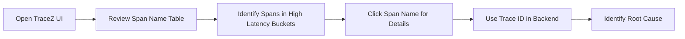
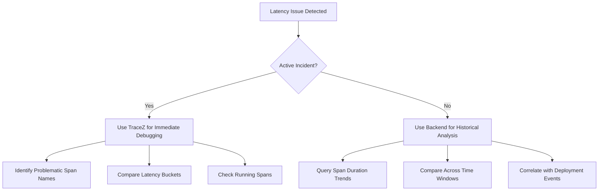

# How to Use the TraceZ Debug Interface to Diagnose Latency Issues

Author: [nawazdhandala](https://www.github.com/nawazdhandala)

Tags: OpenTelemetry, TraceZ, Debugging, Latency, ZPages, Performance

Description: Learn how to use the OpenTelemetry TraceZ debug interface to identify and diagnose latency issues in your services with real-time span inspection.

---

When a service starts responding slowly, the first question is always "where is the time going?" Traditional approaches involve adding timing logs, shipping them to a log aggregator, and piecing together what happened. The TraceZ debug interface gives you a faster path. It is a built-in web page served by the OpenTelemetry Collector zPages extension, or by language SDKs that provide a zPages implementation, that shows recent in-process span samples grouped by latency buckets.

TraceZ is part of the zPages extension. Unlike an external observability backend that involves network hops and processing delays, TraceZ runs inside the process that exposes it. In the Collector, that means TraceZ shows spans created by instrumented Collector components. In an application process, it can show the application spans recorded by that process if your language SDK includes zPages support.

## What TraceZ Shows You

TraceZ organizes spans into three categories: running spans (in-flight operations that have not completed), error samples, and latency-bucketed span samples grouped by how long they took.

The Collector zPages documentation describes the latency bucket scale as:

```text
(0us, 10us, 100us, 1ms, 10ms, 100ms, 1s, 10s, 1m]
```

Each bucket shows a count of spans that fell into that range. If you normally see most spans in the [1ms, 10ms) bucket and suddenly the [1s, 10s) bucket starts filling up, you know exactly where to look.

## Enabling TraceZ

TraceZ comes as part of the zPages extension. You can enable it in the Collector configuration with just a few lines.

```yaml
# collector-config.yaml

extensions:
  # Enable zPages which includes TraceZ, ServiceZ, PipelineZ, ExtensionZ, and FeatureZ
  zpages:
    # The HTTP endpoint where zPages will be served
    endpoint: 0.0.0.0:55679

receivers:
  otlp:
    protocols:
      grpc:
        endpoint: 0.0.0.0:4317
      http:
        endpoint: 0.0.0.0:4318

processors:
  batch:
    timeout: 5s

exporters:
  otlp:
    endpoint: backend.example.com:4317

service:
  # Include zpages in the extensions list
  extensions: [zpages]
  pipelines:
    traces:
      receivers: [otlp]
      processors: [batch]
      exporters: [otlp]
```

Once the Collector starts, TraceZ is available at `http://localhost:55679/debug/tracez`. Use this view to inspect Collector-internal trace operations, such as slow receiver or exporter work. It does not replace your tracing backend for browsing arbitrary application traces flowing through the Collector.

## Enabling TraceZ in Application Code

You do not need the Collector to use TraceZ when your language has a zPages implementation. For example, the OpenTelemetry Go contrib zPages package provides a span processor and HTTP handler that you can embed directly in a Go application.

```go
// main.go - Go application with embedded TraceZ
package main

import (
    "context"
    "log"
    "net/http"

    "go.opentelemetry.io/contrib/zpages"
    "go.opentelemetry.io/otel"
    sdktrace "go.opentelemetry.io/otel/sdk/trace"
)

func main() {
    // Create the zPages span processor.
    zpagesProcessor := zpages.NewSpanProcessor()

    // Add the processor to your tracer provider.
    provider := sdktrace.NewTracerProvider(
        sdktrace.WithSpanProcessor(zpagesProcessor),
    )
    otel.SetTracerProvider(provider)
    defer func() {
        _ = provider.Shutdown(context.Background())
    }()

    // Serve TraceZ at http://localhost:8888/debug/tracez.
    mux := http.NewServeMux()
    mux.Handle("/debug/tracez", zpages.NewTracezHandler(zpagesProcessor))

    go func() {
        log.Fatal(http.ListenAndServe("localhost:8888", mux))
    }()

    // Start the rest of your application here.
    select {}
}
```

With this setup, your application serves TraceZ directly. This is particularly useful for debugging latency in a specific service without needing to inspect the Collector.

## Diagnosing a Latency Spike

Let me walk through a real debugging scenario. You have a web service that normally responds in under 50ms, but users are reporting intermittent slow responses of 2 to 5 seconds.

Step one: open TraceZ in your browser.

```text
http://your-service-host:8888/debug/tracez
```

You will see a table of span names. Each row shows a span name and the count of spans in each latency bucket. Look for span names where the high-latency buckets have unusual counts.


```mermaid
graph LR
    A[Open TraceZ UI] --> B[Review Span Name Table]
    B --> C[Identify Spans in High Latency Buckets]
    C --> D[Click Span Name for Details]
    D --> E[Use Trace ID in Backend]
    E --> F[Identify Root Cause]
```

Step two: click on the span name that shows counts in the [1s, 10s) bucket. TraceZ will show sampled spans in that bucket with timing information and trace/span identifiers.

Step three: use the trace ID from TraceZ to inspect the full span in your tracing backend, or correlate it with structured logs that include the trace ID. In our example, you might see something like this in the backend span details:

```text
Span Name: HTTP GET /api/users
Duration: 3.2s
Attributes:
  http.method: GET
  http.url: /api/users?page=1&limit=100
  http.status_code: 200
  db.system: postgresql
  db.statement: SELECT * FROM users ORDER BY created_at DESC LIMIT 100 OFFSET 0
  db.duration_ms: 3150
```

The `db.duration_ms` attribute reveals that the database query took 3.15 seconds out of the 3.2 second total span duration. The latency is in the database, not in the application logic.

## Using TraceZ to Compare Normal and Slow Operations

One of the most powerful things about TraceZ is that you can quickly identify normal and slow samples from different latency buckets. Use a normal trace ID from the [10ms, 100ms) bucket and a slow trace ID from the [1s, 10s) bucket for the same operation, then compare the full spans in your backend.

```python
# Instrument your code with attributes that help compare spans
from opentelemetry import trace

tracer = trace.get_tracer("user-service")


def get_users(page, limit):
    with tracer.start_as_current_span("fetch_users") as span:
        # Add query parameters as attributes for debugging
        span.set_attribute("query.page", page)
        span.set_attribute("query.limit", limit)
        span.set_attribute("query.offset", (page - 1) * limit)

        # Record the cache check
        cache_result = check_cache(page, limit)
        span.set_attribute("cache.hit", cache_result is not None)

        if cache_result:
            span.add_event("cache.hit", {"cache.key": f"users:{page}:{limit}"})
            return cache_result

        # Cache miss - query the database
        span.add_event("cache.miss", {"cache.key": f"users:{page}:{limit}"})

        # Add connection pool info for debugging slow queries
        pool_stats = get_pool_stats()
        span.set_attribute("db.pool.active", pool_stats.active)
        span.set_attribute("db.pool.idle", pool_stats.idle)
        span.set_attribute("db.pool.waiting", pool_stats.waiting)

        result = query_database(page, limit)
        span.set_attribute("result.count", len(result))
        return result
```

When you compare the normal and slow spans in your backend, the attributes tell the story. Normal spans have `cache.hit: true`. Slow spans have `cache.hit: false` and `db.pool.waiting: 12`, meaning the request had to wait for a database connection from an exhausted pool. TraceZ helped you find the slow samples quickly; the backend gives you the full span detail. Now you know the fix: increase the connection pool size or add caching for this query pattern.

## Monitoring Running Spans

The "Running" column in TraceZ shows spans that have started but not yet finished. During a latency incident, this view is invaluable because it tells you what the service is currently doing.

If you see dozens of running spans for a specific operation, that operation is likely blocked or very slow. This is real-time information that you cannot get from a backend that processes spans after they complete.

```python
# Example: Long-running operation that might block
import time
from opentelemetry import trace

tracer = trace.get_tracer("data-pipeline")


def process_large_batch(items):
    with tracer.start_as_current_span("process_batch") as span:
        span.set_attribute("batch.size", len(items))
        span.set_attribute("batch.type", "full_reindex")

        for i, item in enumerate(items):
            # Add progress events so your backend can show what is happening
            if i % 100 == 0:
                span.add_event("progress", {
                    "items.processed": i,
                    "items.total": len(items),
                    "progress.percent": round(i / len(items) * 100, 1),
                })

            process_item(item)

        span.add_event("complete", {"items.processed": len(items)})
```

When you check TraceZ and see this span in the "Running" column, you know the operation is still in flight. The progress events become useful when the span is exported to your backend or when you correlate the trace ID with application logs. That context helps you decide whether to wait, scale up, or investigate further.

## TraceZ vs. Full Observability Backend

TraceZ is not a replacement for a proper observability backend. It is a complementary tool for specific situations.


```mermaid
graph TD
    A[Latency Issue Detected] --> B{Active Incident?}
    B -->|Yes| C[Use TraceZ for Immediate Debugging]
    B -->|No| D[Use Backend for Historical Analysis]
    C --> E[Identify Problematic Span Names]
    C --> F[Compare Latency Buckets]
    C --> G[Check Running Spans]
    D --> H[Query Span Duration Trends]
    D --> I[Compare Across Time Windows]
    D --> J[Correlate with Deployment Events]
```

Use TraceZ when you need immediate, real-time visibility during an active incident. Use your observability backend when you need full span attributes, events, historical trends, cross-service correlation, or alerting. The best debugging workflows use both: TraceZ for the initial triage, and the backend for deeper analysis and tracking the fix over time.

## Practical Tips

A few things to keep in mind when using TraceZ in production.

First, TraceZ keeps a limited number of spans in memory. It retains samples per bucket per span name rather than acting as durable trace storage. This means that in high-throughput services, older samples get evicted quickly. If you need to capture a specific slow span, check TraceZ promptly.

Second, restrict access to the TraceZ endpoint. Span data can contain sensitive information like database queries, user IDs, and internal URLs. Bind the zPages endpoint to localhost or put it behind authentication.

Third, use meaningful span names. TraceZ groups everything by span name. If all your spans are named "request" or "operation," the TraceZ table becomes useless. Follow OpenTelemetry naming conventions so that span names clearly identify the operation.

## Wrapping Up

TraceZ gives you a debugger-like view into recent in-process tracing activity without any external dependencies. When latency spikes hit, you can open a browser tab, look at the latency buckets, find slow span samples, and decide where to investigate next. It is not a replacement for a full observability stack, but it is a fast tool in your kit for answering "where is the time going right now?"

Enable zPages in your Collector for Collector-internal diagnostics, or embed a supported zPages implementation in your application code. The next time a latency issue shows up, you will be glad you did.
