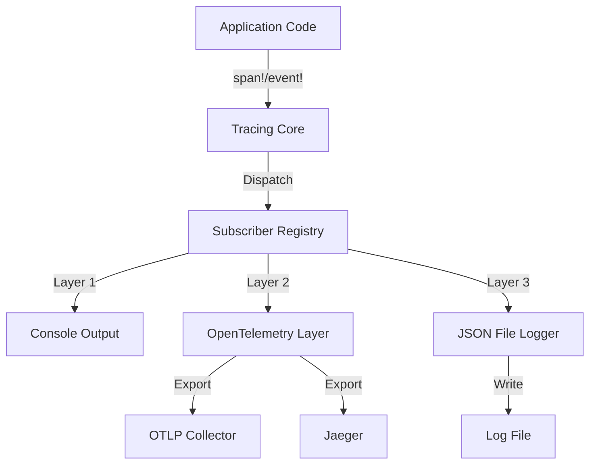

# How to Use tracing-subscriber with OpenTelemetry Layer in Rust

Author: [nawazdhandala](https://www.github.com/nawazdhandala)

Tags: OpenTelemetry, Rust, tracing-subscriber, Layer, Logging, Tracing

Description: Master the configuration of tracing-subscriber with OpenTelemetry layers to create powerful observability pipelines in Rust applications.

The tracing-subscriber crate provides the foundation for structured logging and distributed tracing in Rust applications. When combined with OpenTelemetry layers, it creates a flexible observability pipeline that can route telemetry data to multiple backends simultaneously while maintaining high performance and low overhead.

This guide explores the architecture of tracing-subscriber, demonstrates how to configure OpenTelemetry layers, and shows advanced patterns for building production-ready observability systems.

## Understanding tracing-subscriber Architecture

The tracing-subscriber crate implements a composable layer system where each layer processes events independently. This architecture enables powerful combinations:



Each layer receives the same events but processes them differently. The OpenTelemetry layer converts tracing spans into OpenTelemetry spans and exports them to configured backends.

## Core Dependencies

Add these dependencies to your `Cargo.toml`:

```toml
[dependencies]
# Core tracing infrastructure
tracing = "0.1"
tracing-subscriber = { version = "0.3", features = [
    "env-filter",
    "json",
    "registry",
    "fmt",
] }

# OpenTelemetry integration
opentelemetry = "0.22"
opentelemetry_sdk = { version = "0.22", features = ["rt-tokio"] }
opentelemetry-otlp = { version = "0.15", features = ["tonic"] }
tracing-opentelemetry = "0.23"

# Additional exporters
opentelemetry-jaeger = "0.21"
opentelemetry-zipkin = "0.20"

# Async runtime
tokio = { version = "1.35", features = ["full"] }
```

## Basic Layer Configuration

Start with a simple configuration combining console output and OpenTelemetry:

```rust
use opentelemetry::{global, KeyValue};
use opentelemetry_sdk::{runtime, trace as sdktrace, Resource};
use tracing_subscriber::{
    layer::SubscriberExt,
    util::SubscriberInitExt,
    Layer, Registry,
};

fn init_basic_tracing() -> Result<(), Box<dyn std::error::Error>> {
    // Create OpenTelemetry tracer
    let tracer = opentelemetry_otlp::new_pipeline()
        .tracing()
        .with_exporter(
            opentelemetry_otlp::new_exporter()
                .tonic()
                .with_endpoint("http://localhost:4317"),
        )
        .with_trace_config(
            sdktrace::Config::default().with_resource(Resource::new(vec![
                KeyValue::new("service.name", "rust-service"),
                KeyValue::new("service.version", "1.0.0"),
            ])),
        )
        .install_batch(runtime::Tokio)?;

    // Create OpenTelemetry layer
    let telemetry_layer = tracing_opentelemetry::layer().with_tracer(tracer);

    // Create formatting layer for console output
    let fmt_layer = tracing_subscriber::fmt::layer()
        .with_target(true)
        .with_thread_ids(true)
        .with_line_number(true);

    // Combine layers into a subscriber
    tracing_subscriber::registry()
        .with(telemetry_layer)
        .with(fmt_layer)
        .init();

    Ok(())
}
```

## Environment-Based Filter Configuration

Implement dynamic filtering using environment variables:

```rust
use tracing_subscriber::{EnvFilter, Layer};

fn init_with_env_filter() -> Result<(), Box<dyn std::error::Error>> {
    // Configure filter from RUST_LOG environment variable
    // Default to "info" if not set
    // Example: RUST_LOG=debug,hyper=warn,tokio=info
    let env_filter = EnvFilter::try_from_default_env()
        .unwrap_or_else(|_| EnvFilter::new("info"));

    let tracer = opentelemetry_otlp::new_pipeline()
        .tracing()
        .with_exporter(
            opentelemetry_otlp::new_exporter()
                .tonic()
                .with_endpoint("http://localhost:4317"),
        )
        .with_trace_config(
            sdktrace::Config::default().with_resource(Resource::new(vec![
                KeyValue::new("service.name", "filtered-service"),
            ])),
        )
        .install_batch(runtime::Tokio)?;

    let telemetry_layer = tracing_opentelemetry::layer().with_tracer(tracer);

    // Apply filter to console output but not to OpenTelemetry
    let fmt_layer = tracing_subscriber::fmt::layer()
        .with_filter(env_filter.clone());

    // OpenTelemetry gets all events regardless of console filter
    let otel_layer = telemetry_layer.with_filter(env_filter);

    tracing_subscriber::registry()
        .with(otel_layer)
        .with(fmt_layer)
        .init();

    Ok(())
}
```

## Multiple Backend Configuration

Export telemetry to multiple backends simultaneously:

```rust
use opentelemetry_sdk::trace::TracerProvider;

fn init_multi_backend() -> Result<(), Box<dyn std::error::Error>> {
    // Configure OTLP exporter for primary backend
    let otlp_tracer = opentelemetry_otlp::new_pipeline()
        .tracing()
        .with_exporter(
            opentelemetry_otlp::new_exporter()
                .tonic()
                .with_endpoint("http://localhost:4317"),
        )
        .with_trace_config(
            sdktrace::Config::default().with_resource(Resource::new(vec![
                KeyValue::new("service.name", "multi-backend-service"),
            ])),
        )
        .install_batch(runtime::Tokio)?;

    // Configure Jaeger exporter for development environment
    let jaeger_tracer = opentelemetry_jaeger::new_agent_pipeline()
        .with_service_name("multi-backend-service")
        .with_endpoint("localhost:6831")
        .install_batch(runtime::Tokio)?;

    // Create layers for each backend
    let otlp_layer = tracing_opentelemetry::layer().with_tracer(otlp_tracer);
    let jaeger_layer = tracing_opentelemetry::layer().with_tracer(jaeger_tracer);

    // Console formatting layer
    let fmt_layer = tracing_subscriber::fmt::layer()
        .with_target(false)
        .compact();

    // Combine all layers
    tracing_subscriber::registry()
        .with(otlp_layer)
        .with(jaeger_layer)
        .with(fmt_layer)
        .init();

    Ok(())
}
```

## Custom Layer for Metrics Collection

Create a custom layer that extracts metrics from spans:

```rust
use tracing::{span, Subscriber};
use tracing_subscriber::layer::Context;
use tracing_subscriber::Layer;
use std::sync::atomic::{AtomicU64, Ordering};
use std::sync::Arc;

#[derive(Clone)]
pub struct MetricsLayer {
    span_count: Arc<AtomicU64>,
    event_count: Arc<AtomicU64>,
    error_count: Arc<AtomicU64>,
}

impl MetricsLayer {
    pub fn new() -> Self {
        Self {
            span_count: Arc::new(AtomicU64::new(0)),
            event_count: Arc::new(AtomicU64::new(0)),
            error_count: Arc::new(AtomicU64::new(0)),
        }
    }

    pub fn get_metrics(&self) -> (u64, u64, u64) {
        (
            self.span_count.load(Ordering::Relaxed),
            self.event_count.load(Ordering::Relaxed),
            self.error_count.load(Ordering::Relaxed),
        )
    }
}

impl<S> Layer<S> for MetricsLayer
where
    S: Subscriber,
{
    fn on_new_span(
        &self,
        _attrs: &span::Attributes<'_>,
        _id: &span::Id,
        _ctx: Context<'_, S>,
    ) {
        self.span_count.fetch_add(1, Ordering::Relaxed);
    }

    fn on_event(&self, event: &tracing::Event<'_>, _ctx: Context<'_, S>) {
        self.event_count.fetch_add(1, Ordering::Relaxed);

        // Count errors specifically
        if event.metadata().level() == &tracing::Level::ERROR {
            self.error_count.fetch_add(1, Ordering::Relaxed);
        }
    }
}

// Use the custom layer alongside OpenTelemetry
fn init_with_metrics_layer() -> Result<MetricsLayer, Box<dyn std::error::Error>> {
    let metrics_layer = MetricsLayer::new();

    let tracer = opentelemetry_otlp::new_pipeline()
        .tracing()
        .with_exporter(
            opentelemetry_otlp::new_exporter()
                .tonic()
                .with_endpoint("http://localhost:4317"),
        )
        .with_trace_config(
            sdktrace::Config::default().with_resource(Resource::new(vec![
                KeyValue::new("service.name", "metrics-service"),
            ])),
        )
        .install_batch(runtime::Tokio)?;

    let telemetry_layer = tracing_opentelemetry::layer().with_tracer(tracer);

    tracing_subscriber::registry()
        .with(metrics_layer.clone())
        .with(telemetry_layer)
        .with(tracing_subscriber::fmt::layer())
        .init();

    Ok(metrics_layer)
}
```

## Structured JSON Logging with OpenTelemetry

Combine JSON structured logging with OpenTelemetry tracing:

```rust
use tracing_subscriber::fmt::format::FmtSpan;
use std::fs::File;
use std::sync::Arc;

fn init_json_logging() -> Result<(), Box<dyn std::error::Error>> {
    // Create log file for JSON output
    let log_file = File::create("application.log")?;

    // JSON formatting layer for file output
    let json_layer = tracing_subscriber::fmt::layer()
        .json()
        .with_writer(Arc::new(log_file))
        .with_span_events(FmtSpan::CLOSE)
        .with_current_span(true)
        .with_span_list(true);

    // Human-readable console output
    let console_layer = tracing_subscriber::fmt::layer()
        .pretty()
        .with_writer(std::io::stdout);

    // OpenTelemetry layer
    let tracer = opentelemetry_otlp::new_pipeline()
        .tracing()
        .with_exporter(
            opentelemetry_otlp::new_exporter()
                .tonic()
                .with_endpoint("http://localhost:4317"),
        )
        .with_trace_config(
            sdktrace::Config::default().with_resource(Resource::new(vec![
                KeyValue::new("service.name", "json-logging-service"),
            ])),
        )
        .install_batch(runtime::Tokio)?;

    let otel_layer = tracing_opentelemetry::layer().with_tracer(tracer);

    // Combine all three layers
    tracing_subscriber::registry()
        .with(json_layer)
        .with(console_layer)
        .with(otel_layer)
        .init();

    Ok(())
}
```

## Dynamic Layer Reload

Implement runtime configuration changes without restart:

```rust
use tracing_subscriber::reload;
use tracing_subscriber::EnvFilter;

fn init_reloadable_tracing() -> Result<reload::Handle<EnvFilter, Registry>, Box<dyn std::error::Error>> {
    // Create initial filter
    let initial_filter = EnvFilter::new("info");

    // Create reloadable layer
    let (filter, reload_handle) = reload::Layer::new(initial_filter);

    let tracer = opentelemetry_otlp::new_pipeline()
        .tracing()
        .with_exporter(
            opentelemetry_otlp::new_exporter()
                .tonic()
                .with_endpoint("http://localhost:4317"),
        )
        .install_batch(runtime::Tokio)?;

    let telemetry_layer = tracing_opentelemetry::layer().with_tracer(tracer);

    let fmt_layer = tracing_subscriber::fmt::layer().with_filter(filter);

    tracing_subscriber::registry()
        .with(telemetry_layer)
        .with(fmt_layer)
        .init();

    Ok(reload_handle)
}

// Later in your application, change filter level dynamically
async fn change_log_level(
    handle: reload::Handle<EnvFilter, Registry>,
    new_level: &str,
) -> Result<(), Box<dyn std::error::Error>> {
    let new_filter = EnvFilter::new(new_level);
    handle.reload(new_filter)?;
    tracing::info!("Log level changed to: {}", new_level);
    Ok(())
}
```

## Per-Module Filtering

Configure different trace levels for different modules:

```rust
fn init_per_module_filtering() -> Result<(), Box<dyn std::error::Error>> {
    // Complex filter with per-module settings
    let filter = EnvFilter::new("info")
        .add_directive("my_app::database=debug".parse()?)
        .add_directive("my_app::api=trace".parse()?)
        .add_directive("hyper=warn".parse()?)
        .add_directive("tokio=info".parse()?);

    let tracer = opentelemetry_otlp::new_pipeline()
        .tracing()
        .with_exporter(
            opentelemetry_otlp::new_exporter()
                .tonic()
                .with_endpoint("http://localhost:4317"),
        )
        .with_trace_config(
            sdktrace::Config::default().with_resource(Resource::new(vec![
                KeyValue::new("service.name", "filtered-modules-service"),
            ])),
        )
        .install_batch(runtime::Tokio)?;

    let telemetry_layer = tracing_opentelemetry::layer().with_tracer(tracer);

    let fmt_layer = tracing_subscriber::fmt::layer().with_filter(filter);

    tracing_subscriber::registry()
        .with(telemetry_layer)
        .with(fmt_layer)
        .init();

    Ok(())
}
```

## Sampling Configuration

Implement trace sampling to reduce overhead in high-traffic services:

```rust
use opentelemetry_sdk::trace::{RandomIdGenerator, Sampler};

fn init_with_sampling() -> Result<(), Box<dyn std::error::Error>> {
    // Sample 10% of traces
    let sampler = Sampler::TraceIdRatioBased(0.1);

    let tracer = opentelemetry_otlp::new_pipeline()
        .tracing()
        .with_exporter(
            opentelemetry_otlp::new_exporter()
                .tonic()
                .with_endpoint("http://localhost:4317"),
        )
        .with_trace_config(
            sdktrace::Config::default()
                .with_sampler(sampler)
                .with_id_generator(RandomIdGenerator::default())
                .with_resource(Resource::new(vec![
                    KeyValue::new("service.name", "sampled-service"),
                    KeyValue::new("sampling.rate", "0.1"),
                ])),
        )
        .install_batch(runtime::Tokio)?;

    let telemetry_layer = tracing_opentelemetry::layer().with_tracer(tracer);

    tracing_subscriber::registry()
        .with(telemetry_layer)
        .with(tracing_subscriber::fmt::layer())
        .init();

    Ok(())
}

// Parent-based sampling: always sample if parent was sampled
fn init_parent_based_sampling() -> Result<(), Box<dyn std::error::Error>> {
    let sampler = Sampler::ParentBased(Box::new(Sampler::TraceIdRatioBased(0.1)));

    let tracer = opentelemetry_otlp::new_pipeline()
        .tracing()
        .with_exporter(
            opentelemetry_otlp::new_exporter()
                .tonic()
                .with_endpoint("http://localhost:4317"),
        )
        .with_trace_config(
            sdktrace::Config::default()
                .with_sampler(sampler)
                .with_resource(Resource::new(vec![
                    KeyValue::new("service.name", "parent-sampled-service"),
                ])),
        )
        .install_batch(runtime::Tokio)?;

    let telemetry_layer = tracing_opentelemetry::layer().with_tracer(tracer);

    tracing_subscriber::registry()
        .with(telemetry_layer)
        .with(tracing_subscriber::fmt::layer())
        .init();

    Ok(())
}
```

## Application Example

Put it all together in a working application:

```rust
use tracing::{info, warn, error, instrument};
use tokio::time::{sleep, Duration};

#[instrument]
async fn process_request(user_id: u64, request_data: String) -> Result<String, String> {
    info!(user_id = user_id, "Processing request");

    // Simulate some work
    sleep(Duration::from_millis(100)).await;

    if request_data.is_empty() {
        warn!("Empty request data received");
        return Err("Invalid request".to_string());
    }

    info!("Request processed successfully");
    Ok(format!("Processed: {}", request_data))
}

#[instrument]
async fn handle_batch(items: Vec<String>) {
    info!(item_count = items.len(), "Starting batch processing");

    for (idx, item) in items.iter().enumerate() {
        match process_request(idx as u64, item.clone()).await {
            Ok(result) => info!(index = idx, result = %result, "Item processed"),
            Err(e) => error!(index = idx, error = %e, "Item processing failed"),
        }
    }

    info!("Batch processing complete");
}

#[tokio::main]
async fn main() -> Result<(), Box<dyn std::error::Error>> {
    // Initialize with all layers
    let metrics = init_with_metrics_layer()?;

    info!("Application started");

    // Simulate some application work
    let items = vec![
        "request1".to_string(),
        "request2".to_string(),
        "".to_string(), // This will error
        "request3".to_string(),
    ];

    handle_batch(items).await;

    // Print collected metrics
    let (spans, events, errors) = metrics.get_metrics();
    info!(
        spans = spans,
        events = events,
        errors = errors,
        "Metrics collected"
    );

    // Graceful shutdown
    info!("Shutting down");
    opentelemetry::global::shutdown_tracer_provider();

    Ok(())
}
```

## Error Handling and Graceful Shutdown

Implement robust error handling for telemetry initialization:

```rust
use tracing::warn;

fn init_telemetry_with_fallback() {
    match init_with_env_filter() {
        Ok(_) => {
            tracing::info!("OpenTelemetry initialized successfully");
        }
        Err(e) => {
            // Fall back to basic console logging if OpenTelemetry fails
            warn!("Failed to initialize OpenTelemetry: {}. Using console logging only.", e);

            tracing_subscriber::fmt()
                .with_env_filter(EnvFilter::from_default_env())
                .init();
        }
    }
}

async fn shutdown_telemetry() {
    // Flush all pending spans
    opentelemetry::global::shutdown_tracer_provider();

    // Give exporters time to complete
    tokio::time::sleep(Duration::from_millis(500)).await;

    tracing::info!("Telemetry shutdown complete");
}
```

## Performance Considerations

When configuring tracing-subscriber with OpenTelemetry:

**Layer Ordering**: Place filtering layers before expensive layers. Filtered events skip subsequent layer processing, reducing overhead.

**Batch Export**: Always use batch span processors instead of simple processors. Batching significantly reduces network overhead and improves throughput.

**Selective Instrumentation**: Use environment-based filtering to disable verbose tracing in production while keeping it available for debugging.

**Memory Management**: Configure appropriate batch sizes and timeouts. Default settings work for most cases, but high-throughput services may need tuning.

**Multiple Tracers**: Creating multiple tracers for different backends has minimal overhead. The tracing framework efficiently dispatches to multiple subscribers.

The tracing-subscriber crate with OpenTelemetry layers creates a powerful, flexible observability system. By composing different layers, you can route telemetry to multiple backends, implement custom processing, and maintain fine-grained control over what data gets collected and exported. This architecture provides production-ready observability while maintaining the performance characteristics required for high-throughput Rust services.
