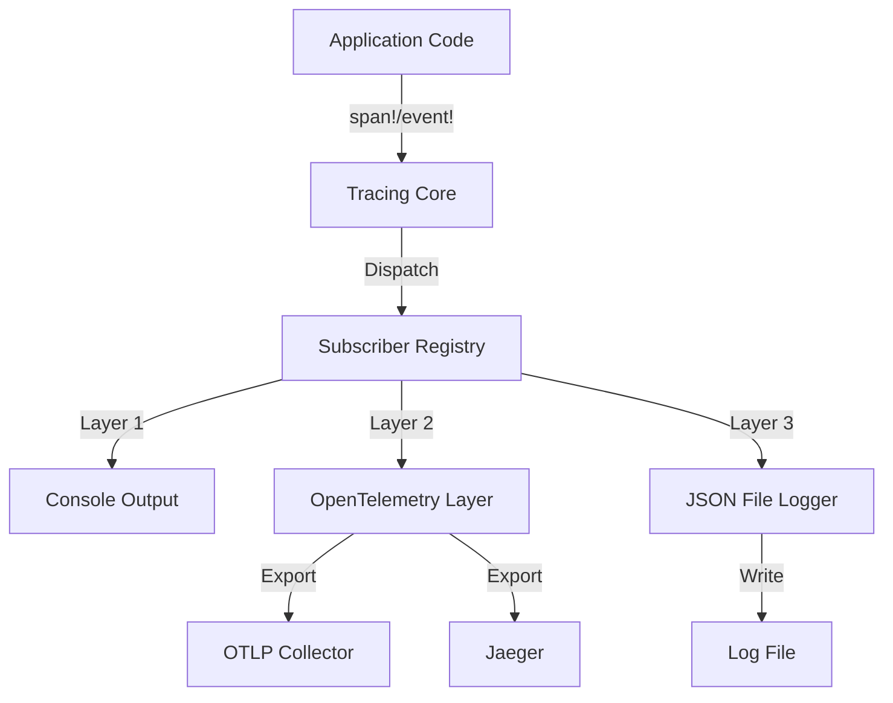

# How to Use tracing-subscriber with OpenTelemetry Layer in Rust

Author: [nawazdhandala](https://www.github.com/nawazdhandala)

Tags: OpenTelemetry, Rust, Tracing-subscriber, Layer, Logging, Tracing

Description: Master the configuration of tracing-subscriber with OpenTelemetry layers to create powerful observability pipelines in Rust applications.

The tracing-subscriber crate provides the foundation for structured logging and distributed tracing in Rust applications. When combined with OpenTelemetry layers, it creates a flexible observability pipeline that can route telemetry data to multiple backends simultaneously while maintaining high performance and low overhead.

This guide explores the architecture of tracing-subscriber, demonstrates how to configure OpenTelemetry layers, and shows advanced patterns for building production-ready observability systems.

## Understanding tracing-subscriber Architecture

The tracing-subscriber crate implements a composable layer system where each layer processes events independently. This architecture enables powerful combinations:


```mermaid
graph TD
    A[Application Code] -->|span!/event!| B[Tracing Core]
    B -->|Dispatch| C[Subscriber Registry]
    C -->|Layer 1| D[Console Output]
    C -->|Layer 2| E[OpenTelemetry Layer]
    C -->|Layer 3| F[JSON File Logger]
    E -->|Export| G[OTLP Collector]
    E -->|Export| H[Jaeger]
    F -->|Write| I[Log File]
```

Each layer receives the same events but processes them differently. The OpenTelemetry layer converts tracing spans into OpenTelemetry spans and exports them to configured backends.

## Core Dependencies

Add these dependencies to your `Cargo.toml`:

```toml
[dependencies]
# Core tracing infrastructure

tracing = "0.1"
tracing-subscriber = { version = "0.3", features = [
    "env-filter",
    "json",
    "registry",
    "fmt",
] }

# OpenTelemetry integration
opentelemetry = "0.32"
opentelemetry_sdk = { version = "0.32", features = ["rt-tokio"] }
opentelemetry-otlp = { version = "0.32", features = ["grpc-tonic"] }
tracing-opentelemetry = "0.33"

# Async runtime
tokio = { version = "1.52", features = ["full"] }
```

## Basic Layer Configuration

Start with a simple configuration combining console output and OpenTelemetry:

```rust
use opentelemetry::trace::TracerProvider as _;
use opentelemetry::KeyValue;
use opentelemetry_otlp::WithExportConfig;
use opentelemetry_sdk::{trace as sdktrace, Resource};
use opentelemetry_sdk::trace::SdkTracerProvider;
use tracing_subscriber::{
    layer::SubscriberExt,
    util::SubscriberInitExt,
};

fn init_basic_tracing() -> Result<SdkTracerProvider, Box<dyn std::error::Error + Send + Sync>> {
    // Create OpenTelemetry exporter and tracer provider
    let exporter = opentelemetry_otlp::SpanExporter::builder()
        .with_tonic()
        .with_endpoint("http://localhost:4317")
        .build()?;

    let provider = sdktrace::SdkTracerProvider::builder()
        .with_batch_exporter(exporter)
        .with_resource(
            Resource::builder()
                .with_service_name("rust-service")
                .with_attributes([KeyValue::new("service.version", "1.0.0")])
                .build(),
        )
        .build();
    let tracer = provider.tracer("rust-service");

    // Create OpenTelemetry layer
    let telemetry_layer = tracing_opentelemetry::layer().with_tracer(tracer);

    // Create formatting layer for console output
    let fmt_layer = tracing_subscriber::fmt::layer()
        .with_target(true)
        .with_thread_ids(true)
        .with_line_number(true);

    // Combine layers into a subscriber
    tracing_subscriber::registry()
        .with(telemetry_layer)
        .with(fmt_layer)
        .init();

    Ok(provider)
}
```

## Environment-Based Filter Configuration

Implement dynamic filtering using environment variables:

```rust
use tracing_subscriber::{EnvFilter, Layer};

fn init_with_env_filter() -> Result<SdkTracerProvider, Box<dyn std::error::Error + Send + Sync>> {
    // Configure filter from RUST_LOG environment variable
    // Default to "info" if not set
    // Example: RUST_LOG=debug,hyper=warn,tokio=info
    let env_filter = EnvFilter::try_from_default_env()
        .unwrap_or_else(|_| EnvFilter::new("info"));

    let exporter = opentelemetry_otlp::SpanExporter::builder()
        .with_tonic()
        .with_endpoint("http://localhost:4317")
        .build()?;

    let provider = sdktrace::SdkTracerProvider::builder()
        .with_batch_exporter(exporter)
        .with_resource(
            Resource::builder()
                .with_service_name("filtered-service")
                .build(),
        )
        .build();
    let tracer = provider.tracer("filtered-service");

    let telemetry_layer = tracing_opentelemetry::layer().with_tracer(tracer);

    // Apply the filter to console output
    let fmt_layer = tracing_subscriber::fmt::layer()
        .with_filter(env_filter.clone());

    // Apply the same filter to OpenTelemetry export
    let otel_layer = telemetry_layer.with_filter(env_filter);

    tracing_subscriber::registry()
        .with(otel_layer)
        .with(fmt_layer)
        .init();

    Ok(provider)
}
```

## Multiple Backend Configuration

Export telemetry to multiple backends simultaneously:

```rust
fn init_multi_backend() -> Result<(SdkTracerProvider, SdkTracerProvider), Box<dyn std::error::Error + Send + Sync>> {
    // Configure OTLP exporter for primary backend
    let otlp_exporter = opentelemetry_otlp::SpanExporter::builder()
        .with_tonic()
        .with_endpoint("http://collector:4317")
        .build()?;

    let otlp_provider = sdktrace::SdkTracerProvider::builder()
        .with_batch_exporter(otlp_exporter)
        .with_resource(
            Resource::builder()
                .with_service_name("multi-backend-service")
                .build(),
        )
        .build();
    let otlp_tracer = otlp_provider.tracer("multi-backend-service");

    // Configure Jaeger through its OTLP endpoint for development
    let jaeger_exporter = opentelemetry_otlp::SpanExporter::builder()
        .with_tonic()
        .with_endpoint("http://localhost:4317")
        .build()?;

    let jaeger_provider = sdktrace::SdkTracerProvider::builder()
        .with_batch_exporter(jaeger_exporter)
        .with_resource(
            Resource::builder()
                .with_service_name("multi-backend-service")
                .build(),
        )
        .build();
    let jaeger_tracer = jaeger_provider.tracer("multi-backend-service-jaeger");

    // Create layers for each backend
    let otlp_layer = tracing_opentelemetry::layer().with_tracer(otlp_tracer);
    let jaeger_layer = tracing_opentelemetry::layer().with_tracer(jaeger_tracer);

    // Console formatting layer
    let fmt_layer = tracing_subscriber::fmt::layer()
        .with_target(false)
        .compact();

    // Combine all layers
    tracing_subscriber::registry()
        .with(otlp_layer)
        .with(jaeger_layer)
        .with(fmt_layer)
        .init();

    Ok((otlp_provider, jaeger_provider))
}
```

## Custom Layer for Metrics Collection

Create a custom layer that extracts metrics from spans:

```rust
use tracing::{span, Subscriber};
use tracing_subscriber::layer::Context;
use tracing_subscriber::Layer;
use std::sync::atomic::{AtomicU64, Ordering};
use std::sync::Arc;

#[derive(Clone)]
pub struct MetricsLayer {
    span_count: Arc<AtomicU64>,
    event_count: Arc<AtomicU64>,
    error_count: Arc<AtomicU64>,
}

impl MetricsLayer {
    pub fn new() -> Self {
        Self {
            span_count: Arc::new(AtomicU64::new(0)),
            event_count: Arc::new(AtomicU64::new(0)),
            error_count: Arc::new(AtomicU64::new(0)),
        }
    }

    pub fn get_metrics(&self) -> (u64, u64, u64) {
        (
            self.span_count.load(Ordering::Relaxed),
            self.event_count.load(Ordering::Relaxed),
            self.error_count.load(Ordering::Relaxed),
        )
    }
}

impl<Svc> Layer<Svc> for MetricsLayer
where
    Svc: Subscriber,
{
    fn on_new_span(
        &self,
        _attrs: &span::Attributes<'_>,
        _id: &span::Id,
        _ctx: Context<'_, Svc>,
    ) {
        self.span_count.fetch_add(1, Ordering::Relaxed);
    }

    fn on_event(&self, event: &tracing::Event<'_>, _ctx: Context<'_, Svc>) {
        self.event_count.fetch_add(1, Ordering::Relaxed);

        // Count errors specifically
        if event.metadata().level() == &tracing::Level::ERROR {
            self.error_count.fetch_add(1, Ordering::Relaxed);
        }
    }
}

// Use the custom layer alongside OpenTelemetry
fn init_with_metrics_layer() -> Result<(MetricsLayer, SdkTracerProvider), Box<dyn std::error::Error + Send + Sync>> {
    let metrics_layer = MetricsLayer::new();

    let exporter = opentelemetry_otlp::SpanExporter::builder()
        .with_tonic()
        .with_endpoint("http://localhost:4317")
        .build()?;

    let provider = sdktrace::SdkTracerProvider::builder()
        .with_batch_exporter(exporter)
        .with_resource(
            Resource::builder()
                .with_service_name("metrics-service")
                .build(),
        )
        .build();
    let tracer = provider.tracer("metrics-service");

    let telemetry_layer = tracing_opentelemetry::layer().with_tracer(tracer);

    tracing_subscriber::registry()
        .with(metrics_layer.clone())
        .with(telemetry_layer)
        .with(tracing_subscriber::fmt::layer())
        .init();

    Ok((metrics_layer, provider))
}
```

## Structured JSON Logging with OpenTelemetry

Combine JSON structured logging with OpenTelemetry tracing:

```rust
use tracing_subscriber::fmt::format::FmtSpan;
use std::fs::File;
use std::sync::Arc;

fn init_json_logging() -> Result<SdkTracerProvider, Box<dyn std::error::Error + Send + Sync>> {
    // Create log file for JSON output
    let log_file = File::create("application.log")?;

    // JSON formatting layer for file output
    let json_layer = tracing_subscriber::fmt::layer()
        .json()
        .with_writer(Arc::new(log_file))
        .with_span_events(FmtSpan::CLOSE)
        .with_current_span(true)
        .with_span_list(true);

    // Human-readable console output
    let console_layer = tracing_subscriber::fmt::layer()
        .pretty()
        .with_writer(std::io::stdout);

    // OpenTelemetry layer
    let exporter = opentelemetry_otlp::SpanExporter::builder()
        .with_tonic()
        .with_endpoint("http://localhost:4317")
        .build()?;

    let provider = sdktrace::SdkTracerProvider::builder()
        .with_batch_exporter(exporter)
        .with_resource(
            Resource::builder()
                .with_service_name("json-logging-service")
                .build(),
        )
        .build();
    let tracer = provider.tracer("json-logging-service");

    let otel_layer = tracing_opentelemetry::layer().with_tracer(tracer);

    // Combine all three layers
    tracing_subscriber::registry()
        .with(json_layer)
        .with(console_layer)
        .with(otel_layer)
        .init();

    Ok(provider)
}
```

## Dynamic Layer Reload

Implement runtime configuration changes without restart:

```rust
use tracing_subscriber::reload;
use tracing_subscriber::EnvFilter;

fn init_reloadable_tracing() -> Result<(reload::Handle<EnvFilter, Registry>, SdkTracerProvider), Box<dyn std::error::Error + Send + Sync>> {
    // Create initial filter
    let initial_filter = EnvFilter::new("info");

    // Create reloadable layer
    let (filter, reload_handle) = reload::Layer::new(initial_filter);

    let exporter = opentelemetry_otlp::SpanExporter::builder()
        .with_tonic()
        .with_endpoint("http://localhost:4317")
        .build()?;

    let provider = sdktrace::SdkTracerProvider::builder()
        .with_batch_exporter(exporter)
        .build();
    let tracer = provider.tracer("reloadable-service");

    let telemetry_layer = tracing_opentelemetry::layer().with_tracer(tracer);

    let fmt_layer = tracing_subscriber::fmt::layer().with_filter(filter);

    tracing_subscriber::registry()
        .with(fmt_layer)
        .with(telemetry_layer)
        .init();

    Ok((reload_handle, provider))
}

// Later in your application, change filter level dynamically
async fn change_log_level(
    handle: reload::Handle<EnvFilter, Registry>,
    new_level: &str,
) -> Result<(), Box<dyn std::error::Error>> {
    let new_filter = EnvFilter::new(new_level);
    handle.reload(new_filter)?;
    tracing::info!("Log level changed to: {}", new_level);
    Ok(())
}
```

## Per-Module Filtering

Configure different trace levels for different modules:

```rust
fn init_per_module_filtering() -> Result<SdkTracerProvider, Box<dyn std::error::Error + Send + Sync>> {
    // Complex filter with per-module settings
    let filter = EnvFilter::new("info")
        .add_directive("my_app::database=debug".parse()?)
        .add_directive("my_app::api=trace".parse()?)
        .add_directive("hyper=warn".parse()?)
        .add_directive("tokio=info".parse()?);

    let exporter = opentelemetry_otlp::SpanExporter::builder()
        .with_tonic()
        .with_endpoint("http://localhost:4317")
        .build()?;

    let provider = sdktrace::SdkTracerProvider::builder()
        .with_batch_exporter(exporter)
        .with_resource(
            Resource::builder()
                .with_service_name("filtered-modules-service")
                .build(),
        )
        .build();
    let tracer = provider.tracer("filtered-modules-service");

    let telemetry_layer = tracing_opentelemetry::layer().with_tracer(tracer);

    let fmt_layer = tracing_subscriber::fmt::layer().with_filter(filter);

    tracing_subscriber::registry()
        .with(telemetry_layer)
        .with(fmt_layer)
        .init();

    Ok(provider)
}
```

## Sampling Configuration

Implement trace sampling to reduce overhead in high-traffic services:

```rust
use opentelemetry_sdk::trace::{RandomIdGenerator, Sampler};

fn init_with_sampling() -> Result<SdkTracerProvider, Box<dyn std::error::Error + Send + Sync>> {
    // Sample 10% of traces
    let sampler = Sampler::TraceIdRatioBased(0.1);

    let exporter = opentelemetry_otlp::SpanExporter::builder()
        .with_tonic()
        .with_endpoint("http://localhost:4317")
        .build()?;

    let provider = sdktrace::SdkTracerProvider::builder()
        .with_batch_exporter(exporter)
        .with_sampler(sampler)
        .with_id_generator(RandomIdGenerator::default())
        .with_resource(
            Resource::builder()
                .with_service_name("sampled-service")
                .with_attributes([KeyValue::new("sampling.rate", "0.1")])
                .build(),
        )
        .build();
    let tracer = provider.tracer("sampled-service");

    let telemetry_layer = tracing_opentelemetry::layer().with_tracer(tracer);

    tracing_subscriber::registry()
        .with(telemetry_layer)
        .with(tracing_subscriber::fmt::layer())
        .init();

    Ok(provider)
}

// Parent-based sampling: always sample if parent was sampled
fn init_parent_based_sampling() -> Result<SdkTracerProvider, Box<dyn std::error::Error + Send + Sync>> {
    let sampler = Sampler::ParentBased(Box::new(Sampler::TraceIdRatioBased(0.1)));

    let exporter = opentelemetry_otlp::SpanExporter::builder()
        .with_tonic()
        .with_endpoint("http://localhost:4317")
        .build()?;

    let provider = sdktrace::SdkTracerProvider::builder()
        .with_batch_exporter(exporter)
        .with_sampler(sampler)
        .with_resource(
            Resource::builder()
                .with_service_name("parent-sampled-service")
                .build(),
        )
        .build();
    let tracer = provider.tracer("parent-sampled-service");

    let telemetry_layer = tracing_opentelemetry::layer().with_tracer(tracer);

    tracing_subscriber::registry()
        .with(telemetry_layer)
        .with(tracing_subscriber::fmt::layer())
        .init();

    Ok(provider)
}
```

## Application Example

Put it all together in a working application:

```rust
use tracing::{info, warn, error, instrument};
use tokio::time::{sleep, Duration};

#[instrument]
async fn process_request(user_id: u64, request_data: String) -> Result<String, String> {
    info!(user_id = user_id, "Processing request");

    // Simulate some work
    sleep(Duration::from_millis(100)).await;

    if request_data.is_empty() {
        warn!("Empty request data received");
        return Err("Invalid request".to_string());
    }

    info!("Request processed successfully");
    Ok(format!("Processed: {}", request_data))
}

#[instrument]
async fn handle_batch(items: Vec<String>) {
    info!(item_count = items.len(), "Starting batch processing");

    for (idx, item) in items.iter().enumerate() {
        match process_request(idx as u64, item.clone()).await {
            Ok(result) => info!(index = idx, result = %result, "Item processed"),
            Err(e) => error!(index = idx, error = %e, "Item processing failed"),
        }
    }

    info!("Batch processing complete");
}

#[tokio::main]
async fn main() -> Result<(), Box<dyn std::error::Error + Send + Sync>> {
    // Initialize with all layers
    let (metrics, tracer_provider) = init_with_metrics_layer()?;

    info!("Application started");

    // Simulate some application work
    let items = vec![
        "request1".to_string(),
        "request2".to_string(),
        "".to_string(), // This will error
        "request3".to_string(),
    ];

    handle_batch(items).await;

    // Print collected metrics
    let (spans, events, errors) = metrics.get_metrics();
    info!(
        spans = spans,
        events = events,
        errors = errors,
        "Metrics collected"
    );

    // Graceful shutdown
    info!("Shutting down");
    tracer_provider.shutdown()?;

    Ok(())
}
```

## Error Handling and Graceful Shutdown

Implement robust error handling for telemetry initialization:

```rust
use opentelemetry_sdk::trace::SdkTracerProvider;
use tracing::warn;

fn init_telemetry_with_fallback() -> Option<SdkTracerProvider> {
    match init_with_env_filter() {
        Ok(provider) => {
            tracing::info!("OpenTelemetry initialized successfully");
            Some(provider)
        }
        Err(e) => {
            // Fall back to basic console logging if OpenTelemetry fails
            tracing_subscriber::fmt()
                .with_env_filter(EnvFilter::from_default_env())
                .init();
            warn!("Failed to initialize OpenTelemetry: {}. Using console logging only.", e);
            None
        }
    }
}

async fn shutdown_telemetry(provider: SdkTracerProvider) -> Result<(), Box<dyn std::error::Error + Send + Sync>> {
    // Flush all pending spans
    provider.shutdown()?;

    tracing::info!("Telemetry shutdown complete");
    Ok(())
}
```

## Performance Considerations

When configuring tracing-subscriber with OpenTelemetry:

**Filtering**: Apply filters to expensive layers, or use a global filter, so disabled spans and events are not processed by those layers.

**Batch Export**: Always use batch span processors instead of simple processors. Batching significantly reduces network overhead and improves throughput.

**Selective Instrumentation**: Use environment-based filtering to disable verbose tracing in production while keeping it available for debugging.

**Memory Management**: Configure appropriate batch sizes and timeouts. Default settings work for most cases, but high-throughput services may need tuning.

**Multiple Tracers**: Creating multiple tracers for different backends adds work for each configured backend. The tracing framework can dispatch to multiple layers efficiently, but each exporter still performs its own processing and export.

The tracing-subscriber crate with OpenTelemetry layers creates a powerful, flexible observability system. By composing different layers, you can route telemetry to multiple backends, implement custom processing, and maintain fine-grained control over what data gets collected and exported. This architecture provides production-ready observability while maintaining the performance characteristics required for high-throughput Rust services.
