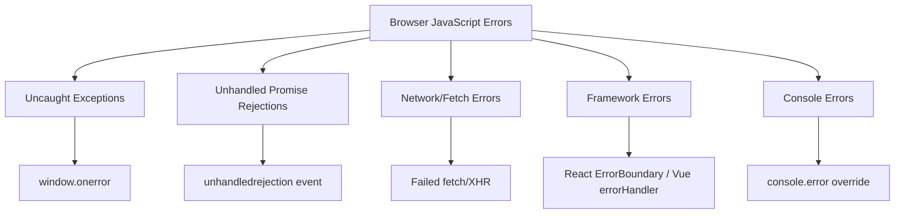

# How to Track Browser JavaScript Errors with OpenTelemetry

Author: [nawazdhandala](https://www.github.com/nawazdhandala)

Tags: OpenTelemetry, JavaScript, Error Tracking, Browser SDK, Frontend Observability, Exception Monitoring

Description: Learn how to capture and report browser JavaScript errors as OpenTelemetry spans and events, covering uncaught exceptions, promise rejections, and framework errors.

---

JavaScript errors in the browser are notoriously difficult to debug in production. A user reports that something broke, but the error message alone rarely tells you enough. You need the context around the error: what the user was doing, which API calls were in flight, and how the error propagated through your application. OpenTelemetry gives you a framework for capturing all of this context and shipping it alongside the error data.

This guide covers capturing every category of browser JavaScript error with OpenTelemetry, from uncaught exceptions to unhandled promise rejections to errors inside frameworks like React.

## Categories of Browser Errors

Before writing any instrumentation code, it helps to understand what kinds of errors browsers produce and where they surface.



Each of these categories needs its own listener, but all of them should funnel into the same OpenTelemetry reporting pipeline. That way you get a consistent format regardless of where the error originated.

## Setting Up the OpenTelemetry Browser SDK

Start by initializing the Web Tracer Provider with the necessary configuration for error tracking.

```javascript
// src/tracing/init.js
import { WebTracerProvider } from '@opentelemetry/sdk-trace-web';
import { BatchSpanProcessor } from '@opentelemetry/sdk-trace-base';
import { OTLPTraceExporter } from '@opentelemetry/exporter-trace-otlp-http';
import { ZoneContextManager } from '@opentelemetry/context-zone';
import { Resource } from '@opentelemetry/resources';

// Create the provider with service metadata so errors
// are tagged with the correct application name
const provider = new WebTracerProvider({
  resource: new Resource({
    'service.name': 'frontend-app',
    'service.version': '2.1.0',
    'deployment.environment': 'production',
  }),
});

// Use batch processing to avoid sending individual spans
// for each error, which would create too much network overhead
provider.addSpanProcessor(
  new BatchSpanProcessor(
    new OTLPTraceExporter({
      url: '/api/v1/traces',
    })
  )
);

provider.register({
  contextManager: new ZoneContextManager(),
});

// Export the tracer for use in error handlers
export const tracer = provider.getTracer('error-tracking', '1.0.0');
```

The `ZoneContextManager` is critical for browser tracing. It uses Zone.js to maintain trace context across asynchronous operations, which means errors thrown inside setTimeout callbacks, promise chains, or event handlers can still be linked to the span that was active when the async operation started.

## Capturing Uncaught Exceptions

The `window.onerror` handler catches any JavaScript error that is not wrapped in a try/catch block. This is your safety net for errors you did not anticipate.

```javascript
// src/error-handlers/uncaught.js
import { tracer } from '../tracing/init';
import { SpanStatusCode } from '@opentelemetry/api';

// Install a global error handler that creates OpenTelemetry spans
// for any uncaught exception in the application
window.onerror = function (message, source, lineno, colno, error) {
  const span = tracer.startSpan('browser.error.uncaught', {
    attributes: {
      // Standard OpenTelemetry semantic conventions for exceptions
      'exception.type': error ? error.name : 'Error',
      'exception.message': message,
      'exception.stacktrace': error ? error.stack : '',

      // Browser-specific context about where the error occurred
      'code.filepath': source,
      'code.lineno': lineno,
      'code.column': colno,

      // Page context helps identify which feature broke
      'browser.url': window.location.href,
      'browser.user_agent': navigator.userAgent,
    },
  });

  // recordException adds a structured exception event to the span
  // following the OpenTelemetry exception semantic conventions
  if (error) {
    span.recordException(error);
  }

  span.setStatus({
    code: SpanStatusCode.ERROR,
    message: String(message),
  });

  span.end();

  // Return false so the error still shows in the browser console
  return false;
};
```

Returning `false` from the handler is important. If you return `true`, the browser suppresses the error from the console, which makes local development confusing. By returning `false`, errors still appear in DevTools while also being reported to your OpenTelemetry backend.

## Capturing Unhandled Promise Rejections

Promise rejections that are not caught with `.catch()` or a try/catch in an async function fire a different event. You need a separate listener for these.

```javascript
// src/error-handlers/promise-rejections.js
import { tracer } from '../tracing/init';
import { SpanStatusCode } from '@opentelemetry/api';

// Unhandled promise rejections do not trigger window.onerror,
// so they need their own dedicated listener
window.addEventListener('unhandledrejection', function (event) {
  const reason = event.reason;

  // The rejection reason might be an Error object or a plain string
  const errorMessage =
    reason instanceof Error ? reason.message : String(reason);
  const errorStack =
    reason instanceof Error ? reason.stack : new Error().stack;
  const errorType =
    reason instanceof Error ? reason.name : 'UnhandledRejection';

  const span = tracer.startSpan('browser.error.unhandled_rejection', {
    attributes: {
      'exception.type': errorType,
      'exception.message': errorMessage,
      'exception.stacktrace': errorStack,
      'browser.url': window.location.href,
      'error.category': 'promise_rejection',
    },
  });

  if (reason instanceof Error) {
    span.recordException(reason);
  }

  span.setStatus({
    code: SpanStatusCode.ERROR,
    message: errorMessage,
  });

  span.end();
});
```

One thing to watch out for: some third-party scripts reject promises with non-Error values like strings or objects. The code above handles this by checking whether the rejection reason is an Error instance and falling back to `String(reason)` otherwise.

## Capturing Network Errors

Failed API calls are among the most common sources of user-visible errors. The OpenTelemetry fetch instrumentation captures successful requests, but you should also explicitly handle failures with rich error context.

```javascript
// src/error-handlers/network-errors.js
import { tracer } from '../tracing/init';
import { SpanStatusCode, context, trace } from '@opentelemetry/api';

// Wrap fetch to capture detailed error information when requests fail
const originalFetch = window.fetch;

window.fetch = async function (...args) {
  const url = typeof args[0] === 'string' ? args[0] : args[0].url;
  const method =
    (args[1] && args[1].method) || 'GET';

  try {
    const response = await originalFetch.apply(this, args);

    // Treat HTTP 4xx and 5xx responses as errors worth tracking
    if (!response.ok) {
      const span = tracer.startSpan('browser.error.http', {
        attributes: {
          'http.method': method,
          'http.url': url,
          'http.status_code': response.status,
          'http.status_text': response.statusText,
          'error.category': 'http_error',
        },
      });

      span.setStatus({
        code: SpanStatusCode.ERROR,
        message: `HTTP ${response.status}: ${response.statusText}`,
      });

      span.end();
    }

    return response;
  } catch (networkError) {
    // This catches actual network failures like DNS errors,
    // connection refused, CORS blocks, and timeouts
    const span = tracer.startSpan('browser.error.network', {
      attributes: {
        'http.method': method,
        'http.url': url,
        'exception.type': networkError.name,
        'exception.message': networkError.message,
        'error.category': 'network_failure',
      },
    });

    span.recordException(networkError);
    span.setStatus({
      code: SpanStatusCode.ERROR,
      message: networkError.message,
    });
    span.end();

    // Re-throw so the calling code can handle the error
    throw networkError;
  }
};
```

The fetch wrapper distinguishes between HTTP error responses (where the server replied but with an error status) and network failures (where the request never completed). These are fundamentally different problems and knowing which one you are dealing with changes your debugging approach.

## Capturing React Error Boundaries

If you are using React, error boundaries catch rendering errors that would otherwise crash your component tree. Connecting these to OpenTelemetry gives you stack traces with component context.

```javascript
// src/components/TracedErrorBoundary.jsx
import React from 'react';
import { tracer } from '../tracing/init';
import { SpanStatusCode } from '@opentelemetry/api';

// A React error boundary that reports caught errors
// as OpenTelemetry exception spans with component context
class TracedErrorBoundary extends React.Component {
  constructor(props) {
    super(props);
    this.state = { hasError: false };
  }

  static getDerivedStateFromError() {
    return { hasError: true };
  }

  componentDidCatch(error, errorInfo) {
    const span = tracer.startSpan('browser.error.react_boundary', {
      attributes: {
        'exception.type': error.name,
        'exception.message': error.message,
        'exception.stacktrace': error.stack,
        // The component stack shows which React components
        // were in the tree when the error occurred
        'react.component_stack': errorInfo.componentStack,
        'react.boundary_name': this.props.name || 'unnamed',
        'error.category': 'react_error_boundary',
        'browser.url': window.location.href,
      },
    });

    span.recordException(error);
    span.setStatus({
      code: SpanStatusCode.ERROR,
      message: error.message,
    });
    span.end();
  }

  render() {
    if (this.state.hasError) {
      return this.props.fallback || <div>Something went wrong.</div>;
    }
    return this.props.children;
  }
}

export default TracedErrorBoundary;
```

Wrap sections of your application with named boundaries so you can tell at a glance which feature area produced the error.

```jsx
// Using the boundary in your app layout
<TracedErrorBoundary name="dashboard-charts" fallback={<ChartError />}>
  <DashboardCharts />
</TracedErrorBoundary>

<TracedErrorBoundary name="user-profile" fallback={<ProfileError />}>
  <UserProfile />
</TracedErrorBoundary>
```

## Adding User Context to Errors

Errors without user context are hard to prioritize. Adding basic user information to error spans helps you understand impact and reach out to affected users.

```javascript
// src/error-handlers/user-context.js
import { tracer } from '../tracing/init';

let currentUser = null;

// Call this after authentication to associate errors with a user
export function setUser(user) {
  currentUser = {
    id: user.id,
    // Never include PII like email in span attributes
    // unless your data retention policies allow it
    plan: user.plan,
    role: user.role,
  };
}

// Enhance any span with user context if available
export function addUserContext(span) {
  if (currentUser) {
    span.setAttribute('enduser.id', currentUser.id);
    span.setAttribute('enduser.plan', currentUser.plan);
    span.setAttribute('enduser.role', currentUser.role);
  }
}
```

Call `addUserContext(span)` from each error handler before ending the span. This lets you filter errors by user segment and understand whether issues are affecting free tier users, enterprise customers, or everyone.

## Putting It All Together

Initialize all error handlers when your application starts, after the OpenTelemetry provider is set up.

```javascript
// src/main.js
import { initTracing } from './tracing/init';
import './error-handlers/uncaught';
import './error-handlers/promise-rejections';
import './error-handlers/network-errors';
import { setUser } from './error-handlers/user-context';

// Initialize tracing first so the tracer is available
// when error handler modules load
initTracing();

// After the user logs in, set their context
onAuthComplete((user) => {
  setUser(user);
});
```

## Summary

Tracking browser JavaScript errors with OpenTelemetry requires covering multiple error surfaces: the global `onerror` handler for uncaught exceptions, the `unhandledrejection` listener for promise failures, a fetch wrapper for network errors, and framework-specific boundaries for rendering errors. Each of these feeds into the same OpenTelemetry tracer, producing spans with consistent attributes that follow semantic conventions.

The result is a unified view of every error in your frontend application, complete with stack traces, page context, user information, and correlation to backend traces. Instead of relying on fragmented error logs from different sources, you have a single pipeline that captures everything and makes it searchable in your observability platform.
