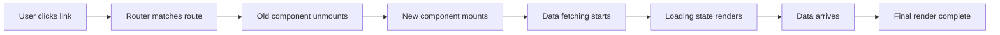

# How to Track Client-Side Routing Performance in SPAs with OpenTelemetry

Author: [nawazdhandala](https://www.github.com/nawazdhandala)

Tags: OpenTelemetry, SPA, Routing, Performance, React, Browser, Frontend

Description: Learn how to instrument client-side routing in single-page applications using OpenTelemetry to measure navigation timing, component rendering, and data fetching per route change.

---

Single-page applications handle navigation differently from traditional websites. When a user clicks a link in a React, Angular, or Vue app, the browser does not make a full page request. Instead, the JavaScript router swaps components, fetches data, and updates the DOM without ever leaving the page. This is great for user experience, but it creates a blind spot in your monitoring.

Traditional page load metrics like `DOMContentLoaded` and `load` only fire once. After that initial load, every subsequent navigation happens entirely in JavaScript. If you are only tracking the initial page load, you are missing the performance story for 90% of your user interactions.

OpenTelemetry gives you the tools to fill this gap. By hooking into your router and wrapping each navigation in a span, you can track exactly how long each route transition takes, from the moment the user clicks to the moment the new view is fully rendered.

## What Happens During a Client-Side Navigation

A typical SPA route change involves several steps that all happen within the browser:



Each of these steps contributes to the total navigation time. Without instrumentation, you only see the final result. With OpenTelemetry spans covering each phase, you can pinpoint exactly where slowdowns occur.

## Base OpenTelemetry Setup

Start with the standard browser SDK configuration:

```javascript
// src/tracing.js
import { WebTracerProvider } from '@opentelemetry/sdk-trace-web';
import { OTLPTraceExporter } from '@opentelemetry/exporter-trace-otlp-http';
import { BatchSpanProcessor } from '@opentelemetry/sdk-trace-web';
import { Resource } from '@opentelemetry/resources';
import { ATTR_SERVICE_NAME } from '@opentelemetry/semantic-conventions';
import { trace, context } from '@opentelemetry/api';

const provider = new WebTracerProvider({
  resource: new Resource({
    [ATTR_SERVICE_NAME]: 'my-spa-frontend',
  }),
});

provider.addSpanProcessor(
  new BatchSpanProcessor(
    new OTLPTraceExporter({
      url: 'https://otel-collector.example.com/v1/traces',
    })
  )
);

provider.register();

export const tracer = trace.getTracer('spa-routing', '1.0.0');
```

This gives you a tracer instance you can use throughout your application. The batch processor queues spans and sends them in groups, which is much more efficient for browser environments.

## Instrumenting React Router

React Router is the most common routing library for React applications. Here is a component that wraps route changes in OpenTelemetry spans:

```javascript
// src/components/RouteTracer.jsx
import { useEffect, useRef } from 'react';
import { useLocation, useNavigationType } from 'react-router-dom';
import { SpanStatusCode, context, trace } from '@opentelemetry/api';
import { tracer } from '../tracing';

export function RouteTracer({ children }) {
  const location = useLocation();
  const navigationType = useNavigationType();
  const activeSpanRef = useRef(null);
  const navigationStartRef = useRef(null);

  useEffect(() => {
    // End any previous navigation span
    if (activeSpanRef.current) {
      activeSpanRef.current.setStatus({ code: SpanStatusCode.OK });
      activeSpanRef.current.end();
    }

    // Record when this navigation started
    navigationStartRef.current = performance.now();

    // Start a new span for this route change
    const span = tracer.startSpan('route.change', {
      attributes: {
        'route.path': location.pathname,
        'route.search': location.search,
        'route.hash': location.hash,
        'route.navigation_type': navigationType,
      },
    });

    activeSpanRef.current = span;

    // Use requestAnimationFrame to measure time until the browser
    // has actually painted the new route content
    requestAnimationFrame(() => {
      requestAnimationFrame(() => {
        const renderTime = performance.now() - navigationStartRef.current;
        span.setAttribute('route.render_duration_ms', renderTime);
      });
    });

    // Cleanup on unmount
    return () => {
      if (activeSpanRef.current) {
        activeSpanRef.current.end();
        activeSpanRef.current = null;
      }
    };
  }, [location.pathname]);

  return children;
}
```

The double `requestAnimationFrame` trick is important. The first `requestAnimationFrame` fires before the browser paints. The second one fires after the paint has actually completed. This gives you a much more accurate measurement of when the user actually sees the new content.

Place this component at the top level of your router:

```javascript
// src/App.jsx
import { BrowserRouter, Routes, Route } from 'react-router-dom';
import { RouteTracer } from './components/RouteTracer';
import { Dashboard } from './pages/Dashboard';
import { Settings } from './pages/Settings';
import { Profile } from './pages/Profile';

export function App() {
  return (
    <BrowserRouter>
      <RouteTracer>
        <Routes>
          <Route path="/" element={<Dashboard />} />
          <Route path="/settings" element={<Settings />} />
          <Route path="/profile/:id" element={<Profile />} />
        </Routes>
      </RouteTracer>
    </BrowserRouter>
  );
}
```

Every route change now produces a span with the path, navigation type (push, pop, or replace), and render duration.

## Tracking Data Fetching Per Route

Most routes need to fetch data before they can render meaningful content. You can create a hook that wraps data fetching in child spans linked to the current navigation:

```javascript
// src/hooks/useTrackedFetch.js
import { useEffect, useState } from 'react';
import { SpanStatusCode } from '@opentelemetry/api';
import { tracer } from '../tracing';

export function useTrackedFetch(url, options = {}) {
  const [data, setData] = useState(null);
  const [loading, setLoading] = useState(true);
  const [error, setError] = useState(null);

  useEffect(() => {
    // Create a span specifically for this data fetch
    const fetchSpan = tracer.startSpan('route.data_fetch', {
      attributes: {
        'http.url': url,
        'http.method': options.method || 'GET',
      },
    });

    const startTime = performance.now();

    fetch(url, options)
      .then((response) => {
        fetchSpan.setAttribute('http.status_code', response.status);

        if (!response.ok) {
          throw new Error(`HTTP ${response.status}: ${response.statusText}`);
        }
        return response.json();
      })
      .then((result) => {
        const duration = performance.now() - startTime;
        fetchSpan.setAttribute('route.fetch_duration_ms', duration);
        fetchSpan.setAttribute('route.response_size', JSON.stringify(result).length);
        fetchSpan.setStatus({ code: SpanStatusCode.OK });
        setData(result);
      })
      .catch((err) => {
        fetchSpan.setStatus({
          code: SpanStatusCode.ERROR,
          message: err.message,
        });
        fetchSpan.recordException(err);
        setError(err);
      })
      .finally(() => {
        fetchSpan.end();
        setLoading(false);
      });

    return () => {
      // If the component unmounts before fetch completes, end the span
      if (!fetchSpan.ended) {
        fetchSpan.setAttribute('route.fetch_cancelled', true);
        fetchSpan.end();
      }
    };
  }, [url]);

  return { data, loading, error };
}
```

Use this hook inside your route components:

```javascript
// src/pages/Profile.jsx
import { useParams } from 'react-router-dom';
import { useTrackedFetch } from '../hooks/useTrackedFetch';

export function Profile() {
  const { id } = useParams();
  const { data, loading, error } = useTrackedFetch(`/api/users/${id}`);

  if (loading) return <div>Loading profile...</div>;
  if (error) return <div>Failed to load profile</div>;

  return (
    <div>
      <h1>{data.name}</h1>
      <p>{data.bio}</p>
    </div>
  );
}
```

Now each route change produces a parent span for the navigation and child spans for each data fetch. You can see exactly how much of the total navigation time is spent fetching data versus rendering components.

## Measuring Component Render Time

For more fine-grained performance data, measure how long individual components take to render after data arrives:

```javascript
// src/hooks/useRenderTimer.js
import { useEffect, useRef } from 'react';
import { tracer } from '../tracing';

export function useRenderTimer(componentName) {
  const startTime = useRef(performance.now());

  useEffect(() => {
    // This runs after the component mounts and paints
    const renderDuration = performance.now() - startTime.current;

    const span = tracer.startSpan('component.render', {
      attributes: {
        'component.name': componentName,
        'component.render_duration_ms': renderDuration,
      },
    });
    span.end();
  }, []);
}
```

Add this hook to any component you want to measure:

```javascript
// src/pages/Dashboard.jsx
import { useRenderTimer } from '../hooks/useRenderTimer';
import { useTrackedFetch } from '../hooks/useTrackedFetch';

export function Dashboard() {
  useRenderTimer('Dashboard');
  const { data, loading } = useTrackedFetch('/api/dashboard/stats');

  if (loading) return <div>Loading dashboard...</div>;

  return (
    <div>
      <h1>Dashboard</h1>
      <StatsGrid stats={data} />
    </div>
  );
}
```

## Handling Route-Level Error Boundaries

Route navigations can fail. Components can throw during rendering, data fetches can return errors, and lazy-loaded chunks can fail to download. Track these failures:

```javascript
// src/components/RouteErrorBoundary.jsx
import { Component } from 'react';
import { SpanStatusCode } from '@opentelemetry/api';
import { tracer } from '../tracing';

export class RouteErrorBoundary extends Component {
  constructor(props) {
    super(props);
    this.state = { hasError: false };
  }

  static getDerivedStateFromError(error) {
    return { hasError: true, error };
  }

  componentDidCatch(error, errorInfo) {
    // Record the route error as a span
    const span = tracer.startSpan('route.error', {
      attributes: {
        'error.type': error.name,
        'error.message': error.message,
        'error.component_stack': errorInfo.componentStack,
        'route.path': window.location.pathname,
      },
    });
    span.recordException(error);
    span.setStatus({ code: SpanStatusCode.ERROR, message: error.message });
    span.end();
  }

  render() {
    if (this.state.hasError) {
      return <div>Something went wrong loading this page.</div>;
    }
    return this.props.children;
  }
}
```

## Analyzing the Data

With all this instrumentation in place, you can answer some important questions in your observability backend:

- **Slowest routes by render time**: Group `route.change` spans by `route.path` and sort by `route.render_duration_ms` to find routes that need optimization.
- **Data fetch bottlenecks**: Look at `route.data_fetch` spans to find which API calls slow down specific routes.
- **Navigation type distribution**: The `route.navigation_type` attribute tells you whether users navigate via links (push), the back button (pop), or redirects (replace).
- **Route error rates**: Count `route.error` spans grouped by path to find routes that crash frequently.

## Performance Considerations

Browser instrumentation needs to be lightweight. A few things to keep in mind:

Do not create spans for every single re-render. Focus on route changes and data fetches. Use the batch span processor to avoid sending a network request for every span. Set a reasonable maximum queue size to prevent memory buildup in long-running sessions. Consider sampling if your application has very high traffic.

The overhead of this instrumentation is negligible compared to the actual work of rendering components and fetching data. A few microseconds per span is nothing next to a 200ms API call.

## Wrapping Up

Client-side routing is the backbone of SPA user experience, and it deserves the same level of observability you give to server-side requests. By wrapping route changes, data fetches, and component renders in OpenTelemetry spans, you get a complete picture of navigation performance from the user's perspective.

The combination of route-level spans with data fetching child spans is particularly powerful. Instead of just knowing that a page took 800ms to render, you can see that 600ms was spent waiting for an API call and 200ms was spent rendering the component tree. That level of detail tells you exactly where to focus your optimization efforts.
