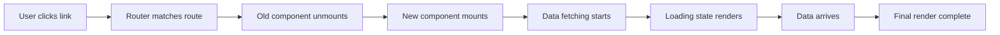

# How to Track Client-Side Routing Performance in SPAs with OpenTelemetry

Author: [nawazdhandala](https://www.github.com/nawazdhandala)

Tags: OpenTelemetry, SPA, Routing, Performance, React, Browser, Frontend

Description: Learn how to instrument client-side routing in single-page applications using OpenTelemetry to measure navigation timing, component rendering, and data fetching per route change.

---

Single-page applications handle navigation differently from traditional websites. When a user clicks a link in a React, Angular, or Vue app, the browser does not make a full page request. Instead, the JavaScript router swaps components, fetches data, and updates the DOM without ever leaving the page. This is great for user experience, but it creates a blind spot in your monitoring.

Traditional page load metrics like `DOMContentLoaded` and `load` only fire once. After that initial load, every subsequent navigation happens entirely in JavaScript. If you are only tracking the initial page load, you are missing the performance story for many of your user interactions.

OpenTelemetry gives you the tools to fill this gap. By hooking into your router and wrapping each navigation in a span, you can track route transitions, data fetching, and an approximation of when the new route has had a chance to paint.

## What Happens During a Client-Side Navigation

A typical SPA route change involves several steps that all happen within the browser:


```mermaid
flowchart LR
    A[User clicks link] --> B[Router matches route]
    B --> C[Old component unmounts]
    C --> D[New component mounts]
    D --> E[Data fetching starts]
    E --> F[Loading state renders]
    F --> G[Data arrives]
    G --> H[Final render complete]
```

Each of these steps contributes to the total navigation time. Without instrumentation, you only see the final result. With OpenTelemetry spans covering the major phases, you can narrow down where slowdowns occur.

## Base OpenTelemetry Setup

Start with the standard browser SDK configuration:

```javascript
// src/tracing.js
import { WebTracerProvider } from '@opentelemetry/sdk-trace-web';
import { OTLPTraceExporter } from '@opentelemetry/exporter-trace-otlp-http';
import { BatchSpanProcessor } from '@opentelemetry/sdk-trace-base';
import { resourceFromAttributes } from '@opentelemetry/resources';
import { ATTR_SERVICE_NAME } from '@opentelemetry/semantic-conventions';
import { trace } from '@opentelemetry/api';

const provider = new WebTracerProvider({
  resource: resourceFromAttributes({
    [ATTR_SERVICE_NAME]: 'my-spa-frontend',
  }),
  spanProcessors: [
    new BatchSpanProcessor(
      new OTLPTraceExporter({
        url: 'https://otel-collector.example.com/v1/traces',
      })
    ),
  ],
});

provider.register();

export const tracer = trace.getTracer('spa-routing', '1.0.0');
```

This gives you a tracer instance you can use throughout your application. The batch processor queues spans and sends them in groups, which is much more efficient for browser environments.

## Instrumenting React Router

React Router is the most common routing library for React applications. Here is a component that wraps route changes in OpenTelemetry spans:

```javascript
// src/components/RouteTracer.jsx
import { createContext, useContext, useLayoutEffect, useRef, useState } from 'react';
import { useLocation, useNavigationType } from 'react-router-dom';
import { SpanStatusCode } from '@opentelemetry/api';
import { tracer } from '../tracing';

const RouteSpanContext = createContext(null);

export function useRouteSpan() {
  return useContext(RouteSpanContext);
}

export function RouteTracer({ children }) {
  const location = useLocation();
  const navigationType = useNavigationType();
  const activeSpanRef = useRef(null);
  const [activeSpan, setActiveSpan] = useState(null);

  useLayoutEffect(() => {
    // Record when this route commit is observed
    const navigationStart = performance.now();

    // Start a new span for this route change
    const span = tracer.startSpan('route.change', {
      attributes: {
        'route.path': location.pathname,
        'route.search': location.search,
        'route.hash': location.hash,
        'route.navigation_type': navigationType,
      },
    });

    activeSpanRef.current = span;
    setActiveSpan(span);

    // Use requestAnimationFrame to measure time until the browser
    // has had a chance to paint the new route content
    requestAnimationFrame(() => {
      requestAnimationFrame(() => {
        const paintDelay = performance.now() - navigationStart;
        span.setAttribute('route.paint_delay_ms', paintDelay);
      });
    });

    // Cleanup on unmount
    return () => {
      if (activeSpanRef.current) {
        activeSpanRef.current.setStatus({ code: SpanStatusCode.OK });
        activeSpanRef.current.end();
        activeSpanRef.current = null;
      }
    };
  }, [location.pathname, location.search, location.hash, navigationType]);

  return (
    <RouteSpanContext.Provider value={activeSpan}>
      {children}
    </RouteSpanContext.Provider>
  );
}
```

The double `requestAnimationFrame` trick is important. A `requestAnimationFrame` callback runs before a repaint, so scheduling the second callback pushes the measurement into the next frame. This gives you a closer approximation of when the user sees the new content, although it is still not a guaranteed paint-complete signal.

Place this component at the top level of your router:

```javascript
// src/App.jsx
import { BrowserRouter, Routes, Route } from 'react-router-dom';
import { RouteTracer } from './components/RouteTracer';
import { Dashboard } from './pages/Dashboard';
import { Settings } from './pages/Settings';
import { Profile } from './pages/Profile';

export function App() {
  return (
    <BrowserRouter>
      <RouteTracer>
        <Routes>
          <Route path="/" element={<Dashboard />} />
          <Route path="/settings" element={<Settings />} />
          <Route path="/profile/:id" element={<Profile />} />
        </Routes>
      </RouteTracer>
    </BrowserRouter>
  );
}
```

Every route change now produces a span with the path, navigation type (`PUSH`, `POP`, or `REPLACE`), and approximate paint delay.

## Tracking Data Fetching Per Route

Most routes need to fetch data before they can render meaningful content. You can create a hook that wraps data fetching in child spans linked to the current navigation:

```javascript
// src/hooks/useTrackedFetch.js
import { useEffect, useState } from 'react';
import { context, SpanStatusCode, trace } from '@opentelemetry/api';
import { tracer } from '../tracing';
import { useRouteSpan } from '../components/RouteTracer';

export function useTrackedFetch(url, options = {}) {
  const [data, setData] = useState(null);
  const [loading, setLoading] = useState(true);
  const [error, setError] = useState(null);
  const routeSpan = useRouteSpan();

  useEffect(() => {
    const requestUrl = new URL(url, window.location.href).href;
    const method = options.method || 'GET';
    const spanContext = routeSpan
      ? trace.setSpan(context.active(), routeSpan)
      : context.active();

    // Create a span specifically for this data fetch
    const fetchSpan = tracer.startSpan('route.data_fetch', {
      attributes: {
        'url.full': requestUrl,
        'http.request.method': method,
      },
    }, spanContext);

    const startTime = performance.now();
    let spanEnded = false;
    let cancelled = false;

    const endFetchSpan = () => {
      if (!spanEnded) {
        fetchSpan.end();
        spanEnded = true;
      }
    };

    fetch(url, options)
      .then((response) => {
        if (cancelled) return null;

        fetchSpan.setAttribute('http.response.status_code', response.status);

        if (!response.ok) {
          throw new Error(`HTTP ${response.status}: ${response.statusText}`);
        }
        return response.json();
      })
      .then((result) => {
        if (cancelled || result === null) return;

        const duration = performance.now() - startTime;
        fetchSpan.setAttribute('route.fetch_duration_ms', duration);
        fetchSpan.setAttribute('route.response_size_bytes', JSON.stringify(result).length);
        fetchSpan.setStatus({ code: SpanStatusCode.OK });
        setData(result);
      })
      .catch((err) => {
        if (cancelled) return;

        fetchSpan.setStatus({
          code: SpanStatusCode.ERROR,
          message: err.message,
        });
        fetchSpan.recordException(err);
        setError(err);
      })
      .finally(() => {
        endFetchSpan();
        if (!cancelled) {
          setLoading(false);
        }
      });

    return () => {
      cancelled = true;

      // If the component unmounts before fetch completes, end the span
      if (!spanEnded) {
        fetchSpan.setAttribute('route.fetch_cancelled', true);
        endFetchSpan();
      }
    };
  }, [url, routeSpan]);

  return { data, loading, error };
}
```

Use this hook inside your route components:

```javascript
// src/pages/Profile.jsx
import { useParams } from 'react-router-dom';
import { useTrackedFetch } from '../hooks/useTrackedFetch';

export function Profile() {
  const { id } = useParams();
  const { data, loading, error } = useTrackedFetch(`/api/users/${id}`);

  if (loading) return <div>Loading profile...</div>;
  if (error) return <div>Failed to load profile</div>;

  return (
    <div>
      <h1>{data.name}</h1>
      <p>{data.bio}</p>
    </div>
  );
}
```

Now each route change produces a parent span for the navigation and child spans for each data fetch. You can see how much route activity is spent fetching data versus updating and painting components.

## Measuring Component Render Time

For more fine-grained performance data, measure how long individual components take to render after data arrives:

```javascript
// src/hooks/useRenderTimer.js
import { useEffect, useRef } from 'react';
import { tracer } from '../tracing';

export function useRenderTimer(componentName, dependencies = []) {
  const renderStart = useRef(performance.now());
  renderStart.current = performance.now();

  useEffect(() => {
    // This runs after React commits the render for this dependency change
    const renderDuration = performance.now() - renderStart.current;

    const span = tracer.startSpan('component.render', {
      attributes: {
        'component.name': componentName,
        'component.render_duration_ms': renderDuration,
      },
    });
    span.end();
  }, dependencies);
}
```

Add this hook to any component you want to measure:

```javascript
// src/pages/Dashboard.jsx
import { useRenderTimer } from '../hooks/useRenderTimer';
import { useTrackedFetch } from '../hooks/useTrackedFetch';

export function Dashboard() {
  const { data, loading } = useTrackedFetch('/api/dashboard/stats');
  useRenderTimer('Dashboard', [loading]);

  if (loading) return <div>Loading dashboard...</div>;

  return (
    <div>
      <h1>Dashboard</h1>
      <StatsGrid stats={data} />
    </div>
  );
}
```

## Handling Route-Level Error Boundaries

Route navigations can fail. Components can throw during rendering, data fetches can return errors, and lazy-loaded chunks can fail to download. Track these failures:

```javascript
// src/components/RouteErrorBoundary.jsx
import { Component } from 'react';
import { SpanStatusCode } from '@opentelemetry/api';
import { tracer } from '../tracing';

export class RouteErrorBoundary extends Component {
  constructor(props) {
    super(props);
    this.state = { hasError: false };
  }

  static getDerivedStateFromError(error) {
    return { hasError: true, error };
  }

  componentDidCatch(error, errorInfo) {
    // Record the route error as a span
    const span = tracer.startSpan('route.error', {
      attributes: {
        'error.type': error.name,
        'error.message': error.message,
        'error.component_stack': errorInfo.componentStack,
        'route.path': window.location.pathname,
      },
    });
    span.recordException(error);
    span.setStatus({ code: SpanStatusCode.ERROR, message: error.message });
    span.end();
  }

  render() {
    if (this.state.hasError) {
      return <div>Something went wrong loading this page.</div>;
    }
    return this.props.children;
  }
}
```

## Analyzing the Data

With all this instrumentation in place, you can answer some important questions in your observability backend:

- **Slowest routes by paint delay**: Group `route.change` spans by `route.path` and sort by `route.paint_delay_ms` to find routes that need optimization.
- **Data fetch bottlenecks**: Look at `route.data_fetch` spans to find which API calls slow down specific routes.
- **Navigation type distribution**: The `route.navigation_type` attribute tells you whether users navigate via links (`PUSH`), the back button (`POP`), or redirects (`REPLACE`).
- **Route error rates**: Count `route.error` spans grouped by path to find routes that crash frequently.

## Performance Considerations

Browser instrumentation needs to be lightweight. A few things to keep in mind:

Do not create spans for every single re-render. Focus on route changes and data fetches. Use the batch span processor to avoid sending a network request for every span. Set a reasonable maximum queue size to prevent memory buildup in long-running sessions. Consider sampling if your application has very high traffic.

The overhead of this instrumentation is small compared to the actual work of rendering components and fetching data, but you should still measure it in your own application and tune sampling or batching for high-traffic frontends.

## Wrapping Up

Client-side routing is the backbone of SPA user experience, and it deserves the same level of observability you give to server-side requests. By wrapping route changes, data fetches, and component render updates in OpenTelemetry spans, you get a better picture of navigation performance from the user's perspective.

The combination of route-level spans with data fetching child spans is particularly powerful. Instead of just knowing that a route feels slow, you can separate API latency from component updates and paint delay. That level of detail tells you where to focus your optimization efforts.
