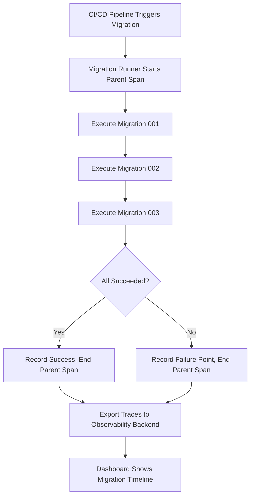

# How to Track Database Migration Performance with OpenTelemetry Tracing

Author: [nawazdhandala](https://www.github.com/nawazdhandala)

Tags: OpenTelemetry, Database, Migrations, Tracing, Performance, DevOps

Description: Learn how to instrument database migrations with OpenTelemetry tracing to track execution time, detect failures, and build reliable migration pipelines.

---

Database migrations are one of those things that work fine in development and then blow up in production. A migration that takes 200 milliseconds on your local database with 500 rows can lock a production table with 50 million rows for 20 minutes. Without proper observability, you are flying blind during one of the riskiest operations in your deployment pipeline.

OpenTelemetry tracing gives you visibility into every step of your migration process. You can see exactly how long each migration takes, which step failed, how the migration interacts with your running application, and whether it caused downstream issues. This post shows you how to instrument your migration tooling with OpenTelemetry.

## Why Trace Migrations?

Migrations are not just "run and forget" operations. They interact with live databases, often during deployments. Here is what can go wrong without visibility:

- A migration acquires an exclusive lock on a large table, blocking all reads and writes for minutes.
- An index creation runs during peak traffic, consuming all available I/O.
- A data backfill migration fails halfway, leaving the database in an inconsistent state.
- Multiple migrations run sequentially, and the third one fails, but you do not know how far it got.

Tracing each migration as a span gives you a timeline of exactly what happened and when.

```mermaid
gantt
    title Migration Execution Timeline
    dateFormat X
    axisFormat %s

    section Migrations
    001_create_users_table     :0, 2
    002_add_email_index        :2, 15
    003_create_orders_table    :15, 17
    004_backfill_user_status   :17, 120
    005_add_foreign_keys       :120, 125
```



## Instrumenting Alembic Migrations (Python)

Alembic is the most popular migration tool for Python/SQLAlchemy applications. We can hook into Alembic's event system to create OpenTelemetry spans for each migration.

First, install the necessary packages.

```bash
# Install OpenTelemetry SDK and the OTLP exporter
pip install opentelemetry-api opentelemetry-sdk opentelemetry-exporter-otlp-proto-http alembic
```

Create a tracing helper that wraps migration execution.

```python
# migrations/tracing.py
from opentelemetry import trace
from opentelemetry.sdk.trace import TracerProvider
from opentelemetry.sdk.trace.export import BatchSpanProcessor
from opentelemetry.exporter.otlp.proto.http.trace_exporter import OTLPSpanExporter
from opentelemetry.sdk.resources import Resource
import time

# Configure the tracer provider with service metadata
resource = Resource.create({
    "service.name": "migration-runner",
    "service.version": "1.0.0",
    "deployment.environment": "production",
})

provider = TracerProvider(resource=resource)
exporter = OTLPSpanExporter(endpoint="http://localhost:4318/v1/traces")
provider.add_span_processor(BatchSpanProcessor(exporter))
trace.set_tracer_provider(provider)

tracer = trace.get_tracer("alembic.migrations")


def traced_migration(revision_id, description, direction="upgrade"):
    """
    Decorator that wraps a migration function with an OpenTelemetry span.
    Records the revision ID, description, direction, and execution time.
    """
    def decorator(func):
        def wrapper(*args, **kwargs):
            # Create a span for this specific migration step
            with tracer.start_as_current_span(
                f"migration.{direction}",
                attributes={
                    "migration.revision": revision_id,
                    "migration.description": description,
                    "migration.direction": direction,
                }
            ) as span:
                start = time.time()
                try:
                    result = func(*args, **kwargs)
                    duration = time.time() - start
                    # Record how long the migration took
                    span.set_attribute("migration.duration_seconds", duration)
                    span.set_attribute("migration.status", "success")
                    return result
                except Exception as e:
                    duration = time.time() - start
                    span.set_attribute("migration.duration_seconds", duration)
                    span.set_attribute("migration.status", "failed")
                    # Record the error details on the span
                    span.record_exception(e)
                    span.set_status(trace.StatusCode.ERROR, str(e))
                    raise
        return wrapper
    return decorator
```

Now use this decorator in your Alembic migration files.

```python
# migrations/versions/003_add_orders_table.py
"""Create orders table and add indexes"""

from alembic import op
import sqlalchemy as sa
from migrations.tracing import traced_migration

# Alembic revision identifiers
revision = "003"
down_revision = "002"


@traced_migration("003", "Create orders table", direction="upgrade")
def upgrade():
    # Create the orders table with all columns
    op.create_table(
        "orders",
        sa.Column("id", sa.BigInteger(), primary_key=True),
        sa.Column("user_id", sa.BigInteger(), nullable=False),
        sa.Column("total_cents", sa.Integer(), nullable=False),
        sa.Column("status", sa.String(50), default="pending"),
        sa.Column("created_at", sa.DateTime(), server_default=sa.func.now()),
    )

    # Create an index on user_id for fast lookups by customer
    op.create_index("idx_orders_user_id", "orders", ["user_id"])

    # Create a composite index for status queries with time ordering
    op.create_index("idx_orders_status_created", "orders", ["status", "created_at"])


@traced_migration("003", "Drop orders table", direction="downgrade")
def downgrade():
    op.drop_table("orders")
```

## Instrumenting a Custom Migration Runner

If you are running migrations outside of a framework (or using a custom runner), you can create a traced migration runner from scratch.

```python
# migrate.py - A custom migration runner with full OpenTelemetry tracing
import os
import glob
import importlib
from opentelemetry import trace

tracer = trace.get_tracer("migration-runner")


def run_all_migrations(migrations_dir, db_connection):
    """
    Execute all pending migrations in order, creating a parent span
    that contains child spans for each individual migration.
    """
    # Create a parent span that covers the entire migration run
    with tracer.start_as_current_span("migration.run_all") as parent_span:
        migration_files = sorted(glob.glob(os.path.join(migrations_dir, "*.py")))
        parent_span.set_attribute("migration.total_count", len(migration_files))
        completed = 0

        for migration_file in migration_files:
            filename = os.path.basename(migration_file)

            # Create a child span for each individual migration
            with tracer.start_as_current_span(f"migration.execute.{filename}") as span:
                span.set_attribute("migration.file", filename)

                try:
                    # Load and execute the migration module
                    spec = importlib.util.spec_from_file_location(filename, migration_file)
                    module = importlib.util.module_from_spec(spec)
                    spec.loader.exec_module(module)

                    # Call the upgrade function defined in the migration
                    module.upgrade(db_connection)
                    completed += 1
                    span.set_attribute("migration.status", "success")

                except Exception as e:
                    span.set_attribute("migration.status", "failed")
                    span.record_exception(e)
                    span.set_status(trace.StatusCode.ERROR, str(e))
                    # Record how many succeeded before the failure
                    parent_span.set_attribute("migration.completed_count", completed)
                    parent_span.set_attribute("migration.failed_at", filename)
                    raise

        parent_span.set_attribute("migration.completed_count", completed)
```

## Instrumenting Knex Migrations (Node.js)

For Node.js applications using Knex, you can wrap the migration runner.

```javascript
// run-migrations.js
const knex = require('./db');
const { trace } = require('@opentelemetry/api');

const tracer = trace.getTracer('knex-migrations');

async function runMigrations() {
  // Create a parent span for the entire migration batch
  return tracer.startActiveSpan('migration.run_all', async (parentSpan) => {
    try {
      // Get the list of pending migrations before running them
      const [completed, pending] = await knex.migrate.list();
      parentSpan.setAttribute('migration.pending_count', pending.length);
      parentSpan.setAttribute('migration.completed_count', completed.length);

      // Run each pending migration individually so we can trace them
      for (const migration of pending) {
        await tracer.startActiveSpan(
          `migration.execute.${migration.name}`,
          async (span) => {
            try {
              const startTime = Date.now();

              // Execute this single migration
              await knex.migrate.up({ name: migration.name });

              const duration = Date.now() - startTime;
              span.setAttribute('migration.name', migration.name);
              span.setAttribute('migration.duration_ms', duration);
              span.setAttribute('migration.status', 'success');
            } catch (error) {
              span.setAttribute('migration.status', 'failed');
              span.recordException(error);
              span.setStatus({ code: trace.SpanStatusCode.ERROR });
              throw error;
            } finally {
              span.end();
            }
          }
        );
      }

      parentSpan.setAttribute('migration.result', 'all_completed');
    } catch (error) {
      parentSpan.setAttribute('migration.result', 'failed');
      parentSpan.recordException(error);
      parentSpan.setStatus({ code: trace.SpanStatusCode.ERROR });
      throw error;
    } finally {
      parentSpan.end();
    }
  });
}

runMigrations()
  .then(() => console.log('All migrations completed'))
  .catch((err) => {
    console.error('Migration failed:', err);
    process.exit(1);
  });
```

## Tracking Lock Contention

One of the biggest risks with migrations is table locking. You can detect this by tracking lock wait times as part of your migration spans.

```python
# lock_monitor.py - Monitor lock contention during migrations
import psycopg2
from opentelemetry import trace

tracer = trace.get_tracer("migration-lock-monitor")


def check_lock_contention(connection, table_name):
    """
    Query pg_locks to see if the migration is causing lock contention.
    Records the results as span events for debugging.
    """
    span = trace.get_current_span()

    cursor = connection.cursor()
    # Check for any blocked queries waiting on locks for this table
    cursor.execute("""
        SELECT blocked.pid AS blocked_pid,
               blocked_activity.query AS blocked_query,
               age(now(), blocked_activity.query_start) AS wait_duration
        FROM pg_catalog.pg_locks blocked
        JOIN pg_catalog.pg_stat_activity blocked_activity
            ON blocked_activity.pid = blocked.pid
        JOIN pg_catalog.pg_locks blocking
            ON blocking.locktype = blocked.locktype
            AND blocking.relation = blocked.relation
        JOIN pg_catalog.pg_class relation
            ON relation.oid = blocked.relation
        WHERE NOT blocked.granted
            AND relation.relname = %s
    """, (table_name,))

    blocked_queries = cursor.fetchall()

    if blocked_queries:
        # Record lock contention as a span event with details
        span.add_event("lock_contention_detected", attributes={
            "table": table_name,
            "blocked_query_count": len(blocked_queries),
            "longest_wait": str(blocked_queries[0][2]) if blocked_queries else "0",
        })
        span.set_attribute("migration.caused_lock_contention", True)
    else:
        span.set_attribute("migration.caused_lock_contention", False)

    cursor.close()
```

## Visualizing Migration Performance Over Time

Once you have traced migrations across multiple deployments, you can compare migration durations over time. This helps you catch regressions early. If migration 004 took 2 seconds last week and now takes 30 seconds, something changed in your data distribution or table size.



## Best Practices

1. Always create a parent span for the entire migration batch and child spans for individual migrations. This gives you both the total time and per-migration detail.
2. Record the migration direction (upgrade vs downgrade) as an attribute so you can filter traces accordingly.
3. Add table row counts as span attributes before and after data migrations so you can correlate duration with data volume.
4. Set up alerts on migration duration exceeding a threshold. If your migrations normally take 5 seconds but one takes 5 minutes, you want to know immediately.
5. Run migrations in a traced CI/CD pipeline so the migration spans are linked to your deployment traces. This gives you a complete picture of deployment risk.

Instrumenting migrations takes minimal effort but provides crucial visibility into one of the most dangerous operations in your deployment process. Start with basic duration tracking and expand to lock monitoring as your needs grow.
