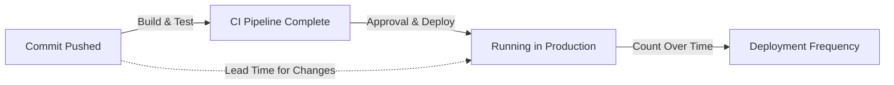

# How to Track Deployment Frequency and Lead Time with OpenTelemetry DORA Metrics

Author: [nawazdhandala](https://www.github.com/nawazdhandala)

Tags: OpenTelemetry, DORA Metrics, DevOps, Deployment Frequency, Lead Time, Observability

Description: Learn how to implement DORA metrics for deployment frequency and lead time using OpenTelemetry, giving your team data-driven insight into software delivery performance.

---

The DORA (DevOps Research and Assessment) metrics have become the standard way to measure software delivery performance. Of the four key metrics, deployment frequency and lead time for changes are the two that most directly reflect how fast a team can deliver value. Deployment frequency measures how often you ship to production. Lead time for changes measures how long it takes from code commit to production deployment.

Most teams track these metrics manually or through vendor-specific integrations. But if you already have an OpenTelemetry pipeline in place, you can capture DORA metrics alongside your existing traces and metrics, giving you a unified observability stack that covers both application health and delivery performance.

This guide shows you how to instrument your deployment pipeline to emit DORA-aligned telemetry using OpenTelemetry.

## Understanding the Two Metrics

Before writing any code, let us be precise about what we are measuring.

**Deployment frequency** is the number of successful deployments to production within a given time period. A deployment counts when new code is actually running in production, not when a CI build finishes or when an artifact is published. The DORA research categorizes teams as elite (on-demand, multiple deploys per day), high (between once per day and once per week), medium (between once per week and once per month), and low (between once per month and once every six months).

**Lead time for changes** is the time between when a commit is made and when that commit is running in production. This includes CI build time, approval time, deployment time, and any manual steps in between. Elite teams have lead times under one day. Low performers can take over six months.



## Designing the Telemetry Model

We will emit both traces and metrics. Traces capture the full lifecycle of each deployment, from commit to production. Metrics capture the aggregate values that DORA cares about.

For traces:
- A root span represents the entire deployment lifecycle
- Child spans represent stages: CI build, approval, deployment rollout
- Span attributes carry metadata like commit SHA, branch, deployer, and environment

For metrics:
- A counter tracks total deployments (for frequency calculation)
- A histogram tracks lead time duration (for percentile analysis)

## Implementing the Deployment Tracker

Here is a Python module that you can call from your deployment pipeline to record DORA telemetry:

```python
# dora_telemetry.py
# Records DORA deployment frequency and lead time metrics via OpenTelemetry

import time
import os
from datetime import datetime, timezone

from opentelemetry import trace, metrics
from opentelemetry.sdk.trace import TracerProvider
from opentelemetry.sdk.trace.export import BatchSpanProcessor
from opentelemetry.sdk.metrics import MeterProvider
from opentelemetry.sdk.metrics.export import PeriodicExportingMetricReader
from opentelemetry.exporter.otlp.proto.grpc.trace_exporter import OTLPSpanExporter
from opentelemetry.exporter.otlp.proto.grpc.metric_exporter import OTLPMetricExporter
from opentelemetry.sdk.resources import Resource
from opentelemetry.trace.status import Status, StatusCode


# Create a shared resource that identifies this telemetry source
resource = Resource.create({
    "service.name": "deployment-pipeline",
    "service.namespace": "dora-metrics",
})


def init_providers():
    """Set up trace and metric providers with OTLP exporters."""
    # Tracing setup
    trace_provider = TracerProvider(resource=resource)
    trace_provider.add_span_processor(
        BatchSpanProcessor(OTLPSpanExporter())
    )
    trace.set_tracer_provider(trace_provider)

    # Metrics setup
    metric_reader = PeriodicExportingMetricReader(
        OTLPMetricExporter(),
        export_interval_millis=10000,
    )
    meter_provider = MeterProvider(resource=resource, metric_readers=[metric_reader])
    metrics.set_meter_provider(meter_provider)


# Initialize providers at module load time
init_providers()

tracer = trace.get_tracer("dora.deployment")
meter = metrics.get_meter("dora.deployment")

# Counter for deployment frequency
deployment_counter = meter.create_counter(
    name="dora.deployments.total",
    description="Total number of production deployments",
    unit="1",
)

# Histogram for lead time measurement
lead_time_histogram = meter.create_histogram(
    name="dora.lead_time.duration",
    description="Time from commit to production deployment",
    unit="s",
)


def record_deployment(commit_sha, commit_timestamp_iso, service_name,
                      environment="production", deployer=None, branch="main"):
    """
    Record a deployment event with both trace and metric telemetry.

    Args:
        commit_sha: The git commit SHA being deployed
        commit_timestamp_iso: ISO 8601 timestamp of when the commit was created
        service_name: Name of the service being deployed
        environment: Target environment (should be 'production' for DORA)
        deployer: Username or system that triggered the deployment
        branch: Git branch name
    """
    # Parse the commit timestamp and calculate lead time
    commit_time = datetime.fromisoformat(commit_timestamp_iso.replace("Z", "+00:00"))
    deploy_time = datetime.now(timezone.utc)
    lead_time_seconds = (deploy_time - commit_time).total_seconds()

    # Common attributes for both traces and metrics
    attributes = {
        "dora.metric.type": "deployment",
        "deployment.environment": environment,
        "deployment.service": service_name,
        "deployment.branch": branch,
        "vcs.commit.sha": commit_sha,
    }

    if deployer:
        attributes["deployment.deployer"] = deployer

    # Record the deployment as a trace span
    with tracer.start_as_current_span("deployment", attributes=attributes) as span:
        span.set_attribute("dora.lead_time.seconds", lead_time_seconds)
        span.set_attribute("dora.lead_time.hours", lead_time_seconds / 3600)
        span.set_attribute("deployment.timestamp", deploy_time.isoformat())
        span.set_attribute("vcs.commit.timestamp", commit_timestamp_iso)
        span.set_status(Status(StatusCode.OK))

    # Increment the deployment counter
    deployment_counter.add(1, attributes)

    # Record the lead time in the histogram
    lead_time_histogram.record(lead_time_seconds, attributes)

    # Flush to ensure telemetry is exported before the process exits
    trace.get_tracer_provider().force_flush()
    metrics.get_meter_provider().force_flush()

    return {
        "lead_time_seconds": lead_time_seconds,
        "lead_time_hours": lead_time_seconds / 3600,
        "deploy_time": deploy_time.isoformat(),
    }
```

The `record_deployment` function is designed to be called once per successful production deployment. It computes the lead time by comparing the original commit timestamp with the current time (the deployment moment). It emits a trace span for detailed per-deployment analysis and metric data points for aggregate dashboards.

## Integrating with GitHub Actions

Here is how to call the deployment tracker from a GitHub Actions workflow after a successful deployment:

```yaml
# .github/workflows/deploy.yml
# Deployment workflow that records DORA metrics via OpenTelemetry

name: Deploy to Production

on:
  push:
    branches: [main]

env:
  OTEL_EXPORTER_OTLP_ENDPOINT: "https://collector.example.com:4317"

jobs:
  build-and-deploy:
    runs-on: ubuntu-latest
    steps:
      - uses: actions/checkout@v4
        with:
          fetch-depth: 0  # Need full history for commit timestamps

      - name: Build and test
        run: |
          npm ci
          npm test
          npm run build

      - name: Deploy to production
        run: |
          # Your actual deployment command here
          ./scripts/deploy.sh

      - name: Record DORA metrics
        if: success()
        run: |
          # Install OpenTelemetry dependencies
          pip install opentelemetry-api opentelemetry-sdk opentelemetry-exporter-otlp-proto-grpc

          # Get the commit timestamp from git
          COMMIT_TIMESTAMP=$(git show -s --format=%cI ${{ github.sha }})

          # Record the deployment event
          python -c "
          from dora_telemetry import record_deployment
          result = record_deployment(
              commit_sha='${{ github.sha }}',
              commit_timestamp_iso='${COMMIT_TIMESTAMP}',
              service_name='my-application',
              environment='production',
              deployer='${{ github.actor }}',
              branch='${{ github.ref_name }}',
          )
          print(f'Deployment recorded. Lead time: {result[\"lead_time_hours\"]:.2f} hours')
          "
```

The key detail here is using `git show -s --format=%cI` to get the commit timestamp in ISO 8601 format. This gives you the actual moment the commit was created, which is the starting point for lead time calculation.

## Handling Multi-Commit Deployments

In practice, a single deployment often includes multiple commits. The DORA definition measures lead time per commit, but you might also want to track the lead time of the oldest commit in a deployment batch. Here is an extension:

```python
# dora_telemetry_batch.py
# Extension to handle multi-commit deployments

import subprocess

def get_commits_since_last_deploy(last_deployed_sha, current_sha):
    """Get all commits between the last deployment and this one."""
    result = subprocess.run(
        ["git", "log", "--format=%H|%cI", f"{last_deployed_sha}..{current_sha}"],
        capture_output=True, text=True, check=True
    )
    commits = []
    for line in result.stdout.strip().split("\n"):
        if line:
            sha, timestamp = line.split("|")
            commits.append({"sha": sha, "timestamp": timestamp})
    return commits


def record_batch_deployment(last_deployed_sha, current_sha, service_name):
    """Record DORA metrics for all commits in this deployment batch."""
    commits = get_commits_since_last_deploy(last_deployed_sha, current_sha)

    for commit in commits:
        # Record each commit individually for accurate per-commit lead time
        record_deployment(
            commit_sha=commit["sha"],
            commit_timestamp_iso=commit["timestamp"],
            service_name=service_name,
        )

    # Also record the batch as a whole
    if commits:
        oldest_commit = commits[-1]  # git log returns newest first
        record_deployment(
            commit_sha=current_sha,
            commit_timestamp_iso=oldest_commit["timestamp"],
            service_name=f"{service_name}.batch",
        )
```

This gives you both the per-commit lead time that DORA defines and a batch-level measurement that represents the oldest change in each deployment.

## Collector Configuration

```yaml
# otel-collector-config.yaml
# Collector config for DORA metrics pipeline

receivers:
  otlp:
    protocols:
      grpc:
        endpoint: 0.0.0.0:4317

processors:
  batch:
    timeout: 10s

  # Add DORA classification based on lead time
  transform:
    metric_statements:
      - context: datapoint
        statements:
          # Tag metrics with DORA performance level based on lead time
          - set(attributes["dora.performance_level"], "elite")
            where attributes["dora.lead_time.seconds"] != nil
            and attributes["dora.lead_time.seconds"] < 86400

exporters:
  otlp:
    endpoint: your-backend:4317

service:
  pipelines:
    traces:
      receivers: [otlp]
      processors: [batch]
      exporters: [otlp]
    metrics:
      receivers: [otlp]
      processors: [batch]
      exporters: [otlp]
```

## Building DORA Dashboards

With telemetry flowing, build dashboards that show your DORA metrics clearly:

**Deployment Frequency Panel**: Query the `dora.deployments.total` counter, grouped by `deployment.service` and bucketed by day or week. Show this as a bar chart over time. Compare against DORA benchmarks to see which category your team falls into.

**Lead Time Distribution Panel**: Query the `dora.lead_time.duration` histogram to show p50, p75, and p95 lead times. A widening gap between p50 and p95 means some changes are getting stuck while others flow quickly, which often points to a bottleneck in the review or approval process.

**Lead Time Trend Panel**: Plot the weekly rolling average of lead time. This is the most useful view for tracking improvement over time.

## Wrapping Up

DORA metrics are only useful if you measure them consistently and accurately. By building deployment frequency and lead time tracking into your OpenTelemetry pipeline, you get automated, precise measurement that does not depend on manual data entry or vendor lock-in. The data lives alongside your application traces and infrastructure metrics, giving you a complete picture of both how your software performs and how your team delivers it. Start with these two metrics, and once you have the pipeline in place, adding change failure rate and mean time to recovery is a natural next step.
