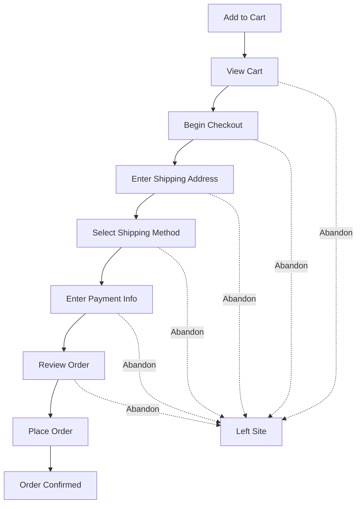

# How to Track Shopping Cart Abandonment Using OpenTelemetry Custom Metrics

Author: [nawazdhandala](https://www.github.com/nawazdhandala)

Tags: OpenTelemetry, E-commerce, Shopping Cart, Custom Metrics, Abandonment, Observability, Business Metrics, Conversion

Description: Learn how to use OpenTelemetry custom metrics to track shopping cart abandonment, measure conversion funnels, and correlate drop-off points with backend performance issues.

---

Shopping cart abandonment rates hover around 70% across the e-commerce industry. That means for every 10 people who add something to their cart, only 3 actually complete the purchase. Some of that is just window shopping, but a meaningful chunk is caused by technical problems: slow checkout pages, payment failures, confusing UX, and timeouts that your backend metrics never surface.

Traditional monitoring tells you that your servers are healthy. Your HTTP 200 rate is high. Your average response time is acceptable. But none of that tells you that 15% of users are dropping off at the shipping address step because the address validation API takes 4 seconds on mobile. OpenTelemetry custom metrics bridge that gap by letting you track business events alongside technical telemetry.

---

## The Abandonment Funnel

Cart abandonment is not a single event. It is the absence of a completion event after a series of funnel steps. Here is a typical checkout funnel:



Each transition is a potential drop-off point. By tracking how many users reach each step and how many proceed to the next, you can calculate conversion rates per step and identify where the funnel leaks.

---

## Setting Up OpenTelemetry for Business Metrics

The same OpenTelemetry SDK you use for infrastructure metrics works perfectly for business metrics. The setup is standard:

```python
# pip install opentelemetry-api opentelemetry-sdk opentelemetry-exporter-otlp

from opentelemetry import trace, metrics
from opentelemetry.sdk.trace import TracerProvider
from opentelemetry.sdk.trace.export import BatchSpanProcessor
from opentelemetry.sdk.metrics import MeterProvider
from opentelemetry.sdk.metrics.export import PeriodicExportingMetricReader
from opentelemetry.exporter.otlp.proto.grpc.trace_exporter import OTLPSpanExporter
from opentelemetry.exporter.otlp.proto.grpc.metric_exporter import OTLPMetricExporter
from opentelemetry.sdk.resources import Resource

resource = Resource.create({
    "service.name": "checkout-service",
    "service.version": "4.2.0",
    "deployment.environment": "production",
})

# Tracing for individual checkout flows
trace_provider = TracerProvider(resource=resource)
trace_provider.add_span_processor(
    BatchSpanProcessor(OTLPSpanExporter(endpoint="otel-collector:4317"))
)
trace.set_tracer_provider(trace_provider)

# Metrics for aggregate funnel tracking
metric_reader = PeriodicExportingMetricReader(
    OTLPMetricExporter(endpoint="otel-collector:4317"),
    export_interval_millis=15000,
)
meter_provider = MeterProvider(resource=resource, metric_readers=[metric_reader])
metrics.set_meter_provider(meter_provider)

tracer = trace.get_tracer("checkout.service")
meter = metrics.get_meter("checkout.service")
```

The key insight here is that business metrics and technical metrics live in the same pipeline. When you see a conversion drop, you can drill into traces from the same time period to find the technical cause.

---

## Defining Funnel Step Metrics

Create a counter for each funnel step. This gives you the raw numbers to calculate step-over-step conversion rates:

```python
# Funnel step counters - one for each stage of checkout
funnel_steps = meter.create_counter(
    name="checkout.funnel.step_reached",
    description="Count of users reaching each checkout funnel step",
)

# Cart value at each step to track revenue impact
cart_value_at_step = meter.create_histogram(
    name="checkout.funnel.cart_value",
    description="Cart value in cents when user reaches each funnel step",
    unit="cents",
)

# Time spent at each step before proceeding or abandoning
step_duration = meter.create_histogram(
    name="checkout.funnel.step_duration",
    description="Time spent at each checkout step",
    unit="seconds",
)

# Explicit abandonment events with reasons
abandonment_events = meter.create_counter(
    name="checkout.abandonment.events_total",
    description="Cart abandonment events with context",
)
```

Using a single counter with a step attribute (rather than separate counters per step) makes it easy to build funnel visualizations in your dashboards. The cart value histogram at each step lets you calculate the actual revenue impact of drop-offs.

---

## Tracking Funnel Progression

Each time a user advances through the funnel, record the step and relevant context:

```python
import time

# In-memory store for tracking step timing per session
# In production, use Redis or a similar store
session_step_times = {}

def record_funnel_step(session_id, step_name, cart, user_context):
    """Record that a user has reached a checkout funnel step."""
    with tracer.start_as_current_span(
        f"checkout.funnel.{step_name}",
        attributes={
            "checkout.session_id": session_id,
            "checkout.step": step_name,
            "checkout.cart.item_count": cart.item_count,
            "checkout.cart.value_cents": cart.total_cents,
            "checkout.user.is_guest": user_context.is_guest,
            "checkout.user.device_type": user_context.device_type,
            "checkout.user.is_returning": user_context.has_previous_orders,
        },
    ) as span:
        # Record that this step was reached
        funnel_steps.add(1, {
            "checkout.step": step_name,
            "checkout.device_type": user_context.device_type,
            "checkout.is_guest": str(user_context.is_guest),
        })

        # Record cart value at this step
        cart_value_at_step.record(
            cart.total_cents,
            {"checkout.step": step_name},
        )

        # Calculate time since the previous step
        now = time.time()
        previous_time = session_step_times.get(session_id)
        if previous_time:
            duration = now - previous_time
            step_duration.record(
                duration,
                {
                    "checkout.step": step_name,
                    "checkout.device_type": user_context.device_type,
                },
            )
            span.set_attribute("checkout.step_transition_seconds", round(duration, 2))

        session_step_times[session_id] = now
```

The device type attribute is especially important. Mobile users often have very different abandonment patterns than desktop users. You might find that your shipping address form is fine on desktop but terrible on mobile, and without that dimension you would never see it in aggregate numbers.

---

## Detecting Abandonment

Abandonment detection works in two ways: explicit (the user clicks away or closes the tab and you catch it) and implicit (the user simply stops progressing and a timeout fires):

```python
from threading import Timer

# Track active checkout sessions
active_sessions = {}
ABANDONMENT_TIMEOUT_SECONDS = 1800  # 30 minutes

def start_abandonment_timer(session_id, cart, user_context, current_step):
    """Start a timer that fires if the user does not progress within the timeout."""
    # Cancel any existing timer for this session
    existing = active_sessions.get(session_id)
    if existing and existing.get("timer"):
        existing["timer"].cancel()

    def on_timeout():
        record_abandonment(
            session_id=session_id,
            last_step=current_step,
            cart=cart,
            user_context=user_context,
            reason="timeout",
        )

    timer = Timer(ABANDONMENT_TIMEOUT_SECONDS, on_timeout)
    timer.start()

    active_sessions[session_id] = {
        "timer": timer,
        "step": current_step,
        "cart": cart,
        "context": user_context,
    }


def record_abandonment(session_id, last_step, cart, user_context, reason):
    """Record a cart abandonment event with full context."""
    with tracer.start_as_current_span(
        "checkout.abandonment",
        attributes={
            "checkout.session_id": session_id,
            "checkout.abandoned_at_step": last_step,
            "checkout.cart.item_count": cart.item_count,
            "checkout.cart.value_cents": cart.total_cents,
            "checkout.abandonment.reason": reason,
            "checkout.user.device_type": user_context.device_type,
            "checkout.user.is_guest": user_context.is_guest,
        },
    ):
        abandonment_events.add(1, {
            "checkout.abandoned_at_step": last_step,
            "checkout.device_type": user_context.device_type,
            "checkout.reason": reason,
        })

    # Clean up the session
    active_sessions.pop(session_id, None)
```

The reason attribute distinguishes between users who timed out (just left) and users who encountered an explicit error. This matters because the remediation is different. Timeout abandonment might need UX improvements, while error-driven abandonment needs bug fixes.

---

## Correlating Abandonment with Backend Performance

The real power of using OpenTelemetry for abandonment tracking is that you can correlate business events with technical performance. Here is how to instrument the backend operations that happen during checkout:

```python
# Backend operation metrics that affect user experience
address_validation_latency = meter.create_histogram(
    name="checkout.backend.address_validation_latency",
    description="Address validation API response time",
    unit="ms",
)

payment_processing_latency = meter.create_histogram(
    name="checkout.backend.payment_processing_latency",
    description="Payment gateway processing time",
    unit="ms",
)

inventory_check_failures = meter.create_counter(
    name="checkout.backend.inventory_check_failures_total",
    description="Failed inventory checks during checkout",
)

def validate_shipping_address(session_id, address):
    """Validate a shipping address using an external API."""
    with tracer.start_as_current_span(
        "checkout.validate_address",
        attributes={
            "checkout.session_id": session_id,
            "checkout.address.country": address.country,
            "checkout.address.provider": "smarty_streets",
        },
    ) as span:
        start = time.monotonic()
        try:
            result = address_api.validate(address)
            latency_ms = (time.monotonic() - start) * 1000

            address_validation_latency.record(
                latency_ms,
                {"checkout.address.country": address.country},
            )

            span.set_attribute("checkout.address.valid", result.is_valid)
            span.set_attribute("checkout.address.latency_ms", round(latency_ms, 1))

            # If validation is slow, flag it since this correlates with abandonment
            if latency_ms > 3000:
                span.add_event("slow_address_validation", {
                    "latency_ms": round(latency_ms, 1),
                    "country": address.country,
                })

            return result

        except Exception as e:
            span.set_attribute("checkout.address.error", str(e))
            span.add_event("address_validation_error", {"error": str(e)})
            raise


def process_payment(session_id, payment_info, amount_cents):
    """Process payment through the payment gateway."""
    with tracer.start_as_current_span(
        "checkout.process_payment",
        attributes={
            "checkout.session_id": session_id,
            "checkout.payment.method": payment_info.method,
            "checkout.payment.gateway": "stripe",
            "checkout.payment.amount_cents": amount_cents,
        },
    ) as span:
        start = time.monotonic()

        result = payment_gateway.charge(payment_info, amount_cents)
        latency_ms = (time.monotonic() - start) * 1000

        payment_processing_latency.record(
            latency_ms,
            {"checkout.payment.method": payment_info.method},
        )

        span.set_attribute("checkout.payment.success", result.success)
        span.set_attribute("checkout.payment.latency_ms", round(latency_ms, 1))

        if not result.success:
            span.set_attribute("checkout.payment.decline_reason", result.decline_reason)
            span.add_event("payment_declined", {
                "reason": result.decline_reason,
                "method": payment_info.method,
            })

        return result
```

Now you can build a dashboard that shows abandonment rate at each step alongside the p95 latency of the backend operations that happen at that step. If the shipping address step has a high abandonment rate and address validation latency is spiking at the same time, you have found your culprit.

---

## Building the Abandonment Dashboard

With these metrics in place, your dashboard should show: funnel conversion counts broken down by device type, step-over-step conversion rates to highlight where users drop off, cart value histograms at each abandoned step (high-value abandonment hurts more), step duration overlaid with abandonment rate (long dwell times before leaving signal UX friction), and backend latency correlated with abandonment at the corresponding funnel step.

---

## Wrapping Up

Cart abandonment is a business problem with technical causes. By using OpenTelemetry custom metrics to track funnel progression, step timing, and abandonment events alongside your existing backend traces and metrics, you can identify whether abandonment is caused by slow APIs, payment failures, or UX friction. The key is treating business events (funnel steps, cart values, abandonment reasons) as first-class telemetry, right next to your infrastructure metrics. When both live in the same observability pipeline, correlation becomes natural instead of requiring a separate analytics tool and manual investigation.
