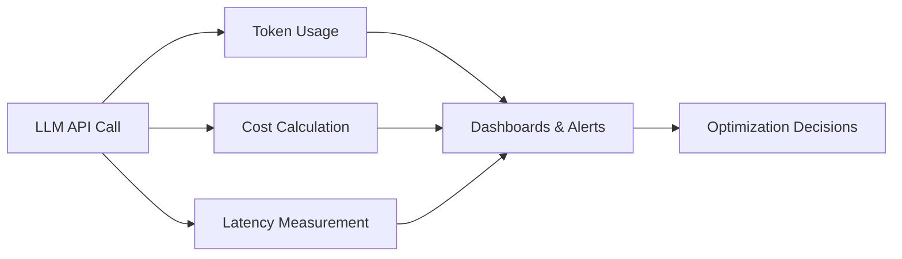
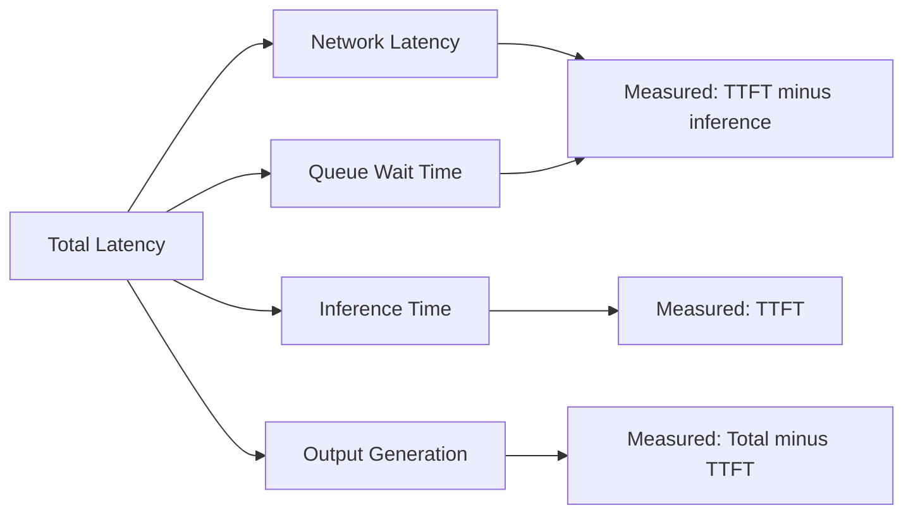

# How to Track Token Usage, Prompt Costs, and Model Latency with OpenTelemetry

Author: [nawazdhandala](https://www.github.com/nawazdhandala)

Tags: OpenTelemetry, LLM, Token Usage, Cost Tracking, Latency, Metrics, Observability, Python

Description: Learn how to track LLM token usage, calculate prompt costs, and measure model latency using OpenTelemetry metrics and traces, with real-world Python examples and dashboarding strategies.

---

Running LLM APIs in production gets expensive fast. A single unoptimized prompt can burn through thousands of tokens per request. Multiply that by thousands of users and you've got a cost problem that's invisible unless you're measuring it.

OpenTelemetry lets you track three critical dimensions of LLM operations: token usage (how many tokens each call consumes), cost (how much each call costs in dollars), and latency (how long each call takes). Together, these give you the data you need to optimize prompts, choose the right models, and set budgets that actually hold.

This guide walks through how to set up comprehensive LLM cost and performance tracking using OpenTelemetry metrics and traces.

---

## The Three Pillars of LLM Cost Observability



Token usage tells you how much capacity you're consuming. Cost tells you how much you're spending. Latency tells you how long users are waiting. You need all three to make good decisions about your LLM infrastructure.

---

## Setting Up Metrics and Tracing

We'll use both OpenTelemetry metrics (for aggregated views) and traces (for per-request detail). The setup configures both a meter and a tracer pointing at the same backend.

```python
from opentelemetry import trace, metrics
from opentelemetry.sdk.trace import TracerProvider
from opentelemetry.sdk.trace.export import BatchSpanProcessor
from opentelemetry.sdk.metrics import MeterProvider
from opentelemetry.sdk.metrics.export import PeriodicExportingMetricReader
from opentelemetry.exporter.otlp.proto.grpc.trace_exporter import OTLPSpanExporter
from opentelemetry.exporter.otlp.proto.grpc.metric_exporter import OTLPMetricExporter
from opentelemetry.sdk.resources import Resource

# Shared resource for both metrics and traces
resource = Resource.create({
    "service.name": "llm-cost-tracker",
    "service.version": "1.0.0",
    "deployment.environment": "production",
})

# Set up tracing
trace_provider = TracerProvider(resource=resource)
trace_exporter = OTLPSpanExporter(endpoint="https://oneuptime.com/otlp")
trace_provider.add_span_processor(BatchSpanProcessor(trace_exporter))
trace.set_tracer_provider(trace_provider)

# Set up metrics with a 30-second export interval
metric_exporter = OTLPMetricExporter(endpoint="https://oneuptime.com/otlp")
metric_reader = PeriodicExportingMetricReader(metric_exporter, export_interval_millis=30000)
meter_provider = MeterProvider(resource=resource, metric_readers=[metric_reader])
metrics.set_meter_provider(meter_provider)

tracer = trace.get_tracer("llm-cost-tracker")
meter = metrics.get_meter("llm-cost-tracker")
```

---

## Defining Cost-Tracking Metrics

Create dedicated metrics for token usage, cost, and latency. Histograms work best here because they let you compute percentiles, averages, and totals from the same instrument.

```python
# Token usage histograms - track distribution of token counts per request
input_token_metric = meter.create_histogram(
    name="gen_ai.usage.input_tokens",
    description="Number of input tokens per LLM request",
    unit="tokens",
)

output_token_metric = meter.create_histogram(
    name="gen_ai.usage.output_tokens",
    description="Number of output tokens per LLM request",
    unit="tokens",
)

total_token_metric = meter.create_histogram(
    name="gen_ai.usage.total_tokens",
    description="Total tokens (input + output) per LLM request",
    unit="tokens",
)

# Cost metric - track the dollar cost of each LLM request
cost_metric = meter.create_histogram(
    name="gen_ai.usage.cost",
    description="Estimated cost in USD per LLM request",
    unit="USD",
)

# Latency metric - track how long each LLM call takes
latency_metric = meter.create_histogram(
    name="gen_ai.latency",
    description="Latency of LLM API calls in milliseconds",
    unit="ms",
)

# Counter for total requests - useful for rate calculations
request_counter = meter.create_counter(
    name="gen_ai.requests.total",
    description="Total number of LLM API requests",
)

# Counter for errors
error_counter = meter.create_counter(
    name="gen_ai.requests.errors",
    description="Total number of failed LLM API requests",
)
```

---

## Building a Pricing Table

To calculate costs, you need a pricing table that maps models to their per-token rates. Keep this as configuration so you can update it when providers change pricing.

```python
# Pricing per 1 million tokens as of early 2026
# Update these values when providers change their pricing
MODEL_PRICING = {
    "gpt-4o": {
        "input_per_million": 2.50,
        "output_per_million": 10.00,
    },
    "gpt-4o-mini": {
        "input_per_million": 0.15,
        "output_per_million": 0.60,
    },
    "gpt-4-turbo": {
        "input_per_million": 10.00,
        "output_per_million": 30.00,
    },
    "claude-sonnet-4-20250514": {
        "input_per_million": 3.00,
        "output_per_million": 15.00,
    },
    "claude-haiku-35": {
        "input_per_million": 0.80,
        "output_per_million": 4.00,
    },
    "claude-opus-4-20250514": {
        "input_per_million": 15.00,
        "output_per_million": 75.00,
    },
}


def calculate_cost(model: str, input_tokens: int, output_tokens: int) -> float:
    """Calculate the estimated cost for a given LLM call."""
    pricing = MODEL_PRICING.get(model)
    if not pricing:
        # Return 0 for unknown models rather than crashing
        return 0.0

    input_cost = (input_tokens / 1_000_000) * pricing["input_per_million"]
    output_cost = (output_tokens / 1_000_000) * pricing["output_per_million"]
    return round(input_cost + output_cost, 6)
```

---

## The Instrumented LLM Call

Now let's put it all together. This function wraps an LLM API call and records all three dimensions: tokens, cost, and latency.

```python
import time
import openai
from opentelemetry import trace

def tracked_llm_call(
    messages: list,
    model: str = "gpt-4o",
    feature: str = "unknown",
    user_id: str = "anonymous",
) -> dict:
    """Make an LLM call with full cost and performance tracking."""

    # Common labels for all metrics - these enable filtering and grouping
    metric_labels = {
        "gen_ai.system": "openai",
        "gen_ai.request.model": model,
        "feature": feature,  # Which product feature triggered this call
    }

    with tracer.start_as_current_span("gen_ai.chat") as span:
        span.set_attribute("gen_ai.system", "openai")
        span.set_attribute("gen_ai.request.model", model)
        span.set_attribute("feature", feature)
        span.set_attribute("user_id", user_id)

        # Count the request
        request_counter.add(1, metric_labels)

        # Start the latency timer
        start_time = time.perf_counter()

        try:
            client = openai.OpenAI()
            response = client.chat.completions.create(
                model=model,
                messages=messages,
            )

            # Calculate elapsed time in milliseconds
            elapsed_ms = (time.perf_counter() - start_time) * 1000

            # Extract token counts from the response
            input_tokens = response.usage.prompt_tokens
            output_tokens = response.usage.completion_tokens
            total_tokens = input_tokens + output_tokens

            # Calculate the dollar cost
            cost = calculate_cost(model, input_tokens, output_tokens)

            # Record all metrics
            input_token_metric.record(input_tokens, metric_labels)
            output_token_metric.record(output_tokens, metric_labels)
            total_token_metric.record(total_tokens, metric_labels)
            cost_metric.record(cost, metric_labels)
            latency_metric.record(elapsed_ms, metric_labels)

            # Also record on the span for per-request investigation
            span.set_attribute("gen_ai.usage.input_tokens", input_tokens)
            span.set_attribute("gen_ai.usage.output_tokens", output_tokens)
            span.set_attribute("gen_ai.usage.total_tokens", total_tokens)
            span.set_attribute("gen_ai.usage.cost_usd", cost)
            span.set_attribute("gen_ai.latency_ms", elapsed_ms)
            span.set_attribute("gen_ai.response.model", response.model)

            return {
                "content": response.choices[0].message.content,
                "input_tokens": input_tokens,
                "output_tokens": output_tokens,
                "cost_usd": cost,
                "latency_ms": round(elapsed_ms, 2),
            }

        except Exception as e:
            elapsed_ms = (time.perf_counter() - start_time) * 1000
            latency_metric.record(elapsed_ms, metric_labels)
            error_counter.add(1, {**metric_labels, "error.type": type(e).__name__})
            span.set_status(trace.StatusCode.ERROR, str(e))
            span.record_exception(e)
            raise
```

---

## Tracking Costs by Feature

One of the most useful things you can do is tag each LLM call with the product feature that triggered it. This lets you break down costs by feature rather than just by model.

```python
# Tag calls by feature for cost attribution
result = tracked_llm_call(
    messages=[{"role": "user", "content": "Summarize this document..."}],
    model="gpt-4o",
    feature="document_summarization",
    user_id="user-12345",
)

result = tracked_llm_call(
    messages=[{"role": "user", "content": "Translate to Spanish: Hello world"}],
    model="gpt-4o-mini",
    feature="translation",
    user_id="user-67890",
)
```

This produces metrics like:

```
gen_ai.usage.cost{feature="document_summarization", model="gpt-4o"} = 0.0125
gen_ai.usage.cost{feature="translation", model="gpt-4o-mini"} = 0.00008
```

---

## Setting Up Budget Alerts

With cost metrics flowing into your observability backend, you can set up alerts when spending exceeds thresholds. Here is a pattern for tracking cumulative daily spend.

```python
import threading
from datetime import datetime, timezone

class BudgetTracker:
    """Track cumulative LLM spending and emit alerts via OpenTelemetry."""

    def __init__(self, daily_budget_usd: float = 100.0):
        self.daily_budget = daily_budget_usd
        self.daily_spend = 0.0
        self.current_date = datetime.now(timezone.utc).date()
        self._lock = threading.Lock()

        # Gauge to report current daily spend
        self.spend_gauge = meter.create_observable_gauge(
            name="gen_ai.budget.daily_spend",
            description="Current daily LLM spend in USD",
            callbacks=[self._observe_spend],
        )

        self.budget_gauge = meter.create_observable_gauge(
            name="gen_ai.budget.daily_limit",
            description="Daily LLM budget limit in USD",
            callbacks=[self._observe_budget],
        )

    def record_cost(self, cost_usd: float):
        """Record a cost and check if we've exceeded the budget."""
        with self._lock:
            today = datetime.now(timezone.utc).date()
            if today != self.current_date:
                # Reset daily counter at midnight UTC
                self.daily_spend = 0.0
                self.current_date = today

            self.daily_spend += cost_usd

            # Record an event if we cross budget thresholds
            utilization = self.daily_spend / self.daily_budget
            if utilization >= 1.0:
                span = trace.get_current_span()
                span.add_event("budget.exceeded", attributes={
                    "budget.daily_spend": self.daily_spend,
                    "budget.daily_limit": self.daily_budget,
                    "budget.utilization": utilization,
                })

    def _observe_spend(self, options):
        """Callback for the observable gauge."""
        from opentelemetry.metrics import Observation
        yield Observation(self.daily_spend)

    def _observe_budget(self, options):
        """Callback for the budget limit gauge."""
        from opentelemetry.metrics import Observation
        yield Observation(self.daily_budget)

# Initialize the budget tracker
budget = BudgetTracker(daily_budget_usd=50.0)
```

---

## Measuring Time to First Token

For streaming responses, total latency doesn't tell the whole story. Users perceive time-to-first-token (TTFT) as responsiveness. Here's how to measure it.

```python
def stream_with_ttft(messages: list, model: str = "gpt-4o"):
    """Stream a response and measure time to first token."""

    with tracer.start_as_current_span("gen_ai.chat") as span:
        span.set_attribute("gen_ai.system", "openai")
        span.set_attribute("gen_ai.request.model", model)
        span.set_attribute("gen_ai.request.stream", True)

        client = openai.OpenAI()
        start_time = time.perf_counter()
        first_token_time = None

        stream = client.chat.completions.create(
            model=model,
            messages=messages,
            stream=True,
            stream_options={"include_usage": True},
        )

        for chunk in stream:
            if chunk.choices and chunk.choices[0].delta.content:
                # Record the time to first token
                if first_token_time is None:
                    first_token_time = time.perf_counter()
                    ttft_ms = (first_token_time - start_time) * 1000
                    span.set_attribute("gen_ai.time_to_first_token_ms", ttft_ms)
                    latency_metric.record(ttft_ms, {
                        "gen_ai.request.model": model,
                        "metric_type": "ttft",
                    })

                yield chunk.choices[0].delta.content

            # Capture usage from the final chunk
            if chunk.usage:
                span.set_attribute("gen_ai.usage.input_tokens", chunk.usage.prompt_tokens)
                span.set_attribute("gen_ai.usage.output_tokens", chunk.usage.completion_tokens)

        # Record total latency
        total_ms = (time.perf_counter() - start_time) * 1000
        span.set_attribute("gen_ai.total_latency_ms", total_ms)
```

---

## Latency Breakdown Analysis

LLM latency has multiple components. Tracking them separately helps you identify bottlenecks.



While you can't directly measure every component from the client side, you can infer a lot:

- **Time to first token (TTFT)**: Covers network round-trip + queue wait + initial inference
- **Generation time**: Total latency minus TTFT, roughly proportional to output tokens
- **Tokens per second**: Output tokens divided by generation time

```python
def compute_throughput(output_tokens: int, ttft_ms: float, total_ms: float) -> float:
    """Calculate output token generation speed in tokens per second."""
    generation_ms = total_ms - ttft_ms
    if generation_ms <= 0:
        return 0.0
    return output_tokens / (generation_ms / 1000)
```

---

## Dashboard Query Examples

Once your metrics are flowing, here are some useful queries to build dashboards around. These are written in a generic PromQL-like syntax that most observability platforms support.

```
# Total daily cost by model
sum(rate(gen_ai_usage_cost_sum[24h])) by (gen_ai_request_model)

# Average tokens per request by feature
avg(gen_ai_usage_total_tokens) by (feature)

# P99 latency by model
histogram_quantile(0.99, rate(gen_ai_latency_bucket[5m])) by (gen_ai_request_model)

# Error rate by model
sum(rate(gen_ai_requests_errors_total[5m])) by (gen_ai_request_model)
/ sum(rate(gen_ai_requests_total[5m])) by (gen_ai_request_model)

# Cost per user (top 10)
topk(10, sum(gen_ai_usage_cost_sum) by (user_id))
```

---

## Wrapping Up

Tracking token usage, costs, and latency isn't optional when you're running LLMs in production. Without it, you're flying blind on spending and can't make informed decisions about model selection, prompt optimization, or capacity planning.

The setup we've covered here gives you three layers of visibility: per-request detail through traces, aggregated trends through metrics, and budget protection through alerts. Start with the basic instrumented call, add the pricing table for your models, and set up a daily budget alert. You can layer on TTFT tracking and per-feature attribution as your usage grows.

The nice thing about using OpenTelemetry for this is that it integrates with whatever observability backend you already use. No vendor lock-in, no proprietary agents - just standard telemetry data that flows into your existing dashboards.
