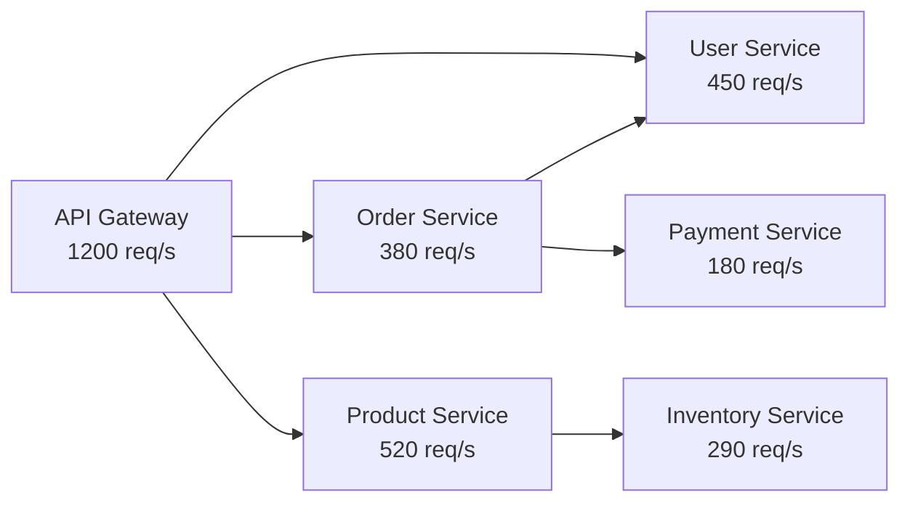

# How to Build a Traffic Analysis Dashboard with Request Volume and Endpoint Breakdowns from OpenTelemetry

Author: [nawazdhandala](https://www.github.com/nawazdhandala)

Tags: OpenTelemetry, Traffic Analysis, HTTP Metrics, Grafana

Description: Build a traffic analysis dashboard from OpenTelemetry HTTP metrics showing request volume, endpoint breakdowns, and patterns.

Understanding your traffic patterns is fundamental to operating a reliable service. You need to know which endpoints get the most requests, when peak traffic occurs, how traffic distributes across services, and whether request patterns are changing over time. OpenTelemetry HTTP server metrics give you all of this data in a standardized format, and with the right dashboard, you can turn raw request counts into actionable traffic intelligence.

## OpenTelemetry HTTP Metrics

When you instrument a web service with OpenTelemetry, the SDK automatically records `http.server.request.duration` as a histogram metric. This single metric, combined with its attributes, provides request count, latency distribution, and dimensional breakdowns all at once.

The key attributes recorded with each observation:

- `http.request.method` - GET, POST, PUT, DELETE, etc.
- `http.route` - The matched route template (e.g., `/api/users/{id}`)
- `http.response.status_code` - The HTTP status code
- `server.address` - The server hostname
- `url.scheme` - http or https

The `_count` suffix on the histogram gives you the total request count, which is the foundation of traffic analysis.

## Collector Configuration

A standard metrics pipeline works for traffic analysis. The one addition worth making is the `metricstransform` processor to create a dedicated request count metric if you want cleaner queries.

```yaml
# otel-collector-config.yaml
receivers:
  otlp:
    protocols:
      grpc:
        endpoint: "0.0.0.0:4317"
      http:
        endpoint: "0.0.0.0:4318"

processors:
  batch:
    send_batch_size: 1000
    timeout: 10s

  # Optional: filter out health check endpoints to reduce noise
  filter/healthchecks:
    metrics:
      datapoint:
        - 'attributes["http.route"] == "/healthz"'
        - 'attributes["http.route"] == "/readyz"'

exporters:
  prometheusremotewrite:
    endpoint: "http://prometheus:9090/api/v1/write"

service:
  pipelines:
    metrics:
      receivers: [otlp]
      processors: [filter/healthchecks, batch]
      exporters: [prometheusremotewrite]
```

## Dashboard Queries

**Total Requests Per Second** - The headline number for traffic volume:

```promql
# Total requests per second across all services
sum(rate(http_server_request_duration_seconds_count[5m]))
```

**Requests by Service** - Which services handle the most traffic:

```promql
# Requests per second broken down by service
sum by (service_name) (
  rate(http_server_request_duration_seconds_count[5m])
)
```

**Top Endpoints by Volume** - The most popular routes:

```promql
# Top 10 endpoints by request volume
topk(10,
  sum by (http_route, service_name) (
    rate(http_server_request_duration_seconds_count[5m])
  )
)
```

**Traffic by HTTP Method** - Distribution of GET, POST, PUT, DELETE:

```promql
# Request volume broken down by HTTP method
sum by (http_request_method) (
  rate(http_server_request_duration_seconds_count[5m])
)
```

**Status Code Distribution** - Overview of response types:

```promql
# Requests grouped by status code class (2xx, 3xx, 4xx, 5xx)
sum by (http_response_status_code) (
  rate(http_server_request_duration_seconds_count[5m])
)
```

For a cleaner view, group by status code class using label_replace:

```promql
# Group status codes into classes
sum by (status_class) (
  label_replace(
    rate(http_server_request_duration_seconds_count[5m]),
    "status_class", "${1}xx", "http_response_status_code", "(\\d)\\d+"
  )
)
```

## Traffic Pattern Analysis

Beyond real-time metrics, traffic pattern analysis helps with capacity planning and understanding user behavior.

**Hour-over-Hour Comparison** - Compare current traffic to the same time yesterday:

```promql
# Current traffic
sum(rate(http_server_request_duration_seconds_count[5m]))

# Same time yesterday using offset
sum(rate(http_server_request_duration_seconds_count[5m] offset 1d))
```

**Week-over-Week Trend** - Detect long-term growth:

```promql
# Traffic growth ratio: this week vs last week
sum(rate(http_server_request_duration_seconds_count[1h]))
/
sum(rate(http_server_request_duration_seconds_count[1h] offset 7d))
```

A value of 1.1 means traffic is 10% higher than the same time last week.

**Peak Traffic Detection** - Find the busiest periods:

```promql
# Maximum requests per second over the last 24 hours
max_over_time(
  sum(rate(http_server_request_duration_seconds_count[5m]))[24h:5m]
)
```

## Traffic Flow Visualization

Use a Grafana Node Graph panel to visualize how traffic flows between services.



To build this in Grafana, you need trace data with service-to-service calls. The Span Metrics Connector can generate metrics with both `service.name` and `peer.service` dimensions, giving you the edges for the graph.

## Dashboard Layout

1. **Traffic Overview** - Total RPS gauge, RPS time series, status code pie chart
2. **Service Breakdown** - RPS per service bar chart, service traffic table with sparklines
3. **Endpoint Detail** - Top endpoints table, endpoint traffic by HTTP method
4. **Patterns and Trends** - Hour-over-hour comparison, week-over-week growth, peak traffic markers
5. **Geographic / Client Breakdown** - If you have `client.address` or geographic attributes, add panels for traffic by region

## Template Variables

Make the dashboard interactive with Grafana variables:

```
# Service selector
Variable: service_name
Query: label_values(http_server_request_duration_seconds_count, service_name)
Multi-value: true

# Time comparison offset
Variable: comparison_offset
Values: 1h, 6h, 1d, 7d
```

Traffic analysis dashboards pay off quickly. They surface endpoints that are growing faster than expected, reveal traffic shifts after feature launches, and provide the baseline data you need for load testing targets. When combined with the latency and error dashboards from other posts in this series, you get a complete picture of how your services perform under real-world traffic conditions.
