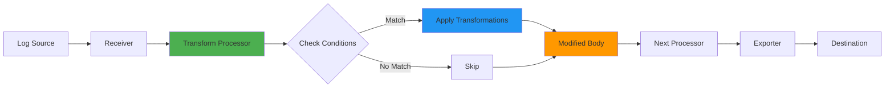

# How to Transform Log Bodies Using OTTL in the OpenTelemetry Collector

Author: [nawazdhandala](https://www.github.com/nawazdhandala)

Tags: OpenTelemetry, Collector, OTTL, Processors, Log Processing, Transform Processor

Description: Learn how to transform log bodies using OpenTelemetry Transformation Language (OTTL) in the OpenTelemetry Collector with practical examples and YAML configurations.

The OpenTelemetry Transformation Language (OTTL) provides powerful capabilities for manipulating telemetry data within the OpenTelemetry Collector. One of the most common use cases is transforming log bodies to extract structured information, redact sensitive data, or normalize log formats across different sources.

## Understanding OTTL and the Transform Processor

OTTL is a domain-specific language designed specifically for transforming telemetry data in the OpenTelemetry Collector. The transform processor implements OTTL and allows you to apply transformations to logs, metrics, and traces as they pass through the collector pipeline.

For log transformations, OTTL provides access to the log record's body, attributes, resource attributes, and other metadata. The body of a log can be a simple string or a complex nested structure, and OTTL provides functions to work with both.

## Basic Log Body Transformation

Here's a simple example that converts all log bodies to uppercase:

```yaml
# Basic transformation to uppercase log bodies
processors:
  transform:
    log_statements:
      - context: log
        statements:
          # Convert the log body to uppercase
          - set(body, Concat([Upper(body)], ""))
```

The `set` function modifies a field, while `Upper` converts text to uppercase. The `Concat` function ensures the result is properly formatted as a string.

## Extracting Information from Log Bodies

A common scenario is extracting specific information from unstructured log bodies into attributes for easier querying and filtering.

```yaml
# Extract error codes from log bodies
processors:
  transform:
    log_statements:
      - context: log
        statements:
          # Extract error code from logs like "Error: ERR_500 - Internal Server Error"
          # This uses regex to find patterns like ERR_XXX
          - set(attributes["error_code"], ExtractPatterns(body, "ERR_\\d+"))

          # Extract the severity level if present in the body
          - set(attributes["extracted_severity"], ExtractPatterns(body, "(ERROR|WARN|INFO|DEBUG)"))

          # Add a flag attribute if the log contains an error
          - set(attributes["has_error"], body != nil and IsMatch(body, "(?i)error"))
```

This configuration extracts structured information from free-form log bodies and stores them as attributes, making the logs more searchable and analyzable.

## Redacting Sensitive Information

Security and compliance often require removing or masking sensitive data from logs before they are stored or exported.

```yaml
# Redact sensitive information from log bodies
processors:
  transform:
    log_statements:
      - context: log
        statements:
          # Redact credit card numbers (basic pattern)
          - replace_pattern(body, "\\b\\d{4}[- ]?\\d{4}[- ]?\\d{4}[- ]?\\d{4}\\b", "****-****-****-****")

          # Redact email addresses
          - replace_pattern(body, "\\b[A-Za-z0-9._%+-]+@[A-Za-z0-9.-]+\\.[A-Z|a-z]{2,}\\b", "[EMAIL_REDACTED]")

          # Redact API keys (assuming format: api_key=xxxxx)
          - replace_pattern(body, "api_key=[A-Za-z0-9]+", "api_key=[REDACTED]")

          # Redact IP addresses
          - replace_pattern(body, "\\b(?:\\d{1,3}\\.){3}\\d{1,3}\\b", "[IP_REDACTED]")
```

The `replace_pattern` function uses regular expressions to find and replace sensitive data patterns in the log body.

## Working with Structured Log Bodies

When logs arrive as structured data (like JSON), you can access nested fields directly.

```yaml
# Transform structured log bodies
processors:
  transform:
    log_statements:
      - context: log
        statements:
          # Access nested fields in a JSON log body
          # Assuming body is {"level": "error", "message": "Failed", "user": {"id": 123}}
          - set(attributes["user_id"], body["user"]["id"])

          # Extract the message to a top-level attribute
          - set(attributes["log_message"], body["message"])

          # Modify the body to remove sensitive user info
          - delete_key(body, "user")

          # Add computed fields to the body
          - set(body["processed_at"], UnixMicro(time_now()))
```

This approach works when the log body is already parsed as a structured object (map). If your logs arrive as JSON strings, you need to parse them first using the JSON parsing capabilities covered in a related post on [parsing JSON logs with OTTL](https://oneuptime.com/blog/post/parse-json-logs-ottl-opentelemetry-collector/view).

## Normalizing Log Bodies Across Sources

Different log sources often use different formats. OTTL allows you to normalize these into a consistent format.

```yaml
# Normalize log bodies from different sources
processors:
  transform:
    log_statements:
      - context: log
        statements:
          # Check if the log is from nginx (based on resource attribute)
          - set(temp_is_nginx, resource.attributes["service.name"] == "nginx")

          # For nginx logs, extract status code from body pattern
          # Example: "GET /api/users 200 1.234ms"
          - set(attributes["http.status_code"], ExtractPatterns(body, "\\s(\\d{3})\\s")) where temp_is_nginx

          # For application logs, status might already be in attributes
          # Ensure all logs have status_code in the same attribute
          - set(attributes["http.status_code"], attributes["status"]) where attributes["status"] != nil and attributes["http.status_code"] == nil

          # Normalize the body format to include timestamp and level
          - set(body, Concat([String(time_now()), " [", String(severity_text), "] ", body], ""))
```

This configuration demonstrates conditional transformations using the `where` clause, which is covered in more detail in the post about [conditional logic in OTTL](https://oneuptime.com/blog/post/conditional-logic-ottl-opentelemetry-collector/view).

## Enriching Log Bodies with Context

You can add contextual information to log bodies to make them more informative.

```yaml
# Enrich log bodies with additional context
processors:
  transform:
    log_statements:
      - context: log
        statements:
          # Prepend service name to log body
          - set(body, Concat(["[", resource.attributes["service.name"], "] ", body], ""))

          # Add trace context to logs when available
          - set(body, Concat([body, " | trace_id=", String(trace_id)], "")) where trace_id != nil

          # Add environment information
          - set(body, Concat([body, " | env=", resource.attributes["deployment.environment"]], "")) where resource.attributes["deployment.environment"] != nil
```

## Complete Pipeline Example

Here's a complete OpenTelemetry Collector configuration that demonstrates log body transformation in a realistic pipeline:

```yaml
# Complete collector configuration with log body transformations
receivers:
  # Receive logs via OTLP protocol
  otlp:
    protocols:
      grpc:
        endpoint: 0.0.0.0:4317
      http:
        endpoint: 0.0.0.0:4318

  # Receive logs from files
  filelog:
    include:
      - /var/log/app/*.log
    operators:
      # Parse as JSON if possible
      - type: json_parser
        parse_from: body
        if: body matches "^\\{"

processors:
  # Memory limiter to prevent OOM
  memory_limiter:
    check_interval: 1s
    limit_mib: 512

  # Batch logs for efficiency
  batch:
    timeout: 10s
    send_batch_size: 1024

  # Transform log bodies
  transform:
    log_statements:
      - context: log
        statements:
          # Redact sensitive data
          - replace_pattern(body, "password=[^&\\s]+", "password=[REDACTED]")
          - replace_pattern(body, "token=[^&\\s]+", "token=[REDACTED]")

          # Extract error codes to attributes
          - set(attributes["error_code"], ExtractPatterns(body, "ERR_\\d+")) where IsMatch(body, "ERR_\\d+")

          # Add service context to body
          - set(body, Concat(["[", resource.attributes["service.name"], "] ", body], ""))

          # Normalize severity mentions in body
          - replace_pattern(body, "(?i)\\[error\\]", "[ERROR]")
          - replace_pattern(body, "(?i)\\[warn\\]", "[WARN]")
          - replace_pattern(body, "(?i)\\[info\\]", "[INFO]")

exporters:
  # Export to OTLP endpoint
  otlp:
    endpoint: https://your-backend:4317
    tls:
      insecure: false

  # Debug exporter for testing
  debug:
    verbosity: detailed

service:
  pipelines:
    logs:
      receivers: [otlp, filelog]
      processors: [memory_limiter, transform, batch]
      exporters: [otlp, debug]
```

## Transformation Flow Diagram

Here's how log body transformations flow through the collector:



## Best Practices for Log Body Transformations

1. **Transform Early in the Pipeline**: Apply transformations as early as possible to ensure consistent data throughout the pipeline.

2. **Use Specific Patterns**: When using regex for extraction or replacement, be as specific as possible to avoid unintended matches.

3. **Test Thoroughly**: Use the [OTTL Playground](https://oneuptime.com/blog/post/ottl-playground-test-opentelemetry-collector/view) to test your transformations before deploying to production.

4. **Consider Performance**: Complex regex operations and multiple transformations can impact performance. Monitor your collector's resource usage.

5. **Document Your Transformations**: Add comments to your OTTL statements explaining what each transformation does and why.

6. **Handle Nil Values**: Always check for nil values before accessing nested fields to prevent errors.

7. **Preserve Original Data When Needed**: If you need to keep the original body, copy it to an attribute before transforming.

## Common Pitfalls to Avoid

1. **Overly Broad Regex**: Using patterns like `.*` can match more than intended and lead to data loss.

2. **Ignoring Data Types**: OTTL is strongly typed. Ensure you use appropriate conversion functions when needed.

3. **Modifying Resource Attributes**: Be cautious when modifying resource attributes as they affect all telemetry from that resource.

4. **Forgetting to Handle Errors**: Use conditional statements to handle cases where expected data is missing.

## Conclusion

Transforming log bodies with OTTL in the OpenTelemetry Collector provides a powerful way to normalize, enrich, and secure your log data. By extracting structured information, redacting sensitive data, and normalizing formats, you can make your logs more valuable for observability and troubleshooting.

The transform processor's flexibility allows you to handle diverse log formats and implement complex transformation logic without writing custom code. Combined with other OTTL capabilities like [attribute modification](https://oneuptime.com/blog/post/rename-modify-attributes-ottl-opentelemetry-collector/view) and [conditional logic](https://oneuptime.com/blog/post/conditional-logic-ottl-opentelemetry-collector/view), you can build sophisticated log processing pipelines that meet your specific requirements.

For more information on OTTL and the transform processor, refer to the [OpenTelemetry Collector documentation](https://opentelemetry.io/docs/collector/transforming-telemetry/).
