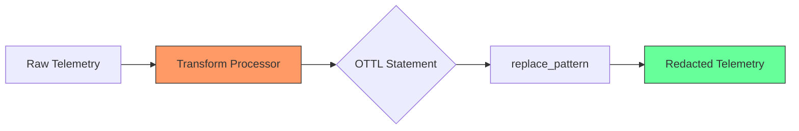
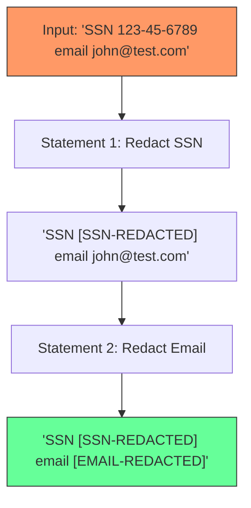

# How to Use the Transform Processor for Fine-Grained PII Redaction with Regex

Author: [nawazdhandala](https://www.github.com/nawazdhandala)

Tags: OpenTelemetry, Collector, Transform Processor, PII, Regex, Data Privacy, Security

Description: A hands-on guide to using the OpenTelemetry Collector transform processor with regex patterns for precise PII redaction in traces, logs, and metrics.

---

The OpenTelemetry Collector's transform processor is one of the most powerful tools available for modifying telemetry data in flight. Unlike the simpler `attributes` processor, which can only delete or overwrite entire attribute values, the transform processor lets you surgically edit parts of a value using regular expressions. This makes it the right tool for PII redaction, where you want to replace a Social Security number inside a larger string without destroying the rest of the context.

This guide covers everything you need to know to use the transform processor for regex-based PII redaction across traces, logs, and metrics.

## Understanding the Transform Processor

The transform processor uses the OpenTelemetry Transformation Language (OTTL), a domain-specific language designed for modifying telemetry data. OTTL provides functions like `replace_pattern`, `replace_match`, and `replace_all_matches` that accept regex patterns and replacement strings.

The key function for PII redaction is `replace_pattern`. It takes three arguments: the field to modify, the regex pattern to match, and the replacement string.



## Adding the Transform Processor to Your Collector

First, make sure you are using the OpenTelemetry Collector Contrib distribution. The core distribution does not include the transform processor. You can verify by checking your Collector binary.

```bash
# Check which components are available in your Collector build
otelcol-contrib components
```

If you see `transform` listed under processors, you are good to go. If not, you need to switch to the contrib distribution or build a custom Collector that includes it.

## Redacting Social Security Numbers

SSNs follow the pattern XXX-XX-XXXX. This is one of the most common PII patterns you will encounter in US-based applications.

The following configuration targets SSN patterns in span attributes and replaces them with a redaction marker.

```yaml
processors:
  transform/redact-ssn:
    trace_statements:
      - context: span
        statements:
          # Match SSN pattern (3 digits, dash, 2 digits, dash, 4 digits)
          # and replace with a redaction marker in the 'user.ssn' attribute
          - replace_pattern(attributes["user.ssn"], "^[0-9]{3}-[0-9]{2}-[0-9]{4}$", "[SSN-REDACTED]")

          # Also scan free-text description attributes for embedded SSNs
          - replace_pattern(attributes["description"], "[0-9]{3}-[0-9]{2}-[0-9]{4}", "[SSN-REDACTED]")
```

Notice the difference between the two patterns. The first uses `^` and `$` anchors because the entire attribute value is an SSN. The second does not use anchors because the SSN might be embedded in a longer string like "User SSN is 123-45-6789 and they requested access."

## Redacting Email Addresses

Email addresses appear everywhere: in user attributes, log messages, HTTP query parameters, and error messages. The regex for emails needs to be broad enough to catch most formats without being so greedy that it matches non-email text.

This configuration redacts email addresses from both span attributes and log bodies.

```yaml
processors:
  transform/redact-emails:
    # Redact emails in trace span attributes
    trace_statements:
      - context: span
        statements:
          # Match standard email pattern and replace with placeholder
          # Covers most common email formats including dots, dashes, and plus signs
          - replace_pattern(attributes["user.email"], "[a-zA-Z0-9._%+\\-]+@[a-zA-Z0-9.\\-]+\\.[a-zA-Z]{2,}", "[EMAIL-REDACTED]")
          - replace_pattern(attributes["http.url"], "[a-zA-Z0-9._%+\\-]+@[a-zA-Z0-9.\\-]+\\.[a-zA-Z]{2,}", "[EMAIL-REDACTED]")

    # Redact emails in log bodies
    log_statements:
      - context: log
        statements:
          # Scan log body text for email addresses and redact them
          - replace_pattern(body, "[a-zA-Z0-9._%+\\-]+@[a-zA-Z0-9.\\-]+\\.[a-zA-Z]{2,}", "[EMAIL-REDACTED]")
```

## Redacting Phone Numbers

Phone numbers are tricky because they come in many formats: (555) 123-4567, 555-123-4567, 5551234567, +1-555-123-4567. You need multiple patterns or a flexible regex.

This configuration handles the most common US phone number formats.

```yaml
processors:
  transform/redact-phones:
    trace_statements:
      - context: span
        statements:
          # Match (XXX) XXX-XXXX format
          - replace_pattern(attributes["user.phone"], "\\([0-9]{3}\\)\\s?[0-9]{3}-[0-9]{4}", "[PHONE-REDACTED]")
          # Match XXX-XXX-XXXX format
          - replace_pattern(attributes["user.phone"], "[0-9]{3}-[0-9]{3}-[0-9]{4}", "[PHONE-REDACTED]")
          # Match +1XXXXXXXXXX format (international with country code)
          - replace_pattern(attributes["user.phone"], "\\+1[0-9]{10}", "[PHONE-REDACTED]")

    log_statements:
      - context: log
        statements:
          # Apply the same patterns to log bodies where phone numbers might appear
          - replace_pattern(body, "\\([0-9]{3}\\)\\s?[0-9]{3}-[0-9]{4}", "[PHONE-REDACTED]")
          - replace_pattern(body, "[0-9]{3}-[0-9]{3}-[0-9]{4}", "[PHONE-REDACTED]")
```

## Combining Multiple Redaction Rules

In practice, you will want to redact several types of PII in a single processor. You can stack multiple statements in one transform processor block. The statements execute in order, so each one operates on the output of the previous one.

```yaml
processors:
  transform/redact-all-pii:
    trace_statements:
      - context: span
        statements:
          # 1. Redact SSNs in any attribute that might contain them
          - replace_pattern(attributes["user.ssn"], "[0-9]{3}-[0-9]{2}-[0-9]{4}", "[SSN-REDACTED]")

          # 2. Redact email addresses in URL attributes
          - replace_pattern(attributes["url.full"], "[a-zA-Z0-9._%+\\-]+@[a-zA-Z0-9.\\-]+\\.[a-zA-Z]{2,}", "[EMAIL-REDACTED]")

          # 3. Redact credit card numbers (16 digits with optional dashes or spaces)
          - replace_pattern(attributes["payment.card"], "[0-9]{4}[\\-\\s]?[0-9]{4}[\\-\\s]?[0-9]{4}[\\-\\s]?[0-9]{4}", "[CC-REDACTED]")

          # 4. Redact IP addresses to remove the last octet
          - replace_pattern(attributes["net.peer.ip"], "([0-9]{1,3}\\.[0-9]{1,3}\\.[0-9]{1,3}\\.)([0-9]{1,3})", "$${1}xxx")

    log_statements:
      - context: log
        statements:
          # Apply the same redaction patterns to log bodies
          - replace_pattern(body, "[0-9]{3}-[0-9]{2}-[0-9]{4}", "[SSN-REDACTED]")
          - replace_pattern(body, "[a-zA-Z0-9._%+\\-]+@[a-zA-Z0-9.\\-]+\\.[a-zA-Z]{2,}", "[EMAIL-REDACTED]")
          - replace_pattern(body, "[0-9]{4}[\\-\\s]?[0-9]{4}[\\-\\s]?[0-9]{4}[\\-\\s]?[0-9]{4}", "[CC-REDACTED]")

    # Metric redaction for labels that might contain PII
    metric_statements:
      - context: datapoint
        statements:
          # Redact email addresses that might appear in metric labels
          - replace_pattern(attributes["user.email"], "[a-zA-Z0-9._%+\\-]+@[a-zA-Z0-9.\\-]+\\.[a-zA-Z]{2,}", "[EMAIL-REDACTED]")
```

## Processing Order Matters

The order of statements within a context block matters. Consider what happens if you have an attribute value like "Contact SSN 123-45-6789 at john@example.com". The SSN redaction runs first, producing "Contact SSN [SSN-REDACTED] at john@example.com". Then the email redaction runs, producing "Contact SSN [SSN-REDACTED] at [EMAIL-REDACTED]". Each statement works on the result of the previous one.

If your patterns could overlap, test them carefully. A poorly written phone number regex might match part of an SSN pattern, causing double redaction like "[PHONE-REDACTED]-6789".



## Handling Dynamic Attribute Keys

Sometimes you do not know the exact attribute key that will contain PII. A span might have attributes like `request.param.email`, `request.param.ssn`, or other dynamically named keys. OTTL does not support wildcard attribute keys directly, but you can work around this by listing the known attribute keys explicitly or by using span events.

For dynamic keys, a better approach is to handle redaction at the application level with a custom SpanProcessor in the SDK, and use the Collector's transform processor as a second layer for known patterns.

## Testing Your Redaction Rules

Before deploying to production, test your regex patterns thoroughly. Use the Collector's `logging` exporter with detailed verbosity to inspect the output.

```yaml
exporters:
  # Use the debug exporter to verify redaction works correctly
  debug:
    verbosity: detailed

service:
  pipelines:
    traces:
      receivers: [otlp]
      processors: [transform/redact-all-pii]
      # Export to debug to inspect redacted output in collector logs
      exporters: [debug]
```

Send test spans with known PII values through the pipeline and verify the output. Check that:

1. The PII is fully replaced and no partial values remain.
2. Non-PII content in the same attribute is preserved.
3. The redaction markers (like `[SSN-REDACTED]`) appear where expected.
4. The regex patterns do not cause false positives on legitimate data.

## Performance Considerations

Regex matching is computationally expensive. Each `replace_pattern` call scans the entire attribute value for matches. If you have many redaction rules and high throughput, the transform processor can become a bottleneck.

To mitigate this:

- Apply redaction only to attributes that actually need it. Do not scan `http.method` for email addresses.
- Use specific attribute keys instead of applying patterns to every attribute.
- Monitor the Collector's own metrics (specifically `otelcol_processor_transform_duration`) to track processing time.
- Consider splitting redaction across multiple Collector instances if throughput is very high.

The transform processor with regex is the most flexible tool the Collector offers for PII redaction. It sits at the right point in the pipeline - after your applications emit telemetry but before the data reaches your backend. Combined with SDK-level controls and proper application logging practices, it forms a solid defense against PII leakage in your observability data.
