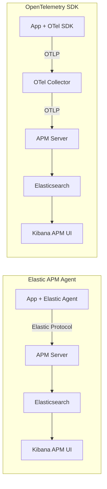

# How to Transition from Elastic APM Agents to OpenTelemetry SDKs

Author: [nawazdhandala](https://www.github.com/nawazdhandala)

Tags: OpenTelemetry, Elastic, APM, Migration, Observability, Elasticsearch

Description: Step-by-step instructions for transitioning from Elastic APM agents to OpenTelemetry SDKs while keeping Elasticsearch as your backend.

---

Elastic APM has been a solid choice for teams that already run the Elastic Stack. The APM agents are well-built, the integration with Elasticsearch and Kibana is seamless, and the whole thing can run self-hosted. So why would you migrate to OpenTelemetry? Because the world is moving toward a common instrumentation standard, and Elastic knows it. In fact, Elastic APM Server has supported OTLP ingestion natively since version 7.13. This means you can switch your application instrumentation to OpenTelemetry while keeping Elasticsearch as your backend.

This guide walks through the transition for Java, Python, and Node.js applications, covering both auto-instrumentation and manual span creation.

## Why Transition from Elastic APM Agents?

Elastic APM agents work well, but they come with limitations:

1. **Elastic-only**: The agents only export to Elastic APM Server. If you want to send data to another backend in the future, you need to re-instrument.
2. **Maintenance burden**: Elastic maintains agents for each language separately. The OpenTelemetry project has broader community contributions and faster feature development.
3. **Standardization**: OpenTelemetry semantic conventions are becoming the industry standard for attribute naming. Building on them now saves work later.
4. **Multi-signal support**: While Elastic APM agents handle traces and some metrics, OpenTelemetry provides a unified approach to traces, metrics, and logs with shared context.

## Architecture: Before and After

The key architectural change is that OpenTelemetry SDKs send data through the OpenTelemetry Collector, which then forwards to your Elastic APM Server using OTLP. This adds a hop but gives you the Collector's processing pipeline.



You can also skip the Collector entirely and send OTLP directly from the SDKs to the APM Server. This is simpler but gives you less control over data processing.

## Step 1: Verify Your Elastic APM Server Supports OTLP

OTLP support was added in Elastic APM Server 7.13 and is enabled by default in 8.x. Check your version and ensure the OTLP endpoint is accessible.

```bash
# Check your APM Server version
# OTLP support requires 7.13 or later
curl -s http://your-apm-server:8200/ | python3 -m json.tool

# Test the OTLP gRPC endpoint
# APM Server listens for OTLP on port 8200 by default (same port, different path)
# A successful connection returns an empty response, not an error
grpcurl -plaintext your-apm-server:8200 list
```

If you are running APM Server 8.x with Fleet, OTLP is already enabled. For standalone configurations, make sure `apm-server.auth.anonymous.enabled` is true or configure an API key.

## Step 2: Migrate a Java Application

Elastic's Java APM agent attaches as a javaagent, just like the OpenTelemetry Java agent. The swap is a one-line change in your startup command, plus some environment variable updates.

Here is the configuration change. Notice how Elastic-specific settings map to standard OpenTelemetry ones.

```bash
# Before: Elastic APM Java agent
# The Elastic agent sends data directly to APM Server using its own protocol
# export ELASTIC_APM_SERVICE_NAME=order-service
# export ELASTIC_APM_SERVER_URL=http://apm-server:8200
# export ELASTIC_APM_SECRET_TOKEN=your-secret-token
# export ELASTIC_APM_ENVIRONMENT=production
# java -javaagent:/path/to/elastic-apm-agent.jar -jar myapp.jar

# After: OpenTelemetry Java agent
# The OTel agent sends data via OTLP to the Collector or directly to APM Server
export OTEL_SERVICE_NAME=order-service
export OTEL_RESOURCE_ATTRIBUTES=deployment.environment=production,service.version=2.1.0
# Send directly to APM Server's OTLP endpoint
export OTEL_EXPORTER_OTLP_ENDPOINT=http://apm-server:8200
export OTEL_EXPORTER_OTLP_PROTOCOL=grpc
# If APM Server requires a secret token, pass it as a header
export OTEL_EXPORTER_OTLP_HEADERS="Authorization=Bearer your-secret-token"

java -javaagent:/path/to/opentelemetry-javaagent.jar -jar myapp.jar
```

The OpenTelemetry Java agent auto-instruments the same libraries that the Elastic agent covers: Spring, Servlet, JAX-RS, JDBC, JMS, and more. The coverage is comparable, and in many cases OpenTelemetry supports even more libraries.

## Step 3: Migrate a Python Application

The Elastic Python agent uses middleware integration for frameworks like Django and Flask. OpenTelemetry follows a similar pattern but with a different initialization approach.

This shows the transformation for a Flask application.

```python
# Before: Elastic APM for Flask
# The Elastic agent integrates as Flask middleware
# from elasticapm.contrib.flask import ElasticAPM
# app = Flask(__name__)
# app.config['ELASTIC_APM'] = {
#     'SERVICE_NAME': 'inventory-service',
#     'SERVER_URL': 'http://apm-server:8200',
#     'SECRET_TOKEN': 'your-secret-token',
#     'ENVIRONMENT': 'production',
# }
# apm = ElasticAPM(app)

# After: OpenTelemetry for Flask
# Install: pip install opentelemetry-sdk opentelemetry-exporter-otlp
#          pip install opentelemetry-instrumentation-flask
from flask import Flask
from opentelemetry import trace
from opentelemetry.sdk.trace import TracerProvider
from opentelemetry.sdk.trace.export import BatchSpanProcessor
from opentelemetry.exporter.otlp.proto.grpc.trace_exporter import OTLPSpanExporter
from opentelemetry.sdk.resources import Resource
from opentelemetry.instrumentation.flask import FlaskInstrumentor

# Configure the tracer provider with service identity
resource = Resource.create({
    "service.name": "inventory-service",
    "deployment.environment": "production",
    "service.version": "1.5.0",
})

# Set up OTLP export to APM Server or OTel Collector
provider = TracerProvider(resource=resource)
exporter = OTLPSpanExporter(
    endpoint="http://apm-server:8200",
    # Pass the secret token as a header if required
    headers={"Authorization": "Bearer your-secret-token"},
)
provider.add_span_processor(BatchSpanProcessor(exporter))
trace.set_tracer_provider(provider)

# Create the Flask app and instrument it
app = Flask(__name__)
FlaskInstrumentor().instrument_app(app)
```

Alternatively, you can use zero-code instrumentation with `opentelemetry-instrument`, which is the closest equivalent to Elastic's automatic instrumentation:

```bash
# Zero-code instrumentation for Python
# This auto-detects Flask, Django, requests, SQLAlchemy, etc.
# It is the easiest migration path from Elastic's auto-instrumentation
pip install opentelemetry-distro opentelemetry-exporter-otlp
opentelemetry-bootstrap -a install

# Run with auto-instrumentation
OTEL_SERVICE_NAME=inventory-service \
OTEL_EXPORTER_OTLP_ENDPOINT=http://apm-server:8200 \
opentelemetry-instrument python app.py
```

## Step 4: Migrate Custom Spans and Transactions

Elastic APM uses the concept of "transactions" (top-level operations) and "spans" (child operations). In OpenTelemetry, everything is a span, and the root span serves the same purpose as an Elastic transaction.

Here is how to convert custom instrumentation.

```python
# Before: Elastic APM custom instrumentation
# import elasticapm
#
# @elasticapm.capture_span('calculate-discount')
# def calculate_discount(customer_id, cart_total):
#     client = elasticapm.get_client()
#     elasticapm.label(customer_id=customer_id, cart_total=cart_total)
#     discount = run_discount_engine(customer_id, cart_total)
#     return discount

# After: OpenTelemetry custom instrumentation
from opentelemetry import trace

tracer = trace.getTracer("discount-module", "1.0.0")

def calculate_discount(customer_id, cart_total):
    # startActiveSpan is equivalent to capture_span
    # It creates a child span under the current active span
    with tracer.start_as_current_span("calculate-discount") as span:
        # set_attribute replaces elasticapm.label()
        span.set_attribute("customer.id", customer_id)
        span.set_attribute("cart.total", cart_total)
        try:
            discount = run_discount_engine(customer_id, cart_total)
            span.set_attribute("discount.value", discount)
            return discount
        except Exception as e:
            # Record the exception and mark the span as errored
            span.record_exception(e)
            span.set_status(trace.StatusCode.ERROR, str(e))
            raise
```

## Step 5: Handle Elastic-Specific Features

Some Elastic APM features need alternative solutions in OpenTelemetry:

**User context**: Elastic APM has `set_user_context()`. In OpenTelemetry, set user attributes on the span directly.

```python
# Elastic APM user context equivalent in OpenTelemetry
# Before: elasticapm.set_user_context(user_id='123', email='user@example.com')
# After: Set standard attributes on the current span
span = trace.get_current_span()
span.set_attribute("enduser.id", "123")
span.set_attribute("enduser.email", "user@example.com")
```

**Custom context**: Elastic's `set_custom_context()` maps to span attributes. There is no separate context object; just add attributes to the span.

**Error capture**: Elastic's `capture_exception()` becomes `span.record_exception()`. Both attach error details to the current trace context.

## Step 6: Update Kibana Dashboards

When you switch from Elastic APM agents to OpenTelemetry, the data lands in the same Elasticsearch indices (via APM Server), but some field names change. Elastic's APM UI in Kibana handles OpenTelemetry data natively starting from version 8.0, so most views work automatically.

However, custom Kibana dashboards that reference Elastic APM field names need updating:

| Elastic APM Field | OpenTelemetry Equivalent |
|---|---|
| transaction.name | span.name (for root spans) |
| transaction.type | Not directly mapped; use span.kind |
| span.type | span.kind + attributes |
| labels.* | resource.attributes.* or span.attributes.* |
| service.environment | deployment.environment |
| user.id | enduser.id |

## Migration Checklist

Before fully cutting over, verify each item:

- All services send traces via OTLP to APM Server
- Trace counts in Kibana match pre-migration baselines
- Custom spans appear with correct names and attributes
- Error tracking captures exceptions with stack traces
- Service maps show correct dependency relationships
- Latency distributions match pre-migration patterns
- No Elastic APM agent configuration remains in code or deployment

## Conclusion

Transitioning from Elastic APM agents to OpenTelemetry SDKs is a smooth process because Elastic APM Server already speaks OTLP natively. You keep your Elasticsearch backend, your Kibana dashboards, and your existing data retention policies. What changes is the instrumentation layer, moving from Elastic-specific agents to the industry standard. The result is instrumentation that is portable, community-maintained, and ready for whatever observability architecture decisions you make next.
