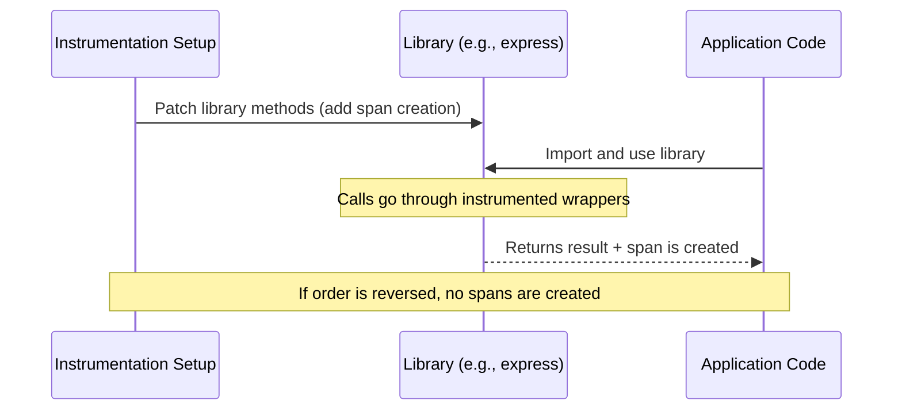

# How to Troubleshoot Auto-Instrumentation Not Generating Spans

Author: [nawazdhandala](https://www.github.com/nawazdhandala)

Tags: OpenTelemetry, Auto-Instrumentation, Troubleshooting, Tracing, Spans, Debugging

Description: A practical guide to diagnosing and fixing OpenTelemetry auto-instrumentation setups that fail to generate spans or produce incomplete traces.

---

You installed the OpenTelemetry auto-instrumentation packages, added the initialization code, started your application, and... nothing. No spans appear in your tracing backend. Or maybe some spans show up but key libraries like your HTTP framework or database client produce nothing. This is a frustrating but common situation, and the causes are almost always one of a handful of well-known issues.

This guide walks through the most common reasons auto-instrumentation fails to generate spans and how to fix each one.

## Understanding How Auto-Instrumentation Works

Before diving into troubleshooting, it helps to understand the mechanism behind auto-instrumentation. OpenTelemetry auto-instrumentation works by monkey-patching or wrapping popular libraries at runtime. When you import an HTTP client library, for example, the instrumentation package replaces key methods with instrumented versions that create spans around the original calls.

The critical detail here is timing. The instrumentation packages need to patch libraries before your application code imports and uses them. If your application imports a library before the instrumentation has a chance to wrap it, those calls will never generate spans.



## Step 1: Verify Initialization Order

The single most common cause of missing spans is initializing the OpenTelemetry SDK after importing your application libraries. The SDK setup must happen first.

Here is the wrong way to do it in Node.js:

```javascript
// WRONG: Importing express before setting up instrumentation
// The express module gets loaded without patches applied
const express = require('express');
const { NodeSDK } = require('@opentelemetry/sdk-node');
const { getNodeAutoInstrumentations } = require('@opentelemetry/auto-instrumentations-node');

const sdk = new NodeSDK({
  instrumentations: [getNodeAutoInstrumentations()],
});
sdk.start();

// At this point express is already loaded unpatched - no spans will be generated
const app = express();
```

And here is the correct approach:

```javascript
// CORRECT: Set up instrumentation BEFORE importing any application libraries
// This file should be your entry point or loaded via --require flag
const { NodeSDK } = require('@opentelemetry/sdk-node');
const { getNodeAutoInstrumentations } = require('@opentelemetry/auto-instrumentations-node');
const { OTLPTraceExporter } = require('@opentelemetry/exporter-trace-otlp-http');

// Initialize and start the SDK first
const sdk = new NodeSDK({
  traceExporter: new OTLPTraceExporter({
    url: 'http://localhost:4318/v1/traces',
  }),
  instrumentations: [getNodeAutoInstrumentations()],
});

sdk.start();

// NOW import your application libraries - they will be properly patched
const express = require('express');
const app = express();
```

For Python, the same principle applies. The easiest way to guarantee correct ordering is to use the `opentelemetry-instrument` command:

```bash
# Use the opentelemetry-instrument wrapper to ensure correct initialization order
# This automatically patches libraries before your application code runs
opentelemetry-instrument \
  --traces_exporter otlp \
  --exporter_otlp_endpoint http://localhost:4318 \
  python app.py
```

## Step 2: Check That Instrumentation Packages Are Installed

Auto-instrumentation is not a single magic package. Each library you want to instrument requires its own instrumentation package. If you are using Express and pg (PostgreSQL client) in Node.js, you need the corresponding instrumentation packages installed.

```bash
# Check which OpenTelemetry instrumentation packages are installed
# Each library needs its own instrumentation package
npm list | grep opentelemetry

# For a Node.js app using Express and PostgreSQL, you need at minimum:
# @opentelemetry/instrumentation-express
# @opentelemetry/instrumentation-http (required for Express to work)
# @opentelemetry/instrumentation-pg
```

A subtle but important detail: the Express instrumentation depends on the HTTP instrumentation. If you have `@opentelemetry/instrumentation-express` installed but not `@opentelemetry/instrumentation-http`, Express spans will not appear. Always install the HTTP instrumentation when instrumenting any HTTP framework.

For Python:

```bash
# List installed OpenTelemetry instrumentation packages
pip list | grep opentelemetry-instrumentation

# Install all available auto-instrumentations at once
pip install opentelemetry-distro
opentelemetry-bootstrap -a install
```

The `opentelemetry-bootstrap -a install` command detects which libraries you have installed and installs the corresponding instrumentation packages automatically.

## Step 3: Verify the Exporter Is Configured and Reachable

Even if spans are being generated internally, they will not appear in your backend if the exporter cannot reach the collector or backend endpoint.

```javascript
// Add a console exporter alongside your OTLP exporter for debugging
// This prints spans to stdout so you can verify they are being created
const { NodeSDK } = require('@opentelemetry/sdk-node');
const { ConsoleSpanExporter } = require('@opentelemetry/sdk-trace-node');
const { OTLPTraceExporter } = require('@opentelemetry/exporter-trace-otlp-http');
const { SimpleSpanProcessor, BatchSpanProcessor } = require('@opentelemetry/sdk-trace-node');
const { trace } = require('@opentelemetry/api');

// Use SimpleSpanProcessor with ConsoleSpanExporter for immediate feedback
// Spans will print to your terminal as soon as they end
const consoleExporter = new ConsoleSpanExporter();
const otlpExporter = new OTLPTraceExporter({
  url: 'http://localhost:4318/v1/traces',
});

const sdk = new NodeSDK({
  // Using multiple span processors to export to both console and OTLP
  spanProcessors: [
    new SimpleSpanProcessor(consoleExporter),
    new BatchSpanProcessor(otlpExporter),
  ],
});

sdk.start();
```

If spans appear in your console output but not in your tracing backend, the problem is with the exporter configuration or network connectivity. Check that the OTLP endpoint URL is correct and that your collector is actually running.

```bash
# Verify that the OTLP endpoint is reachable
# A healthy collector should respond on its HTTP port
curl -v http://localhost:4318/v1/traces \
  -H "Content-Type: application/json" \
  -d '{}'

# Check if the collector process is running
docker ps | grep otel-collector
```

## Step 4: Check for Suppressed Instrumentation

Some instrumentation packages suppress nested instrumentations to avoid creating redundant spans. For example, if the HTTP instrumentation already creates a span for an incoming request, the Express instrumentation might not create a duplicate span for the same request. This is by design, but it can be confusing when you expect to see spans from a specific library.

```javascript
// Some instrumentations can be individually enabled or disabled
// Check if a specific instrumentation is accidentally disabled
const { getNodeAutoInstrumentations } = require('@opentelemetry/auto-instrumentations-node');

const instrumentations = getNodeAutoInstrumentations({
  // Each instrumentation can be configured individually
  // Setting enabled: false will suppress that instrumentation entirely
  '@opentelemetry/instrumentation-fs': {
    enabled: false, // File system instrumentation is often disabled to reduce noise
  },
  '@opentelemetry/instrumentation-express': {
    enabled: true, // Make sure this is not accidentally set to false
  },
});
```

## Step 5: Confirm the Sampler Is Not Dropping Everything

If you configured a sampler, it might be dropping all or most spans. The default sampler is `AlwaysOn`, which keeps everything, but if someone changed it to a ratio-based sampler or `AlwaysOff`, that would explain the missing spans.

```javascript
// Check your sampler configuration
// An AlwaysOff sampler or a zero-ratio sampler will drop all spans
const { NodeSDK } = require('@opentelemetry/sdk-node');
const { AlwaysOnSampler, TraceIdRatioBasedSampler } = require('@opentelemetry/sdk-trace-node');

const sdk = new NodeSDK({
  // AlwaysOnSampler ensures no spans are dropped due to sampling
  // Use this during debugging, then switch to ratio-based for production
  sampler: new AlwaysOnSampler(),

  // If using ratio-based sampling, make sure the ratio is not 0
  // sampler: new TraceIdRatioBasedSampler(1.0), // 1.0 = 100% of traces
});
```

You can also check environment variables that override the sampler:

```bash
# These environment variables control sampling behavior
# OTEL_TRACES_SAMPLER=always_off would suppress all spans
echo $OTEL_TRACES_SAMPLER
echo $OTEL_TRACES_SAMPLER_ARG

# Set to always_on for debugging
export OTEL_TRACES_SAMPLER=always_on
```

## Step 6: Look for Version Mismatches

OpenTelemetry SDK packages need to be on compatible versions. Mixing major versions or using an old instrumentation package with a new SDK core can cause silent failures where instrumentations simply do not register.

```bash
# Check for version mismatches in Node.js
# All @opentelemetry packages should be on compatible versions
npm list | grep @opentelemetry

# Look for duplicate installations that might cause conflicts
npm ls @opentelemetry/api

# The API package should appear exactly once
# Multiple versions can cause instrumentation to silently fail
# because the instrumentation registers with a different API instance
```

The `@opentelemetry/api` package is especially sensitive to this. If multiple versions of the API package exist in your dependency tree, instrumentations might register with one version while your SDK uses another, and no spans will be produced.

```bash
# Fix duplicate API versions by deduplicating
npm dedupe

# Or explicitly install a single version
npm install @opentelemetry/api@latest
```

## Step 7: Enable Debug Logging

When all else fails, enable debug logging in the OpenTelemetry SDK to see exactly what is happening during initialization and at runtime:

```javascript
// Enable verbose diagnostic logging to see what the SDK is doing internally
const { diag, DiagConsoleLogger, DiagLogLevel } = require('@opentelemetry/api');

// Set this BEFORE creating the SDK instance
// VERBOSE level shows everything including instrumentation patching details
diag.setLogger(new DiagConsoleLogger(), DiagLogLevel.DEBUG);
```

With debug logging enabled, you will see messages about which libraries are being patched, whether the patching succeeded, and whether spans are being created and exported. Look for messages like "Applying instrumentation patch" and "Exporting span" in the output.

## Quick Diagnostic Checklist

When troubleshooting missing spans, work through this list in order:

1. Is the SDK initialized before any application libraries are imported?
2. Are the correct instrumentation packages installed for each library you want to trace?
3. Does the HTTP instrumentation package exist (required by most framework instrumentations)?
4. Can you see spans in the console when using `ConsoleSpanExporter`?
5. Is the OTLP endpoint URL correct and reachable?
6. Is the sampler set to something other than `AlwaysOff`?
7. Are all `@opentelemetry` packages on compatible versions with no duplicates?
8. Does debug logging reveal any errors or warnings during initialization?

Working through these steps systematically will resolve the vast majority of auto-instrumentation issues. The most frequent culprits are initialization order and missing instrumentation packages, so start there before investigating more exotic causes.
