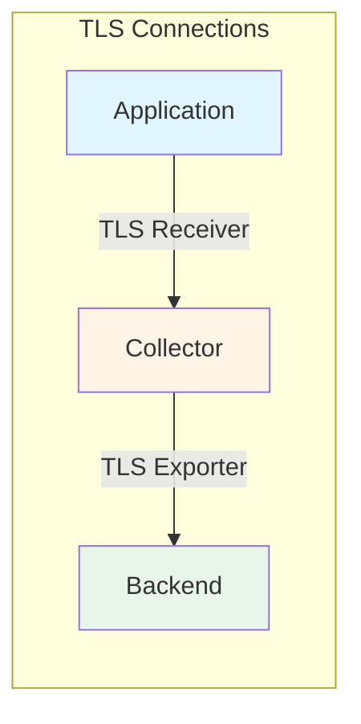

# How to Troubleshoot Collector Certificate and TLS Errors

Author: [nawazdhandala](https://www.github.com/nawazdhandala)

Tags: OpenTelemetry, Collector, Troubleshooting, TLS, SSL, Certificates, Security

Description: A comprehensive guide to diagnosing and resolving TLS certificate errors in OpenTelemetry Collector, covering common issues, certificate validation, mutual TLS, and secure production configurations.

---

TLS certificate errors are among the most frustrating issues when setting up the OpenTelemetry Collector. Error messages like "x509: certificate signed by unknown authority" or "certificate has expired" can block your entire telemetry pipeline. These errors occur when the Collector cannot verify the TLS certificates of the backends it connects to, or when clients cannot verify the Collector's certificates.

This guide covers how TLS works in the Collector, how to diagnose certificate issues, and how to configure secure TLS connections for production environments.

---

## Understanding TLS in OpenTelemetry Collector

TLS (Transport Layer Security) is used in two places:

1. **Exporter TLS**: Collector connecting to backends (outbound)
2. **Receiver TLS**: Applications connecting to Collector (inbound)



Each connection requires:
- **Certificate**: Identity of the server
- **Private Key**: Proves ownership of certificate
- **CA Certificate**: Trusted authority that signed the certificate

---

## Common TLS Errors

### Error 1: Unknown Certificate Authority

```
Error: failed to export traces: rpc error: code = Unavailable desc = connection error:
desc = "transport: authentication handshake failed: x509: certificate signed by unknown authority"
```

**Cause:** The Collector doesn't trust the CA that signed the backend's certificate.

### Error 2: Certificate Expired

```
Error: x509: certificate has expired or is not yet valid
```

**Cause:** The certificate's validity period has passed or hasn't started yet.

### Error 3: Hostname Mismatch

```
Error: x509: certificate is valid for example.com, not oneuptime.com
```

**Cause:** The certificate's Common Name (CN) or Subject Alternative Name (SAN) doesn't match the hostname.

### Error 4: Self-Signed Certificate

```
Error: x509: certificate signed by unknown authority (self-signed certificate)
```

**Cause:** The certificate is self-signed and not trusted by default.

### Error 5: Certificate Chain Incomplete

```
Error: x509: certificate signed by unknown authority (intermediate certificate missing)
```

**Cause:** The server didn't send the complete certificate chain.

---

## Diagnostic Tools

### 1. OpenSSL - Check Certificate Details

```bash
# Check certificate from a server
openssl s_client -connect oneuptime.com:443 -servername oneuptime.com

# Save certificate to file
echo | openssl s_client -connect oneuptime.com:443 -servername oneuptime.com 2>/dev/null | \
  openssl x509 -out server.crt

# View certificate details
openssl x509 -in server.crt -text -noout

# Check expiration date
openssl x509 -in server.crt -noout -dates

# Verify certificate against CA
openssl verify -CAfile ca.crt server.crt
```

### 2. curl - Test TLS Connection

```bash
# Test HTTPS endpoint
curl -v https://oneuptime.com/otlp

# Test with specific CA
curl --cacert ca.crt https://oneuptime.com/otlp

# Ignore certificate validation (testing only!)
curl -k https://oneuptime.com/otlp
```

### 3. Check System CA Store

```bash
# On Debian/Ubuntu
ls /etc/ssl/certs/

# On RHEL/CentOS
ls /etc/pki/tls/certs/

# Check if specific CA is trusted
openssl verify /etc/ssl/certs/my-ca.crt
```

---

## Exporter TLS Configuration

Configure TLS when the Collector connects to backends.

### Scenario 1: Public HTTPS Endpoint

For public endpoints with valid certificates (Let's Encrypt, DigiCert, etc.):

```yaml
exporters:
  # HTTPS endpoint with valid certificate
  otlphttp:
    endpoint: https://oneuptime.com/otlp
    headers:
      x-oneuptime-token: ${ONEUPTIME_TOKEN}

    # TLS uses system CA store by default
    # No additional TLS config needed
    tls:
      insecure: false  # Verify certificates (default)
```

### Scenario 2: Custom CA Certificate

When backend uses certificate signed by custom CA:

```yaml
exporters:
  otlphttp:
    endpoint: https://internal-backend.company.local/otlp
    headers:
      x-api-key: ${API_KEY}

    tls:
      # Path to CA certificate that signed the backend cert
      ca_file: /etc/otelcol/certs/company-ca.crt
      # Verify the certificate
      insecure: false
      # Optionally verify hostname
      insecure_skip_verify: false
      # Server name for SNI (if different from endpoint hostname)
      server_name_override: internal-backend.company.local
```

**Setup Custom CA:**
```bash
# Copy CA certificate to Collector host
sudo mkdir -p /etc/otelcol/certs
sudo cp company-ca.crt /etc/otelcol/certs/
sudo chown otelcol:otelcol /etc/otelcol/certs/company-ca.crt
sudo chmod 644 /etc/otelcol/certs/company-ca.crt

# Verify CA is valid
openssl x509 -in /etc/otelcol/certs/company-ca.crt -text -noout
```

### Scenario 3: Self-Signed Certificate

For development/testing with self-signed certificates:

```yaml
exporters:
  otlphttp:
    endpoint: https://localhost:4318

    tls:
      # Option 1: Trust the self-signed cert
      ca_file: /etc/otelcol/certs/self-signed.crt
      insecure: false

      # Option 2: Disable verification (NOT for production!)
      insecure: true
      insecure_skip_verify: true
```

**Create Self-Signed Certificate:**
```bash
# Generate self-signed cert
openssl req -x509 -newkey rsa:4096 -keyout key.pem -out cert.pem -days 365 -nodes \
  -subj "/C=US/ST=State/L=City/O=Company/CN=localhost"

# View certificate
openssl x509 -in cert.pem -text -noout
```

### Scenario 4: Mutual TLS (mTLS)

Both client and server verify each other's certificates:

```yaml
exporters:
  otlphttp:
    endpoint: https://secure-backend.company.local/otlp

    tls:
      # Server CA (verify backend)
      ca_file: /etc/otelcol/certs/backend-ca.crt

      # Client certificate (authenticate to backend)
      cert_file: /etc/otelcol/certs/collector-client.crt
      key_file: /etc/otelcol/certs/collector-client.key

      # Minimum TLS version
      min_version: "1.2"
      # Maximum TLS version
      max_version: "1.3"
```

**Setup mTLS:**
```bash
# Create directory structure
sudo mkdir -p /etc/otelcol/certs
cd /etc/otelcol/certs

# Copy certificates
sudo cp backend-ca.crt .
sudo cp collector-client.crt .
sudo cp collector-client.key .

# Set permissions
sudo chown -R otelcol:otelcol /etc/otelcol/certs
sudo chmod 644 backend-ca.crt collector-client.crt
sudo chmod 400 collector-client.key  # Private key should be restrictive

# Verify client cert was signed by CA
openssl verify -CAfile backend-ca.crt collector-client.crt
```

---

## Receiver TLS Configuration

Configure TLS when applications connect to the Collector.

### Scenario 1: TLS Receiver with Certificate

```yaml
receivers:
  otlp:
    protocols:
      # gRPC with TLS
      grpc:
        endpoint: 0.0.0.0:4317
        tls:
          # Server certificate
          cert_file: /etc/otelcol/certs/collector.crt
          key_file: /etc/otelcol/certs/collector.key

          # Client authentication (optional)
          client_ca_file: /etc/otelcol/certs/client-ca.crt

      # HTTP with TLS
      http:
        endpoint: 0.0.0.0:4318
        tls:
          cert_file: /etc/otelcol/certs/collector.crt
          key_file: /etc/otelcol/certs/collector.key
```

**Generate Server Certificate:**
```bash
# Option 1: Use Let's Encrypt (recommended for internet-facing)
certbot certonly --standalone -d collector.example.com

# Certificates will be in /etc/letsencrypt/live/collector.example.com/
sudo cp /etc/letsencrypt/live/collector.example.com/fullchain.pem \
  /etc/otelcol/certs/collector.crt
sudo cp /etc/letsencrypt/live/collector.example.com/privkey.pem \
  /etc/otelcol/certs/collector.key

# Option 2: Generate self-signed for internal use
openssl req -x509 -newkey rsa:4096 \
  -keyout /etc/otelcol/certs/collector.key \
  -out /etc/otelcol/certs/collector.crt \
  -days 365 -nodes \
  -subj "/CN=collector.internal.local" \
  -addext "subjectAltName=DNS:collector.internal.local,DNS:*.internal.local"

# Set permissions
sudo chown otelcol:otelcol /etc/otelcol/certs/*
sudo chmod 644 /etc/otelcol/certs/collector.crt
sudo chmod 400 /etc/otelcol/certs/collector.key
```

### Scenario 2: Require Client Certificates (mTLS)

```yaml
receivers:
  otlp:
    protocols:
      grpc:
        endpoint: 0.0.0.0:4317
        tls:
          # Server certificate
          cert_file: /etc/otelcol/certs/collector.crt
          key_file: /etc/otelcol/certs/collector.key

          # Require client certificates
          client_ca_file: /etc/otelcol/certs/client-ca.crt

          # Client certificate policy
          # - NoClientCert: Don't require client certs
          # - RequestClientCert: Request but don't require
          # - RequireAnyClientCert: Require but don't verify
          # - VerifyClientCertIfGiven: Verify if provided
          # - RequireAndVerifyClientCert: Require and verify (most secure)
          client_auth_type: RequireAndVerifyClientCert
```

---

## Fixing Common Issues

### Fix 1: Unknown Certificate Authority

**Problem:** Backend certificate not trusted.

**Solution 1 - Add CA to System Trust Store:**

```bash
# On Debian/Ubuntu
sudo cp company-ca.crt /usr/local/share/ca-certificates/
sudo update-ca-certificates

# On RHEL/CentOS
sudo cp company-ca.crt /etc/pki/ca-trust/source/anchors/
sudo update-ca-trust

# Restart Collector
sudo systemctl restart otelcol
```

**Solution 2 - Configure CA in Collector:**

```yaml
exporters:
  otlphttp:
    endpoint: https://backend.company.local/otlp
    tls:
      ca_file: /etc/otelcol/certs/company-ca.crt
```

### Fix 2: Certificate Expired

**Problem:** Certificate validity period has passed.

**Solution - Renew Certificate:**

```bash
# Check expiration
openssl x509 -in /etc/otelcol/certs/collector.crt -noout -dates

# For Let's Encrypt
sudo certbot renew

# For self-signed, regenerate
openssl req -x509 -newkey rsa:4096 \
  -keyout /etc/otelcol/certs/collector.key \
  -out /etc/otelcol/certs/collector.crt \
  -days 365 -nodes \
  -subj "/CN=collector.example.com"

# Restart Collector
sudo systemctl restart otelcol
```

**Automate Renewal:**

```bash
# Create renewal script
sudo tee /etc/cron.daily/renew-collector-cert > /dev/null <<'EOF'
#!/bin/bash
certbot renew --quiet --post-hook "systemctl reload otelcol"
EOF

sudo chmod +x /etc/cron.daily/renew-collector-cert
```

### Fix 3: Hostname Mismatch

**Problem:** Certificate CN/SAN doesn't match hostname.

**Check Certificate Names:**
```bash
# View certificate SANs
openssl x509 -in cert.crt -text -noout | grep -A 1 "Subject Alternative Name"
```

**Solution 1 - Use Correct Hostname:**
```yaml
exporters:
  otlphttp:
    # Use hostname that matches certificate
    endpoint: https://correct-hostname.example.com/otlp
```

**Solution 2 - Override Server Name (if needed):**
```yaml
exporters:
  otlphttp:
    endpoint: https://192.168.1.100/otlp
    tls:
      # Tell TLS to expect this hostname
      server_name_override: backend.example.com
```

**Solution 3 - Generate Certificate with Correct SANs:**
```bash
# Create config file for openssl
cat > cert.conf <<EOF
[req]
default_bits = 4096
distinguished_name = req_distinguished_name
req_extensions = v3_req
prompt = no

[req_distinguished_name]
CN = collector.example.com

[v3_req]
subjectAltName = @alt_names

[alt_names]
DNS.1 = collector.example.com
DNS.2 = collector.internal.local
DNS.3 = *.example.com
IP.1 = 192.168.1.100
EOF

# Generate certificate with SANs
openssl req -x509 -newkey rsa:4096 \
  -keyout collector.key \
  -out collector.crt \
  -days 365 -nodes \
  -config cert.conf \
  -extensions v3_req
```

### Fix 4: Incomplete Certificate Chain

**Problem:** Intermediate certificates missing.

**Solution - Provide Full Chain:**

```bash
# Download intermediate certificates
wget https://example.com/intermediate1.crt
wget https://example.com/intermediate2.crt

# Create full chain: server -> intermediate -> root
cat collector.crt intermediate1.crt intermediate2.crt root.crt > fullchain.crt
```

```yaml
receivers:
  otlp:
    protocols:
      grpc:
        tls:
          # Use full chain instead of just server cert
          cert_file: /etc/otelcol/certs/fullchain.crt
          key_file: /etc/otelcol/certs/collector.key
```

---

## Production TLS Configuration

Here's a complete, secure configuration for production:

```yaml
# Extensions for health checks
extensions:
  health_check:
    endpoint: 0.0.0.0:13133

# Receivers with TLS
receivers:
  otlp:
    protocols:
      # Secure gRPC with TLS
      grpc:
        endpoint: 0.0.0.0:4317
        max_recv_msg_size_mib: 32
        keepalive:
          server_parameters:
            max_connection_idle: 11s
        tls:
          # Server certificate from Let's Encrypt or internal CA
          cert_file: /etc/otelcol/certs/collector.crt
          key_file: /etc/otelcol/certs/collector.key

          # Require and verify client certificates (mTLS)
          client_ca_file: /etc/otelcol/certs/client-ca.crt
          client_auth_type: RequireAndVerifyClientCert

          # Use modern TLS version
          min_version: "1.2"
          max_version: "1.3"

          # Strong cipher suites
          cipher_suites:
            - TLS_ECDHE_RSA_WITH_AES_128_GCM_SHA256
            - TLS_ECDHE_RSA_WITH_AES_256_GCM_SHA384
            - TLS_ECDHE_ECDSA_WITH_AES_128_GCM_SHA256
            - TLS_ECDHE_ECDSA_WITH_AES_256_GCM_SHA384

      # Secure HTTP with TLS
      http:
        endpoint: 0.0.0.0:4318
        tls:
          cert_file: /etc/otelcol/certs/collector.crt
          key_file: /etc/otelcol/certs/collector.key
          client_ca_file: /etc/otelcol/certs/client-ca.crt
          client_auth_type: RequireAndVerifyClientCert
          min_version: "1.2"

# Processors
processors:
  memory_limiter:
    limit_mib: 1600
    spike_limit_mib: 400

  batch:
    timeout: 10s
    send_batch_size: 8192

# Exporters with TLS
exporters:
  # Export to OneUptime with public CA
  otlphttp/oneuptime:
    endpoint: https://oneuptime.com/otlp
    headers:
      x-oneuptime-token: ${ONEUPTIME_TOKEN}
    compression: gzip
    timeout: 30s

    # Use system CA store (no additional config needed)
    tls:
      insecure: false
      insecure_skip_verify: false

    sending_queue:
      enabled: true
      queue_size: 50000

    retry_on_failure:
      enabled: true
      initial_interval: 5s
      max_interval: 30s
      max_elapsed_time: 300s

  # Export to internal backend with custom CA
  otlphttp/internal:
    endpoint: https://internal-backend.company.local/otlp

    tls:
      # Custom CA for internal backend
      ca_file: /etc/otelcol/certs/internal-ca.crt
      # Client certificate for mTLS
      cert_file: /etc/otelcol/certs/collector-client.crt
      key_file: /etc/otelcol/certs/collector-client.key
      # Enforce modern TLS
      min_version: "1.2"
      max_version: "1.3"

# Service configuration
service:
  extensions: [health_check]

  pipelines:
    traces:
      receivers: [otlp]
      processors: [memory_limiter, batch]
      exporters: [otlphttp/oneuptime, otlphttp/internal]
```

---

## Kubernetes TLS Configuration

### Using Kubernetes Secrets for Certificates

```yaml
# Create secret from certificate files
apiVersion: v1
kind: Secret
metadata:
  name: otel-collector-certs
  namespace: observability
type: Opaque
data:
  # Base64-encoded certificates
  collector.crt: LS0tLS1CRUdJTi...
  collector.key: LS0tLS1CRUdJTi...
  ca.crt: LS0tLS1CRUdJTi...
---
apiVersion: apps/v1
kind: Deployment
metadata:
  name: otel-collector
  namespace: observability
spec:
  template:
    spec:
      containers:
      - name: otel-collector
        volumeMounts:
        # Mount certificates as read-only volume
        - name: certs
          mountPath: /etc/otelcol/certs
          readOnly: true

      volumes:
      - name: certs
        secret:
          secretName: otel-collector-certs
          defaultMode: 0400  # Read-only for owner
```

**Create Secret from Files:**
```bash
# Create secret from certificate files
kubectl create secret generic otel-collector-certs \
  --from-file=collector.crt=/path/to/collector.crt \
  --from-file=collector.key=/path/to/collector.key \
  --from-file=ca.crt=/path/to/ca.crt \
  -n observability
```

### Using cert-manager for Certificate Management

```yaml
# Install cert-manager first
# kubectl apply -f https://github.com/cert-manager/cert-manager/releases/download/v1.13.0/cert-manager.yaml

# Create Certificate resource
apiVersion: cert-manager.io/v1
kind: Certificate
metadata:
  name: otel-collector-cert
  namespace: observability
spec:
  secretName: otel-collector-certs
  duration: 2160h  # 90 days
  renewBefore: 360h  # 15 days before expiry

  # Certificate details
  commonName: otel-collector.observability.svc.cluster.local
  dnsNames:
    - otel-collector.observability.svc.cluster.local
    - otel-collector.observability.svc
    - otel-collector

  # Reference to issuer
  issuerRef:
    name: internal-ca-issuer
    kind: ClusterIssuer
---
# ClusterIssuer for internal CA
apiVersion: cert-manager.io/v1
kind: ClusterIssuer
metadata:
  name: internal-ca-issuer
spec:
  ca:
    secretName: internal-ca-key-pair
```

---

## Testing TLS Configuration

### Test Receiver TLS

```bash
# Test gRPC TLS with openssl
openssl s_client -connect collector.example.com:4317 -servername collector.example.com

# Test with telemetrygen
docker run --rm \
  -v $(pwd)/ca.crt:/ca.crt \
  ghcr.io/open-telemetry/opentelemetry-collector-contrib/telemetrygen:latest \
  traces \
  --otlp-endpoint collector.example.com:4317 \
  --otlp-ca /ca.crt \
  --otlp-cert /client.crt \
  --otlp-key /client.key \
  --duration 30s
```

### Test Exporter TLS

```bash
# Check Collector logs for TLS errors
kubectl logs -l app=opentelemetry-collector -n observability | grep -i tls

# Look for successful connections
kubectl logs -l app=opentelemetry-collector -n observability | grep "exporter.*success"
```

---

## Monitoring Certificate Expiration

Set up alerts for expiring certificates:

```yaml
# Add Prometheus exporter to expose certificate metrics
extensions:
  pprof:
    endpoint: 0.0.0.0:1777

# Query certificate expiration
# This requires external monitoring of certificate files
```

**External Monitoring Script:**
```bash
#!/bin/bash
# check-cert-expiry.sh

CERT_FILE="/etc/otelcol/certs/collector.crt"
WARN_DAYS=30

expiry_date=$(openssl x509 -in "$CERT_FILE" -noout -enddate | cut -d= -f2)
expiry_epoch=$(date -d "$expiry_date" +%s)
current_epoch=$(date +%s)
days_until_expiry=$(( ($expiry_epoch - $current_epoch) / 86400 ))

if [ $days_until_expiry -lt $WARN_DAYS ]; then
  echo "WARNING: Certificate expires in $days_until_expiry days"
  # Send alert
  exit 1
fi

echo "Certificate valid for $days_until_expiry days"
exit 0
```

---

## Security Best Practices

1. **Use Strong TLS Versions** - Minimum TLS 1.2, prefer TLS 1.3
2. **Keep Certificates Updated** - Automate renewal
3. **Use Strong Cipher Suites** - Disable weak ciphers
4. **Implement mTLS** - For internal services
5. **Protect Private Keys** - Permissions 400, never commit to git
6. **Use Certificate Rotation** - Shorter validity periods with automation
7. **Monitor Expiration** - Set alerts 30+ days before expiry
8. **Verify Hostnames** - Don't disable hostname verification in production
9. **Use cert-manager** - In Kubernetes for automated management
10. **Secure Certificate Storage** - Use Kubernetes Secrets or Vault

---

## Related Resources

- [How to Fix Collector Connection Refused on OTLP Ports](https://oneuptime.com/blog/post/fix-collector-connection-refused-otlp-ports/view)
- [How to Troubleshoot Collector Pipeline Blocked Errors](https://oneuptime.com/blog/post/troubleshoot-collector-pipeline-blocked-errors/view)
- [How to Debug Collector File Permissions Issues on Linux](https://oneuptime.com/blog/post/debug-collector-file-permissions-linux/view)
- [How to Fix Invalid Configuration Errors in Collector](https://oneuptime.com/blog/post/fix-invalid-configuration-errors-collector/view)

---

## Summary

TLS certificate errors in OpenTelemetry Collector commonly involve:

1. Unknown certificate authorities
2. Expired certificates
3. Hostname mismatches
4. Incomplete certificate chains
5. Missing or incorrect client certificates

Fix TLS issues by:
- Adding custom CAs to system trust store or Collector config
- Renewing expired certificates and automating renewal
- Ensuring certificates include correct hostnames in SANs
- Providing complete certificate chains
- Properly configuring mTLS for enhanced security

Always use valid TLS certificates in production and never disable certificate verification. Automate certificate management with tools like Let's Encrypt or cert-manager.

[OneUptime](https://oneuptime.com) supports secure TLS connections for OpenTelemetry data with automatic certificate validation.
