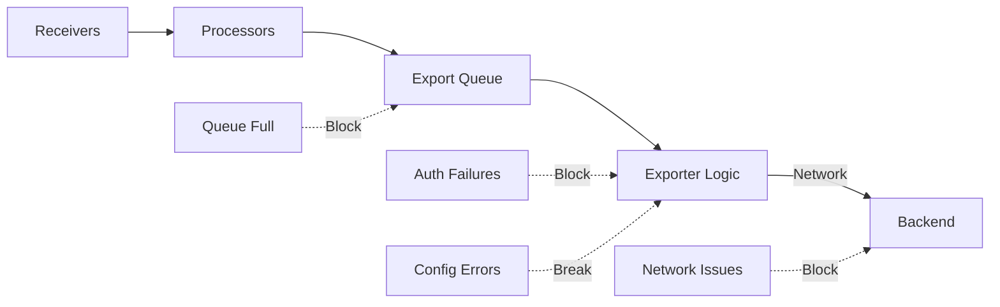

# How to Troubleshoot the OpenTelemetry Collector Not Exporting Data

Author: [nawazdhandala](https://www.github.com/nawazdhandala)

Tags: OpenTelemetry, Collector, Troubleshooting, Exporters, Debugging, Data Loss

Description: Diagnose and resolve issues when OpenTelemetry Collector receives data but fails to export it to backends, including queue problems, authentication failures, and network issues.

The OpenTelemetry Collector may successfully receive telemetry data but fail to export it to backends. This creates a critical observability gap where your data is collected but never reaches storage. This guide provides systematic troubleshooting techniques for exporter-related issues, covering authentication, network problems, queue saturation, and configuration errors.

## Understanding the Export Pipeline

Data flows through the collector from receivers to exporters:



Common exporter failure points:

1. Queue overflow from slow or unavailable backends
2. Authentication or TLS certificate issues
3. Network connectivity problems
4. Backend rejecting data (invalid format, quota exceeded)
5. Incorrect endpoint configuration
6. Resource exhaustion in collector

## Initial Diagnostic Steps

### Step 1: Confirm Data is Being Received

Before diagnosing export issues, verify the collector is receiving data:

```bash
# Check receiver metrics
curl -s http://localhost:8888/metrics | grep "otelcol_receiver_accepted_spans"

# Should show non-zero values:
# otelcol_receiver_accepted_spans{receiver="otlp",service_instance_id="...",transport="grpc"} 12543

# If zero, the problem is receiving data, not exporting
# See: https://oneuptime.com/blog/post/2026-02-06-troubleshoot-collector-not-receiving-data/view
```

### Step 2: Check Exporter Metrics

Examine exporter-specific metrics to identify the problem:

```bash
# Check if exports are failing
curl -s http://localhost:8888/metrics | grep "otelcol_exporter"

# Key metrics to check:
# otelcol_exporter_sent_spans - successfully exported spans
# otelcol_exporter_send_failed_spans - failed export attempts
# otelcol_exporter_queue_size - current queue utilization
# otelcol_exporter_queue_capacity - maximum queue size
```

Analyze the metrics:

```bash
# Calculate export success rate
sent=$(curl -s http://localhost:8888/metrics | grep "otelcol_exporter_sent_spans{" | awk '{print $2}')
failed=$(curl -s http://localhost:8888/metrics | grep "otelcol_exporter_send_failed_spans{" | awk '{print $2}')

echo "Sent: $sent"
echo "Failed: $failed"
echo "Success rate: $(echo "scale=2; $sent / ($sent + $failed) * 100" | bc)%"
```

### Step 3: Enable Debug Logging

Enable debug logging on the exporter to see detailed error messages:

```yaml
# config.yaml - Enable debug logging
service:
  telemetry:
    logs:
      level: debug
      # Log exporter details
      development: true
      encoding: console
      # Show timestamps
      disable_timestamp: false

exporters:
  otlp:
    endpoint: backend:4317
    tls:
      insecure: false
```

Check logs for exporter errors:

```bash
# View recent exporter errors
docker logs otel-collector 2>&1 | grep -i "exporter\|export\|error" | tail -20

# Common error patterns:
# "connection refused" = backend not reachable
# "context deadline exceeded" = timeout
# "certificate verify failed" = TLS issue
# "401 Unauthorized" = authentication problem
# "429 Too Many Requests" = rate limiting
```

## Common Issue 1: Backend Unreachable

Collector cannot connect to backend endpoint.

### Symptoms

```
Error: failed to export: rpc error: code = Unavailable desc = connection refused
Error: Post "https://backend:4317": dial tcp: lookup backend: no such host
```

### Diagnosis

```bash
# Test backend connectivity from collector
# Kubernetes
kubectl exec -it otel-collector-0 -n observability -- sh
wget -O- http://backend:4317 || echo "Connection failed"

# Docker
docker exec otel-collector sh -c "nc -zv backend 4317"

# Check DNS resolution
kubectl exec -it otel-collector-0 -- nslookup backend

# Test with curl
kubectl exec -it otel-collector-0 -- curl -v https://backend:4317
```

### Solutions

**Solution 1: Fix endpoint configuration**

```yaml
# config.yaml - Correct endpoint formats
exporters:
  # gRPC endpoint (no protocol prefix)
  otlp/grpc:
    endpoint: backend.observability.svc.cluster.local:4317
    tls:
      insecure: false

  # HTTP endpoint (with protocol prefix)
  otlp/http:
    endpoint: https://backend.observability.svc.cluster.local:4318
    tls:
      insecure: false

  # External SaaS backend
  otlp/external:
    endpoint: api.observability-vendor.com:443
    tls:
      insecure: false
    headers:
      # Authentication headers
      x-api-key: "${API_KEY}"
```

**Solution 2: Update Kubernetes service**

```yaml
# backend-service.yaml - Expose backend properly
apiVersion: v1
kind: Service
metadata:
  name: backend
  namespace: observability
spec:
  type: ClusterIP
  selector:
    app: observability-backend
  ports:
  - name: otlp-grpc
    port: 4317
    targetPort: 4317
  - name: otlp-http
    port: 4318
    targetPort: 4318

---
# For cross-namespace access
apiVersion: v1
kind: Service
metadata:
  name: backend
  namespace: collector-namespace
spec:
  type: ExternalName
  externalName: backend.observability.svc.cluster.local
```

**Solution 3: Configure network access**

```yaml
# network-policy.yaml - Allow collector to backend traffic
apiVersion: networking.k8s.io/v1
kind: NetworkPolicy
metadata:
  name: allow-collector-to-backend
  namespace: observability
spec:
  podSelector:
    matchLabels:
      app: observability-backend
  policyTypes:
  - Ingress
  ingress:
  - from:
    - podSelector:
        matchLabels:
          app: otel-collector
    ports:
    - protocol: TCP
      port: 4317
    - protocol: TCP
      port: 4318
```

## Common Issue 2: Authentication Failures

Backend rejects data due to missing or invalid credentials.

### Symptoms

```
Error: rpc error: code = Unauthenticated desc = invalid api key
Error: 401 Unauthorized
Error: missing required authentication header
```

### Diagnosis

```bash
# Test authentication manually
# Bearer token
curl -H "Authorization: Bearer YOUR_TOKEN" https://backend:4318/v1/traces

# API key header
curl -H "X-API-Key: YOUR_KEY" https://backend:4318/v1/traces

# Check if credentials are in environment
kubectl exec -it otel-collector-0 -- env | grep -i "api\|token\|key"
```

### Solutions

**Solution 1: Configure authentication headers**

```yaml
# config.yaml - Add authentication
exporters:
  otlp:
    endpoint: backend.example.com:4317
    # Static headers
    headers:
      x-api-key: "your-api-key-here"
      x-tenant-id: "your-tenant-id"

  # Using environment variables (recommended)
  otlp/secure:
    endpoint: backend.example.com:4317
    headers:
      # Reference environment variable
      authorization: "Bearer ${BACKEND_API_TOKEN}"
      x-api-key: "${BACKEND_API_KEY}"
```

**Solution 2: Use Kubernetes secrets**

```yaml
# secret.yaml - Store credentials securely
apiVersion: v1
kind: Secret
metadata:
  name: otel-backend-credentials
  namespace: observability
type: Opaque
stringData:
  api-key: "your-actual-api-key"
  api-token: "your-actual-token"

---
# deployment.yaml - Mount credentials as environment variables
apiVersion: apps/v1
kind: Deployment
metadata:
  name: otel-collector
spec:
  template:
    spec:
      containers:
      - name: otel-collector
        image: otel/opentelemetry-collector-contrib:0.93.0
        env:
        - name: BACKEND_API_KEY
          valueFrom:
            secretKeyRef:
              name: otel-backend-credentials
              key: api-key
        - name: BACKEND_API_TOKEN
          valueFrom:
            secretKeyRef:
              name: otel-backend-credentials
              key: api-token
```

**Solution 3: OAuth2 authentication**

```yaml
# config.yaml - OAuth2 client credentials
extensions:
  oauth2client:
    client_id: "${OAUTH_CLIENT_ID}"
    client_secret: "${OAUTH_CLIENT_SECRET}"
    token_url: "https://auth.backend.com/oauth/token"
    scopes: ["telemetry.write"]

exporters:
  otlp:
    endpoint: backend.example.com:4317
    # Use OAuth2 extension for authentication
    auth:
      authenticator: oauth2client

service:
  extensions: [oauth2client]
  pipelines:
    traces:
      receivers: [otlp]
      exporters: [otlp]
```

## Common Issue 3: TLS Certificate Problems

TLS verification fails between collector and backend.

### Symptoms

```
Error: x509: certificate signed by unknown authority
Error: tls: bad certificate
Error: x509: certificate has expired
```

### Diagnosis

```bash
# Check certificate validity
openssl s_client -connect backend.example.com:4317 -showcerts

# Verify certificate chain
echo | openssl s_client -connect backend.example.com:4317 2>/dev/null | openssl x509 -noout -dates

# Test with insecure connection (TESTING ONLY)
curl -k https://backend.example.com:4318/v1/traces
```

### Solutions

**Solution 1: Configure TLS properly**

```yaml
# config.yaml - TLS configuration
exporters:
  otlp:
    endpoint: backend.example.com:4317
    tls:
      # Verify server certificate (default: true)
      insecure: false
      # Path to CA certificate for verification
      ca_file: /etc/otelcol/certs/ca.crt
      # Client certificate (if required by backend)
      cert_file: /etc/otelcol/certs/client.crt
      key_file: /etc/otelcol/certs/client.key
      # Override server name for verification
      server_name_override: backend.example.com

  # For development/testing only: disable TLS verification
  otlp/insecure:
    endpoint: backend:4317
    tls:
      insecure: true  # WARNING: Not for production!
```

**Solution 2: Mount certificates in Kubernetes**

```yaml
# certificate-secret.yaml - Store certificates
apiVersion: v1
kind: Secret
metadata:
  name: otel-tls-certs
  namespace: observability
type: Opaque
data:
  ca.crt: <base64-encoded-ca-cert>
  client.crt: <base64-encoded-client-cert>
  client.key: <base64-encoded-client-key>

---
# deployment.yaml - Mount certificates
apiVersion: apps/v1
kind: Deployment
metadata:
  name: otel-collector
spec:
  template:
    spec:
      containers:
      - name: otel-collector
        volumeMounts:
        - name: tls-certs
          mountPath: /etc/otelcol/certs
          readOnly: true
      volumes:
      - name: tls-certs
        secret:
          secretName: otel-tls-certs
```

**Solution 3: Use system CA certificates**

```yaml
# config.yaml - Use system CA bundle
exporters:
  otlp:
    endpoint: backend.example.com:4317
    tls:
      # Use system CA certificates
      insecure: false
      # On Linux: /etc/ssl/certs/ca-certificates.crt
      # On Alpine: /etc/ssl/cert.pem
      ca_file: /etc/ssl/certs/ca-certificates.crt
```

## Common Issue 4: Queue Saturation

Export queue fills up faster than data can be exported.

### Symptoms

```
Error: dropping data, queue is full
Metric: otelcol_exporter_queue_size == otelcol_exporter_queue_capacity
Metric: otelcol_exporter_enqueue_failed_spans > 0
```

### Diagnosis

```bash
# Check queue utilization
curl -s http://localhost:8888/metrics | grep "otelcol_exporter_queue"

# Calculate queue saturation
queue_size=$(curl -s http://localhost:8888/metrics | grep "otelcol_exporter_queue_size{" | awk '{print $2}')
queue_capacity=$(curl -s http://localhost:8888/metrics | grep "otelcol_exporter_queue_capacity{" | awk '{print $2}')

echo "Queue utilization: $(echo "scale=2; $queue_size / $queue_capacity * 100" | bc)%"

# Check for dropped data
curl -s http://localhost:8888/metrics | grep "otelcol_exporter_enqueue_failed"
```

### Solutions

**Solution 1: Increase queue size**

```yaml
# config.yaml - Larger queues
exporters:
  otlp:
    endpoint: backend:4317
    sending_queue:
      enabled: true
      # Increase from default 1000
      queue_size: 5000
      # Increase concurrent consumers
      num_consumers: 20
```

**Solution 2: Enable persistent queue**

```yaml
# config.yaml - Persistent queue for reliability
extensions:
  file_storage:
    directory: /var/lib/otelcol/queue
    compaction:
      directory: 50GiB

exporters:
  otlp:
    endpoint: backend:4317
    sending_queue:
      enabled: true
      queue_size: 5000
      # Store overflow to disk
      storage: file_storage
      num_consumers: 20

service:
  extensions: [file_storage]
```

See the full guide: https://oneuptime.com/blog/post/2026-02-06-persistent-queue-storage-collector-reliability/view

**Solution 3: Optimize batch size**

```yaml
# config.yaml - Better batching reduces queue pressure
processors:
  batch:
    # Send larger batches less frequently
    timeout: 5s
    send_batch_size: 2048
    send_batch_max_size: 4096

service:
  pipelines:
    traces:
      receivers: [otlp]
      processors: [batch]
      exporters: [otlp]
```

## Common Issue 5: Backend Rate Limiting

Backend throttles or rejects data due to rate limits.

### Symptoms

```
Error: 429 Too Many Requests
Error: rate limit exceeded
Error: quota exceeded
```

### Diagnosis

```bash
# Check for rate limit errors in logs
docker logs otel-collector 2>&1 | grep -i "429\|rate limit\|quota"

# Monitor export success rate over time
watch -n 5 'curl -s http://localhost:8888/metrics | grep "otelcol_exporter_send_failed"'
```

### Solutions

**Solution 1: Configure retry with backoff**

```yaml
# config.yaml - Exponential backoff for retries
exporters:
  otlp:
    endpoint: backend:4317
    retry_on_failure:
      enabled: true
      # Start with 1 second delay
      initial_interval: 1s
      # Maximum 60 seconds between retries
      max_interval: 60s
      # Keep retrying for up to 10 minutes
      max_elapsed_time: 600s

    timeout: 30s
```

**Solution 2: Implement sampling**

```yaml
# config.yaml - Reduce data volume with sampling
processors:
  # Probabilistic sampling: keep 10% of traces
  probabilistic_sampler:
    sampling_percentage: 10

  # Tail sampling: keep only interesting traces
  tail_sampling:
    policies:
      - name: errors-only
        type: status_code
        status_code:
          status_codes: [ERROR]
      - name: slow-traces
        type: latency
        latency:
          threshold_ms: 1000
      - name: sample-others
        type: probabilistic
        probabilistic:
          sampling_percentage: 5

service:
  pipelines:
    traces:
      receivers: [otlp]
      processors: [tail_sampling, batch]
      exporters: [otlp]
```

**Solution 3: Scale horizontally**

Deploy multiple collector instances to distribute load:

```yaml
# deployment.yaml - Scale collectors
apiVersion: apps/v1
kind: Deployment
metadata:
  name: otel-collector
spec:
  # Increase replicas
  replicas: 5
  template:
    spec:
      containers:
      - name: otel-collector
        resources:
          requests:
            cpu: 1000m
            memory: 2Gi

---
# Use HPA for auto-scaling
apiVersion: autoscaling/v2
kind: HorizontalPodAutoscaler
metadata:
  name: otel-collector-hpa
spec:
  scaleTargetRef:
    apiVersion: apps/v1
    kind: Deployment
    name: otel-collector
  minReplicas: 3
  maxReplicas: 10
  metrics:
  - type: Pods
    pods:
      metric:
        name: otelcol_exporter_queue_size
      target:
        type: AverageValue
        averageValue: "800"
```

## Common Issue 6: Configuration Errors

Exporter configuration is invalid or incompatible with backend.

### Symptoms

```
Error: unknown exporter type "otlp"
Error: exporter "otlp" is not configured
Error: invalid endpoint format
```

### Diagnosis

```bash
# Validate configuration
otelcol-contrib validate --config config.yaml

# Check if exporter is registered in service
grep -A 20 "service:" config.yaml | grep "exporters:"
```

### Solutions

**Solution 1: Verify exporter in pipeline**

```yaml
# config.yaml - Proper configuration structure
exporters:
  # Define exporter here
  otlp:
    endpoint: backend:4317

service:
  pipelines:
    traces:
      receivers: [otlp]
      # Must reference exporter defined above
      exporters: [otlp]  # Name must match

    metrics:
      receivers: [otlp]
      # Can use same or different exporter
      exporters: [otlp]
```

**Solution 2: Use correct exporter type**

```yaml
# config.yaml - Different exporters for different backends
exporters:
  # OTLP exporter for OpenTelemetry-compatible backends
  otlp:
    endpoint: backend:4317

  # Jaeger exporter for Jaeger
  jaeger:
    endpoint: jaeger:14250
    tls:
      insecure: true

  # Prometheus exporter for Prometheus
  prometheus:
    endpoint: 0.0.0.0:8889

  # Zipkin exporter for Zipkin
  zipkin:
    endpoint: http://zipkin:9411/api/v2/spans

service:
  pipelines:
    traces:
      receivers: [otlp]
      # Use appropriate exporter for your backend
      exporters: [otlp]
```

**Solution 3: Test with logging exporter**

```yaml
# config.yaml - Debug with logging exporter
exporters:
  # Logging exporter for debugging
  logging:
    verbosity: detailed
    sampling_initial: 5
    sampling_thereafter: 200

  # Your actual exporter
  otlp:
    endpoint: backend:4317

service:
  pipelines:
    traces:
      receivers: [otlp]
      # Export to both logging (for debug) and backend
      exporters: [logging, otlp]
```

## Common Issue 7: Data Format Rejection

Backend rejects data due to invalid format or schema.

### Symptoms

```
Error: 400 Bad Request
Error: invalid trace data
Error: schema validation failed
```

### Diagnosis

```bash
# Capture data being sent
# Enable detailed logging to see payload
docker logs otel-collector 2>&1 | grep -A 20 "sending request"

# Use logging exporter to inspect data
# Add logging exporter to see what's being exported
```

### Solutions

**Solution 1: Transform data to match backend schema**

```yaml
# config.yaml - Transform data before export
processors:
  # Transform attributes to match backend requirements
  transform:
    trace_statements:
      - context: resource
        statements:
          # Ensure required attributes exist
          - set(attributes["service.name"], "unknown") where attributes["service.name"] == nil
          - set(attributes["deployment.environment"], "production")
      - context: span
        statements:
          # Remove problematic attributes
          - delete_key(attributes, "internal.attribute")
          # Rename attributes
          - set(attributes["http.status_code"], attributes["http.response.status_code"])

  batch:
    timeout: 1s

service:
  pipelines:
    traces:
      receivers: [otlp]
      processors: [transform, batch]
      exporters: [otlp]
```

**Solution 2: Filter invalid data**

```yaml
# config.yaml - Filter out invalid spans
processors:
  # Filter processor removes invalid data
  filter:
    traces:
      span:
        # Keep only valid spans
        - 'attributes["http.status_code"] != nil'
        - 'resource.attributes["service.name"] != nil'

service:
  pipelines:
    traces:
      receivers: [otlp]
      processors: [filter, batch]
      exporters: [otlp]
```

## Comprehensive Troubleshooting Script

Automate exporter diagnostics:

```bash
#!/bin/bash
# troubleshoot-exporter.sh - Systematic exporter diagnostics

echo "OpenTelemetry Collector Exporter Troubleshooting"
echo "================================================="

METRICS_URL="http://localhost:8888/metrics"

# 1. Check data is being received
echo "[1/8] Checking if data is being received..."
received=$(curl -s $METRICS_URL | grep "otelcol_receiver_accepted_spans{" | tail -1 | awk '{print $2}')
if [ "$received" -gt 0 ]; then
    echo "✓ Received $received spans"
else
    echo "✗ No data received - check receiver configuration"
    exit 1
fi

# 2. Check export success
echo "[2/8] Checking export status..."
sent=$(curl -s $METRICS_URL | grep "otelcol_exporter_sent_spans{" | tail -1 | awk '{print $2}')
failed=$(curl -s $METRICS_URL | grep "otelcol_exporter_send_failed_spans{" | tail -1 | awk '{print $2}')

if [ "$sent" -gt 0 ]; then
    echo "✓ Successfully exported $sent spans"
else
    echo "✗ No spans exported"
fi

if [ "$failed" -gt 0 ]; then
    echo "✗ Export failures: $failed spans failed"
else
    echo "✓ No export failures"
fi

# 3. Check queue status
echo "[3/8] Checking export queue..."
queue_size=$(curl -s $METRICS_URL | grep "otelcol_exporter_queue_size{" | tail -1 | awk '{print $2}')
queue_capacity=$(curl -s $METRICS_URL | grep "otelcol_exporter_queue_capacity{" | tail -1 | awk '{print $2}')

if [ ! -z "$queue_size" ] && [ ! -z "$queue_capacity" ]; then
    utilization=$(echo "scale=2; $queue_size / $queue_capacity * 100" | bc)
    echo "  Queue utilization: ${utilization}%"

    if [ $(echo "$utilization > 80" | bc) -eq 1 ]; then
        echo "✗ Queue nearly full - risk of data loss"
    else
        echo "✓ Queue has capacity"
    fi
fi

# 4. Test backend connectivity
echo "[4/8] Testing backend connectivity..."
backend_host=$(grep "endpoint:" config.yaml | head -1 | awk '{print $2}' | sed 's/"//g')
if [ ! -z "$backend_host" ]; then
    if nc -zv $backend_host 2>&1 | grep -q "succeeded"; then
        echo "✓ Backend reachable: $backend_host"
    else
        echo "✗ Cannot reach backend: $backend_host"
    fi
fi

# 5. Check for enqueue failures
echo "[5/8] Checking for data loss..."
enqueue_failed=$(curl -s $METRICS_URL | grep "otelcol_exporter_enqueue_failed_spans{" | tail -1 | awk '{print $2}')
if [ "$enqueue_failed" -gt 0 ]; then
    echo "✗ Data loss detected: $enqueue_failed spans dropped"
else
    echo "✓ No data loss"
fi

# 6. Check recent errors in logs
echo "[6/8] Checking recent logs..."
if docker logs otel-collector --tail=50 2>&1 | grep -i "error" > /dev/null; then
    echo "✗ Errors found in logs:"
    docker logs otel-collector --tail=50 2>&1 | grep -i "error" | tail -3
else
    echo "✓ No recent errors"
fi

# 7. Check collector resource usage
echo "[7/8] Checking resource usage..."
memory=$(curl -s $METRICS_URL | grep "otelcol_process_memory_rss" | awk '{print $2}')
memory_mb=$(echo "$memory / 1024 / 1024" | bc)
echo "  Memory: ${memory_mb} MB"

# 8. Export rate
echo "[8/8] Calculating export rate..."
sleep 5
sent_later=$(curl -s $METRICS_URL | grep "otelcol_exporter_sent_spans{" | tail -1 | awk '{print $2}')
rate=$(echo "scale=2; ($sent_later - $sent) / 5" | bc)
echo "  Export rate: ${rate} spans/sec"

echo ""
echo "Troubleshooting complete."
```

## Monitoring Export Health

Set up proactive monitoring:

```yaml
# prometheus-alerts.yaml - Export health alerts
groups:
- name: otel_collector_exporter
  interval: 30s
  rules:
  # Alert when exports are failing
  - alert: CollectorExportFailing
    expr: |
      rate(otelcol_exporter_send_failed_spans[5m]) > 0
    for: 2m
    labels:
      severity: critical
    annotations:
      summary: "Collector failing to export data"

  # Alert when queue is filling
  - alert: CollectorQueueSaturated
    expr: |
      (otelcol_exporter_queue_size / otelcol_exporter_queue_capacity) > 0.9
    for: 5m
    labels:
      severity: warning
    annotations:
      summary: "Export queue near capacity"

  # Alert when data is being dropped
  - alert: CollectorDroppingData
    expr: |
      rate(otelcol_exporter_enqueue_failed_spans[5m]) > 0
    labels:
      severity: critical
    annotations:
      summary: "Collector dropping data due to queue overflow"
```

## Conclusion

Troubleshooting exporter issues requires checking multiple components: backend connectivity, authentication, TLS configuration, queue capacity, and data format compatibility. Use the collector's metrics and logs to identify the specific failure point, then apply targeted solutions. Always monitor key export metrics in production to catch issues before they cause significant data loss.

For more troubleshooting guides, see related posts:
- https://oneuptime.com/blog/post/2026-02-06-troubleshoot-collector-not-receiving-data/view
- https://oneuptime.com/blog/post/2026-02-06-troubleshoot-configuration-yaml-errors-collector/view
- https://oneuptime.com/blog/post/2026-02-06-persistent-queue-storage-collector-reliability/view
- https://oneuptime.com/blog/post/2026-02-06-right-size-cpu-memory-opentelemetry-collector/view
