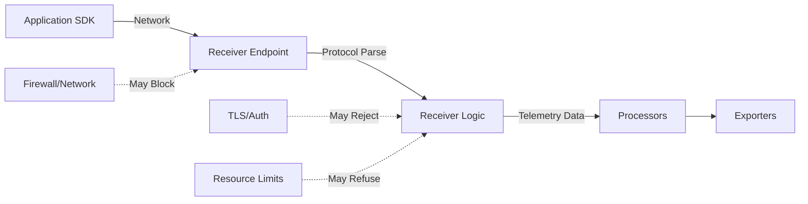

# How to Troubleshoot the OpenTelemetry Collector Not Receiving Data

Author: [nawazdhandala](https://www.github.com/nawazdhandala)

Tags: OpenTelemetry, Collector, Troubleshooting, Debugging, Receivers, Connectivity

Description: Systematically diagnose and fix issues when OpenTelemetry Collector fails to receive telemetry data from applications and services.

When the OpenTelemetry Collector fails to receive data from your applications, it breaks your entire observability pipeline. This guide provides a systematic approach to diagnosing and resolving receiver-related issues, covering network connectivity, configuration problems, authentication failures, and resource constraints.

## Understanding the Receiver Pipeline

Before troubleshooting, understand how data flows into the collector:



Common failure points:

1. Network connectivity between application and collector
2. Firewall rules blocking traffic
3. Incorrect endpoint configuration
4. Protocol mismatches
5. Authentication/TLS issues
6. Resource exhaustion (memory, CPU)
7. Port conflicts

## Initial Diagnostic Steps

Start with these basic checks before deep diving:

### Step 1: Check Collector Logs

Enable debug logging to see detailed receiver information:

```yaml
# config.yaml - Enable debug logging
service:
  telemetry:
    logs:
      # Set to debug for troubleshooting
      level: debug
      # Log to console for easy access
      development: true
      # Show log source location
      encoding: console

receivers:
  otlp:
    protocols:
      grpc:
        endpoint: 0.0.0.0:4317
      http:
        endpoint: 0.0.0.0:4318
```

Check logs for receiver-related errors:

```bash
# Docker: View collector logs
docker logs otel-collector 2>&1 | grep -i "receiver\|error\|fail"

# Kubernetes: View collector logs
kubectl logs -n observability deployment/otel-collector --tail=100 | grep -i "receiver"

# Look for specific error patterns:
# - "bind: address already in use" = port conflict
# - "connection refused" = endpoint not accessible
# - "TLS handshake failed" = certificate issues
# - "context deadline exceeded" = timeout issues
```

### Step 2: Verify Receiver is Running

Check that the receiver successfully started:

```bash
# Look for startup confirmation in logs
docker logs otel-collector 2>&1 | grep "Everything is ready"

# Should see output like:
# 2025-02-06T10:00:00.123Z info service/service.go:143 Everything is ready. Begin running and processing data.
```

### Step 3: Test Network Connectivity

Verify the collector endpoint is reachable from your application:

```bash
# Test from application host or pod
# Test OTLP/gRPC (port 4317)
telnet collector-host 4317

# Test OTLP/HTTP (port 4318)
curl -v http://collector-host:4318/v1/traces

# In Kubernetes, test from application pod
kubectl exec -it your-app-pod -- nc -zv otel-collector 4317

# Expected output for successful connection:
# Connection to otel-collector 4317 port [tcp/*] succeeded!
```

## Common Issue 1: Port Not Bound

The receiver fails to bind to the configured port.

### Symptoms

```
Error: failed to start receiver: listen tcp 0.0.0.0:4317: bind: address already in use
```

### Diagnosis

```bash
# Check what's using the port
# Linux
sudo lsof -i :4317

# macOS
lsof -i :4317

# Check all listening ports
netstat -tuln | grep 4317

# In Kubernetes, check if another pod is using the port
kubectl get pods -A -o wide | grep -E "4317|4318"
```

### Solutions

**Solution 1: Change the port**

```yaml
# config.yaml - Use different ports
receivers:
  otlp:
    protocols:
      grpc:
        # Use alternate port
        endpoint: 0.0.0.0:14317
      http:
        endpoint: 0.0.0.0:14318
```

**Solution 2: Stop conflicting service**

```bash
# Find and stop the conflicting process
sudo lsof -i :4317
# Kill the process (use PID from lsof output)
sudo kill -9 <PID>
```

**Solution 3: Fix Kubernetes port conflicts**

```yaml
# deployment.yaml - Ensure unique ports
apiVersion: v1
kind: Service
metadata:
  name: otel-collector
spec:
  ports:
  - name: otlp-grpc
    port: 4317
    targetPort: 4317
    # Ensure no other service uses this port
  - name: otlp-http
    port: 4318
    targetPort: 4318
```

## Common Issue 2: Network Isolation

Application cannot reach collector due to network configuration.

### Symptoms

```bash
# From application
curl http://otel-collector:4318/v1/traces
# curl: (6) Could not resolve host: otel-collector
# or
# curl: (7) Failed to connect to otel-collector port 4318: Connection refused
```

### Diagnosis

```bash
# Kubernetes: Check if service exists
kubectl get svc -n observability otel-collector

# Check service endpoints
kubectl get endpoints -n observability otel-collector

# Verify DNS resolution
kubectl exec -it your-app-pod -- nslookup otel-collector

# Test connectivity from application namespace
kubectl run -it --rm debug --image=nicolaka/netshoot --restart=Never -- bash
# Inside debug pod:
curl -v http://otel-collector.observability.svc.cluster.local:4318/v1/traces
```

### Solutions

**Solution 1: Fix Kubernetes service configuration**

```yaml
# service.yaml - Properly expose collector
apiVersion: v1
kind: Service
metadata:
  name: otel-collector
  namespace: observability
spec:
  type: ClusterIP
  selector:
    app: otel-collector
  ports:
  - name: otlp-grpc
    port: 4317
    targetPort: 4317
    protocol: TCP
  - name: otlp-http
    port: 4318
    targetPort: 4318
    protocol: TCP

---
# If cross-namespace access needed
apiVersion: v1
kind: Service
metadata:
  name: otel-collector
  # Create service in application namespace pointing to collector
  namespace: application-namespace
spec:
  type: ExternalName
  externalName: otel-collector.observability.svc.cluster.local
```

**Solution 2: Configure network policies**

```yaml
# network-policy.yaml - Allow traffic to collector
apiVersion: networking.k8s.io/v1
kind: NetworkPolicy
metadata:
  name: allow-to-collector
  namespace: observability
spec:
  podSelector:
    matchLabels:
      app: otel-collector
  policyTypes:
  - Ingress
  ingress:
  # Allow from application namespaces
  - from:
    - namespaceSelector:
        matchLabels:
          app: your-application
    ports:
    - protocol: TCP
      port: 4317
    - protocol: TCP
      port: 4318
```

**Solution 3: Update application endpoint**

```yaml
# application-deployment.yaml - Correct collector endpoint
apiVersion: apps/v1
kind: Deployment
metadata:
  name: your-app
spec:
  template:
    spec:
      containers:
      - name: app
        env:
        # Use fully qualified service name for cross-namespace
        - name: OTEL_EXPORTER_OTLP_ENDPOINT
          value: "http://otel-collector.observability.svc.cluster.local:4318"
        # Or use service in same namespace
        - name: OTEL_EXPORTER_OTLP_ENDPOINT
          value: "http://otel-collector:4318"
```

## Common Issue 3: Firewall Blocking Traffic

Firewall rules prevent traffic from reaching collector.

### Diagnosis

```bash
# Check firewall rules (Linux)
sudo iptables -L -n | grep -E "4317|4318"

# Test with firewall temporarily disabled (careful in production)
sudo ufw disable
# Test connection
curl http://collector:4318/v1/traces
sudo ufw enable

# Check cloud provider security groups
# AWS: Check security group rules
# GCP: Check firewall rules
# Azure: Check NSG rules
```

### Solutions

**Solution 1: Open required ports**

```bash
# Linux firewall
sudo ufw allow 4317/tcp
sudo ufw allow 4318/tcp

# Docker: Publish ports
docker run -p 4317:4317 -p 4318:4318 otel/opentelemetry-collector-contrib
```

**Solution 2: Configure cloud firewall rules**

```bash
# AWS: Add security group rule
aws ec2 authorize-security-group-ingress \
  --group-id sg-xxxxxxxx \
  --protocol tcp \
  --port 4317 \
  --cidr 10.0.0.0/16

# GCP: Create firewall rule
gcloud compute firewall-rules create allow-otel-collector \
  --allow tcp:4317,tcp:4318 \
  --source-ranges 10.0.0.0/16
```

## Common Issue 4: TLS/Authentication Failures

Receiver expects authentication but application doesn't provide it.

### Symptoms

```
Error: rpc error: code = Unauthenticated desc = missing credentials
Error: tls: bad certificate
Error: x509: certificate signed by unknown authority
```

### Diagnosis

```bash
# Test without TLS verification
curl -k https://collector:4318/v1/traces

# Check certificate validity
openssl s_client -connect collector:4317 -showcerts

# Verify certificate chain
openssl verify -CAfile /path/to/ca.crt /path/to/server.crt
```

### Solutions

**Solution 1: Configure TLS in receiver**

```yaml
# config.yaml - TLS configuration
receivers:
  otlp:
    protocols:
      grpc:
        endpoint: 0.0.0.0:4317
        tls:
          # Enable TLS
          cert_file: /etc/otelcol/certs/server.crt
          key_file: /etc/otelcol/certs/server.key
          # Client certificate verification (optional)
          client_ca_file: /etc/otelcol/certs/ca.crt
      http:
        endpoint: 0.0.0.0:4318
        tls:
          cert_file: /etc/otelcol/certs/server.crt
          key_file: /etc/otelcol/certs/server.key

# For development/testing only: disable TLS
receivers:
  otlp:
    protocols:
      grpc:
        endpoint: 0.0.0.0:4317
        # No TLS configuration = insecure
```

**Solution 2: Configure authentication**

```yaml
# config.yaml - API key authentication
extensions:
  # Bearer token authentication
  bearertokenauth:
    # Check X-API-Key header
    token: "your-secret-api-key"

receivers:
  otlp:
    protocols:
      grpc:
        endpoint: 0.0.0.0:4317
        # Require authentication
        auth:
          authenticator: bearertokenauth

service:
  extensions: [bearertokenauth]
  pipelines:
    traces:
      receivers: [otlp]
```

**Solution 3: Match application configuration**

```bash
# Application must send correct credentials
export OTEL_EXPORTER_OTLP_HEADERS="x-api-key=your-secret-api-key"
export OTEL_EXPORTER_OTLP_ENDPOINT="https://collector:4318"
export OTEL_EXPORTER_OTLP_CERTIFICATE="/path/to/ca.crt"
```

## Common Issue 5: Protocol Mismatches

Application sends data in format receiver doesn't expect.

### Symptoms

```
Error: malformed HTTP request
Error: unknown service opentelemetry.proto.collector.trace.v1.TraceService
```

### Diagnosis

```bash
# Check what protocol application is using
# gRPC typically on port 4317
# HTTP typically on port 4318

# Test gRPC endpoint
grpcurl -plaintext collector:4317 list

# Test HTTP endpoint
curl -v http://collector:4318/v1/traces \
  -H "Content-Type: application/json" \
  -d '{}'
```

### Solutions

**Solution 1: Enable correct protocol in receiver**

```yaml
# config.yaml - Enable both protocols
receivers:
  otlp:
    protocols:
      # Enable gRPC
      grpc:
        endpoint: 0.0.0.0:4317
      # Enable HTTP
      http:
        endpoint: 0.0.0.0:4318

  # If using Jaeger format
  jaeger:
    protocols:
      thrift_http:
        endpoint: 0.0.0.0:14268
      grpc:
        endpoint: 0.0.0.0:14250

  # If using Zipkin format
  zipkin:
    endpoint: 0.0.0.0:9411
```

**Solution 2: Update application configuration**

```bash
# For OTLP/gRPC
export OTEL_EXPORTER_OTLP_PROTOCOL=grpc
export OTEL_EXPORTER_OTLP_ENDPOINT=http://collector:4317

# For OTLP/HTTP
export OTEL_EXPORTER_OTLP_PROTOCOL=http/protobuf
export OTEL_EXPORTER_OTLP_ENDPOINT=http://collector:4318
```

## Common Issue 6: Resource Exhaustion

Collector refuses data due to memory or CPU limits.

### Symptoms

```
Error: receiver refused data: memory limit exceeded
Error: context deadline exceeded
```

### Diagnosis

```bash
# Check collector resource usage
# Kubernetes
kubectl top pod -n observability otel-collector

# Docker
docker stats otel-collector

# Check collector metrics
curl -s http://localhost:8888/metrics | grep -E "memory|cpu|refused"

# Look for these metrics:
# otelcol_receiver_refused_spans > 0 = data being refused
# otelcol_process_memory_rss approaching limit = memory pressure
```

### Solutions

**Solution 1: Add memory limiter processor**

```yaml
# config.yaml - Memory protection
processors:
  # Memory limiter MUST be first processor
  memory_limiter:
    check_interval: 1s
    # Set to 80% of container memory limit
    limit_mib: 1536
    # Trigger GC at 25% of limit
    spike_limit_mib: 384

service:
  pipelines:
    traces:
      receivers: [otlp]
      # Memory limiter FIRST
      processors: [memory_limiter, batch]
      exporters: [otlp]
```

**Solution 2: Increase resource limits**

```yaml
# deployment.yaml - Increase resources
spec:
  containers:
  - name: otel-collector
    resources:
      requests:
        cpu: 2000m
        memory: 2Gi
      limits:
        cpu: 4000m
        memory: 4Gi
```

**Solution 3: Configure backpressure**

```yaml
# config.yaml - Limit receiver throughput
receivers:
  otlp:
    protocols:
      grpc:
        endpoint: 0.0.0.0:4317
        # Limit max message size
        max_recv_msg_size_mib: 16
        # Enable keepalive to detect dead connections
        keepalive:
          server_parameters:
            max_connection_idle: 11s
            max_connection_age: 12s
```

## Common Issue 7: Configuration Errors

Receiver configuration is invalid or incomplete.

### Symptoms

```
Error: error reading configuration: yaml: unmarshal errors
Error: receiver "otlp" not found in service pipelines
```

### Diagnosis

```bash
# Validate configuration syntax
otelcol-contrib validate --config config.yaml

# Check for common mistakes:
# - Receiver not added to service.pipelines
# - Incorrect YAML indentation
# - Missing required fields
```

### Solutions

**Solution 1: Validate configuration structure**

```yaml
# config.yaml - Proper structure
receivers:
  # Define receivers here
  otlp:
    protocols:
      grpc:
        endpoint: 0.0.0.0:4317

processors:
  batch:
    timeout: 1s

exporters:
  logging:
    verbosity: detailed

service:
  # Must reference receivers defined above
  pipelines:
    traces:
      receivers: [otlp]  # Must match receiver name
      processors: [batch]
      exporters: [logging]
```

**Solution 2: Test with minimal configuration**

```yaml
# minimal-config.yaml - Simplest working config
receivers:
  otlp:
    protocols:
      grpc:
        endpoint: 0.0.0.0:4317

exporters:
  logging:
    verbosity: detailed

service:
  pipelines:
    traces:
      receivers: [otlp]
      exporters: [logging]
```

Test minimal config first, then add complexity:

```bash
# Test minimal config
otelcol-contrib --config minimal-config.yaml

# If working, gradually add processors, other receivers, etc.
```

## Debugging with Test Data

Use telemetrygen to isolate whether the issue is in the application or collector:

```bash
# Install telemetrygen
go install github.com/open-telemetry/opentelemetry-collector-contrib/cmd/telemetrygen@latest

# Test collector gRPC receiver
telemetrygen traces \
  --otlp-endpoint localhost:4317 \
  --otlp-insecure \
  --traces 10

# Test collector HTTP receiver
telemetrygen traces \
  --otlp-http \
  --otlp-endpoint http://localhost:4318 \
  --traces 10

# If telemetrygen works but application doesn't:
# - Issue is in application SDK configuration
# - Check application OTEL environment variables
# - Verify application can resolve collector hostname

# If telemetrygen also fails:
# - Issue is in collector configuration
# - Check receiver configuration
# - Verify network connectivity
```

## Comprehensive Troubleshooting Checklist

Use this systematic checklist when troubleshooting:

```bash
#!/bin/bash
# troubleshoot-receiver.sh - Systematic diagnostics

echo "OpenTelemetry Collector Receiver Troubleshooting"
echo "================================================"

# 1. Check collector is running
echo "[1/10] Checking if collector is running..."
if pgrep -f otelcol > /dev/null; then
    echo "✓ Collector process found"
else
    echo "✗ Collector not running!"
    exit 1
fi

# 2. Check collector logs for errors
echo "[2/10] Checking collector logs..."
if docker logs otel-collector 2>&1 | grep -i "error" > /dev/null; then
    echo "✗ Errors found in logs:"
    docker logs otel-collector 2>&1 | grep -i "error" | tail -5
else
    echo "✓ No errors in recent logs"
fi

# 3. Check ports are listening
echo "[3/10] Checking if ports are listening..."
for port in 4317 4318; do
    if nc -z localhost $port 2>/dev/null; then
        echo "✓ Port $port is open"
    else
        echo "✗ Port $port is not listening!"
    fi
done

# 4. Check DNS resolution
echo "[4/10] Checking DNS resolution..."
if nslookup otel-collector > /dev/null 2>&1; then
    echo "✓ DNS resolution works"
else
    echo "✗ Cannot resolve otel-collector"
fi

# 5. Test connectivity
echo "[5/10] Testing connectivity..."
if curl -s -o /dev/null -w "%{http_code}" http://localhost:4318/v1/traces | grep -q "200\|400\|405"; then
    echo "✓ HTTP endpoint reachable"
else
    echo "✗ HTTP endpoint not reachable"
fi

# 6. Check receiver metrics
echo "[6/10] Checking receiver metrics..."
if curl -s http://localhost:8888/metrics | grep "otelcol_receiver_accepted_spans" > /dev/null; then
    echo "✓ Receiver metrics available"
    accepted=$(curl -s http://localhost:8888/metrics | grep "otelcol_receiver_accepted_spans" | tail -1)
    echo "  $accepted"
else
    echo "✗ No receiver metrics found"
fi

# 7. Check for refused spans
echo "[7/10] Checking for refused data..."
refused=$(curl -s http://localhost:8888/metrics | grep "otelcol_receiver_refused_spans" | grep -v "^#" | tail -1)
if echo "$refused" | grep " 0$" > /dev/null; then
    echo "✓ No refused spans"
else
    echo "✗ Spans are being refused:"
    echo "  $refused"
fi

# 8. Check memory usage
echo "[8/10] Checking memory usage..."
memory=$(curl -s http://localhost:8888/metrics | grep "otelcol_process_memory_rss" | grep -v "^#" | awk '{print $2}')
memory_mb=$(echo "$memory / 1024 / 1024" | bc)
echo "  Memory usage: ${memory_mb} MB"

# 9. Test with telemetrygen
echo "[9/10] Testing with telemetrygen..."
if command -v telemetrygen > /dev/null; then
    if telemetrygen traces --otlp-endpoint localhost:4317 --otlp-insecure --traces 5 2>&1 | grep "generation complete" > /dev/null; then
        echo "✓ telemetrygen test successful"
    else
        echo "✗ telemetrygen test failed"
    fi
else
    echo "⚠ telemetrygen not installed (optional)"
fi

# 10. Summary
echo "[10/10] Summary"
echo "Check complete. Review any ✗ items above."
```

## Monitoring for Receiver Issues

Set up proactive monitoring to catch issues early:

```yaml
# prometheus-alerts.yaml - Receiver health alerts
groups:
- name: otel_collector_receiver
  interval: 30s
  rules:
  # Alert when no data received for 5 minutes
  - alert: CollectorNotReceivingData
    expr: |
      rate(otelcol_receiver_accepted_spans[5m]) == 0
    for: 5m
    labels:
      severity: warning
    annotations:
      summary: "Collector not receiving spans"

  # Alert when data is refused
  - alert: CollectorRefusingData
    expr: |
      rate(otelcol_receiver_refused_spans[1m]) > 0
    labels:
      severity: critical
    annotations:
      summary: "Collector refusing data due to overload"

  # Alert when receiver errors increase
  - alert: CollectorReceiverErrors
    expr: |
      rate(otelcol_receiver_failed_spans[5m]) > 10
    labels:
      severity: warning
    annotations:
      summary: "High receiver error rate"
```

## Conclusion

Troubleshooting receiver issues requires a systematic approach: start with basic connectivity checks, verify configuration correctness, test with synthetic data, and monitor key metrics. Most issues fall into a few categories: network connectivity, configuration errors, authentication problems, or resource exhaustion. Use the diagnostic tools and scripts provided to quickly identify and resolve problems before they impact production observability.

For more troubleshooting guides, see related posts:
- https://oneuptime.com/blog/post/2026-02-06-troubleshoot-collector-not-exporting-data/view
- https://oneuptime.com/blog/post/2026-02-06-troubleshoot-configuration-yaml-errors-collector/view
- https://oneuptime.com/blog/post/2026-02-06-right-size-cpu-memory-opentelemetry-collector/view
