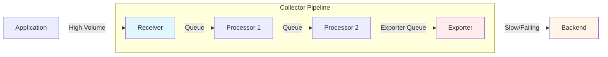
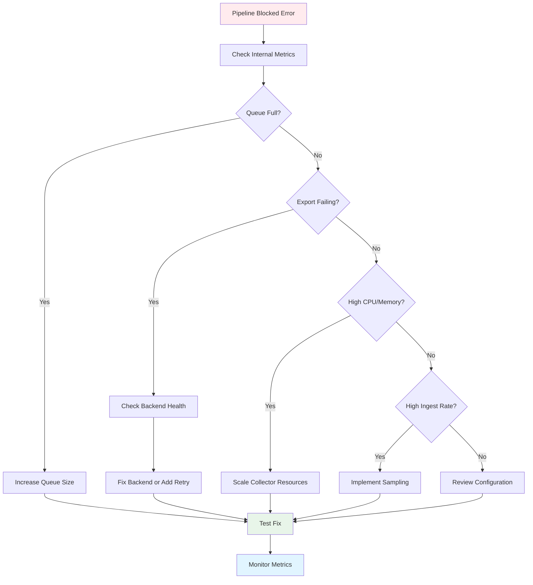

# How to Troubleshoot Collector Pipeline Blocked Errors

Author: [nawazdhandala](https://www.github.com/nawazdhandala)

Tags: OpenTelemetry, Collector, Troubleshooting, Performance, Backpressure, Queues

Description: A comprehensive guide to diagnosing and resolving OpenTelemetry Collector pipeline blocked errors, covering queue saturation, backpressure handling, and performance tuning strategies.

---

When your OpenTelemetry Collector logs show "pipeline blocked" or "queue full" errors, it means telemetry data is arriving faster than the Collector can process and export it. This backpressure situation can lead to data loss, increased latency, and application performance degradation. Understanding how to diagnose and fix these issues is critical for maintaining a healthy observability pipeline.

This guide covers the root causes of pipeline blocking, how to diagnose the problem using internal metrics, and practical solutions for different scenarios.

---

## Understanding Pipeline Blocking

The OpenTelemetry Collector processes data through pipelines that consist of receivers, processors, and exporters. Each component has internal queues and buffers:



Pipeline blocking occurs when:

1. **Exporter is slow**: Backend is responding slowly or timing out
2. **Exporter is failing**: Network issues, authentication failures, or backend downtime
3. **Incoming rate exceeds processing capacity**: Too much telemetry for Collector resources
4. **Queue size too small**: Buffers can't absorb traffic bursts
5. **Resource constraints**: CPU or memory limits throttling the Collector

---

## Diagnostic Metrics

The Collector exposes internal metrics that help identify pipeline blocking. Enable internal metrics in your configuration:

```yaml
# Enable Collector self-monitoring
service:
  telemetry:
    metrics:
      readers:
        - periodic:
            exporter:
              otlp:
                protocol: http/protobuf
                endpoint: https://oneuptime.com/otlp
                headers:
                  x-oneuptime-token: ${ONEUPTIME_TOKEN}
      # Expose metrics for Prometheus scraping
      address: 0.0.0.0:8888
```

### Key Metrics to Monitor

**Queue Metrics:**
```
otelcol_exporter_queue_size          # Current items in queue
otelcol_exporter_queue_capacity      # Max queue capacity
otelcol_exporter_enqueue_failed      # Items rejected due to full queue
```

**Exporter Metrics:**
```
otelcol_exporter_send_failed_spans         # Failed span exports
otelcol_exporter_send_failed_metric_points # Failed metric exports
otelcol_exporter_send_failed_log_records   # Failed log exports
```

**Receiver Metrics:**
```
otelcol_receiver_accepted_spans      # Spans accepted by receiver
otelcol_receiver_refused_spans       # Spans refused (backpressure)
```

**Check these metrics using Prometheus queries:**
```promql
# Queue utilization percentage
(otelcol_exporter_queue_size / otelcol_exporter_queue_capacity) * 100

# Rate of enqueue failures (items dropped)
rate(otelcol_exporter_enqueue_failed_spans[5m])

# Export failure rate
rate(otelcol_exporter_send_failed_spans[5m])
```

---

## Common Causes and Solutions

### Cause 1: Queue Size Too Small

The default queue size (10,000 items) may be insufficient for high-throughput environments.

**Diagnosis:**
```bash
# Check Collector logs for queue full messages
kubectl logs -l app=opentelemetry-collector | grep -i "queue full"

# Check internal metrics
curl http://localhost:8888/metrics | grep queue_size
```

**Problem Indicators:**
- `otelcol_exporter_enqueue_failed` increasing
- `otelcol_exporter_queue_size` consistently at capacity
- Application seeing refused spans

**Solution - Increase Queue Size:**
```yaml
exporters:
  otlphttp:
    endpoint: https://oneuptime.com/otlp
    headers:
      x-oneuptime-token: ${ONEUPTIME_TOKEN}

    # Configure persistent queue for durability
    sending_queue:
      enabled: true
      # Increase queue size from default 10,000 to 50,000
      # Each item is approximately 1-2 KB, so this uses ~100 MB memory
      queue_size: 50000
      # Number of concurrent workers sending data
      num_consumers: 10
      # Enable persistent storage to survive restarts
      storage: file_storage

    # Retry configuration for transient failures
    retry_on_failure:
      enabled: true
      initial_interval: 5s      # First retry after 5s
      max_interval: 30s         # Max backoff time
      max_elapsed_time: 300s    # Give up after 5 minutes
      # Use exponential backoff multiplier
      multiplier: 1.5

# Configure file storage for persistent queue
extensions:
  file_storage:
    directory: /var/lib/otelcol/queue
    timeout: 10s
    # Limit disk usage to 2GB
    compaction:
      on_start: true
      directory: /var/lib/otelcol/queue
      max_transaction_size: 65536

service:
  extensions: [file_storage]
  pipelines:
    traces:
      receivers: [otlp]
      processors: [batch]
      exporters: [otlphttp]
```

**For Kubernetes, ensure persistent storage:**
```yaml
apiVersion: apps/v1
kind: Deployment
metadata:
  name: otel-collector
spec:
  template:
    spec:
      containers:
      - name: otel-collector
        volumeMounts:
        # Mount volume for persistent queue
        - name: queue-storage
          mountPath: /var/lib/otelcol/queue
      volumes:
      - name: queue-storage
        persistentVolumeClaim:
          claimName: otel-collector-queue
---
apiVersion: v1
kind: PersistentVolumeClaim
metadata:
  name: otel-collector-queue
spec:
  accessModes:
    - ReadWriteOnce
  resources:
    requests:
      # Allocate 5GB for queue persistence
      storage: 5Gi
  storageClassName: fast-ssd
```

### Cause 2: Exporter Performance Issues

The backend might be slow or experiencing issues.

**Diagnosis:**
```promql
# Check export duration (should be under 1 second)
histogram_quantile(0.95, rate(otelcol_exporter_send_failed_spans_duration_bucket[5m]))

# Check failure rate
rate(otelcol_exporter_send_failed_spans[5m]) > 0
```

**Solution - Optimize Batching:**
```yaml
processors:
  # Batch processor reduces network overhead by grouping items
  batch:
    # Send batch when it reaches this size
    send_batch_size: 8192
    # Or when this timeout is reached (whichever comes first)
    timeout: 5s
    # Never send batches larger than this
    send_batch_max_size: 16384

    # Additional tuning for metadata
    # Reduces per-batch overhead for large batches
    metadata_keys:
      - http.method
      - http.status_code

exporters:
  otlphttp:
    endpoint: https://oneuptime.com/otlp
    headers:
      x-oneuptime-token: ${ONEUPTIME_TOKEN}

    # Compression reduces network bandwidth by 70-90%
    compression: gzip

    # Timeout for export requests
    timeout: 30s

    # Limit concurrent exports to prevent overwhelming backend
    # Increase if backend can handle more load
    sending_queue:
      num_consumers: 10

    # Connection pool tuning
    # Reuse connections for better performance
    max_idle_conns: 100
    max_idle_conns_per_host: 10
    idle_conn_timeout: 90s

service:
  pipelines:
    traces:
      receivers: [otlp]
      # Batching before export is critical for performance
      processors: [batch]
      exporters: [otlphttp]
```

### Cause 3: Insufficient Collector Resources

The Collector process doesn't have enough CPU or memory to handle the load.

**Diagnosis:**
```bash
# Check Collector resource usage
kubectl top pod -l app=opentelemetry-collector

# Check if pod is being throttled
kubectl describe pod -l app=opentelemetry-collector | grep -A 5 "Limits"

# Check memory usage metrics
curl http://localhost:8888/metrics | grep process_runtime_go_mem
```

**Solution - Increase Resources:**
```yaml
apiVersion: apps/v1
kind: Deployment
metadata:
  name: otel-collector
spec:
  replicas: 3  # Scale horizontally for high throughput
  template:
    spec:
      containers:
      - name: otel-collector
        resources:
          requests:
            # Minimum guaranteed resources
            memory: "512Mi"
            cpu: "500m"
          limits:
            # Maximum allowed resources
            # Set limits higher than requests for burst capacity
            memory: "2Gi"
            cpu: "2000m"

        # Environment variables for Go runtime tuning
        env:
        # Set max Go memory to 80% of limit to leave headroom
        - name: GOMEMLIMIT
          value: "1600MiB"
        # Tune garbage collection target percentage
        - name: GOGC
          value: "75"
```

**Configure memory limiter processor:**
```yaml
processors:
  # Memory limiter prevents OOM by refusing data when close to limit
  memory_limiter:
    # Should be ~80% of container memory limit
    limit_mib: 1600
    # Temporary spike allowance
    spike_limit_mib: 400
    # How often to check memory usage
    check_interval: 1s

  batch:
    timeout: 5s
    send_batch_size: 8192

service:
  pipelines:
    traces:
      receivers: [otlp]
      # Memory limiter MUST be first processor
      processors: [memory_limiter, batch]
      exporters: [otlphttp]
```

### Cause 4: Backend Downtime or Rate Limiting

The backend is rejecting requests or is completely down.

**Diagnosis:**
```bash
# Check for HTTP error codes in logs
kubectl logs -l app=opentelemetry-collector | grep -E "429|503|500"

# Check export success rate
curl http://localhost:8888/metrics | grep send_failed
```

**Solution - Add Fallback Exporter:**
```yaml
exporters:
  # Primary backend
  otlphttp/primary:
    endpoint: https://oneuptime.com/otlp
    headers:
      x-oneuptime-token: ${ONEUPTIME_TOKEN}
    retry_on_failure:
      enabled: true
      max_elapsed_time: 60s  # Shorter timeout before failing

  # Fallback: write to local file when primary fails
  file/backup:
    path: /var/log/otelcol/backup.json
    rotation:
      max_megabytes: 100
      max_backups: 10

  # Alternative: send to different backend
  otlphttp/secondary:
    endpoint: https://backup-backend.example.com/otlp
    headers:
      x-api-key: ${BACKUP_TOKEN}

# Use load balancing exporter for automatic failover
exporters:
  loadbalancing:
    protocol:
      otlp:
        timeout: 30s
    resolver:
      static:
        hostnames:
          - https://oneuptime.com/otlp
          - https://backup.oneuptime.com/otlp
    routing_key: "traceID"

service:
  pipelines:
    traces:
      receivers: [otlp]
      processors: [memory_limiter, batch]
      exporters: [loadbalancing]
```

### Cause 5: Aggressive Sampling Needed

Sometimes you're collecting too much data. Smart sampling can reduce load.

**Solution - Implement Tail Sampling:**
```yaml
processors:
  # Tail sampling makes intelligent sampling decisions after seeing full trace
  tail_sampling:
    # Wait for complete trace before deciding
    decision_wait: 10s
    # Track this many traces in memory
    num_traces: 50000
    # Define sampling policies
    policies:
      # Always keep errors
      - name: errors-policy
        type: status_code
        status_code:
          status_codes: [ERROR]

      # Always keep slow requests (>1 second)
      - name: slow-traces-policy
        type: latency
        latency:
          threshold_ms: 1000

      # Keep traces that hit specific endpoints
      - name: critical-endpoints
        type: string_attribute
        string_attribute:
          key: http.route
          values:
            - /api/checkout
            - /api/payment
          enabled_regex_matching: true

      # Sample 10% of successful, fast traces
      - name: probabilistic-policy
        type: probabilistic
        probabilistic:
          sampling_percentage: 10

  batch:
    timeout: 5s
    send_batch_size: 8192

service:
  pipelines:
    traces:
      receivers: [otlp]
      processors: [memory_limiter, tail_sampling, batch]
      exporters: [otlphttp]
```

---

## Complete Production Configuration

Here's a production-ready configuration optimized to prevent pipeline blocking:

```yaml
# Extensions for health monitoring
extensions:
  health_check:
    endpoint: 0.0.0.0:13133
  pprof:
    endpoint: 0.0.0.0:1777
  zpages:
    endpoint: 0.0.0.0:55679
  # Persistent storage for queue
  file_storage:
    directory: /var/lib/otelcol/queue
    timeout: 10s

# Receivers
receivers:
  otlp:
    protocols:
      grpc:
        endpoint: 0.0.0.0:4317
        # Limit max message size to prevent memory spikes
        max_recv_msg_size_mib: 32
      http:
        endpoint: 0.0.0.0:4318

# Processors
processors:
  # CRITICAL: Memory limiter must be first processor
  memory_limiter:
    limit_mib: 1600        # 80% of 2GB container limit
    spike_limit_mib: 400   # 20% spike allowance
    check_interval: 1s

  # Batch to optimize network usage
  batch:
    timeout: 5s
    send_batch_size: 8192
    send_batch_max_size: 16384

  # Resource detection adds environment context
  resourcedetection:
    detectors: [env, system, docker, kubernetes]
    timeout: 5s

# Exporters
exporters:
  # Primary exporter with robust queue and retry
  otlphttp:
    endpoint: https://oneuptime.com/otlp
    headers:
      x-oneuptime-token: ${ONEUPTIME_TOKEN}
    compression: gzip
    timeout: 30s

    # Large persistent queue for handling bursts
    sending_queue:
      enabled: true
      queue_size: 50000         # 50k items (~100MB)
      num_consumers: 20         # Parallel export workers
      storage: file_storage     # Persist queue to disk

    # Exponential backoff retry
    retry_on_failure:
      enabled: true
      initial_interval: 5s
      max_interval: 30s
      max_elapsed_time: 300s

  # Debug exporter for troubleshooting
  logging:
    verbosity: normal
    sampling_initial: 5
    sampling_thereafter: 200

# Service configuration
service:
  extensions: [health_check, pprof, zpages, file_storage]

  # Configure internal telemetry
  telemetry:
    logs:
      level: info
    metrics:
      address: 0.0.0.0:8888
      readers:
        - periodic:
            exporter:
              otlp:
                protocol: http/protobuf
                endpoint: https://oneuptime.com/otlp
                headers:
                  x-oneuptime-token: ${ONEUPTIME_TOKEN}

  pipelines:
    traces:
      receivers: [otlp]
      processors: [memory_limiter, resourcedetection, batch]
      exporters: [otlphttp]

    metrics:
      receivers: [otlp]
      processors: [memory_limiter, resourcedetection, batch]
      exporters: [otlphttp]

    logs:
      receivers: [otlp]
      processors: [memory_limiter, resourcedetection, batch]
      exporters: [otlphttp]
```

---

## Monitoring Dashboard Queries

Create alerts for pipeline blocking using these queries:

**Alert: Queue Near Capacity**
```promql
# Alert when queue is >80% full for 5 minutes
(
  otelcol_exporter_queue_size
  / otelcol_exporter_queue_capacity
) * 100 > 80
```

**Alert: High Enqueue Failure Rate**
```promql
# Alert when >1% of items are being dropped
(
  rate(otelcol_exporter_enqueue_failed_spans[5m])
  / rate(otelcol_receiver_accepted_spans[5m])
) * 100 > 1
```

**Alert: Export Failures**
```promql
# Alert when exports are failing
rate(otelcol_exporter_send_failed_spans[5m]) > 10
```

**Dashboard Panel: Pipeline Throughput**
```promql
# Items per second through the pipeline
sum(rate(otelcol_receiver_accepted_spans[1m]))
```

---

## Scaling Strategies

### Horizontal Scaling

Deploy multiple Collector instances behind a load balancer:

```yaml
apiVersion: apps/v1
kind: Deployment
metadata:
  name: otel-collector
spec:
  # Scale based on load
  replicas: 5
  strategy:
    type: RollingUpdate
    rollingUpdate:
      maxSurge: 1
      maxUnavailable: 0
  template:
    spec:
      # Spread pods across nodes for reliability
      affinity:
        podAntiAffinity:
          preferredDuringSchedulingIgnoredDuringExecution:
          - weight: 100
            podAffinityTerm:
              labelSelector:
                matchLabels:
                  app: opentelemetry-collector
              topologyKey: kubernetes.io/hostname
---
# Horizontal Pod Autoscaler
apiVersion: autoscaling/v2
kind: HorizontalPodAutoscaler
metadata:
  name: otel-collector-hpa
spec:
  scaleTargetRef:
    apiVersion: apps/v1
    kind: Deployment
    name: otel-collector
  minReplicas: 3
  maxReplicas: 10
  metrics:
  # Scale based on CPU
  - type: Resource
    resource:
      name: cpu
      target:
        type: Utilization
        averageUtilization: 70
  # Scale based on memory
  - type: Resource
    resource:
      name: memory
      target:
        type: Utilization
        averageUtilization: 80
  # Scale based on queue size
  - type: Pods
    pods:
      metric:
        name: otelcol_exporter_queue_size
      target:
        type: AverageValue
        averageValue: "40000"
```

### Vertical Scaling

For very high throughput, use larger instances:

```yaml
resources:
  requests:
    memory: "4Gi"
    cpu: "2000m"
  limits:
    memory: "8Gi"
    cpu: "4000m"

env:
- name: GOMEMLIMIT
  value: "6400MiB"  # 80% of 8GB
```

---

## Troubleshooting Workflow



---

## Related Resources

- [How to Fix Collector Connection Refused on OTLP Ports](https://oneuptime.com/blog/post/2026-02-06-fix-collector-connection-refused-otlp-ports/view)
- [How to Diagnose Data Loss with otelcol_exporter_send_failed_spans Metrics](https://oneuptime.com/blog/post/2026-02-06-diagnose-data-loss-exporter-send-failed-spans/view)
- [How to Collect OpenTelemetry Collector Internal Metrics](https://oneuptime.com/blog/post/2025-01-22-how-to-collect-opentelemetry-collector-internal-metrics/view)
- [What is OpenTelemetry Collector and Why Use One?](https://oneuptime.com/blog/post/2025-09-18-what-is-opentelemetry-collector-and-why-use-one/view)

---

## Summary

Pipeline blocking in the OpenTelemetry Collector occurs when data arrives faster than it can be processed and exported. Key solutions include:

1. Increase queue size and enable persistent storage
2. Optimize batching and compression
3. Scale Collector resources (CPU, memory, replicas)
4. Implement retry logic and failover exporters
5. Use tail sampling to reduce data volume
6. Monitor internal metrics and set up alerts

The goal is to build a resilient pipeline that can handle bursts, survive backend outages, and scale with your telemetry volume.

[OneUptime](https://oneuptime.com) provides production-ready observability with native OpenTelemetry support and built-in tools for monitoring your Collector pipelines.
