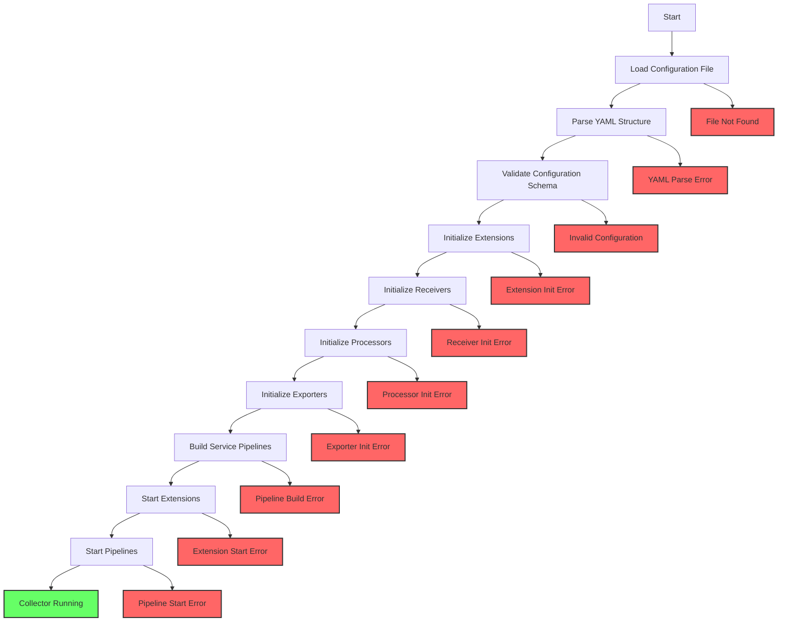

# How to Troubleshoot Collector Startup Failures

Author: [nawazdhandala](https://www.github.com/nawazdhandala)

Tags: OpenTelemetry, Collector, Startup, Troubleshooting, Configuration, Debugging

Description: Master the techniques for diagnosing and resolving OpenTelemetry Collector startup failures with practical examples and systematic troubleshooting approaches.

Collector startup failures can bring observability pipelines to a halt. Unlike runtime errors that affect running systems, startup failures prevent the collector from beginning operations at all. Understanding common failure modes and systematic troubleshooting approaches gets your collector running quickly and reliably.

## Understanding Startup Sequence

The OpenTelemetry Collector follows a specific startup sequence. Understanding this sequence helps identify where failures occur:



Failures at any stage halt the startup process. Error messages indicate which stage failed, guiding your troubleshooting approach.

## Configuration File Loading Errors

The most basic startup failure occurs when the collector cannot find or read its configuration file.

**Problem**: Collector exits immediately with "no such file or directory" error.

**Diagnosis**:

```bash
# Test if configuration file exists and is readable
ls -la /etc/otelcol-contrib/config.yaml

# Check file permissions
stat /etc/otelcol-contrib/config.yaml

# Verify file contents
cat /etc/otelcol-contrib/config.yaml
```

**Common causes**:

- Configuration file path specified incorrectly in startup command
- File mounted at wrong location in containerized deployments
- Insufficient permissions to read configuration file
- Configuration file name typo

**Solution for Kubernetes deployments**:

```yaml
apiVersion: v1
kind: ConfigMap
metadata:
  name: otel-collector-config
  namespace: observability
data:
  # Configuration key must match the mount path
  config.yaml: |
    receivers:
      otlp:
        protocols:
          grpc:
            endpoint: 0.0.0.0:4317
    processors:
      batch:
        timeout: 10s
    exporters:
      debug:
        verbosity: detailed
    service:
      pipelines:
        traces:
          receivers: [otlp]
          processors: [batch]
          exporters: [debug]
---
apiVersion: apps/v1
kind: Deployment
metadata:
  name: otel-collector
  namespace: observability
spec:
  replicas: 1
  selector:
    matchLabels:
      app: otel-collector
  template:
    metadata:
      labels:
        app: otel-collector
    spec:
      containers:
      - name: otel-collector
        image: otel/opentelemetry-collector-contrib:latest
        # Ensure command references correct config path
        command:
          - "/otelcol-contrib"
          - "--config=/conf/config.yaml"
        volumeMounts:
        - name: otel-collector-config
          # Mount path must match command argument
          mountPath: /conf
          readOnly: true
      volumes:
      - name: otel-collector-config
        configMap:
          name: otel-collector-config
```

Verify the configuration file location matches between the mount path and the `--config` flag.

**Solution for Docker deployments**:

```yaml
# docker-compose.yml with correct volume mounting
version: '3.8'
services:
  otel-collector:
    image: otel/opentelemetry-collector-contrib:latest
    # Specify config file path
    command: ["--config=/etc/otel-collector/config.yaml"]
    volumes:
      # Mount host file to container path specified in command
      - ./config.yaml:/etc/otel-collector/config.yaml:ro
    ports:
      - "4317:4317"
      - "4318:4318"
```

The `:ro` suffix makes the mount read-only, preventing accidental modifications.

## YAML Syntax Errors

Invalid YAML syntax prevents configuration parsing. These errors occur after the file is found but before validation.

**Problem**: Collector exits with "yaml: unmarshal errors" or similar parsing failures.

**Common YAML mistakes**:

```yaml
# INCORRECT: Inconsistent indentation
receivers:
  otlp:
    protocols:
      grpc:
       endpoint: 0.0.0.0:4317  # Wrong indentation
      http:
        endpoint: 0.0.0.0:4318

# INCORRECT: Tabs instead of spaces
receivers:
	otlp:  # Tab character used instead of spaces
		protocols:
			grpc:

# INCORRECT: Missing colon
receivers
  otlp:
    protocols:
      grpc:
        endpoint: 0.0.0.0:4317

# INCORRECT: Invalid list syntax
exporters:
  otlp
    - endpoint: backend1.example.com:4317
    - endpoint: backend2.example.com:4317

# CORRECT: Proper YAML syntax
receivers:
  otlp:
    protocols:
      grpc:
        endpoint: 0.0.0.0:4317
      http:
        endpoint: 0.0.0.0:4318

processors:
  batch:
    timeout: 10s

exporters:
  otlp:
    endpoint: backend.example.com:4317

service:
  pipelines:
    traces:
      receivers: [otlp]
      processors: [batch]
      exporters: [otlp]
```

**Validation techniques**:

```bash
# Validate YAML syntax with yamllint
yamllint config.yaml

# Check YAML structure with yq
yq eval config.yaml

# Use online YAML validators
# Copy configuration to https://www.yamllint.com/

# Test configuration with collector validate command
otelcol-contrib validate --config=config.yaml
```

Most editors provide YAML validation. Configure your editor to use 2-space indentation and show whitespace characters to catch indentation errors.

## Configuration Schema Validation Errors

After parsing YAML successfully, the collector validates the configuration against its schema. Schema validation catches incorrect component names, missing required fields, and invalid parameter values.

**Problem**: Collector exits with "unknown receiver type" or "invalid configuration" errors.

**Example error scenarios**:

```yaml
# INCORRECT: Typo in component type
receivers:
  otlp:
    protocols:
      grpc:
        endpoint: 0.0.0.0:4317

processors:
  betch:  # Typo: should be "batch"
    timeout: 10s

exporters:
  otlp:
    endpoint: backend.example.com:4317

service:
  pipelines:
    traces:
      receivers: [otlp]
      processors: [betch]  # References invalid processor
      exporters: [otlp]
```

Error message: `error reading configuration: unknown processor type: "betch"`

**Solution**: Correct the component name:

```yaml
processors:
  batch:  # Corrected spelling
    timeout: 10s

service:
  pipelines:
    traces:
      receivers: [otlp]
      processors: [batch]  # References valid processor
      exporters: [otlp]
```

**Missing required fields**:

```yaml
# INCORRECT: Missing required endpoint field
receivers:
  otlp:
    protocols:
      grpc:
        # endpoint field is required but missing

processors:
  batch:
    timeout: 10s

exporters:
  otlp:
    endpoint: backend.example.com:4317

service:
  pipelines:
    traces:
      receivers: [otlp]
      processors: [batch]
      exporters: [otlp]
```

Error message: `error reading configuration: receivers::otlp: missing required field 'endpoint'`

**Solution**: Add required fields:

```yaml
receivers:
  otlp:
    protocols:
      grpc:
        endpoint: 0.0.0.0:4317  # Required field added
```

**Component not available in collector distribution**:

```yaml
# INCORRECT: Using contrib-only processor in core distribution
receivers:
  otlp:
    protocols:
      grpc:
        endpoint: 0.0.0.0:4317

processors:
  # transform processor only available in collector-contrib
  transform:
    trace_statements:
      - context: span
        statements:
          - set(attributes["environment"], "production")

exporters:
  otlp:
    endpoint: backend.example.com:4317

service:
  pipelines:
    traces:
      receivers: [otlp]
      processors: [transform]
      exporters: [otlp]
```

Error message: `error reading configuration: unknown processor type: "transform"`

**Solution**: Use the contrib distribution or replace with available processors:

```bash
# Use collector-contrib instead of collector-core
docker pull otel/opentelemetry-collector-contrib:latest

# Or check component availability
otelcol-contrib components
```

## Port Binding Failures

Port binding errors occur when the collector attempts to listen on ports that are unavailable or restricted.

**Problem**: Collector exits with "bind: address already in use" or "bind: permission denied" errors.

**Diagnosis**:

```bash
# Check if port is already in use
netstat -tuln | grep 4317
lsof -i :4317

# For macOS
lsof -i :4317

# For Linux
ss -tuln | grep 4317

# Check which process is using the port
sudo lsof -i :4317
```

**Solution for port conflicts**:

```yaml
# Change receiver port to an available port
receivers:
  otlp:
    protocols:
      grpc:
        # Changed from 4317 to 4327 to avoid conflict
        endpoint: 0.0.0.0:4327
      http:
        # Changed from 4318 to 4328 to avoid conflict
        endpoint: 0.0.0.0:4328

processors:
  batch:
    timeout: 10s

exporters:
  otlp:
    endpoint: backend.example.com:4317

service:
  pipelines:
    traces:
      receivers: [otlp]
      processors: [batch]
      exporters: [otlp]
```

Update client applications to send telemetry to the new ports.

**Solution for permission errors**:

Ports below 1024 require elevated privileges on Unix systems:

```bash
# Option 1: Run collector with elevated privileges (not recommended)
sudo otelcol-contrib --config=config.yaml

# Option 2: Grant capability to bind privileged ports (Linux only)
sudo setcap 'cap_net_bind_service=+ep' /usr/local/bin/otelcol-contrib

# Option 3: Use non-privileged ports (recommended)
# Change ports to 1024 or above in configuration
```

For production deployments, use non-privileged ports and handle port mapping at the infrastructure level:

```yaml
# Kubernetes service for port mapping
apiVersion: v1
kind: Service
metadata:
  name: otel-collector
spec:
  type: LoadBalancer
  selector:
    app: otel-collector
  ports:
    # External port 4317 maps to internal port 4317
    - name: otlp-grpc
      protocol: TCP
      port: 4317
      targetPort: 4317
    - name: otlp-http
      protocol: TCP
      port: 4318
      targetPort: 4318
```

## Extension Initialization Failures

Extensions provide capabilities like health checks, performance profiling, and metrics exposure. Extension failures during initialization prevent collector startup.

**Problem**: Collector exits with extension initialization errors.

**Common extension failures**:

```yaml
# INCORRECT: Invalid extension configuration
extensions:
  # Health check on port already in use
  health_check:
    endpoint: 0.0.0.0:13133

  # pprof on privileged port
  pprof:
    endpoint: 0.0.0.0:80  # Requires elevated privileges

  # zpages with invalid configuration
  zpages:
    endpoint: 0.0.0.0:55679
    # Invalid parameter that doesn't exist
    invalid_parameter: value

receivers:
  otlp:
    protocols:
      grpc:
        endpoint: 0.0.0.0:4317

processors:
  batch:
    timeout: 10s

exporters:
  debug:
    verbosity: normal

service:
  # Extensions must be listed in service section
  extensions: [health_check, pprof, zpages]
  pipelines:
    traces:
      receivers: [otlp]
      processors: [batch]
      exporters: [debug]
```

**Solution**: Fix extension configurations:

```yaml
extensions:
  # Use available port for health check
  health_check:
    endpoint: 0.0.0.0:13133

  # Use non-privileged port for pprof
  pprof:
    endpoint: 0.0.0.0:1777

  # Remove invalid parameters from zpages
  zpages:
    endpoint: 0.0.0.0:55679

receivers:
  otlp:
    protocols:
      grpc:
        endpoint: 0.0.0.0:4317

processors:
  batch:
    timeout: 10s

exporters:
  debug:
    verbosity: normal

service:
  extensions: [health_check, pprof, zpages]
  pipelines:
    traces:
      receivers: [otlp]
      processors: [batch]
      exporters: [debug]
```

Learn more about using extensions at https://oneuptime.com/blog/post/2026-02-06-zpages-live-debugging-collector/view and https://oneuptime.com/blog/post/2026-02-06-profile-collector-pprof-extension/view.

## Pipeline Configuration Errors

Pipeline configuration errors occur when service pipelines reference undefined components or create invalid component combinations.

**Problem**: Collector exits with "pipeline references undefined receiver/processor/exporter" errors.

**Example error**:

```yaml
receivers:
  otlp:
    protocols:
      grpc:
        endpoint: 0.0.0.0:4317

processors:
  batch:
    timeout: 10s

exporters:
  otlp:
    endpoint: backend.example.com:4317

service:
  pipelines:
    traces:
      receivers: [otlp]
      processors: [batch]
      # References exporter that isn't defined
      exporters: [debug]
```

Error message: `error building pipelines: exporter "debug" not found`

**Solution**: Ensure all pipeline components are defined:

```yaml
receivers:
  otlp:
    protocols:
      grpc:
        endpoint: 0.0.0.0:4317

processors:
  batch:
    timeout: 10s

exporters:
  # Define the debug exporter
  debug:
    verbosity: normal

  otlp:
    endpoint: backend.example.com:4317

service:
  pipelines:
    traces:
      receivers: [otlp]
      processors: [batch]
      # Now references defined exporter
      exporters: [debug, otlp]
```

**Circular pipeline dependencies**:

```yaml
# INCORRECT: Circular dependency through connectors
receivers:
  otlp:
    protocols:
      grpc:
        endpoint: 0.0.0.0:4317

processors:
  batch:
    timeout: 10s

connectors:
  forward:

exporters:
  debug:
    verbosity: normal

service:
  pipelines:
    traces/1:
      receivers: [otlp]
      processors: [batch]
      # Exports to connector
      exporters: [forward]

    traces/2:
      # Receives from connector
      receivers: [forward]
      processors: [batch]
      # Exports back to same connector (circular)
      exporters: [forward]
```

Error message: `error building pipelines: circular pipeline dependency detected`

**Solution**: Remove circular dependencies:

```yaml
receivers:
  otlp:
    protocols:
      grpc:
        endpoint: 0.0.0.0:4317

processors:
  batch:
    timeout: 10s

connectors:
  forward:

exporters:
  debug:
    verbosity: normal

service:
  pipelines:
    traces/1:
      receivers: [otlp]
      processors: [batch]
      exporters: [forward]

    traces/2:
      receivers: [forward]
      processors: [batch]
      # Export to terminal exporter instead
      exporters: [debug]
```

## Network Connectivity Issues

Exporters that require network connectivity during initialization can cause startup failures when backends are unreachable.

**Problem**: Collector exits or hangs during startup when connecting to backends.

**Configuration causing network-dependent startup**:

```yaml
receivers:
  otlp:
    protocols:
      grpc:
        endpoint: 0.0.0.0:4317

processors:
  batch:
    timeout: 10s

exporters:
  otlp:
    endpoint: unreachable-backend.example.com:4317
    # Exporter may fail during initialization if backend is down

processors:
  batch:
    timeout: 10s

service:
  pipelines:
    traces:
      receivers: [otlp]
      processors: [batch]
      exporters: [otlp]
```

**Solution**: Configure retry and timeout settings:

```yaml
exporters:
  otlp:
    endpoint: backend.example.com:4317

    # Connection timeout during startup
    timeout: 10s

    # Retry configuration for runtime failures
    retry_on_failure:
      enabled: true
      initial_interval: 5s
      max_interval: 30s
      max_elapsed_time: 300s

    # Queue configuration to buffer during outages
    sending_queue:
      enabled: true
      num_consumers: 10
      queue_size: 1000

receivers:
  otlp:
    protocols:
      grpc:
        endpoint: 0.0.0.0:4317

processors:
  batch:
    timeout: 10s

service:
  pipelines:
    traces:
      receivers: [otlp]
      processors: [batch]
      exporters: [otlp]
```

Most exporters do not validate connectivity during startup, but some custom or third-party exporters might. Check exporter documentation for initialization behavior.

## Resource Constraint Failures

Insufficient system resources can cause initialization failures, especially in containerized environments.

**Problem**: Collector exits with memory allocation errors or process limits during startup.

**Kubernetes deployment with insufficient resources**:

```yaml
# INCORRECT: Resources too low for collector operation
apiVersion: apps/v1
kind: Deployment
metadata:
  name: otel-collector
spec:
  replicas: 1
  selector:
    matchLabels:
      app: otel-collector
  template:
    metadata:
      labels:
        app: otel-collector
    spec:
      containers:
      - name: otel-collector
        image: otel/opentelemetry-collector-contrib:latest
        resources:
          requests:
            # Too low for collector initialization
            memory: "64Mi"
            cpu: "100m"
          limits:
            memory: "128Mi"
            cpu: "200m"
```

**Solution**: Allocate sufficient resources:

```yaml
# CORRECT: Adequate resources for collector operation
apiVersion: apps/v1
kind: Deployment
metadata:
  name: otel-collector
spec:
  replicas: 1
  selector:
    matchLabels:
      app: otel-collector
  template:
    metadata:
      labels:
        app: otel-collector
    spec:
      containers:
      - name: otel-collector
        image: otel/opentelemetry-collector-contrib:latest
        resources:
          requests:
            # Sufficient memory for initialization and operation
            memory: "512Mi"
            cpu: "500m"
          limits:
            memory: "1Gi"
            cpu: "1000m"
        env:
        - name: GOMEMLIMIT
          # Set Go memory limit to help garbage collector
          value: "900MiB"
```

For memory management guidance, see https://oneuptime.com/blog/post/2026-02-06-troubleshoot-memory-issues-oom-kills-collector/view.

## Systematic Troubleshooting Approach

When facing startup failures, follow this systematic approach:

**Step 1**: Enable verbose logging:

```bash
# Run collector with debug logging
otelcol-contrib --config=config.yaml --set=service.telemetry.logs.level=debug

# For containerized deployments, add environment variable
docker run -e OTEL_LOG_LEVEL=debug otel/opentelemetry-collector-contrib:latest
```

**Step 2**: Validate configuration file:

```bash
# Check YAML syntax
yamllint config.yaml

# Validate with collector
otelcol-contrib validate --config=config.yaml

# Test with minimal configuration
cat > minimal-config.yaml <<EOF
receivers:
  otlp:
    protocols:
      grpc:
        endpoint: 0.0.0.0:4317

processors:
  batch:
    timeout: 10s

exporters:
  debug:
    verbosity: normal

service:
  pipelines:
    traces:
      receivers: [otlp]
      processors: [batch]
      exporters: [debug]
EOF

otelcol-contrib --config=minimal-config.yaml
```

**Step 3**: Check system resources and ports:

```bash
# Check port availability
netstat -tuln | grep -E '4317|4318|13133'

# Check memory availability
free -h

# Check disk space for logs
df -h

# Check file descriptors limit
ulimit -n
```

**Step 4**: Examine logs for specific error messages:

```bash
# For systemd deployments
journalctl -u otel-collector -n 100

# For Kubernetes deployments
kubectl logs -n observability deployment/otel-collector

# For Docker deployments
docker logs otel-collector
```

**Step 5**: Isolate the failing component by progressively simplifying configuration:

Start with a minimal working configuration, then add components one at a time until the failure reoccurs. This identifies the specific component causing the issue.

For detailed log analysis, refer to https://oneuptime.com/blog/post/2026-02-06-read-interpret-collector-internal-logs/view.

## Common Startup Failure Patterns

Recognize these common patterns to accelerate troubleshooting:

**Pattern 1**: Immediate exit with no error message indicates configuration file not found or unreadable.

**Pattern 2**: Exit with "yaml:" prefix indicates YAML syntax error.

**Pattern 3**: Exit with "unknown type" indicates typo in component name or component not available in distribution.

**Pattern 4**: Exit with "bind:" indicates port binding failure.

**Pattern 5**: Exit with specific component name indicates initialization failure in that component.

**Pattern 6**: Hang during startup indicates network connectivity issue or blocking initialization.

## Conclusion

Troubleshooting collector startup failures requires understanding the startup sequence, recognizing common failure patterns, and applying systematic debugging approaches. Configuration validation, resource allocation, port availability, and component compatibility are the primary areas to investigate. With proper validation tools and incremental configuration testing, most startup failures can be quickly diagnosed and resolved.

For runtime troubleshooting after successful startup, see https://oneuptime.com/blog/post/2026-02-06-debug-exporter-troubleshoot-collector-pipelines/view and https://oneuptime.com/blog/post/2026-02-06-zpages-live-debugging-collector/view.
