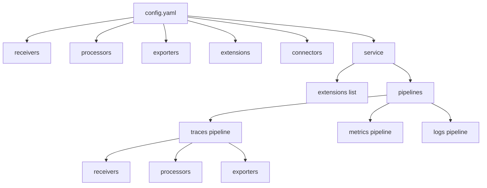

# How to Troubleshoot Configuration YAML Errors in the OpenTelemetry Collector

Author: [nawazdhandala](https://www.github.com/nawazdhandala)

Tags: OpenTelemetry, Collector, Configuration, YAML, Troubleshooting, Validation

Description: Diagnose and fix YAML configuration errors in OpenTelemetry Collector including syntax issues, validation failures, and structural problems.

Configuration errors are the most common cause of OpenTelemetry Collector startup failures. YAML syntax issues, missing required fields, invalid values, and structural problems can prevent the collector from starting or cause runtime failures. This guide provides systematic approaches to identify, diagnose, and fix configuration errors.

## Understanding Collector Configuration Structure

The OpenTelemetry Collector configuration has a specific structure that must be followed:



Required top-level sections:

- `receivers`: Define how data enters the collector
- `exporters`: Define where data is sent
- `service`: Configure pipelines that connect receivers to exporters
- `processors` (optional): Transform data between receivers and exporters
- `extensions` (optional): Add capabilities like health checks
- `connectors` (optional): Connect pipelines together

## Common YAML Syntax Errors

### Error 1: Incorrect Indentation

YAML is whitespace-sensitive. Indentation must be consistent and use spaces (not tabs).

**Incorrect:**

```yaml
receivers:
  otlp:
  protocols:  # Wrong: should be indented under otlp
    grpc:
      endpoint: 0.0.0.0:4317
```

**Correct:**

```yaml
receivers:
  otlp:
    protocols:  # Correct: indented 2 spaces under otlp
      grpc:
        endpoint: 0.0.0.0:4317
```

**Error message:**

```
Error: yaml: line 3: mapping values are not allowed in this context
```

**How to fix:**

```bash
# Check for tab characters (should be spaces)
cat -A config.yaml | grep "^I"

# Use yamllint to check formatting
yamllint config.yaml

# Common yamllint errors:
# - "wrong indentation: expected X but found Y"
# - "too many spaces inside brackets"
# - "missing starting space in comment"
```

### Error 2: Missing Colons

Every key must be followed by a colon.

**Incorrect:**

```yaml
receivers
  otlp:  # Missing colon after 'receivers'
    protocols:
      grpc:
        endpoint: 0.0.0.0:4317
```

**Correct:**

```yaml
receivers:  # Colon added
  otlp:
    protocols:
      grpc:
        endpoint: 0.0.0.0:4317
```

### Error 3: Incorrect Quotes

Quotes are needed for values containing special characters, but must be used correctly.

**Incorrect:**

```yaml
exporters:
  otlp:
    # Unmatched quotes
    endpoint: "backend:4317
```

**Correct:**

```yaml
exporters:
  otlp:
    # Properly quoted
    endpoint: "backend:4317"
    # Or without quotes (no special chars)
    endpoint: backend:4317
```

### Error 4: Invalid List Syntax

Lists in YAML use hyphens with proper indentation.

**Incorrect:**

```yaml
service:
  pipelines:
    traces:
      receivers: otlp  # Should be a list
      exporters: logging
```

**Correct:**

```yaml
service:
  pipelines:
    traces:
      # Method 1: Flow style (inline list)
      receivers: [otlp]
      exporters: [logging]

      # Method 2: Block style (multi-line list)
      receivers:
        - otlp
      exporters:
        - logging
```

## Using the Configuration Validator

The collector includes a built-in validation command:

```bash
# Validate configuration before starting
otelcol-contrib validate --config config.yaml

# Expected output for valid config:
# Config validation successful

# Expected output for invalid config:
# Error: failed to load config: ...
```

Validation catches common errors:

```bash
# Example validation errors:

# Missing required fields:
# Error: receiver "otlp" not found in config

# Invalid values:
# Error: timeout: invalid duration "-1s"

# Type mismatches:
# Error: cannot unmarshal string into Go value of type int

# Undefined references:
# Error: service references exporter "undefined" which is not configured
```

## Common Configuration Errors

### Error 1: Component Not Defined

Referencing a component that isn't configured.

**Error message:**

```
Error: service references receiver "otlp" which is not configured
Error: service references processor "batch" which is not configured
```

**Diagnosis:**

```yaml
# Problem: processor 'batch' referenced but not defined
service:
  pipelines:
    traces:
      receivers: [otlp]
      processors: [batch]  # batch is not defined above
      exporters: [logging]
```

**Solution:**

```yaml
# Add the missing component definition
receivers:
  otlp:
    protocols:
      grpc:
        endpoint: 0.0.0.0:4317

processors:
  # Define batch processor
  batch:
    timeout: 1s
    send_batch_size: 1024

exporters:
  logging:
    verbosity: detailed

service:
  pipelines:
    traces:
      receivers: [otlp]
      processors: [batch]  # Now properly defined
      exporters: [logging]
```

### Error 2: Missing Required Fields

Component configuration missing mandatory fields.

**Error message:**

```
Error: receiver "otlp": protocols: must have at least one protocol enabled
Error: exporter "otlp": endpoint must be specified
```

**Diagnosis:**

```yaml
# Problem: OTLP receiver has no protocols
receivers:
  otlp:  # Empty configuration - no protocols defined
```

**Solution:**

```yaml
# Add required fields
receivers:
  otlp:
    protocols:  # Required: at least one protocol
      grpc:
        endpoint: 0.0.0.0:4317

exporters:
  otlp:
    endpoint: backend:4317  # Required field
```

### Error 3: Invalid Type Values

Providing wrong data type for a field.

**Error message:**

```
Error: cannot unmarshal string into Go value of type int
Error: time: invalid duration "10"
Error: invalid boolean value "yes"
```

**Diagnosis:**

```yaml
# Problem: incorrect types
processors:
  batch:
    # Should be duration string (e.g., "10s"), not integer
    timeout: 10
    # Should be integer, not string
    send_batch_size: "1024"

exporters:
  otlp:
    tls:
      # Should be boolean, not string
      insecure: "false"
```

**Solution:**

```yaml
# Use correct types
processors:
  batch:
    # Duration needs units: s, ms, m, h
    timeout: 10s
    # Integer without quotes
    send_batch_size: 1024

exporters:
  otlp:
    tls:
      # Boolean without quotes
      insecure: false
```

**Common type requirements:**

```yaml
# Duration fields: must include units
timeout: 30s
check_interval: 1s
max_elapsed_time: 5m

# Size fields: must include units
limit_mib: 512
max_recv_msg_size_mib: 32

# Numeric fields: no quotes
send_batch_size: 1024
queue_size: 5000
num_consumers: 10

# Boolean fields: no quotes
enabled: true
insecure: false
development: true

# String fields: quotes optional unless special chars
endpoint: backend:4317
endpoint: "backend:4317"  # Both valid
```

### Error 4: Pipeline Component Order

Certain processors must be in specific positions in the pipeline.

**Error message:**

```
Warning: memory_limiter processor should be first in pipeline
Error: batch processor should come after memory_limiter
```

**Diagnosis:**

```yaml
# Problem: incorrect processor order
service:
  pipelines:
    traces:
      receivers: [otlp]
      # Wrong order: batch before memory_limiter
      processors: [batch, memory_limiter]
      exporters: [otlp]
```

**Solution:**

```yaml
# Correct processor order
service:
  pipelines:
    traces:
      receivers: [otlp]
      # Correct order: memory_limiter first, batch last
      processors: [memory_limiter, attributes, batch]
      exporters: [otlp]
```

**Recommended processor order:**

1. `memory_limiter` (first - protects against OOM)
2. Filtering processors (`filter`, `routing`)
3. Transformation processors (`attributes`, `resource`, `transform`)
4. Sampling processors (`probabilistic_sampler`, `tail_sampling`)
5. `batch` (last - reduces export overhead)

### Error 5: Extension Not Registered

Using an extension without registering it in the service section.

**Error message:**

```
Error: failed to get extension: extension "health_check" not found
```

**Diagnosis:**

```yaml
# Problem: extension defined but not registered
extensions:
  health_check:
    endpoint: 0.0.0.0:13133

service:
  # health_check not listed here
  pipelines:
    traces:
      receivers: [otlp]
      exporters: [logging]
```

**Solution:**

```yaml
# Register extension in service section
extensions:
  health_check:
    endpoint: 0.0.0.0:13133

  file_storage:
    directory: /var/lib/otelcol/queue

service:
  # Register all extensions here
  extensions: [health_check, file_storage]

  pipelines:
    traces:
      receivers: [otlp]
      exporters: [logging]
```

### Error 6: Duplicate Component Names

Using the same component name multiple times.

**Error message:**

```
Error: duplicate receiver name: otlp
```

**Diagnosis:**

```yaml
# Problem: otlp defined twice
receivers:
  otlp:
    protocols:
      grpc:
        endpoint: 0.0.0.0:4317

  # Duplicate name
  otlp:
    protocols:
      http:
        endpoint: 0.0.0.0:4318
```

**Solution:**

```yaml
# Use unique names with / separator
receivers:
  # Both protocols in one receiver
  otlp:
    protocols:
      grpc:
        endpoint: 0.0.0.0:4317
      http:
        endpoint: 0.0.0.0:4318

  # OR use name variants
  otlp/grpc:
    protocols:
      grpc:
        endpoint: 0.0.0.0:4317

  otlp/http:
    protocols:
      http:
        endpoint: 0.0.0.0:4318
```

## Debugging Configuration Issues

### Method 1: Start with Minimal Configuration

Begin with the simplest possible configuration and add complexity incrementally.

```yaml
# minimal-config.yaml - Simplest working configuration
receivers:
  otlp:
    protocols:
      grpc:
        endpoint: 0.0.0.0:4317

exporters:
  logging:
    verbosity: detailed

service:
  pipelines:
    traces:
      receivers: [otlp]
      exporters: [logging]
```

Test the minimal configuration:

```bash
# Start with minimal config
otelcol-contrib --config minimal-config.yaml

# If it works, gradually add components:
# 1. Add batch processor
# 2. Add memory_limiter
# 3. Add real exporter
# 4. Add extensions
# 5. Add complex processors
```

### Method 2: Use Configuration Diff

Compare working and broken configurations to identify issues.

```bash
# Compare configurations
diff working-config.yaml broken-config.yaml

# Look for differences in:
# - Indentation
# - Component names
# - Field values
# - Pipeline definitions
```

### Method 3: Enable Debug Logging

Run collector with debug logging to see detailed configuration parsing.

```yaml
# Add to your config
service:
  telemetry:
    logs:
      level: debug
```

```bash
# Run with debug output
otelcol-contrib --config config.yaml 2>&1 | tee collector-debug.log

# Check log for configuration parsing errors
grep -i "config\|error\|fail" collector-debug.log
```

### Method 4: Check for Invisible Characters

Hidden characters can cause parsing errors.

```bash
# Check for non-printable characters
cat -A config.yaml

# Look for:
# ^I - tab characters (should use spaces)
# ^M - Windows line endings (should use Unix)
# Strange unicode characters

# Convert line endings
dos2unix config.yaml

# Replace tabs with spaces
expand -t 2 config.yaml > config-fixed.yaml
```

## Configuration Testing Script

Automate configuration validation:

```bash
#!/bin/bash
# validate-config.sh - Comprehensive config validation

CONFIG_FILE="${1:-config.yaml}"

echo "OpenTelemetry Collector Configuration Validator"
echo "==============================================="

# 1. Check file exists
echo "[1/7] Checking if config file exists..."
if [ -f "$CONFIG_FILE" ]; then
    echo "✓ File found: $CONFIG_FILE"
else
    echo "✗ File not found: $CONFIG_FILE"
    exit 1
fi

# 2. Check YAML syntax
echo "[2/7] Validating YAML syntax..."
if python3 -c "import yaml; yaml.safe_load(open('$CONFIG_FILE'))" 2>/dev/null; then
    echo "✓ YAML syntax is valid"
else
    echo "✗ YAML syntax error:"
    python3 -c "import yaml; yaml.safe_load(open('$CONFIG_FILE'))" 2>&1
    exit 1
fi

# 3. Check for tabs
echo "[3/7] Checking for tab characters..."
if grep -q $'\t' "$CONFIG_FILE"; then
    echo "✗ Tab characters found (use spaces instead):"
    grep -n $'\t' "$CONFIG_FILE" | head -5
else
    echo "✓ No tab characters found"
fi

# 4. Check required sections
echo "[4/7] Checking required sections..."
for section in "receivers" "exporters" "service"; do
    if grep -q "^$section:" "$CONFIG_FILE"; then
        echo "✓ Section '$section' found"
    else
        echo "✗ Required section '$section' missing"
    fi
done

# 5. Check pipeline definitions
echo "[5/7] Checking pipeline definitions..."
if grep -q "pipelines:" "$CONFIG_FILE"; then
    echo "✓ Pipelines section found"

    # Check each pipeline has required components
    for signal in "traces" "metrics" "logs"; do
        if grep -A 5 "$signal:" "$CONFIG_FILE" | grep -q "receivers:"; then
            echo "  ✓ $signal pipeline has receivers"
        fi
        if grep -A 5 "$signal:" "$CONFIG_FILE" | grep -q "exporters:"; then
            echo "  ✓ $signal pipeline has exporters"
        fi
    done
else
    echo "✗ No pipelines defined"
fi

# 6. Check for common mistakes
echo "[6/7] Checking for common mistakes..."

# Check memory_limiter position
if grep -A 20 "processors:" "$CONFIG_FILE" | grep -B 5 "memory_limiter" | grep -q "batch"; then
    echo "⚠ Warning: batch processor may come before memory_limiter"
fi

# Check for quoted booleans
if grep -E "(insecure|enabled|development): \"(true|false)\"" "$CONFIG_FILE"; then
    echo "⚠ Warning: Boolean values should not be quoted"
fi

# Check for timeout without units
if grep -E "timeout: [0-9]+$" "$CONFIG_FILE"; then
    echo "⚠ Warning: Timeout values should include units (s, ms, m)"
fi

# 7. Validate with collector
echo "[7/7] Validating with OpenTelemetry Collector..."
if command -v otelcol-contrib >/dev/null 2>&1; then
    if otelcol-contrib validate --config "$CONFIG_FILE" 2>&1; then
        echo "✓ Configuration is valid"
    else
        echo "✗ Collector validation failed"
        exit 1
    fi
else
    echo "⚠ otelcol-contrib not found, skipping collector validation"
fi

echo ""
echo "Validation complete!"
```

Make executable and run:

```bash
chmod +x validate-config.sh
./validate-config.sh config.yaml
```

## Using Environment Variables

Configuration can reference environment variables to avoid hardcoding values.

```yaml
# config.yaml - Using environment variables
exporters:
  otlp:
    # Reference environment variable
    endpoint: ${BACKEND_ENDPOINT}
    # Provide default value if not set
    endpoint: ${BACKEND_ENDPOINT:-backend:4317}
    headers:
      # Secure way to pass credentials
      authorization: "Bearer ${API_TOKEN}"

receivers:
  otlp:
    protocols:
      grpc:
        endpoint: ${OTLP_GRPC_ENDPOINT:-0.0.0.0:4317}

service:
  telemetry:
    logs:
      # Control log level via environment
      level: ${LOG_LEVEL:-info}
```

Set variables before starting:

```bash
# Export environment variables
export BACKEND_ENDPOINT="backend.example.com:4317"
export API_TOKEN="your-secret-token"
export OTLP_GRPC_ENDPOINT="0.0.0.0:4317"
export LOG_LEVEL="debug"

# Start collector
otelcol-contrib --config config.yaml

# Or inline
BACKEND_ENDPOINT=backend:4317 otelcol-contrib --config config.yaml
```

In Kubernetes:

```yaml
# deployment.yaml - Environment variables in Kubernetes
apiVersion: apps/v1
kind: Deployment
metadata:
  name: otel-collector
spec:
  template:
    spec:
      containers:
      - name: otel-collector
        image: otel/opentelemetry-collector-contrib:0.93.0
        env:
        # From literal values
        - name: BACKEND_ENDPOINT
          value: "backend.observability.svc.cluster.local:4317"

        # From ConfigMap
        - name: LOG_LEVEL
          valueFrom:
            configMapKeyRef:
              name: otel-config
              key: log_level

        # From Secret
        - name: API_TOKEN
          valueFrom:
            secretKeyRef:
              name: otel-secrets
              key: api-token
```

## Configuration Best Practices

Follow these practices to avoid common errors:

### 1. Use Consistent Formatting

```yaml
# Good: Consistent 2-space indentation
receivers:
  otlp:
    protocols:
      grpc:
        endpoint: 0.0.0.0:4317

# Bad: Mixed indentation
receivers:
  otlp:
   protocols:  # 1 space
      grpc:   # 2 spaces
          endpoint: 0.0.0.0:4317  # 4 spaces
```

### 2. Add Comments for Clarity

```yaml
# config.yaml - Well-commented configuration
receivers:
  otlp:
    protocols:
      # gRPC receiver for OTLP protocol
      # Used by applications sending telemetry via gRPC
      grpc:
        endpoint: 0.0.0.0:4317
        # Increase for large payloads (default: 4MB)
        max_recv_msg_size_mib: 32

processors:
  # Memory limiter prevents OOM kills
  # MUST be first processor in pipeline
  memory_limiter:
    check_interval: 1s
    # Set to 80% of container memory limit
    limit_mib: 1536
```

### 3. Use Meaningful Component Names

```yaml
# Good: Descriptive names
receivers:
  otlp/applications:
    protocols:
      grpc:
        endpoint: 0.0.0.0:4317

  otlp/infrastructure:
    protocols:
      grpc:
        endpoint: 0.0.0.0:4318

exporters:
  otlp/production:
    endpoint: prod-backend:4317

  otlp/staging:
    endpoint: staging-backend:4317

# Bad: Unclear names
receivers:
  otlp/1:
    protocols:
      grpc:
        endpoint: 0.0.0.0:4317
```

### 4. Organize Configuration Logically

```yaml
# Recommended order for readability:

# 1. Extensions (optional capabilities)
extensions:
  health_check:
    endpoint: 0.0.0.0:13133

# 2. Receivers (data inputs)
receivers:
  otlp:
    protocols:
      grpc:
        endpoint: 0.0.0.0:4317

# 3. Processors (data transformation)
processors:
  memory_limiter:
    limit_mib: 512
  batch:
    timeout: 1s

# 4. Exporters (data outputs)
exporters:
  otlp:
    endpoint: backend:4317

# 5. Service (pipeline configuration)
service:
  extensions: [health_check]
  pipelines:
    traces:
      receivers: [otlp]
      processors: [memory_limiter, batch]
      exporters: [otlp]
```

### 5. Version Control Your Configurations

```bash
# Initialize git repository
git init

# Add .gitignore for sensitive files
cat > .gitignore << EOF
# Ignore files with secrets
*-secret.yaml
credentials.yaml

# Ignore runtime data
/data/
*.log
EOF

# Commit configuration
git add config.yaml
git commit -m "Initial collector configuration"

# Use branches for environments
git checkout -b production
git checkout -b staging
```

## Tools for Configuration Management

### 1. YAML Linters

```bash
# Install yamllint
pip install yamllint

# Create .yamllint config
cat > .yamllint << EOF
rules:
  line-length:
    max: 120
  indentation:
    spaces: 2
  comments:
    min-spaces-from-content: 2
EOF

# Run linter
yamllint config.yaml
```

### 2. Schema Validation

```bash
# Install yq for YAML processing
brew install yq  # macOS
apt-get install yq  # Ubuntu

# Query configuration
yq '.receivers.otlp.protocols.grpc.endpoint' config.yaml

# Validate structure
yq '.service.pipelines.traces.receivers[]' config.yaml
```

### 3. Configuration Templates

Use templates for consistent configurations:

```yaml
# template.yaml - Base configuration template
receivers:
  otlp:
    protocols:
      grpc:
        endpoint: ${GRPC_ENDPOINT}

exporters:
  otlp:
    endpoint: ${BACKEND_ENDPOINT}
    headers:
      authorization: "Bearer ${API_TOKEN}"

service:
  pipelines:
    traces:
      receivers: [otlp]
      processors: [batch]
      exporters: [otlp]
```

Generate environment-specific configs:

```bash
# Generate production config
GRPC_ENDPOINT="0.0.0.0:4317" \
BACKEND_ENDPOINT="prod-backend:4317" \
API_TOKEN="prod-token" \
envsubst < template.yaml > prod-config.yaml

# Generate staging config
GRPC_ENDPOINT="0.0.0.0:4317" \
BACKEND_ENDPOINT="staging-backend:4317" \
API_TOKEN="staging-token" \
envsubst < template.yaml > staging-config.yaml
```

## Conclusion

Configuration errors are preventable through systematic validation, proper YAML formatting, and following OpenTelemetry Collector configuration requirements. Use the built-in validator, start with minimal configurations, add complexity incrementally, and leverage configuration management tools to maintain reliable collector deployments. Always validate configuration changes before deploying to production.

For more troubleshooting guides, see related posts:
- https://oneuptime.com/blog/post/troubleshoot-collector-not-receiving-data/view
- https://oneuptime.com/blog/post/troubleshoot-collector-not-exporting-data/view
- https://oneuptime.com/blog/post/right-size-cpu-memory-opentelemetry-collector/view
