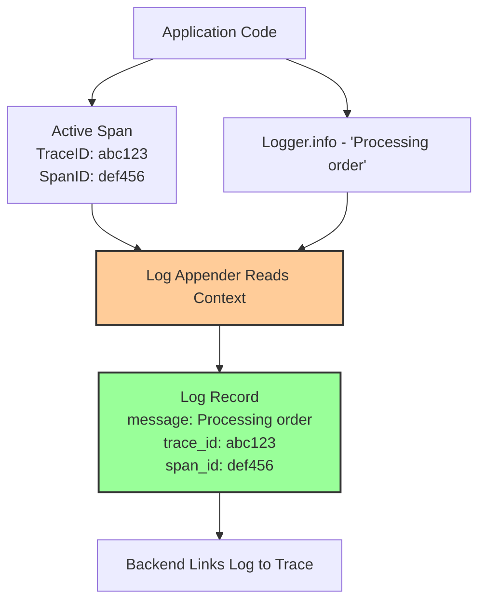

# How to Troubleshoot Log Correlation Failures Between Traces and Logs

Author: [nawazdhandala](https://www.github.com/nawazdhandala)

Tags: OpenTelemetry, Logging, Tracing, Correlation, Troubleshooting, Observability, Context

Description: Fix broken log-trace correlation in OpenTelemetry by diagnosing missing trace IDs in logs, misconfigured appenders, and context propagation gaps.

---

One of the biggest promises of OpenTelemetry is unified observability. You should be able to click on a trace and see the logs that were emitted during that trace, or search your logs by trace ID and jump directly to the trace view. When this works, debugging production issues becomes dramatically faster.

When it does not work, you end up staring at logs with no trace ID, or traces with no associated logs, and you are back to manually correlating timestamps. This guide covers the most common reasons log-trace correlation breaks and how to fix each one.

## How Log-Trace Correlation Works

The correlation between logs and traces relies on a simple mechanism: when a log is emitted while a span is active, the log record gets tagged with the current trace ID and span ID. Your observability backend then uses these IDs to link logs and traces together.



The critical step is D: the log appender or bridge must read the current OpenTelemetry context and inject the trace ID and span ID into the log record. If this step fails, the log has no trace context and correlation is impossible.

## Problem 1: Missing OpenTelemetry Log Appender

The most common cause of broken correlation is that the logging framework has not been configured to read OpenTelemetry context. The standard logging libraries (Logback, Log4j2, Python logging, etc.) do not know about OpenTelemetry by default. You need to add a bridge or appender.

### Java with Logback

```xml
<!-- logback.xml -->
<!-- Add the OpenTelemetry Logback appender to inject trace context into logs -->
<configuration>
    <!-- OpenTelemetry appender that reads trace context and adds it to MDC -->
    <appender name="OTEL" class="io.opentelemetry.instrumentation.logback.appender.v1_0.OpenTelemetryAppender">
        <!-- Capture MDC properties as log attributes -->
        <captureMdcAttributes>*</captureMdcAttributes>
    </appender>

    <!-- Standard console appender with trace context in the pattern -->
    <appender name="CONSOLE" class="ch.qos.logback.core.ConsoleAppender">
        <encoder>
            <!-- Include trace_id and span_id from MDC in log output -->
            <!-- These fields are populated by the OTel appender -->
            <pattern>%d{HH:mm:ss.SSS} [%thread] %-5level %logger{36} trace_id=%X{trace_id} span_id=%X{span_id} - %msg%n</pattern>
        </encoder>
    </appender>

    <root level="INFO">
        <!-- Both appenders must be active -->
        <!-- OTEL sends logs to the collector, CONSOLE prints them locally -->
        <appender-ref ref="OTEL" />
        <appender-ref ref="CONSOLE" />
    </root>
</configuration>
```

You also need the dependency in your build file:

```groovy
// build.gradle
// The logback appender bridges Logback logs to OpenTelemetry
dependencies {
    implementation 'io.opentelemetry.instrumentation:opentelemetry-logback-appender-1.0:2.2.0-alpha'
}
```

If you are using the OpenTelemetry Java agent, the Logback instrumentation is included automatically. But you still need the log pattern to include trace_id and span_id if you want correlation in your plain text logs.

### Python with the logging module

```python
# logging_setup.py
# Configure Python logging to include OpenTelemetry trace context
import logging
from opentelemetry.instrumentation.logging import LoggingInstrumentor

# This instrumentor patches the Python logging module to inject
# trace_id, span_id, and trace_flags into every log record
LoggingInstrumentor().instrument(set_logging_format=True)

# The default format after instrumentation includes trace context:
# %(asctime)s %(levelname)s [%(name)s] [trace_id=%(otelTraceID)s
#   span_id=%(otelSpanID)s] - %(message)s

# You can also set a custom format that includes the OTel fields
logging.basicConfig(
    level=logging.INFO,
    format='%(asctime)s %(levelname)s [trace_id=%(otelTraceID)s span_id=%(otelSpanID)s] %(message)s'
)
```

```python
# If you want to send logs to the collector via OTLP, add the log exporter
from opentelemetry.sdk._logs import LoggerProvider
from opentelemetry.sdk._logs.export import BatchLogRecordProcessor
from opentelemetry.exporter.otlp.proto.grpc._log_exporter import OTLPLogExporter
from opentelemetry._logs import set_logger_provider

# Configure the OTLP log exporter
logger_provider = LoggerProvider()
logger_provider.add_log_record_processor(
    BatchLogRecordProcessor(
        OTLPLogExporter(endpoint="http://otel-collector:4317")
    )
)
set_logger_provider(logger_provider)
```

### Node.js with Winston or Pino

```javascript
// logger.js
// Configure Winston to include OpenTelemetry trace context
const winston = require('winston');
const { trace } = require('@opentelemetry/api');

// Custom format that injects trace context into every log entry
const otelFormat = winston.format((info) => {
    // Get the active span from the current context
    const activeSpan = trace.getActiveSpan();
    if (activeSpan) {
        const ctx = activeSpan.spanContext();
        // Add trace_id and span_id to the log entry
        info.trace_id = ctx.traceId;
        info.span_id = ctx.spanId;
        info.trace_flags = ctx.traceFlags.toString(16).padStart(2, '0');
    }
    return info;
});

const logger = winston.createLogger({
    level: 'info',
    format: winston.format.combine(
        otelFormat(),
        winston.format.timestamp(),
        winston.format.json()
    ),
    transports: [
        new winston.transports.Console(),
    ],
});

module.exports = logger;
```

## Problem 2: Logs Emitted Outside of an Active Span

Even with the correct appender configured, logs emitted when no span is active will have empty trace context. This is not a bug. It is a timing issue.

Common scenarios where this happens:

```java
// LogTimingIssue.java
// Demonstrates logs emitted outside of span scope
public class OrderService {

    private static final Logger log = LoggerFactory.getLogger(OrderService.class);

    public void processOrder(OrderRequest request) {
        // BAD: This log is emitted BEFORE the span starts
        // It will have no trace_id
        log.info("Received order request: {}", request.getId());

        Span span = tracer.spanBuilder("processOrder").startSpan();
        try (Scope scope = span.makeCurrent()) {
            // GOOD: This log is emitted INSIDE the span scope
            // It will have trace_id and span_id
            log.info("Processing order: {}", request.getId());

            Order result = createOrder(request);
            log.info("Order created: {}", result.getId());
        } finally {
            span.end();
        }

        // BAD: This log is emitted AFTER the span ends
        // It will have no trace_id
        log.info("Order processing complete for: {}", request.getId());
    }
}
```

The fix is to make sure important logs are emitted within the scope of a span:

```java
// FixedLogTiming.java
// Ensure all relevant logs are within span scope
public class OrderService {

    private static final Logger log = LoggerFactory.getLogger(OrderService.class);

    public void processOrder(OrderRequest request) {
        // Start the span BEFORE any logging
        Span span = tracer.spanBuilder("processOrder")
                .setAttribute("order.id", request.getId())
                .startSpan();

        try (Scope scope = span.makeCurrent()) {
            // All logs within this try block will have trace context
            log.info("Received order request: {}", request.getId());
            Order result = createOrder(request);
            log.info("Order created: {}", result.getId());
            log.info("Order processing complete for: {}", request.getId());
        } catch (Exception e) {
            // Exception logs also get trace context
            log.error("Failed to process order: {}", request.getId(), e);
            span.recordException(e);
            throw e;
        } finally {
            span.end();
        }
    }
}
```

## Problem 3: Collector Pipeline Not Connecting Logs and Traces

Even if your application correctly attaches trace context to logs, the collector pipeline must be configured to handle both logs and traces and preserve the correlation fields.

```yaml
# collector-config.yaml
# BAD: Logs pipeline that strips trace context
receivers:
  otlp:
    protocols:
      grpc:
        endpoint: 0.0.0.0:4317

processors:
  # This transform accidentally removes trace context from logs
  transform/logs:
    log_statements:
      - context: log
        statements:
          # Removing all resource attributes might strip service.name
          # which breaks correlation in the backend
          - delete_key(resource.attributes, "service.name")

  batch:
    timeout: 10s

exporters:
  otlp:
    endpoint: backend.example.com:4317

service:
  pipelines:
    traces:
      receivers: [otlp]
      processors: [batch]
      exporters: [otlp]
    logs:
      receivers: [otlp]
      processors: [transform/logs, batch]
      exporters: [otlp]
```

```yaml
# collector-config.yaml
# GOOD: Logs pipeline that preserves trace context
receivers:
  otlp:
    protocols:
      grpc:
        endpoint: 0.0.0.0:4317

processors:
  batch:
    timeout: 10s

  # If you need to transform logs, make sure trace context fields
  # (trace_id, span_id) are not modified
  transform/logs:
    log_statements:
      - context: log
        statements:
          # Add attributes but do not touch trace context
          - set(attributes["environment"], "production")

exporters:
  otlp:
    endpoint: backend.example.com:4317

service:
  pipelines:
    # Both pipelines go to the same backend
    # The backend uses trace_id to link them
    traces:
      receivers: [otlp]
      processors: [batch]
      exporters: [otlp]
    logs:
      receivers: [otlp]
      processors: [transform/logs, batch]
      exporters: [otlp]
```

## Problem 4: File-Based Log Collection Missing Trace Context

If you collect logs from files (using Fluent Bit, Fluentd, or the collector's filelog receiver), the logs need to contain trace IDs in a parseable format. The filelog receiver does not magically add trace context. It can only extract what is already in the log text.

```yaml
# collector-config.yaml
# Parse trace context from structured JSON logs
receivers:
  filelog:
    include:
      - /var/log/app/*.log
    operators:
      # Parse JSON log lines
      - type: json_parser
        timestamp:
          parse_from: attributes.timestamp
          layout: '%Y-%m-%dT%H:%M:%S.%LZ'

      # Extract trace_id and span_id from parsed JSON fields
      # and set them as the log record's trace context
      - type: trace_parser
        trace_id:
          parse_from: attributes.trace_id
        span_id:
          parse_from: attributes.span_id
        trace_flags:
          parse_from: attributes.trace_flags

processors:
  batch:
    timeout: 10s

exporters:
  otlp:
    endpoint: backend.example.com:4317

service:
  pipelines:
    logs:
      receivers: [filelog]
      processors: [batch]
      exporters: [otlp]
```

For this to work, your application logs must include trace_id and span_id in a consistent format. Here is an example of a JSON log line that the above config can parse:

```json
{
  "timestamp": "2026-02-06T10:30:45.123Z",
  "level": "INFO",
  "message": "Processing order 12345",
  "trace_id": "a1b2c3d4e5f6a1b2c3d4e5f6a1b2c3d4",
  "span_id": "1a2b3c4d5e6f7a8b",
  "trace_flags": "01",
  "service": "order-service"
}
```

If your logs are in a plain text format instead, use a regex parser:

```yaml
# Parse trace context from plain text logs
receivers:
  filelog:
    include:
      - /var/log/app/*.log
    operators:
      # Parse structured fields from log lines like:
      # 2026-02-06 10:30:45 INFO [trace_id=abc123 span_id=def456] Processing order
      - type: regex_parser
        regex: '(?P<timestamp>\d{4}-\d{2}-\d{2} \d{2}:\d{2}:\d{2}) (?P<level>\w+) \[trace_id=(?P<trace_id>[a-f0-9]+) span_id=(?P<span_id>[a-f0-9]+)\] (?P<message>.*)'
        timestamp:
          parse_from: attributes.timestamp
          layout: '%Y-%m-%d %H:%M:%S'

      # Move parsed trace fields to the log record's trace context
      - type: trace_parser
        trace_id:
          parse_from: attributes.trace_id
        span_id:
          parse_from: attributes.span_id
```

## Problem 5: Different Backends for Logs and Traces

If your logs go to one backend (like Elasticsearch) and traces go to another (like Jaeger), correlation depends on both backends having the trace ID indexed and a frontend that can query both.

```yaml
# collector-config.yaml
# Logs and traces going to different backends
# Correlation still works as long as both backends index trace_id
exporters:
  # Traces go to an OTLP-compatible trace backend
  otlp/traces:
    endpoint: jaeger.example.com:4317

  # Logs go to Elasticsearch
  elasticsearch:
    endpoints: ["https://elasticsearch.example.com:9200"]
    logs_index: "app-logs"

service:
  pipelines:
    traces:
      receivers: [otlp]
      processors: [batch]
      exporters: [otlp/traces]
    logs:
      receivers: [otlp]
      processors: [batch]
      exporters: [elasticsearch]
```

For this to work, the Elasticsearch exporter must preserve the trace_id field. Verify by querying Elasticsearch directly:

```bash
# Check that logs in Elasticsearch contain trace_id
# This query searches for logs with a non-empty TraceId field
curl -s "http://elasticsearch:9200/app-logs/_search" \
     -H "Content-Type: application/json" \
     -d '{
       "query": {
         "exists": { "field": "TraceId" }
       },
       "size": 1
     }' | python3 -m json.tool
```

If TraceId is missing from the Elasticsearch documents, the exporter or a processor is dropping the field.

## Debugging Checklist

When log-trace correlation is not working, walk through these checks in order:

1. **Is the log appender/bridge installed and configured?** Check your logging framework config for the OpenTelemetry integration.

2. **Are logs being emitted within active span scope?** Add debug logging to verify that `Span.current()` returns a valid span at the point where logs are emitted.

3. **Do raw log records contain trace_id?** Check the collector's debug exporter output to see if logs arriving at the collector have trace context.

4. **Is the collector preserving trace context?** Make sure no processor is stripping or modifying trace_id/span_id fields.

5. **Does the backend index trace_id?** Query the backend directly to verify trace IDs are stored and queryable.

```bash
# Quick verification script
# Add a debug exporter to see exactly what the collector receives
# Look for TraceId and SpanId in the log output

# In collector config, add debug exporter to the logs pipeline:
# exporters:
#   debug:
#     verbosity: detailed
# service:
#   pipelines:
#     logs:
#       exporters: [debug, otlp]
```

The most reliable approach is to send both logs and traces through the same collector pipeline to the same OTLP-compatible backend. This minimizes the number of places where correlation can break. If you need to use separate backends, make sure you verify the trace_id field exists at each step of the pipeline from application to backend query.
