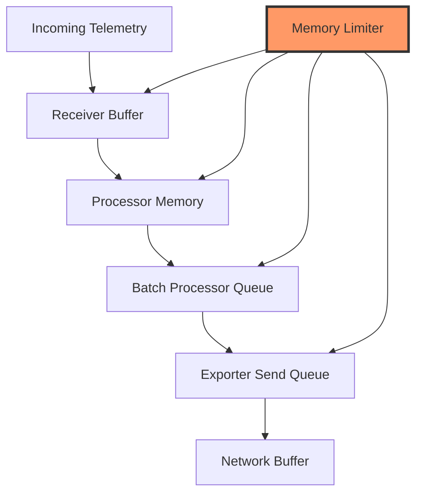

# How to Troubleshoot Memory Issues and OOM Kills in the Collector

Author: [nawazdhandala](https://www.github.com/nawazdhandala)

Tags: OpenTelemetry, Collector, Memory, OOM, Performance, Troubleshooting, Resource Management

Description: Comprehensive guide to diagnosing and resolving memory issues and out-of-memory kills in OpenTelemetry Collector deployments with practical solutions.

Memory management is critical for stable OpenTelemetry Collector deployments. Out-of-memory (OOM) kills are among the most common production issues, often occurring during traffic spikes or configuration changes. Understanding how the collector uses memory and implementing proper safeguards prevents service disruptions and data loss.

## Understanding Collector Memory Usage

The OpenTelemetry Collector uses memory across several components. Receivers buffer incoming telemetry data, processors hold data during transformation, and exporters queue data for transmission. Each pipeline maintains separate buffers, and memory usage scales with data volume and pipeline complexity.

Memory consumption patterns differ by signal type. Traces typically consume more memory than metrics due to larger payloads and attribute counts. Logs can vary significantly based on message size and volume.

## Memory Architecture Overview

Understanding how memory flows through the collector helps identify bottlenecks:



The memory limiter processor monitors total collector memory usage and applies backpressure when limits are approached. Properly configured, it prevents OOM kills by refusing new data before memory exhaustion.

## Identifying Memory Issues

Before implementing solutions, identify the symptoms and causes of memory problems. Common indicators include:

**Gradual memory growth**: Memory usage steadily increases over time, indicating a memory leak or insufficient garbage collection.

**Sudden spikes**: Memory jumps during specific events like traffic bursts or large payload arrivals.

**Recurring OOM kills**: The collector repeatedly crashes with out-of-memory errors.

**High memory but low throughput**: Memory usage remains high even with moderate traffic, suggesting inefficient processing.

Check collector logs for memory-related messages:

```bash
# Search for OOM-related log entries
kubectl logs -n observability otel-collector-<pod-id> | grep -i "memory\|oom\|killed"

# For Docker deployments
docker logs otel-collector | grep -i "memory\|oom\|killed"
```

## Implementing the Memory Limiter Processor

The memory limiter processor is your first line of defense against OOM kills. It monitors memory usage and applies backpressure when configurable thresholds are exceeded:

```yaml
# Memory limiter configuration with recommended settings
processors:
  memory_limiter:
    # Check memory usage every second
    check_interval: 1s

    # Hard limit at 80% of available memory
    # When this is exceeded, the collector forces garbage collection
    # and refuses new data
    limit_mib: 1536

    # Soft limit at 70% of available memory
    # When exceeded, the collector begins refusing data
    # This prevents reaching the hard limit
    spike_limit_mib: 512

receivers:
  otlp:
    protocols:
      grpc:
        endpoint: 0.0.0.0:4317
      http:
        endpoint: 0.0.0.0:4318

exporters:
  otlp:
    endpoint: backend.example.com:4317

service:
  pipelines:
    traces:
      # Memory limiter MUST be the first processor
      receivers: [otlp]
      processors: [memory_limiter, batch]
      exporters: [otlp]
```

The memory limiter must appear first in the processor list. This ensures it can apply backpressure before other processors consume memory.

Calculate appropriate limits based on your deployment environment. For a container with 2GB memory allocation, set `limit_mib` to 1536 (75% of 2048MB) and `spike_limit_mib` to 512 (25% headroom).

## Configuring Memory Limits by Environment

Different deployment environments require different memory configurations:

**Kubernetes deployment with resource limits**:

```yaml
# Kubernetes deployment with memory configuration
apiVersion: apps/v1
kind: Deployment
metadata:
  name: otel-collector
spec:
  replicas: 3
  template:
    spec:
      containers:
      - name: otel-collector
        image: otel/opentelemetry-collector-contrib:latest
        resources:
          # Request guarantees these resources are available
          requests:
            memory: "2Gi"
            cpu: "1000m"
          # Limits define maximum allowed usage
          limits:
            memory: "4Gi"
            cpu: "2000m"
        env:
        - name: GOMEMLIMIT
          # Set Go memory limit to 90% of container limit
          # This helps garbage collector tune its behavior
          value: "3600MiB"
---
# ConfigMap with memory limiter configuration
apiVersion: v1
kind: ConfigMap
metadata:
  name: otel-collector-config
data:
  config.yaml: |
    processors:
      memory_limiter:
        check_interval: 1s
        # Set to 75% of container memory limit (4Gi)
        limit_mib: 3072
        # Allow 25% spike headroom
        spike_limit_mib: 1024

    receivers:
      otlp:
        protocols:
          grpc:
            endpoint: 0.0.0.0:4317

    exporters:
      otlp:
        endpoint: backend.example.com:4317

    service:
      pipelines:
        traces:
          receivers: [otlp]
          processors: [memory_limiter, batch]
          exporters: [otlp]
```

The `GOMEMLIMIT` environment variable tells the Go runtime to trigger garbage collection more aggressively as memory approaches the limit. This reduces the likelihood of OOM kills.

**Docker deployment**:

```yaml
# docker-compose.yml with memory configuration
version: '3.8'
services:
  otel-collector:
    image: otel/opentelemetry-collector-contrib:latest
    command: ["--config=/etc/otel-collector-config.yaml"]
    volumes:
      - ./otel-collector-config.yaml:/etc/otel-collector-config.yaml
    ports:
      - "4317:4317"
      - "4318:4318"
    environment:
      - GOMEMLIMIT=1800MiB
    # Docker memory limits
    mem_limit: 2g
    mem_reservation: 1g
    # Prevent OOM killer from terminating the container
    # Instead, processes inside will be killed if they exceed limits
    oom_kill_disable: false
```

## Optimizing Batch Processor Configuration

The batch processor accumulates telemetry data in memory before sending. Misconfigured batching can cause excessive memory consumption:

```yaml
processors:
  memory_limiter:
    check_interval: 1s
    limit_mib: 1536
    spike_limit_mib: 512

  # Optimized batch processor configuration
  batch:
    # Send batch after 10 seconds OR when size reaches limit
    # Whichever comes first
    timeout: 10s

    # Maximum batch size in number of spans/metrics/logs
    # Smaller batches use less memory but increase network overhead
    send_batch_size: 1024

    # Maximum batch size in bytes
    # This prevents a small number of large items from consuming excessive memory
    send_batch_max_size: 2048

receivers:
  otlp:
    protocols:
      grpc:
        endpoint: 0.0.0.0:4317

exporters:
  otlp:
    endpoint: backend.example.com:4317

service:
  pipelines:
    traces:
      receivers: [otlp]
      processors: [memory_limiter, batch]
      exporters: [otlp]
```

Tune batch processor parameters based on your traffic patterns. High-volume systems benefit from larger batches (reduced overhead), while memory-constrained deployments should use smaller batches.

## Managing Exporter Queue Size

Exporters maintain internal queues for retry logic and network buffering. Large queues consume significant memory during backend outages:

```yaml
exporters:
  # Optimized exporter configuration to limit memory usage
  otlp:
    endpoint: backend.example.com:4317

    # Timeout for send operations
    timeout: 30s

    # Retry configuration
    retry_on_failure:
      enabled: true
      # Initial backoff interval
      initial_interval: 5s
      # Maximum backoff interval
      max_interval: 30s
      # Maximum time to retry
      max_elapsed_time: 300s

    # Sending queue configuration
    sending_queue:
      enabled: true
      # Number of concurrent consumers
      # More consumers = faster sending but higher memory usage
      num_consumers: 10

      # Maximum queue size in number of batches
      # This is the critical parameter for memory management
      # Lower values reduce memory but may cause data loss during backend outages
      queue_size: 1000

processors:
  memory_limiter:
    check_interval: 1s
    limit_mib: 1536
    spike_limit_mib: 512

  batch:
    timeout: 10s
    send_batch_size: 1024

receivers:
  otlp:
    protocols:
      grpc:
        endpoint: 0.0.0.0:4317

service:
  pipelines:
    traces:
      receivers: [otlp]
      processors: [memory_limiter, batch]
      exporters: [otlp]
```

The `queue_size` parameter directly impacts memory usage. Each queued batch consumes memory proportional to its size. Calculate total queue memory as: `queue_size * send_batch_size * average_item_size`.

## Handling High-Cardinality Data

High-cardinality attributes in processors can cause memory explosion. The attributes processor and transform processor hold mappings in memory:

```yaml
processors:
  memory_limiter:
    check_interval: 1s
    limit_mib: 1536
    spike_limit_mib: 512

  # Attributes processor with cardinality control
  attributes:
    actions:
      # Delete high-cardinality attributes that aren't needed
      - key: http.url
        action: delete
      - key: request.id
        action: delete

      # Keep only essential attributes
      - key: http.method
        action: upsert
        from_attribute: http.method
      - key: http.status_code
        action: upsert
        from_attribute: http.status_code

  # Filter processor to drop unnecessary data
  filter:
    traces:
      span:
        # Drop health check spans that add volume without value
        - 'attributes["http.target"] == "/health"'
        - 'attributes["http.target"] == "/readiness"'
        - 'attributes["http.target"] == "/liveness"'

  batch:
    timeout: 10s
    send_batch_size: 1024

receivers:
  otlp:
    protocols:
      grpc:
        endpoint: 0.0.0.0:4317

exporters:
  otlp:
    endpoint: backend.example.com:4317

service:
  pipelines:
    traces:
      receivers: [otlp]
      processors: [memory_limiter, attributes, filter, batch]
      exporters: [otlp]
```

Removing unnecessary high-cardinality attributes reduces memory consumption and improves collector performance. Focus on attributes that provide actionable insights.

## Monitoring Collector Memory Usage

Implement monitoring to detect memory issues before they cause OOM kills:

```yaml
extensions:
  # Health check extension
  health_check:
    endpoint: 0.0.0.0:13133

  # pprof extension for memory profiling
  pprof:
    endpoint: 0.0.0.0:1777

  # zpages extension for live debugging
  zpages:
    endpoint: 0.0.0.0:55679

receivers:
  otlp:
    protocols:
      grpc:
        endpoint: 0.0.0.0:4317

  # Prometheus receiver to scrape collector's own metrics
  prometheus:
    config:
      scrape_configs:
        - job_name: 'otel-collector'
          scrape_interval: 10s
          static_configs:
            - targets: ['localhost:8888']

processors:
  memory_limiter:
    check_interval: 1s
    limit_mib: 1536
    spike_limit_mib: 512

  batch:
    timeout: 10s

exporters:
  # Export collector metrics to monitoring backend
  prometheusremotewrite:
    endpoint: http://prometheus.example.com:9090/api/v1/write

  otlp:
    endpoint: backend.example.com:4317

service:
  extensions: [health_check, pprof, zpages]

  pipelines:
    # Pipeline for application telemetry
    traces:
      receivers: [otlp]
      processors: [memory_limiter, batch]
      exporters: [otlp]

    # Pipeline for collector's own metrics
    metrics:
      receivers: [prometheus]
      processors: [batch]
      exporters: [prometheusremotewrite]

  telemetry:
    # Enable collector internal metrics
    metrics:
      level: detailed
      address: 0.0.0.0:8888
```

Key metrics to monitor for memory issues:

- `otelcol_process_memory_rss`: Resident set size (physical memory used)
- `otelcol_processor_refused_spans`: Spans refused by memory limiter
- `otelcol_exporter_queue_size`: Current queue size for exporters
- `otelcol_processor_batch_batch_size_trigger_send`: Batch sizes being sent

For detailed guidance on using pprof for memory profiling, see https://oneuptime.com/blog/post/2026-02-06-profile-collector-pprof-extension/view.

## Diagnosing Memory Leaks

If memory grows continuously despite proper configuration, investigate potential memory leaks:

```bash
# Enable pprof and capture heap profiles over time
# First profile
curl http://localhost:1777/debug/pprof/heap > heap_profile_1.pb.gz

# Wait 5 minutes during normal operation
sleep 300

# Second profile
curl http://localhost:1777/debug/pprof/heap > heap_profile_2.pb.gz

# Compare profiles to find growing allocations
go tool pprof -base heap_profile_1.pb.gz heap_profile_2.pb.gz

# In the pprof interactive prompt, use these commands:
# top - show functions allocating the most memory
# list <function_name> - show source code for a function
# web - generate a visual graph (requires graphviz)
```

Growing allocations in custom processors or specific components indicate memory leaks. Update to the latest collector version or report the issue to the OpenTelemetry community.

## Vertical vs Horizontal Scaling

When memory limits are consistently reached, consider scaling strategies:

**Vertical scaling** increases resources for existing collector instances:

```yaml
# Kubernetes vertical scaling
resources:
  requests:
    memory: "4Gi"  # Increased from 2Gi
    cpu: "2000m"   # Increased from 1000m
  limits:
    memory: "8Gi"  # Increased from 4Gi
    cpu: "4000m"   # Increased from 2000m
```

Vertical scaling is simpler but has limits. Single instances can only scale to the largest available node size.

**Horizontal scaling** distributes load across multiple collector instances:

```yaml
# Kubernetes horizontal scaling
apiVersion: apps/v1
kind: Deployment
metadata:
  name: otel-collector
spec:
  # Increase replica count
  replicas: 6  # Increased from 3
  template:
    spec:
      containers:
      - name: otel-collector
        resources:
          requests:
            memory: "2Gi"
            cpu: "1000m"
          limits:
            memory: "4Gi"
            cpu: "2000m"
---
# Horizontal Pod Autoscaler for dynamic scaling
apiVersion: autoscaling/v2
kind: HorizontalPodAutoscaler
metadata:
  name: otel-collector-hpa
spec:
  scaleTargetRef:
    apiVersion: apps/v1
    kind: Deployment
    name: otel-collector
  minReplicas: 3
  maxReplicas: 10
  metrics:
  - type: Resource
    resource:
      name: memory
      target:
        type: Utilization
        # Scale up when memory exceeds 70%
        averageUtilization: 70
  - type: Resource
    resource:
      name: cpu
      target:
        type: Utilization
        averageUtilization: 80
```

Horizontal scaling provides better resilience and can handle larger overall throughput. Ensure load balancing distributes traffic evenly across collector instances.

## Advanced Memory Management Techniques

For complex deployments, implement advanced memory management patterns:

```yaml
# Multi-tier collector architecture for memory management
# Tier 1: Lightweight collectors with minimal processing
processors:
  memory_limiter:
    check_interval: 1s
    limit_mib: 512
    spike_limit_mib: 256

  # Minimal processing to reduce memory usage
  batch:
    timeout: 5s
    send_batch_size: 512

receivers:
  otlp:
    protocols:
      grpc:
        endpoint: 0.0.0.0:4317

exporters:
  # Forward to tier 2 collectors for heavy processing
  otlp:
    endpoint: tier2-collector.example.com:4317

service:
  pipelines:
    traces:
      receivers: [otlp]
      processors: [memory_limiter, batch]
      exporters: [otlp]

# Tier 2: Powerful collectors with extensive processing
# (deployed separately with higher resource allocations)
# processors:
#   memory_limiter:
#     check_interval: 1s
#     limit_mib: 3072
#     spike_limit_mib: 1024
#
#   transform:
#     # Complex transformations run here
#
#   attributes:
#     # Heavy attribute processing
#
#   batch:
#     timeout: 10s
#     send_batch_size: 2048
```

This tiered architecture separates lightweight data collection from memory-intensive processing. Tier 1 collectors run with minimal resources on application nodes, while tier 2 collectors run on dedicated infrastructure with higher memory allocations.

## Emergency Response to OOM Situations

When facing an active OOM crisis, take immediate action:

**Step 1**: Reduce memory limiter thresholds to force more aggressive backpressure:

```yaml
processors:
  memory_limiter:
    check_interval: 500ms  # Check more frequently
    limit_mib: 1024        # Reduce limits
    spike_limit_mib: 256   # Reduce spike allowance
```

**Step 2**: Reduce batch sizes to lower memory consumption:

```yaml
processors:
  batch:
    timeout: 5s           # Shorter timeout
    send_batch_size: 256  # Smaller batches
```

**Step 3**: Disable non-essential processors temporarily:

```yaml
service:
  pipelines:
    traces:
      receivers: [otlp]
      # Remove transform, attributes, and other heavy processors
      processors: [memory_limiter, batch]
      exporters: [otlp]
```

**Step 4**: Scale horizontally if possible:

```bash
# Kubernetes
kubectl scale deployment otel-collector --replicas=10

# Docker Compose
docker-compose up --scale otel-collector=10
```

These emergency measures sacrifice processing capabilities and data completeness for stability. Once the situation stabilizes, gradually restore normal configuration while monitoring memory usage.

## Conclusion

Memory management is fundamental to reliable OpenTelemetry Collector operations. The memory limiter processor, proper batch configuration, controlled exporter queues, and comprehensive monitoring form the foundation of a stable deployment. Understanding memory architecture, identifying issues early, and implementing appropriate scaling strategies prevent OOM kills and ensure continuous telemetry collection.

For related troubleshooting topics, see https://oneuptime.com/blog/post/2026-02-06-troubleshoot-collector-startup-failures/view and https://oneuptime.com/blog/post/2026-02-06-zpages-live-debugging-collector/view. To validate your memory optimizations, use https://oneuptime.com/blog/post/2026-02-06-debug-exporter-troubleshoot-collector-pipelines/view.
