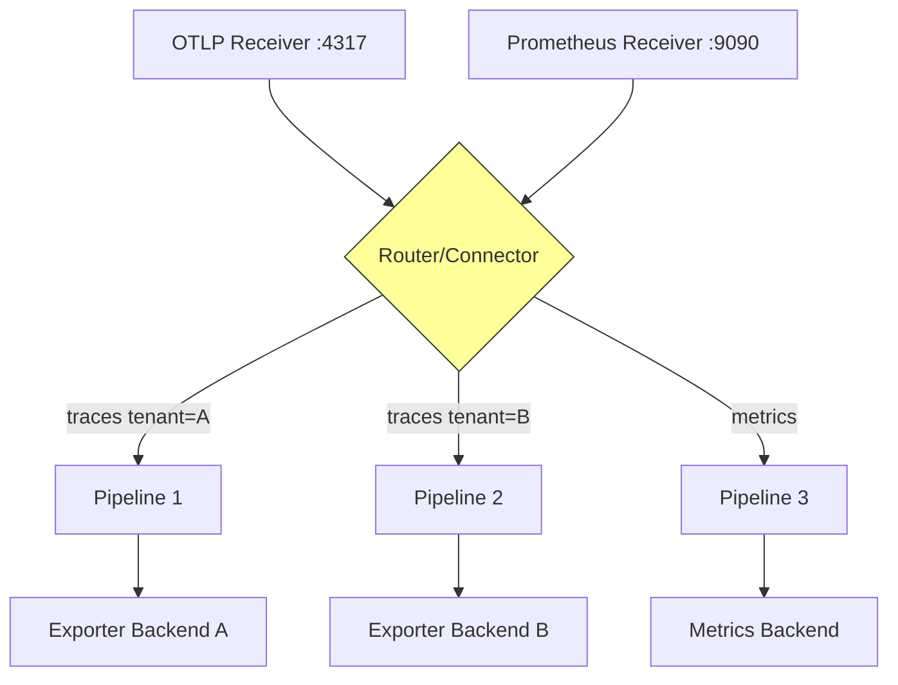

# How to Troubleshoot Multi-Pipeline Routing Issues in the Collector

Author: [nawazdhandala](https://www.github.com/nawazdhandala)

Tags: OpenTelemetry, Collector, Troubleshooting, Pipelines, Routing, Configuration

Description: Comprehensive guide to diagnosing and fixing routing problems in OpenTelemetry Collector multi-pipeline configurations with practical examples and debugging techniques.

Multi-pipeline routing in the OpenTelemetry Collector enables sophisticated telemetry processing: sending different data to different backends, applying tenant-specific processing, or handling priority-based routing. However, misconfigured routing causes data to reach wrong destinations, disappear entirely, or get duplicated. This guide helps you diagnose and fix routing issues systematically.

## Understanding Multi-Pipeline Architecture

The OpenTelemetry Collector supports multiple independent pipelines, each with its own receivers, processors, and exporters.



Routing decisions happen at several points:

1. **Receiver level**: Which pipeline receives the data
2. **Processor level**: Filtering or routing within processors
3. **Connector level**: Moving data between pipelines
4. **Exporter level**: Where processed data goes

## Common Routing Problems

### 1. Data Not Reaching Expected Pipeline

Symptoms: Data sent to collector but not appearing in target backend.

### 2. Data Going to Wrong Pipeline

Symptoms: Data appears in unexpected backend or with wrong processing applied.

### 3. Data Duplication Across Pipelines

Symptoms: Same telemetry data appears multiple times in backends.

### 4. Pipeline Selection Not Working

Symptoms: Conditional routing based on attributes fails.

### 5. Fan-Out Not Functioning

Symptoms: Data should go to multiple backends but only reaches one.

## Diagnostic Strategy

### Enable Comprehensive Logging

Start by making routing decisions visible.

```yaml
# otel-collector-config.yaml
service:
  telemetry:
    logs:
      # Enable debug logging
      level: debug
      encoding: json
      development: true
      initial_fields:
        service: otel-collector

    metrics:
      level: detailed
      address: 0.0.0.0:8888

receivers:
  otlp:
    protocols:
      grpc:
        endpoint: 0.0.0.0:4317

processors:
  # Add attributes to track pipeline routing
  attributes/pipeline1:
    actions:
    - key: pipeline.name
      value: "pipeline1"
      action: insert

  attributes/pipeline2:
    actions:
    - key: pipeline.name
      value: "pipeline2"
      action: insert

  batch:
    timeout: 10s
    send_batch_size: 8192

exporters:
  # Logging exporter to see what each pipeline receives
  logging/pipeline1:
    loglevel: info
    sampling_initial: 5
    sampling_thereafter: 100

  logging/pipeline2:
    loglevel: info
    sampling_initial: 5
    sampling_thereafter: 100

  otlp/backend1:
    endpoint: "backend1.observability.svc.cluster.local:4317"

  otlp/backend2:
    endpoint: "backend2.observability.svc.cluster.local:4317"

service:
  pipelines:
    traces/pipeline1:
      receivers: [otlp]
      processors: [attributes/pipeline1, batch]
      exporters: [logging/pipeline1, otlp/backend1]

    traces/pipeline2:
      receivers: [otlp]
      processors: [attributes/pipeline2, batch]
      exporters: [logging/pipeline2, otlp/backend2]
```

Monitor pipeline-specific logs:

```bash
# Watch pipeline1 logs
kubectl logs -f deployment/otel-collector -n observability | \
  grep "pipeline.name=pipeline1"

# Watch pipeline2 logs
kubectl logs -f deployment/otel-collector -n observability | \
  grep "pipeline.name=pipeline2"

# Count data routed to each pipeline
kubectl logs deployment/otel-collector -n observability --since=5m | \
  jq -r '.["pipeline.name"]' | sort | uniq -c
```

### Check Pipeline Metrics

Examine metrics to understand data flow through pipelines.

```promql
# Data received by each pipeline
sum by (pipeline) (rate(otelcol_receiver_accepted_spans[5m]))

# Data exported from each pipeline
sum by (pipeline, exporter) (rate(otelcol_exporter_sent_spans[5m]))

# Data dropped in each pipeline
sum by (pipeline) (rate(otelcol_processor_dropped_spans[5m]))

# Compare input vs output for each pipeline
sum by (pipeline) (rate(otelcol_receiver_accepted_spans[5m])) -
sum by (pipeline) (rate(otelcol_exporter_sent_spans[5m]))
```

## Routing Patterns and Solutions

### Pattern 1: Attribute-Based Routing

Route data to different pipelines based on resource or span attributes.

```yaml
# otel-collector-config.yaml
receivers:
  otlp:
    protocols:
      grpc:
        endpoint: 0.0.0.0:4317

processors:
  # Filter for tenant A data
  filter/tenantA:
    traces:
      span:
      # Include only spans with tenant_id = "tenant-a"
      - 'attributes["tenant_id"] == "tenant-a"'

  # Filter for tenant B data
  filter/tenantB:
    traces:
      span:
      # Include only spans with tenant_id = "tenant-b"
      - 'attributes["tenant_id"] == "tenant-b"'

  # Add pipeline identifier
  attributes/tenantA:
    actions:
    - key: pipeline.route
      value: "tenant-a"
      action: insert

  attributes/tenantB:
    actions:
    - key: pipeline.route
      value: "tenant-b"
      action: insert

  batch:
    timeout: 10s
    send_batch_size: 4096

exporters:
  otlp/tenantA:
    endpoint: "backend-tenant-a.observability.svc.cluster.local:4317"
    # Tenant-specific configuration
    headers:
      X-Tenant-ID: "tenant-a"

  otlp/tenantB:
    endpoint: "backend-tenant-b.observability.svc.cluster.local:4317"
    headers:
      X-Tenant-ID: "tenant-b"

  # Fallback for unmatched data
  otlp/default:
    endpoint: "backend-default.observability.svc.cluster.local:4317"

service:
  pipelines:
    # Pipeline for tenant A
    traces/tenantA:
      receivers: [otlp]
      processors: [filter/tenantA, attributes/tenantA, batch]
      exporters: [otlp/tenantA]

    # Pipeline for tenant B
    traces/tenantB:
      receivers: [otlp]
      processors: [filter/tenantB, attributes/tenantB, batch]
      exporters: [otlp/tenantB]

    # Catch-all pipeline for unmatched data
    traces/default:
      receivers: [otlp]
      processors: [batch]
      exporters: [otlp/default]
```

**Common Issue**: All data goes to default pipeline because filters don't match.

**Debug**:

```bash
# Check if tenant_id attribute exists in data
kubectl logs deployment/otel-collector -n observability | \
  jq -r '.ResourceSpans[].ScopeSpans[].Spans[].Attributes[] | select(.Key == "tenant_id")'

# Verify filter syntax
kubectl logs deployment/otel-collector -n observability | grep -i "filter"
```

**Fix**: Ensure attribute names match exactly (case-sensitive).

```yaml
processors:
  filter/tenantA:
    traces:
      span:
      # Use correct attribute key (check case sensitivity)
      - 'attributes["tenant.id"] == "tenant-a"'
      # OR use resource attribute if that's where it's stored
      - 'resource.attributes["tenant_id"] == "tenant-a"'
```

### Pattern 2: Fan-Out to Multiple Backends

Send same data to multiple backends for redundancy or different processing.

```yaml
# otel-collector-config.yaml
receivers:
  otlp:
    protocols:
      grpc:
        endpoint: 0.0.0.0:4317

processors:
  batch:
    timeout: 10s
    send_batch_size: 8192

exporters:
  # Primary backend
  otlp/primary:
    endpoint: "primary-backend.observability.svc.cluster.local:4317"
    timeout: 30s

  # Secondary backend for backup
  otlp/secondary:
    endpoint: "secondary-backend.observability.svc.cluster.local:4317"
    timeout: 30s

  # Analytics backend
  otlp/analytics:
    endpoint: "analytics-backend.observability.svc.cluster.local:4317"
    timeout: 30s

service:
  pipelines:
    # Single pipeline with multiple exporters (fan-out)
    traces:
      receivers: [otlp]
      processors: [batch]
      # Data sent to all three backends
      exporters: [otlp/primary, otlp/secondary, otlp/analytics]
```

**Common Issue**: Data only reaches first exporter when one exporter fails.

**Fix**: Configure exporters to not block on failure.

```yaml
exporters:
  otlp/primary:
    endpoint: "primary-backend.observability.svc.cluster.local:4317"
    timeout: 30s
    # Queue to handle temporary failures
    sending_queue:
      enabled: true
      queue_size: 10000
    retry_on_failure:
      enabled: true
      max_elapsed_time: 300s

  otlp/secondary:
    endpoint: "secondary-backend.observability.svc.cluster.local:4317"
    timeout: 30s
    sending_queue:
      enabled: true
      queue_size: 10000
    retry_on_failure:
      enabled: true
      max_elapsed_time: 300s
```

### Pattern 3: Priority-Based Routing

Route high-priority data to fast path and normal data to standard path.

```yaml
# otel-collector-config.yaml
receivers:
  otlp:
    protocols:
      grpc:
        endpoint: 0.0.0.0:4317

  # Separate receiver for high-priority data
  otlp/priority:
    protocols:
      grpc:
        endpoint: 0.0.0.0:4320

processors:
  # Minimal processing for high-priority
  batch/priority:
    timeout: 1s
    send_batch_size: 1024

  # Standard processing
  batch/standard:
    timeout: 10s
    send_batch_size: 8192

  # Add sampling to standard pipeline
  probabilistic_sampler:
    sampling_percentage: 10

exporters:
  # Fast backend for high-priority
  otlp/priority:
    endpoint: "fast-backend.observability.svc.cluster.local:4317"
    timeout: 10s
    sending_queue:
      enabled: true
      queue_size: 50000
      num_consumers: 20

  # Standard backend
  otlp/standard:
    endpoint: "standard-backend.observability.svc.cluster.local:4317"
    timeout: 30s
    sending_queue:
      enabled: true
      queue_size: 20000
      num_consumers: 10

service:
  pipelines:
    # High-priority pipeline: fast, no sampling
    traces/priority:
      receivers: [otlp/priority]
      processors: [batch/priority]
      exporters: [otlp/priority]

    # Standard pipeline: sampled, batched
    traces/standard:
      receivers: [otlp]
      processors: [probabilistic_sampler, batch/standard]
      exporters: [otlp/standard]
```

**Testing**: Send test traffic to both receivers.

```bash
# Send high-priority span to port 4320
grpcurl -plaintext -d @ otel-collector.observability.svc.cluster.local:4320 \
  opentelemetry.proto.collector.trace.v1.TraceService/Export <<EOF
{
  "resourceSpans": [{
    "scopeSpans": [{
      "spans": [{
        "traceId": "$(openssl rand -hex 16)",
        "spanId": "$(openssl rand -hex 8)",
        "name": "priority-test",
        "startTimeUnixNano": "$(date +%s)000000000",
        "endTimeUnixNano": "$(date +%s)000000000"
      }]
    }]
  }]
}
EOF

# Send standard span to port 4317
grpcurl -plaintext -d @ otel-collector.observability.svc.cluster.local:4317 \
  opentelemetry.proto.collector.trace.v1.TraceService/Export <<EOF
{
  "resourceSpans": [{
    "scopeSpans": [{
      "spans": [{
        "traceId": "$(openssl rand -hex 16)",
        "spanId": "$(openssl rand -hex 8)",
        "name": "standard-test",
        "startTimeUnixNano": "$(date +%s)000000000",
        "endTimeUnixNano": "$(date +%s)000000000"
      }]
    }]
  }]
}
EOF
```

### Pattern 4: Using Routing Connector

Use the routing connector (experimental) for advanced routing logic.

```yaml
# otel-collector-config.yaml
receivers:
  otlp:
    protocols:
      grpc:
        endpoint: 0.0.0.0:4317

connectors:
  # Routing connector to split data between pipelines
  routing:
    # Default pipeline if no routes match
    default_pipelines: [traces/default]

    # Table defining routing rules
    table:
    - statement: route() where attributes["service.name"] == "payment-service"
      pipelines: [traces/critical]

    - statement: route() where attributes["http.status_code"] >= 500
      pipelines: [traces/errors]

    - statement: route() where attributes["environment"] == "production"
      pipelines: [traces/prod]

    - statement: route() where attributes["environment"] == "staging"
      pipelines: [traces/staging]

processors:
  batch/critical:
    timeout: 5s
    send_batch_size: 2048

  batch/errors:
    timeout: 5s
    send_batch_size: 4096

  batch/prod:
    timeout: 10s
    send_batch_size: 8192

  batch/staging:
    timeout: 15s
    send_batch_size: 16384

  batch/default:
    timeout: 10s
    send_batch_size: 8192

exporters:
  otlp/critical:
    endpoint: "critical-backend.observability.svc.cluster.local:4317"

  otlp/errors:
    endpoint: "errors-backend.observability.svc.cluster.local:4317"

  otlp/prod:
    endpoint: "prod-backend.observability.svc.cluster.local:4317"

  otlp/staging:
    endpoint: "staging-backend.observability.svc.cluster.local:4317"

  otlp/default:
    endpoint: "default-backend.observability.svc.cluster.local:4317"

service:
  pipelines:
    # Ingestion pipeline uses routing connector
    traces/ingest:
      receivers: [otlp]
      processors: []
      exporters: [routing]

    # Downstream pipelines receive routed data
    traces/critical:
      receivers: [routing]
      processors: [batch/critical]
      exporters: [otlp/critical]

    traces/errors:
      receivers: [routing]
      processors: [batch/errors]
      exporters: [otlp/errors]

    traces/prod:
      receivers: [routing]
      processors: [batch/prod]
      exporters: [otlp/prod]

    traces/staging:
      receivers: [routing]
      processors: [batch/staging]
      exporters: [otlp/staging]

    traces/default:
      receivers: [routing]
      processors: [batch/default]
      exporters: [otlp/default]
```

**Common Issue**: Routing connector not matching expected data.

**Debug**:

```bash
# Check routing connector logs
kubectl logs deployment/otel-collector -n observability | grep -i "routing"

# Verify attribute values in data
kubectl logs deployment/otel-collector -n observability | \
  jq -r '.ResourceSpans[].Resource.Attributes[] | "\(.Key): \(.Value)"'
```

### Pattern 5: Cross-Pipeline Data Sharing

Use forward connector to duplicate data across different signal types.

```yaml
# otel-collector-config.yaml
receivers:
  otlp:
    protocols:
      grpc:
        endpoint: 0.0.0.0:4317

connectors:
  # Forward connector to generate metrics from traces
  spanmetrics:
    # Histogram buckets for latency
    histogram:
      explicit:
        buckets: [0.01, 0.05, 0.1, 0.5, 1, 5, 10]
    # Dimensions to aggregate by
    dimensions:
    - name: service.name
    - name: http.method
    - name: http.status_code

processors:
  batch/traces:
    timeout: 10s
    send_batch_size: 8192

  batch/metrics:
    timeout: 30s
    send_batch_size: 4096

exporters:
  otlp/traces:
    endpoint: "traces-backend.observability.svc.cluster.local:4317"

  otlp/metrics:
    endpoint: "metrics-backend.observability.svc.cluster.local:4317"

service:
  pipelines:
    # Traces pipeline exports to backend and spanmetrics connector
    traces:
      receivers: [otlp]
      processors: [batch/traces]
      exporters: [otlp/traces, spanmetrics]

    # Metrics pipeline receives from spanmetrics connector
    metrics:
      receivers: [spanmetrics]
      processors: [batch/metrics]
      exporters: [otlp/metrics]
```

## Debugging Complex Routing Issues

### Trace Data Flow Through Pipelines

Add detailed logging at each stage to understand routing decisions.

```yaml
# otel-collector-config.yaml
processors:
  # Log data entering pipeline
  attributes/stage1:
    actions:
    - key: debug.stage
      value: "entry"
      action: insert

  # Filter or route
  filter/route:
    traces:
      span:
      - 'attributes["tenant_id"] == "tenant-a"'

  # Log data after filter
  attributes/stage2:
    actions:
    - key: debug.stage
      value: "after-filter"
      action: insert

  batch:
    timeout: 10s
    send_batch_size: 8192

  # Log data before export
  attributes/stage3:
    actions:
    - key: debug.stage
      value: "pre-export"
      action: insert

exporters:
  # Detailed logging exporter
  logging:
    loglevel: debug
    sampling_initial: 10
    sampling_thereafter: 100

  otlp/backend:
    endpoint: "backend.observability.svc.cluster.local:4317"

service:
  pipelines:
    traces:
      receivers: [otlp]
      processors:
      - attributes/stage1
      - filter/route
      - attributes/stage2
      - batch
      - attributes/stage3
      exporters: [logging, otlp/backend]
```

### Validate Configuration Before Deployment

Use the collector's validate command to catch configuration errors.

```bash
# Validate configuration locally
docker run --rm -v $(pwd)/otel-collector-config.yaml:/etc/otel/config.yaml \
  otel/opentelemetry-collector-contrib:0.93.0 \
  validate --config=/etc/otel/config.yaml

# Or in Kubernetes
kubectl run -it --rm debug --image=otel/opentelemetry-collector-contrib:0.93.0 \
  --restart=Never -- validate --config=/conf/config.yaml
```

### Use Metrics to Track Pipeline Health

Monitor pipeline-specific metrics to detect routing anomalies.

```promql
# Data entering each pipeline (should sum to total received)
sum by (pipeline) (rate(otelcol_receiver_accepted_spans{pipeline=~"traces/.*"}[5m]))

# Data leaving each pipeline
sum by (pipeline) (rate(otelcol_exporter_sent_spans{pipeline=~"traces/.*"}[5m]))

# Data dropped in each pipeline (should be zero or expected amount)
sum by (pipeline) (rate(otelcol_processor_dropped_spans{pipeline=~"traces/.*"}[5m]))

# Verify fan-out: sum of exports should equal input * number of exporters
sum(rate(otelcol_exporter_sent_spans[5m])) /
sum(rate(otelcol_receiver_accepted_spans[5m]))
```

## Testing Routing Configuration

### Create Synthetic Test Data

Generate test spans with specific attributes to verify routing.

```go
// test-routing.go
package main

import (
    "context"
    "fmt"
    "log"
    "time"

    "go.opentelemetry.io/otel"
    "go.opentelemetry.io/otel/attribute"
    "go.opentelemetry.io/otel/exporters/otlp/otlptrace/otlptracegrpc"
    "go.opentelemetry.io/otel/sdk/resource"
    "go.opentelemetry.io/otel/sdk/trace"
    semconv "go.opentelemetry.io/otel/semconv/v1.17.0"
)

func main() {
    ctx := context.Background()

    // Create exporter
    exporter, err := otlptracegrpc.New(
        ctx,
        otlptracegrpc.WithEndpoint("otel-collector.observability.svc.cluster.local:4317"),
        otlptracegrpc.WithInsecure(),
    )
    if err != nil {
        log.Fatalf("Failed to create exporter: %v", err)
    }
    defer exporter.Shutdown(ctx)

    // Test routing to tenant A
    testTenantRouting(ctx, exporter, "tenant-a")

    // Test routing to tenant B
    testTenantRouting(ctx, exporter, "tenant-b")

    // Test priority routing
    testPriorityRouting(ctx, exporter)
}

func testTenantRouting(ctx context.Context, exporter trace.SpanExporter, tenantID string) {
    // Create trace provider with tenant resource
    tp := trace.NewTracerProvider(
        trace.WithBatcher(exporter),
        trace.WithResource(resource.NewWithAttributes(
            semconv.SchemaURL,
            attribute.String("tenant_id", tenantID),
            attribute.String("service.name", fmt.Sprintf("test-service-%s", tenantID)),
        )),
    )
    defer tp.Shutdown(ctx)

    tracer := tp.Tracer("routing-tester")

    // Create test span
    _, span := tracer.Start(ctx, fmt.Sprintf("test-span-%s", tenantID))
    span.SetAttributes(
        attribute.String("test.type", "tenant-routing"),
        attribute.String("tenant_id", tenantID),
    )
    time.Sleep(100 * time.Millisecond)
    span.End()

    log.Printf("Sent test span for tenant: %s", tenantID)
}

func testPriorityRouting(ctx context.Context, exporter trace.SpanExporter) {
    tp := trace.NewTracerProvider(
        trace.WithBatcher(exporter),
        trace.WithResource(resource.NewWithAttributes(
            semconv.SchemaURL,
            attribute.String("service.name", "priority-test"),
            attribute.String("priority", "high"),
        )),
    )
    defer tp.Shutdown(ctx)

    tracer := tp.Tracer("routing-tester")

    _, span := tracer.Start(ctx, "priority-test-span")
    span.SetAttributes(
        attribute.String("test.type", "priority-routing"),
        attribute.String("priority", "high"),
    )
    time.Sleep(100 * time.Millisecond)
    span.End()

    log.Printf("Sent high-priority test span")
}
```

### Automated Routing Validation

Create a test suite that validates routing behavior.

```bash
#!/bin/bash
# validate-routing.sh

set -e

echo "Testing multi-pipeline routing..."

# Test tenant A routing
echo "Sending test span for tenant-a..."
grpcurl -plaintext -d '{
  "resourceSpans": [{
    "resource": {
      "attributes": [{
        "key": "tenant_id",
        "value": {"stringValue": "tenant-a"}
      }]
    },
    "scopeSpans": [{
      "spans": [{
        "traceId": "'$(openssl rand -hex 16)'",
        "spanId": "'$(openssl rand -hex 8)'",
        "name": "test-tenant-a",
        "startTimeUnixNano": "'$(date +%s)000000000'",
        "endTimeUnixNano": "'$(date +%s)000000000'"
      }]
    }]
  }]
}' otel-collector.observability.svc.cluster.local:4317 \
  opentelemetry.proto.collector.trace.v1.TraceService/Export

# Wait for processing
sleep 5

# Check logs to verify routing
echo "Checking tenant-a pipeline logs..."
kubectl logs deployment/otel-collector -n observability --since=1m | \
  grep "tenant-a" | grep "pipeline.name=tenantA"

if [ $? -eq 0 ]; then
  echo "✓ Tenant A routing successful"
else
  echo "✗ Tenant A routing failed"
  exit 1
fi

# Test tenant B routing
echo "Sending test span for tenant-b..."
grpcurl -plaintext -d '{
  "resourceSpans": [{
    "resource": {
      "attributes": [{
        "key": "tenant_id",
        "value": {"stringValue": "tenant-b"}
      }]
    },
    "scopeSpans": [{
      "spans": [{
        "traceId": "'$(openssl rand -hex 16)'",
        "spanId": "'$(openssl rand -hex 8)'",
        "name": "test-tenant-b",
        "startTimeUnixNano": "'$(date +%s)000000000'",
        "endTimeUnixNano": "'$(date +%s)000000000'"
      }]
    }]
  }]
}' otel-collector.observability.svc.cluster.local:4317 \
  opentelemetry.proto.collector.trace.v1.TraceService/Export

sleep 5

echo "Checking tenant-b pipeline logs..."
kubectl logs deployment/otel-collector -n observability --since=1m | \
  grep "tenant-b" | grep "pipeline.name=tenantB"

if [ $? -eq 0 ]; then
  echo "✓ Tenant B routing successful"
else
  echo "✗ Tenant B routing failed"
  exit 1
fi

echo "All routing tests passed!"
```

## Best Practices for Multi-Pipeline Routing

1. **Document routing logic clearly** in configuration comments
2. **Use explicit pipeline names** that describe their purpose
3. **Add debug attributes** during development to trace data flow
4. **Validate configurations** before deploying to production
5. **Monitor pipeline-specific metrics** to detect routing anomalies
6. **Test routing with synthetic data** before production traffic
7. **Keep routing rules simple** - complex logic is error-prone
8. **Use connectors for advanced routing** instead of complex filters
9. **Log data at pipeline boundaries** during troubleshooting
10. **Version control routing configurations** and test changes in staging

## Troubleshooting Checklist

When routing issues occur, work through this checklist:

- [ ] Check collector logs for errors or warnings
- [ ] Verify attribute names match exactly (case-sensitive)
- [ ] Confirm data contains expected attributes for routing
- [ ] Validate filter expressions with test data
- [ ] Check pipeline metrics to see where data flows
- [ ] Verify exporter configurations point to correct backends
- [ ] Test with logging exporter to see what each pipeline receives
- [ ] Ensure resource attributes vs span attributes are used correctly
- [ ] Check for processor ordering issues (filters before other processors)
- [ ] Verify connector configurations if using advanced routing

## Related Resources

For more OpenTelemetry Collector troubleshooting guidance:

- [How to Fix Collector Slow Startup in Kubernetes](https://oneuptime.com/blog/post/2026-02-06-fix-collector-slow-startup-kubernetes/view)
- [How to Debug Collector Receiver Connection Drops](https://oneuptime.com/blog/post/2026-02-06-debug-collector-receiver-connection-drops/view)
- [How to Monitor Collector Queue Depth and Backpressure](https://oneuptime.com/blog/post/2026-02-06-monitor-collector-queue-depth-backpressure/view)
- [How to Fix Collector Exporter Timeout Errors](https://oneuptime.com/blog/post/2026-02-06-fix-collector-exporter-timeout-errors/view)

Multi-pipeline routing enables sophisticated telemetry processing but requires careful configuration. By understanding routing mechanisms, using comprehensive logging, and systematically testing configurations, you can build reliable routing that sends data exactly where it needs to go.
