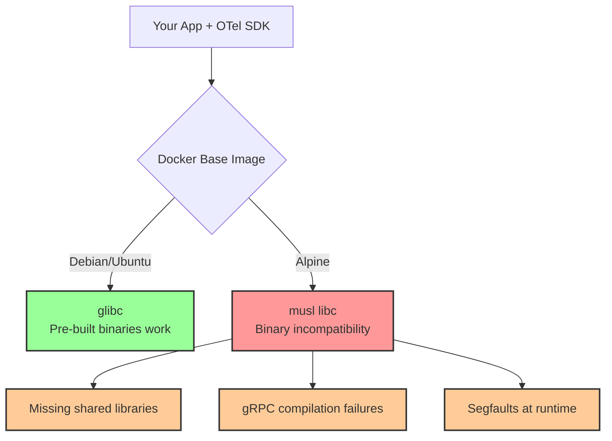

# How to Troubleshoot OpenTelemetry with Alpine Linux Docker Images

Author: [nawazdhandala](https://www.github.com/nawazdhandala)

Tags: OpenTelemetry, Docker, Alpine Linux, Troubleshooting, gRPC, Python, Node.js, Containers

Description: Learn how to resolve common OpenTelemetry issues that arise specifically when using Alpine Linux-based Docker images, from gRPC compilation failures to missing system libraries.

---

Alpine Linux is a popular choice for Docker images because of its tiny footprint. A base Alpine image is about 5 MB compared to over 100 MB for Debian-based images. But that small size comes at a cost: Alpine uses musl libc instead of glibc, ships with minimal system libraries, and lacks many development headers that OpenTelemetry dependencies expect. This creates a whole class of problems that only show up when you move from a development machine or a Debian-based image to Alpine.

This post covers the most common issues you will hit when running OpenTelemetry instrumented applications on Alpine Linux Docker images and how to fix each one.

## The Core Problem: musl vs glibc

Alpine Linux uses musl libc as its C standard library instead of the glibc that most Linux distributions use. Many native extensions and pre-built binaries in the Python and Node.js ecosystems are compiled against glibc. When these run on Alpine, they either fail to load or need to be recompiled from source, which requires development tools that Alpine does not include by default.



## Issue 1: gRPC Native Extension Fails to Build

The gRPC Python package (`grpcio`) includes native C/C++ code that must be compiled on Alpine. Without the right build tools, you get errors like this:

```
Building wheels for collected packages: grpcio
  Building wheel for grpcio (pyproject.toml) ... error
  error: command '/usr/bin/gcc' failed: No such file or directory
```

Or even more cryptic errors about missing headers:

```
fatal error: linux/futex.h: No such file or directory
fatal error: openssl/ssl.h: No such file or directory
```

The fix is to install the build dependencies before pip install:

```dockerfile
# Dockerfile: Python app with OpenTelemetry on Alpine
FROM python:3.12-alpine

# Install build dependencies needed for grpcio and other native extensions
RUN apk add --no-cache \
    gcc \
    g++ \
    musl-dev \
    linux-headers \
    openssl-dev \
    libffi-dev

# Copy and install Python dependencies
COPY requirements.txt .
RUN pip install --no-cache-dir -r requirements.txt

# Clean up build dependencies to keep the image small
RUN apk del gcc g++ musl-dev linux-headers

COPY . /app
WORKDIR /app

CMD ["python", "main.py"]
```

A better approach for keeping the image small is to use a multi-stage build:

```dockerfile
# Multi-stage build: compile in a builder, run in a clean Alpine image
FROM python:3.12-alpine AS builder

# Install build tools in the builder stage
RUN apk add --no-cache \
    gcc \
    g++ \
    musl-dev \
    linux-headers \
    openssl-dev \
    libffi-dev

COPY requirements.txt .
RUN pip install --no-cache-dir --prefix=/install -r requirements.txt

# Final stage: clean Alpine image with only runtime dependencies
FROM python:3.12-alpine

# Install only runtime libraries (no compilers)
RUN apk add --no-cache \
    libstdc++ \
    libgcc

# Copy installed packages from builder
COPY --from=builder /install /usr/local

COPY . /app
WORKDIR /app

CMD ["python", "main.py"]
```

The key packages you need for building grpcio on Alpine are `gcc`, `g++`, `musl-dev`, and `linux-headers`. Without any one of them, the build will fail with different error messages.

## Issue 2: Node.js gRPC Binary Not Available for Alpine

Node.js OpenTelemetry packages that use `@grpc/grpc-js` are pure JavaScript and work fine on Alpine. But if you are using the older `grpc` package (now deprecated) or any native addon, you will see errors like:

```
Error: Error loading shared library ld-linux-x86-64.so.2: No such file or directory
```

Or:

```
Error: Cannot find module '/app/node_modules/grpc/src/node/extension_binary/
  node-v108-linux-x64-musl/grpc_node.node'
```

The solution is straightforward. Make sure you are using `@grpc/grpc-js` instead of the native `grpc` package:

```json
{
  "dependencies": {
    "@opentelemetry/api": "^1.7.0",
    "@opentelemetry/sdk-trace-node": "^1.21.0",
    "@opentelemetry/exporter-trace-otlp-grpc": "^0.48.0",
    "@grpc/grpc-js": "^1.9.0"
  }
}
```

```javascript
// Verify you are importing from @grpc/grpc-js, not grpc
const grpc = require('@grpc/grpc-js');  // Pure JS, works on Alpine
// NOT: const grpc = require('grpc');    // Native addon, breaks on Alpine
```

If you must use a native Node.js addon on Alpine, install the build tools:

```dockerfile
# Dockerfile: Node.js app on Alpine with native build support
FROM node:20-alpine

# Install build tools for native addons
RUN apk add --no-cache \
    python3 \
    make \
    g++ \
    linux-headers

WORKDIR /app
COPY package*.json ./
RUN npm ci

# Remove build tools after installation
RUN apk del python3 make g++

COPY . .
CMD ["node", "index.js"]
```

## Issue 3: Missing CA Certificates for TLS

Alpine ships with a minimal set of CA certificates. If your OpenTelemetry exporter connects to a collector or backend over TLS, it might fail with certificate verification errors:

```
SSL: CERTIFICATE_VERIFY_FAILED
unable to get local issuer certificate
```

This happens because the `ca-certificates` package is not installed by default:

```dockerfile
# Fix: Install CA certificates on Alpine
FROM python:3.12-alpine

# Install CA certificates for TLS connections
RUN apk add --no-cache ca-certificates

COPY requirements.txt .
RUN pip install --no-cache-dir -r requirements.txt

COPY . /app
WORKDIR /app

CMD ["python", "main.py"]
```

If you are using a custom CA (for example, with an internal collector that uses a self-signed certificate), you need to add it to the trust store:

```dockerfile
# Add custom CA certificate to Alpine trust store
FROM python:3.12-alpine

RUN apk add --no-cache ca-certificates

# Copy your custom CA certificate
COPY my-company-ca.crt /usr/local/share/ca-certificates/

# Update the certificate trust store
RUN update-ca-certificates

COPY requirements.txt .
RUN pip install --no-cache-dir -r requirements.txt

COPY . /app
WORKDIR /app

CMD ["python", "main.py"]
```

## Issue 4: DNS Resolution Differences

Alpine's musl libc handles DNS resolution differently than glibc. One notorious difference is that musl does not support the `search` directive in `/etc/resolv.conf` the same way glibc does. In Kubernetes, this can cause DNS lookups for short service names to fail:

```python
# This might fail on Alpine in Kubernetes
exporter = OTLPSpanExporter(
    endpoint="http://otel-collector:4317",  # Short name might not resolve
    insecure=True
)
```

The fix is to use the fully qualified domain name:

```python
# Use FQDN to avoid DNS resolution issues on Alpine
exporter = OTLPSpanExporter(
    endpoint="http://otel-collector.observability.svc.cluster.local:4317",
    insecure=True
)
```

Alternatively, you can install the `libc6-compat` package which provides some glibc compatibility:

```dockerfile
# Install glibc compatibility layer
FROM python:3.12-alpine

RUN apk add --no-cache libc6-compat

COPY requirements.txt .
RUN pip install --no-cache-dir -r requirements.txt

COPY . /app
WORKDIR /app

CMD ["python", "main.py"]
```

## Issue 5: Segfaults with Auto-Instrumentation

Some OpenTelemetry auto-instrumentation libraries use native extensions that can segfault on Alpine due to the musl/glibc incompatibility. This often shows up as a cryptic crash with no useful error message:

```
Segmentation fault (core dumped)
```

To debug this, install the `gdb` package and get a stack trace:

```dockerfile
# Debug Dockerfile for tracking down segfaults
FROM python:3.12-alpine

RUN apk add --no-cache \
    gdb \
    gcc \
    g++ \
    musl-dev \
    linux-headers

COPY requirements.txt .
RUN pip install --no-cache-dir -r requirements.txt

COPY . /app
WORKDIR /app

# Run under gdb to get a stack trace on crash
CMD ["gdb", "-batch", "-ex", "run", "-ex", "bt full", "--args", "python", "main.py"]
```

If the segfault comes from a specific instrumentation library, you can exclude it and use manual instrumentation instead:

```python
# Python: Exclude problematic auto-instrumentation
# Instead of using opentelemetry-instrument which loads everything,
# selectively instrument only the libraries that work

from opentelemetry.instrumentation.flask import FlaskInstrumentor
from opentelemetry.instrumentation.requests import RequestsInstrumentor

# Only instrument libraries known to work on Alpine
FlaskInstrumentor().instrument()
RequestsInstrumentor().instrument()

# Skip the one causing segfaults (e.g., a database driver instrumentation)
# and add manual spans instead
```

## Issue 6: Timezone and Locale Problems

Alpine does not include timezone data by default. This can cause timestamp-related issues in spans:

```dockerfile
# Install timezone data for correct span timestamps
FROM python:3.12-alpine

RUN apk add --no-cache tzdata

# Set timezone
ENV TZ=UTC

COPY requirements.txt .
RUN pip install --no-cache-dir -r requirements.txt

COPY . /app
WORKDIR /app

CMD ["python", "main.py"]
```

## The Alternative: Use Slim Images Instead

If you are spending a lot of time fighting Alpine compatibility issues, consider using Debian slim images instead. They use glibc, include more system libraries, and are only slightly larger than Alpine:

```dockerfile
# Debian slim: 80MB base vs Alpine's 5MB, but far fewer compatibility issues
FROM python:3.12-slim

# Most OTel dependencies install without any extra packages
COPY requirements.txt .
RUN pip install --no-cache-dir -r requirements.txt

COPY . /app
WORKDIR /app

CMD ["python", "main.py"]
```

The size difference between Alpine and slim images matters less than you might think once you add application code and dependencies. A Python app with OpenTelemetry on Alpine with all its build dependencies might end up larger than the same app on Debian slim.

## Complete Working Dockerfile Template

Here is a production-ready template that handles all the common Alpine issues for a Python OpenTelemetry application:

```dockerfile
# Production Dockerfile: Python + OpenTelemetry on Alpine
FROM python:3.12-alpine AS builder

# Install all build dependencies
RUN apk add --no-cache \
    gcc \
    g++ \
    musl-dev \
    linux-headers \
    openssl-dev \
    libffi-dev

COPY requirements.txt .
RUN pip install --no-cache-dir --prefix=/install -r requirements.txt

# Final runtime image
FROM python:3.12-alpine

# Install runtime dependencies only
RUN apk add --no-cache \
    ca-certificates \
    libstdc++ \
    libgcc \
    tzdata \
    libc6-compat

ENV TZ=UTC

# Copy pre-built Python packages
COPY --from=builder /install /usr/local

COPY . /app
WORKDIR /app

# Health check to verify the app starts properly
HEALTHCHECK --interval=30s --timeout=10s \
    CMD python -c "import opentelemetry; print('ok')" || exit 1

CMD ["python", "main.py"]
```

## Conclusion

Alpine Linux Docker images and OpenTelemetry can work together, but you need to account for the differences between musl and glibc. The most common issues are missing build tools for gRPC compilation, missing CA certificates for TLS, DNS resolution quirks, and occasional segfaults from native extensions. Multi-stage builds let you keep the final image small while still having the build tools needed during compilation. If you find yourself spending too much time on Alpine compatibility, switching to Debian slim images is a perfectly reasonable choice that avoids most of these problems with only a modest increase in image size.
