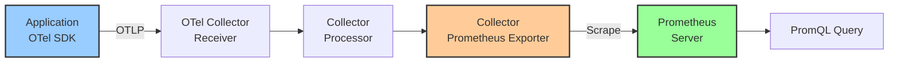

# How to Troubleshoot OpenTelemetry Metrics Not Appearing in Prometheus

Author: [nawazdhandala](https://www.github.com/nawazdhandala)

Tags: OpenTelemetry, Prometheus, Metrics, Troubleshooting, Collector, Exporter, Observability

Description: Step-by-step guide to diagnosing why OpenTelemetry metrics fail to appear in Prometheus, covering collector config, naming, and scraping issues.

---

You have instrumented your application with OpenTelemetry, configured the collector, pointed Prometheus at it, and nothing shows up. Or maybe some metrics appear but others are mysteriously absent. This is one of the most common problems teams face when integrating OpenTelemetry with Prometheus, and the root cause is usually one of a handful of well-known issues.

This guide walks through the problem systematically, from the application all the way through to the Prometheus query, so you can find and fix whatever is blocking your metrics.

## Understanding the Metrics Pipeline

Before debugging, it helps to know every step a metric takes from your code to a Prometheus query result:



A metric can get lost at any of these stages. We will check each one.

## Step 1: Verify Metrics Are Leaving the Application

First, confirm that your application is actually producing and exporting metrics. The easiest way is to add a debug exporter alongside your OTLP exporter:

```python
# app_metrics.py
# Verify that the application is generating metrics by logging them locally
from opentelemetry import metrics
from opentelemetry.sdk.metrics import MeterProvider
from opentelemetry.sdk.metrics.export import (
    ConsoleMetricExporter,
    PeriodicExportingMetricReader,
)
from opentelemetry.exporter.otlp.proto.grpc.metric_exporter import OTLPMetricExporter

# Console exporter prints metrics to stdout for debugging
# Use this temporarily to confirm metrics are being generated
console_reader = PeriodicExportingMetricReader(
    ConsoleMetricExporter(),
    export_interval_millis=5000,
)

# OTLP exporter sends metrics to the collector
otlp_reader = PeriodicExportingMetricReader(
    OTLPMetricExporter(endpoint="http://otel-collector:4317"),
    export_interval_millis=10000,
)

# Register both readers so metrics go to console and collector
provider = MeterProvider(metric_readers=[console_reader, otlp_reader])
metrics.set_meter_provider(provider)

# Create a test metric
meter = metrics.get_meter("test")
counter = meter.create_counter("test_requests_total", description="Test counter")
counter.add(1, {"method": "GET", "path": "/api/orders"})
```

If you see metrics printing to the console but they are not reaching Prometheus, the problem is downstream. If nothing prints, fix your instrumentation first.

## Step 2: Verify the Collector Is Receiving Metrics

Check the collector logs for incoming metric data. Enable debug logging temporarily:

```yaml
# collector-config.yaml
# Enable detailed logging to see if metrics arrive at the collector
receivers:
  otlp:
    protocols:
      grpc:
        endpoint: 0.0.0.0:4317
      http:
        endpoint: 0.0.0.0:4318

processors:
  batch:
    timeout: 10s

exporters:
  # Debug exporter logs received data to the collector's stdout
  # Set verbosity to detailed to see individual metric data points
  debug:
    verbosity: detailed

  prometheus:
    endpoint: 0.0.0.0:8889
    namespace: ""

service:
  telemetry:
    logs:
      level: debug

  pipelines:
    metrics:
      receivers: [otlp]
      processors: [batch]
      # Include both debug and prometheus exporters
      exporters: [debug, prometheus]
```

After restarting the collector with this config, you should see metric data in the collector logs. If not, check network connectivity between the application and collector:

```bash
# Test OTLP gRPC connectivity from the application's environment
# grpcurl should return the service list if the collector is reachable
grpcurl -plaintext otel-collector:4317 list

# Test OTLP HTTP connectivity
# A POST with an empty body should return a response (possibly an error)
# but confirms the endpoint is reachable
curl -v http://otel-collector:4318/v1/metrics
```

## Step 3: Check the Prometheus Exporter Configuration

This is where most problems live. The collector's Prometheus exporter has several configuration options that can silently drop or rename metrics.

Here is a correctly configured exporter:

```yaml
# collector-config.yaml
# Prometheus exporter configuration with common pitfalls addressed
exporters:
  prometheus:
    # This is the endpoint Prometheus will scrape
    # Make sure this port is accessible from the Prometheus server
    endpoint: 0.0.0.0:8889

    # Namespace adds a prefix to all metric names
    # Set to empty string to avoid unexpected prefixes
    namespace: ""

    # Enable resource attributes as labels
    # Without this, service.name and other resource attributes are dropped
    resource_to_telemetry_conversion:
      enabled: true

    # Metric name sanitization
    # OpenTelemetry uses dots (http.server.duration)
    # Prometheus requires underscores (http_server_duration)
    # The exporter handles this automatically
```

Common configuration mistakes:

**Mistake 1: Wrong endpoint or port conflict**

```yaml
# BAD: Port 8888 is used by the collector's internal metrics
exporters:
  prometheus:
    endpoint: 0.0.0.0:8888  # Conflicts with internal metrics

# GOOD: Use a different port for application metrics
exporters:
  prometheus:
    endpoint: 0.0.0.0:8889  # Dedicated port for exported metrics
```

**Mistake 2: Namespace prefix causing confusion**

```yaml
# With this config, a metric named "http_requests_total" becomes
# "myapp_http_requests_total" in Prometheus
exporters:
  prometheus:
    endpoint: 0.0.0.0:8889
    namespace: "myapp"  # Adds "myapp_" prefix to all metrics
```

If you are searching for `http_requests_total` in Prometheus but the namespace is set, you will not find it. Search for `myapp_http_requests_total` instead, or remove the namespace.

## Step 4: Verify Prometheus Scraping

Even if the collector is exposing metrics correctly, Prometheus needs to be scraping the right endpoint. First, check that the collector's Prometheus endpoint is working:

```bash
# Manually scrape the collector's Prometheus endpoint
# This should return metric data in Prometheus text format
curl http://otel-collector:8889/metrics

# Expected output looks like:
# # HELP http_server_duration Duration of HTTP server requests
# # TYPE http_server_duration histogram
# http_server_duration_bucket{method="GET",path="/api",le="0.005"} 10
# http_server_duration_bucket{method="GET",path="/api",le="0.01"} 25
```

If `curl` returns data but Prometheus shows nothing, the problem is in the Prometheus configuration:

```yaml
# prometheus.yml
# Scrape configuration for the OpenTelemetry collector
scrape_configs:
  - job_name: 'otel-collector'
    # Scrape interval determines how often Prometheus pulls metrics
    scrape_interval: 15s

    # The collector's prometheus exporter endpoint
    static_configs:
      - targets: ['otel-collector:8889']

    # If your collector uses a different metrics path (rare)
    # metrics_path: '/metrics'
```

Check the Prometheus targets page to see if scraping is working:

```bash
# Query the Prometheus API to check target status
# Look for the otel-collector target and its state
curl http://prometheus:9090/api/v1/targets | python3 -m json.tool
```

The target should show `"health": "up"`. If it shows `"health": "down"`, Prometheus cannot reach the collector's exporter endpoint. Check DNS resolution, network policies, and firewall rules.

## Step 5: Metric Name Translation Issues

This is a subtle but very common problem. OpenTelemetry and Prometheus have different naming conventions, and the translation between them can cause metrics to appear under unexpected names.

OpenTelemetry uses dots and descriptive names:
- `http.server.request.duration`
- `http.server.active_requests`

Prometheus uses underscores and specific suffixes:
- `http_server_request_duration_seconds` (unit suffix added)
- `http_server_active_requests`

The collector's Prometheus exporter automatically translates names, but the rules can be surprising:

```yaml
# collector-config.yaml
# Metric name normalization settings
exporters:
  prometheus:
    endpoint: 0.0.0.0:8889

    # Controls whether OTel metric names are normalized to Prometheus conventions
    # When true (default), dots become underscores and units become suffixes
    metric_expiration: 5m
```

Here is a reference table for common translations:

| OpenTelemetry Name | Unit | Prometheus Name |
|---|---|---|
| `http.server.duration` | `ms` | `http_server_duration_milliseconds` |
| `http.server.duration` | `s` | `http_server_duration_seconds` |
| `http.server.request.size` | `By` | `http_server_request_size_bytes` |
| `process.cpu.time` | `s` | `process_cpu_time_seconds` |
| `my.custom.counter` | (none) | `my_custom_counter` |

If you are searching for `http.server.duration` in Prometheus, you will not find it. Search for `http_server_duration_milliseconds` (or whatever the translated name is based on the unit you set).

## Step 6: Check for Metric Type Conflicts

Prometheus is strict about metric types. If the same metric name arrives with different types (once as a counter, once as a gauge), Prometheus rejects it silently.

```yaml
# collector-config.yaml
# Use the transform processor to fix type conflicts before export
processors:
  # The transform processor can rename conflicting metrics
  transform:
    metric_statements:
      - context: metric
        statements:
          # Rename a conflicting metric to avoid type clash
          - set(name, "custom_request_count_total") where name == "request_count" and type == "Sum"
          - set(name, "custom_request_count_gauge") where name == "request_count" and type == "Gauge"

  batch:
    timeout: 10s

service:
  pipelines:
    metrics:
      receivers: [otlp]
      processors: [transform, batch]
      exporters: [prometheus]
```

You can check for type conflicts by looking at the collector logs with debug logging enabled. Look for messages containing "type mismatch" or "conflicting type".

## Step 7: Check Temporality and Aggregation

OpenTelemetry supports two temporality modes for cumulative metrics: cumulative and delta. Prometheus only understands cumulative temporality. If your application exports delta metrics, they will not work correctly with Prometheus.

```python
# fix_temporality.py
# Configure the OTLP exporter to use cumulative temporality
# This is required for Prometheus compatibility
from opentelemetry.sdk.metrics import MeterProvider
from opentelemetry.sdk.metrics.export import PeriodicExportingMetricReader
from opentelemetry.exporter.otlp.proto.grpc.metric_exporter import OTLPMetricExporter

# Force cumulative temporality for all instrument types
# Delta temporality does not work with Prometheus
exporter = OTLPMetricExporter(
    endpoint="http://otel-collector:4317",
    preferred_temporality={
        # All instrument types should use cumulative temporality
        # when the backend is Prometheus
    }
)

reader = PeriodicExportingMetricReader(exporter, export_interval_millis=10000)
provider = MeterProvider(metric_readers=[reader])
```

Most OpenTelemetry SDKs default to cumulative temporality for OTLP export, so this is usually not the problem. But if you have customized the temporality settings, double-check them.

## Step 8: Using prometheusremotewrite Instead

If scrape-based collection is causing issues, consider using the Prometheus Remote Write exporter instead. This pushes metrics directly to Prometheus, bypassing the scrape mechanism entirely:

```yaml
# collector-config.yaml
# Push metrics to Prometheus using remote write instead of scrape
exporters:
  prometheusremotewrite:
    endpoint: http://prometheus:9090/api/v1/write

    # Resource attributes to include as labels
    resource_to_telemetry_conversion:
      enabled: true

    # Retry configuration for reliability
    retry_on_failure:
      enabled: true
      initial_interval: 5s
      max_interval: 30s

service:
  pipelines:
    metrics:
      receivers: [otlp]
      processors: [batch]
      exporters: [prometheusremotewrite]
```

Note that Prometheus must have remote write receiver enabled:

```yaml
# prometheus.yml
# Enable remote write receiver (required for accepting pushed metrics)
# Start Prometheus with --web.enable-remote-write-receiver flag
```

```bash
# Start Prometheus with remote write support enabled
prometheus --config.file=prometheus.yml \
           --web.enable-remote-write-receiver \
           --storage.tsdb.path=/prometheus
```

## Quick Diagnostic Checklist

When metrics are not appearing in Prometheus, run through this checklist:

1. Is the application producing metrics? (Add a console exporter to check)
2. Is the collector receiving metrics? (Check collector logs with debug level)
3. Is the collector's Prometheus endpoint responding? (`curl http://collector:8889/metrics`)
4. Is the Prometheus target healthy? (Check Prometheus targets page)
5. Are you searching with the correct metric name? (Remember the naming translation)
6. Are there type conflicts? (Check collector debug logs)
7. Is temporality set to cumulative? (Required for Prometheus)
8. Is the port correct and not conflicting with internal metrics? (8889 not 8888)

Most of the time, the issue falls into one of three buckets: the collector is not receiving data, the Prometheus exporter port or config is wrong, or the metric name in your query does not match the translated name. Start with the `curl` test against the collector's Prometheus endpoint. If that returns your metrics, the problem is on the Prometheus side. If it returns nothing, the problem is on the collector side.
