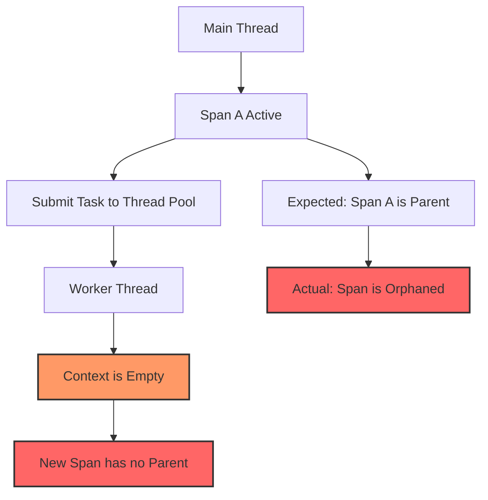

# How to Troubleshoot OpenTelemetry in Multi-Threaded Applications

Author: [nawazdhandala](https://www.github.com/nawazdhandala)

Tags: OpenTelemetry, Multi-Threading, Concurrency, Context Propagation, Tracing, Debugging, Java, Python, Go

Description: A practical guide to diagnosing and fixing OpenTelemetry context propagation issues in multi-threaded applications across Java, Python, and Go.

---

Multi-threaded applications introduce a whole category of problems that you do not encounter in single-threaded code. When you add OpenTelemetry to the mix, the most common issue is broken context propagation. Spans get orphaned, parent-child relationships disappear, and your traces look like a collection of disconnected fragments rather than a coherent picture of a request's journey.

This post covers the most frequent multi-threading issues with OpenTelemetry, why they happen, and how to fix them in Java, Python, and Go.

## Why Context Gets Lost Across Threads

OpenTelemetry stores the current span context in thread-local storage (or the language equivalent). When your application spawns a new thread or submits work to a thread pool, the new thread starts with an empty context. It has no knowledge of the span that was active on the originating thread.



The result is that spans created on worker threads have no parent, so they show up as separate root traces in your backend. This makes distributed tracing essentially useless for understanding multi-threaded request flows.

## Java: Thread Pools and ExecutorService

Java is where this problem shows up most frequently because thread pools are so heavily used. The standard `ExecutorService` does not propagate OpenTelemetry context automatically.

Here is the broken version:

```java
// BROKEN: Context is lost when submitting to executor
ExecutorService executor = Executors.newFixedThreadPool(4);

Span parentSpan = tracer.spanBuilder("parent-operation").startSpan();
try (Scope scope = parentSpan.makeCurrent()) {
    // This task runs on a different thread
    // The worker thread has no knowledge of parentSpan
    executor.submit(() -> {
        // This span will be a root span, not a child of parentSpan
        Span childSpan = tracer.spanBuilder("child-operation").startSpan();
        try (Scope childScope = childSpan.makeCurrent()) {
            doWork();
        } finally {
            childSpan.end();
        }
    });
} finally {
    parentSpan.end();
}
```

The fix is to wrap your `ExecutorService` with the OpenTelemetry context-aware wrapper, or manually propagate context:

```java
// FIX OPTION 1: Use Context.current().wrap() on the Runnable
ExecutorService executor = Executors.newFixedThreadPool(4);

Span parentSpan = tracer.spanBuilder("parent-operation").startSpan();
try (Scope scope = parentSpan.makeCurrent()) {
    // Wrap the runnable to capture the current context
    // Context.current() snapshots the active span context
    executor.submit(Context.current().wrap(() -> {
        // Now this span correctly becomes a child of parentSpan
        Span childSpan = tracer.spanBuilder("child-operation").startSpan();
        try (Scope childScope = childSpan.makeCurrent()) {
            doWork();
        } finally {
            childSpan.end();
        }
    }));
} finally {
    parentSpan.end();
}

// FIX OPTION 2: Wrap the entire ExecutorService
// This automatically propagates context for all submitted tasks
ExecutorService wrappedExecutor = Context.taskWrapping(
    Executors.newFixedThreadPool(4)
);
```

Option 2 is usually better because it handles context propagation for every task submitted to the pool, so you cannot accidentally forget to wrap a task.

## Python: Threading and concurrent.futures

Python has similar issues with its `threading` module and `concurrent.futures.ThreadPoolExecutor`. The OpenTelemetry Python SDK stores context in `contextvars`, which does propagate to threads created with `threading.Thread` in Python 3.12+. However, thread pools created with `concurrent.futures` can behave differently depending on the version.

Here is the problem and fix:

```python
import concurrent.futures
from opentelemetry import trace, context
from opentelemetry.context import attach, detach

tracer = trace.get_tracer("threading-example")

def worker_task(ctx):
    """Worker function that receives context explicitly."""
    # Attach the propagated context to this thread
    token = attach(ctx)
    try:
        # Now spans created here will be children of the parent
        with tracer.start_as_current_span("child-operation"):
            do_work()
    finally:
        # Always detach to clean up the thread's context
        detach(token)

# Create the parent span
with tracer.start_as_current_span("parent-operation"):
    # Capture the current context before submitting to the pool
    ctx = context.get_current()

    with concurrent.futures.ThreadPoolExecutor(max_workers=4) as pool:
        # Pass the captured context to the worker
        future = pool.submit(worker_task, ctx)
        future.result()  # Wait for completion
```

The key is capturing the context with `context.get_current()` on the calling thread and then attaching it with `attach()` on the worker thread. Without this, the worker thread will have a bare context with no active span.

For a cleaner approach, you can create a decorator that handles this automatically:

```python
import functools
from opentelemetry import context
from opentelemetry.context import attach, detach

def propagate_context(func):
    """Decorator that propagates OTel context to the wrapped function.
    Use this on any function submitted to a thread pool."""
    # Capture context at decoration time (when task is submitted)
    ctx = context.get_current()

    @functools.wraps(func)
    def wrapper(*args, **kwargs):
        token = attach(ctx)
        try:
            return func(*args, **kwargs)
        finally:
            detach(token)
    return wrapper

# Usage: wrap the callable before submitting to the pool
with tracer.start_as_current_span("parent"):
    pool.submit(propagate_context(my_task), arg1, arg2)
```

## Go: Goroutines and Context Passing

Go actually handles this better than most languages because its `context.Context` is an explicit parameter rather than thread-local state. However, the problem still shows up when developers forget to pass the context to goroutines.

```go
// BROKEN: The goroutine receives a background context
func handleRequest(ctx context.Context) {
    // Start a parent span
    ctx, parentSpan := tracer.Start(ctx, "parent-operation")
    defer parentSpan.End()

    // Common mistake: not passing ctx to the goroutine
    go func() {
        // context.Background() has no span information
        // This span will be orphaned
        _, childSpan := tracer.Start(context.Background(), "child-operation")
        defer childSpan.End()
        doWork()
    }()
}

// FIXED: Pass the context explicitly to the goroutine
func handleRequest(ctx context.Context) {
    ctx, parentSpan := tracer.Start(ctx, "parent-operation")
    defer parentSpan.End()

    // Pass ctx into the goroutine's closure
    go func(ctx context.Context) {
        // Now the child span correctly references the parent
        _, childSpan := tracer.Start(ctx, "child-operation")
        defer childSpan.End()
        doWork()
    }(ctx)  // Pass ctx as an argument
}
```

The fix in Go is straightforward, but it is easy to miss in code review. A good linting rule or a grep for `context.Background()` inside goroutines can catch these issues early.

## Diagnosing Broken Context in Production

When you suspect context propagation issues, here is how to confirm and find them.

First, look for traces with an unusually high number of root spans. In a healthy system, most traces should have a single root span. If you see traces with many roots, or if you see standalone spans that should be part of larger traces, context is being lost somewhere.

```promql
# Prometheus query to find services producing excessive root spans
# A high ratio of root spans to total spans indicates context loss
sum(rate(traces_spanmetrics_calls_total{span_kind="SPAN_KIND_INTERNAL", parent_span_id=""}[5m])) by (service_name)
/
sum(rate(traces_spanmetrics_calls_total{span_kind="SPAN_KIND_INTERNAL"}[5m])) by (service_name)
```

Second, add debug logging around context propagation points:

```java
// Java: Log the current trace context at submission and execution
Span currentSpan = Span.current();
logger.debug("Submitting task with traceId={} spanId={}",
    currentSpan.getSpanContext().getTraceId(),
    currentSpan.getSpanContext().getSpanId());

executor.submit(Context.current().wrap(() -> {
    Span workerSpan = Span.current();
    logger.debug("Executing task with traceId={} spanId={}",
        workerSpan.getSpanContext().getTraceId(),
        workerSpan.getSpanContext().getSpanId());
    // If traceId differs or is all zeros, context was lost
}));
```

If the traceId on the worker thread is all zeros or differs from the submitting thread, context propagation is broken at that point.

## Async Frameworks and Reactive Libraries

Modern async frameworks like Spring WebFlux, Project Reactor, and RxJava add another layer of complexity because they often hop between threads transparently. The OpenTelemetry Java agent handles many of these cases automatically through bytecode instrumentation, but if you are using the SDK directly, you need to be aware of the context propagation hooks.

For Spring WebFlux with Reactor:

```java
// Enable automatic context propagation in Reactor
// This must be called before any reactive chains are created
Hooks.enableAutomaticContextPropagation();

// With this enabled, the OpenTelemetry context flows through
// Reactor's operators even when they switch threads
Mono.just("data")
    .subscribeOn(Schedulers.boundedElastic())
    .flatMap(data -> {
        // Context is automatically propagated here
        Span span = tracer.spanBuilder("reactive-operation").startSpan();
        // ... span will correctly be a child of the upstream span
        return processData(data);
    });
```

For Python's asyncio, context propagation works differently. Since asyncio uses cooperative multitasking on a single thread, `contextvars` handles propagation correctly within the same event loop. The problem only arises when you mix asyncio with thread pools:

```python
import asyncio
from opentelemetry import context

async def async_handler():
    with tracer.start_as_current_span("async-parent"):
        # This works fine: context propagates within the event loop
        await async_child_operation()

        # This needs manual propagation: runs on a thread pool
        loop = asyncio.get_event_loop()
        ctx = context.get_current()
        await loop.run_in_executor(
            None,
            propagate_context(blocking_operation)
        )
```

## Common Pitfalls to Watch For

There are a few patterns that almost always lead to context loss:

1. **Caching thread pool executors globally** without wrapping them. If you create a `ThreadPoolExecutor` in a static field, make sure it is wrapped with `Context.taskWrapping()` in Java.

2. **Using fire-and-forget patterns** where you spawn a thread but never wait for it. The parent span might end before the child span starts, which can cause timing issues in your traces even if context propagation is correct.

3. **Double-wrapping context** accidentally. If you wrap a task with `Context.current().wrap()` and also use a wrapped executor, the context should be the same, but it adds confusion and overhead.

4. **Mixing SDK and agent instrumentation**. If you use the Java agent, it already handles many context propagation cases. Adding manual propagation on top can lead to unexpected behavior.

The safest approach is to always use the language's recommended context propagation mechanism, test it with a simple parent-child span test across threads, and verify the trace structure in your backend before deploying to production.
