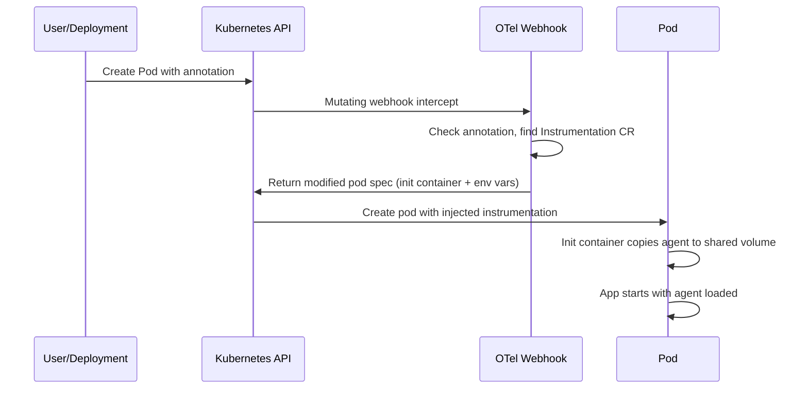
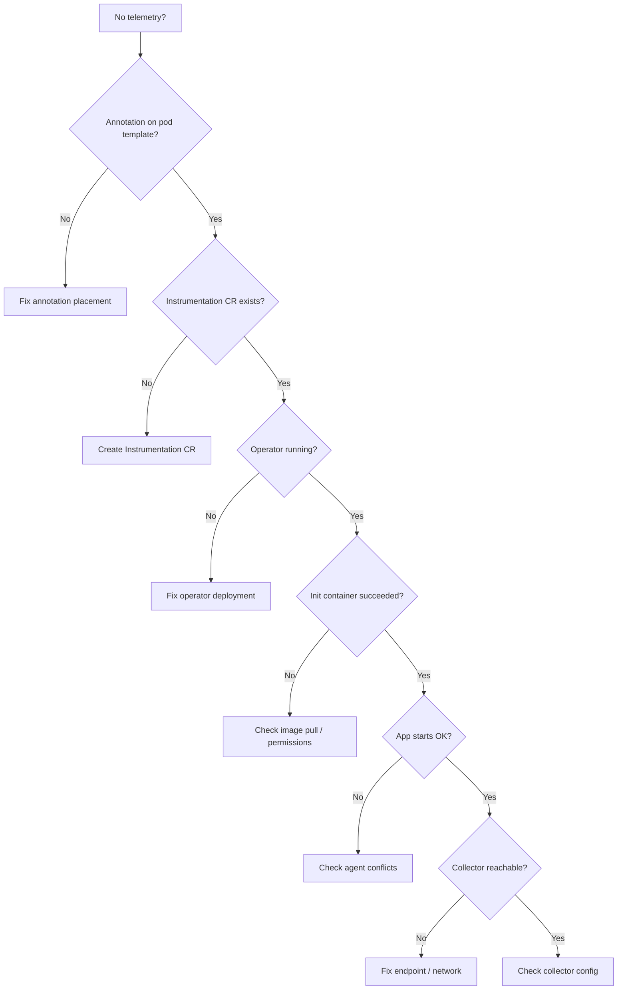

# How to Troubleshoot OpenTelemetry Operator Auto-Instrumentation Issues

Author: [nawazdhandala](https://www.github.com/nawazdhandala)

Tags: OpenTelemetry, Kubernetes, Auto-Instrumentation, Operator, Troubleshooting, Debugging

Description: A hands-on troubleshooting guide for common OpenTelemetry Operator auto-instrumentation problems, covering injection failures, missing telemetry, and configuration errors.

---

The OpenTelemetry Operator's auto-instrumentation feature is genuinely useful. You annotate a pod, and the operator injects the OpenTelemetry SDK into your application at startup. No code changes required. When it works, it feels like magic. When it does not work, it feels like a black box.

This post is a systematic troubleshooting guide. I have run into every one of these issues while setting up auto-instrumentation across multiple clusters. Each section covers a specific failure mode, how to identify it, and how to fix it.

## How Auto-Instrumentation Works

Before debugging, it helps to understand the mechanism. The OpenTelemetry Operator uses a Kubernetes mutating webhook. When a pod is created, the webhook intercepts the creation request and checks for specific annotations. If it finds `instrumentation.opentelemetry.io/inject-java: "true"` (or similar for other languages), it modifies the pod spec to:

1. Add an init container that copies the instrumentation agent into a shared volume
2. Mount that volume into the application container
3. Set environment variables that configure the agent (like `JAVA_TOOL_OPTIONS` or `NODE_OPTIONS`)



If any step in this chain breaks, you get either no instrumentation or a broken application. Let us go through the common failure modes.

## Issue 1: The Annotation is Not Being Recognized

This is the most common issue. You add the annotation, redeploy, and nothing happens. The pod starts without any instrumentation.

First, verify the annotation is actually on the pod (not just the Deployment).

```bash
# Check if the annotation made it to the pod spec
kubectl get pod <pod-name> -n <namespace> -o jsonpath='{.metadata.annotations}' | jq .
```

If the annotation is missing from the pod, make sure it is in the right place in your Deployment. The annotation must be in `spec.template.metadata.annotations`, not in `metadata.annotations` at the top level.

```yaml
# WRONG - annotation on the Deployment itself, not the pod template
apiVersion: apps/v1
kind: Deployment
metadata:
  name: my-app
  annotations:
    instrumentation.opentelemetry.io/inject-java: "true"  # This does nothing
spec:
  template:
    metadata:
      # RIGHT - annotation on the pod template
      annotations:
        instrumentation.opentelemetry.io/inject-java: "true"
    spec:
      containers:
        - name: my-app
          image: my-app:latest
```

Also check that the annotation value matches the Instrumentation resource name or is simply `"true"`. If you have multiple Instrumentation CRs, you can specify one by name.

```yaml
# Use a specific Instrumentation CR by namespace/name
annotations:
  instrumentation.opentelemetry.io/inject-java: "monitoring/my-instrumentation"
```

## Issue 2: The Instrumentation CR Does Not Exist

The webhook looks for an `Instrumentation` custom resource in the pod's namespace (or the one specified in the annotation). If it cannot find one, it silently skips injection.

```bash
# List all Instrumentation CRs in the namespace
kubectl get instrumentation -n <namespace>

# If empty, you need to create one
```

Here is a basic Instrumentation CR that works for most cases.

```yaml
# instrumentation.yaml
# Defines the auto-instrumentation configuration for Java applications
apiVersion: opentelemetry.io/v1alpha1
kind: Instrumentation
metadata:
  name: my-instrumentation
  namespace: default
spec:
  # Where the collector is running
  exporter:
    endpoint: http://otel-collector.monitoring:4317
  propagators:
    - tracecontext
    - baggage
  sampler:
    type: parentbased_traceidratio
    argument: "1.0"
  java:
    image: ghcr.io/open-telemetry/opentelemetry-operator/autoinstrumentation-java:latest
  nodejs:
    image: ghcr.io/open-telemetry/opentelemetry-operator/autoinstrumentation-nodejs:latest
  python:
    image: ghcr.io/open-telemetry/opentelemetry-operator/autoinstrumentation-python:latest
  dotnet:
    image: ghcr.io/open-telemetry/opentelemetry-operator/autoinstrumentation-dotnet:latest
```

Apply it and then restart your pods. The webhook only intercepts pod creation, so existing pods will not be modified.

```bash
# Apply the Instrumentation CR
kubectl apply -f instrumentation.yaml

# Restart the deployment to trigger re-injection
kubectl rollout restart deployment/my-app -n default
```

## Issue 3: The Webhook is Not Running

If the operator's webhook is down or misconfigured, no injection happens. Check the operator pod status first.

```bash
# Check if the operator pod is running
kubectl get pods -n opentelemetry-operator-system

# Check operator logs for errors
kubectl logs -n opentelemetry-operator-system deployment/opentelemetry-operator-controller-manager
```

Common webhook problems include:

- **Certificate expiry** - The webhook uses TLS. If the certificate has expired, the API server rejects the webhook call. If you used cert-manager, check the Certificate resource.
- **Webhook configuration mismatch** - The MutatingWebhookConfiguration must point to the correct service.

```bash
# Check the webhook configuration
kubectl get mutatingwebhookconfiguration -l app.kubernetes.io/name=opentelemetry-operator

# Describe it to see the service reference and failure policy
kubectl describe mutatingwebhookconfiguration opentelemetry-operator-mutating-webhook-configuration
```

If the `failurePolicy` is set to `Ignore`, webhook failures are silent. Temporarily set it to `Fail` during debugging to see if the webhook is actually being called.

## Issue 4: Init Container Fails

Sometimes the injection happens but the init container that copies the agent fails. This prevents the pod from starting.

```bash
# Check the pod's init containers
kubectl get pod <pod-name> -n <namespace> -o jsonpath='{.status.initContainerStatuses}' | jq .

# Check the init container logs
kubectl logs <pod-name> -n <namespace> -c opentelemetry-auto-instrumentation
```

The most common cause is an image pull failure. The init container uses the image specified in the Instrumentation CR (for example, `ghcr.io/open-telemetry/opentelemetry-operator/autoinstrumentation-java:latest`). If your cluster cannot reach that registry, the init container gets stuck in `ImagePullBackOff`.

Fix this by either allowing access to the registry or mirroring the image to your private registry and updating the Instrumentation CR.

```yaml
# Use a private registry mirror for the agent image
spec:
  java:
    image: my-registry.example.com/otel/autoinstrumentation-java:2.1.0
```

## Issue 5: Application Fails to Start After Injection

The agent is injected, but the application crashes or behaves incorrectly. This usually happens because the agent conflicts with something in the application.

Check the application container logs for errors related to the agent.

```bash
# Look for agent-related errors in the application logs
kubectl logs <pod-name> -n <namespace> -c my-app | grep -i "opentelemetry\|otel\|agent\|instrument"
```

For Java applications, the agent is loaded via `JAVA_TOOL_OPTIONS`. Check what value was injected.

```bash
# Check the environment variables injected by the operator
kubectl get pod <pod-name> -n <namespace> -o jsonpath='{.spec.containers[0].env}' | jq .
```

Common conflicts include:

- **Existing JAVA_TOOL_OPTIONS** - If your application already sets this variable, the operator appends to it, which can cause issues. Check for duplicate `-javaagent` flags.
- **Memory pressure** - The agent uses additional memory. If your container has tight memory limits, the added overhead can cause OOM kills.
- **Library conflicts** - Some applications bundle libraries that conflict with the agent's instrumentation. Check the agent docs for known incompatibilities.

You can pass additional agent configuration through environment variables in the Instrumentation CR.

```yaml
# Add environment variables to tune the Java agent
spec:
  java:
    image: ghcr.io/open-telemetry/opentelemetry-operator/autoinstrumentation-java:latest
    env:
      - name: OTEL_INSTRUMENTATION_COMMON_DEFAULT_ENABLED
        value: "true"
      - name: OTEL_INSTRUMENTATION_JDBC_ENABLED
        # Disable JDBC instrumentation if it causes conflicts
        value: "false"
```

## Issue 6: Telemetry is Not Reaching the Backend

Everything looks correct: the agent is injected, the application starts fine, but no traces or metrics appear in your backend. This is a connectivity issue between the agent and the collector.

```bash
# Verify the collector endpoint is reachable from the pod
kubectl exec <pod-name> -n <namespace> -- sh -c 'nc -zv otel-collector.monitoring 4317'
```

Check that the endpoint in the Instrumentation CR is correct. The agent runs inside the application container, so it needs to reach the collector over the Kubernetes network.

```yaml
# Make sure this endpoint resolves from the application's namespace
spec:
  exporter:
    endpoint: http://otel-collector.monitoring:4317
```

Also check the collector's logs to see if it is receiving any data.

```bash
# Check collector logs for incoming connections
kubectl logs -n monitoring deployment/otel-collector --tail=100
```

If the collector uses TLS, you need to configure the agent to use the correct protocol. By default, auto-instrumentation uses gRPC without TLS.

## Issue 7: Only Some Pods Get Instrumented

If you have multiple replicas and only some get instrumented, the issue is timing. The webhook only modifies pods at creation time. Pods that were created before the Instrumentation CR existed or before the operator was running will not have instrumentation.

The fix is simple: restart the affected pods.

```bash
# Restart all pods in a deployment to trigger re-injection
kubectl rollout restart deployment/my-app -n default

# Verify all pods have the init container
kubectl get pods -n default -l app=my-app -o jsonpath='{range .items[*]}{.metadata.name}{"\t"}{.spec.initContainers[*].name}{"\n"}{end}'
```

## Debugging Checklist

When auto-instrumentation is not working, go through this checklist in order:

1. Is the annotation on the pod template (not the Deployment metadata)?
2. Does an Instrumentation CR exist in the correct namespace?
3. Is the OpenTelemetry Operator pod running and healthy?
4. Is the mutating webhook configured and its certificate valid?
5. Did the init container complete successfully?
6. Are the correct environment variables set on the application container?
7. Does the application start without errors?
8. Can the application reach the collector endpoint?
9. Is the collector receiving and exporting data?



Work through each step methodically. In my experience, about 80% of auto-instrumentation issues fall into the first three categories: wrong annotation placement, missing Instrumentation CR, or an unhealthy operator. The remaining 20% involve connectivity problems or agent conflicts. With this checklist, you can diagnose most issues in under 10 minutes.
