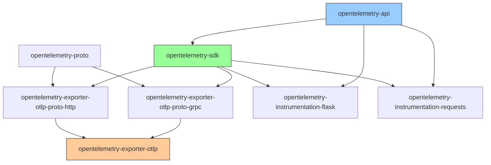

# How to Troubleshoot OpenTelemetry Python SDK ImportError Issues

Author: [nawazdhandala](https://www.github.com/nawazdhandala)

Tags: OpenTelemetry, Python, SDK, ImportError, Troubleshooting, Dependencies

Description: A practical guide to diagnosing and resolving ImportError and ModuleNotFoundError issues with the OpenTelemetry Python SDK packages.

---

If you have worked with the OpenTelemetry Python SDK for any length of time, you have almost certainly hit an ImportError that made you question your sanity. The Python SDK is split across dozens of packages, each with its own version, and the naming conventions are long enough that a single typo can send you down a debugging rabbit hole. This guide covers the most common ImportError scenarios and how to resolve them quickly.

## Why ImportErrors Happen So Often with OpenTelemetry

The OpenTelemetry Python ecosystem is organized as a collection of small, focused packages rather than one monolithic library. The core API is separate from the SDK, which is separate from each exporter, which is separate from each instrumentation library. This design is intentional and makes sense architecturally, but it means you need to install the right combination of packages, and they all need to be compatible versions.

Here is a simplified view of the package dependency tree:



Every arrow is a dependency that needs to be satisfied. Miss one, and you get an ImportError.

## Error 1: ModuleNotFoundError for the Base SDK

The most basic error looks like this:

```
ModuleNotFoundError: No module named 'opentelemetry'
```

This means the OpenTelemetry API package is not installed in your current Python environment. The fix is straightforward:

```bash
# Install the core API and SDK packages.
# The API provides the interfaces, the SDK provides the implementation.
pip install opentelemetry-api opentelemetry-sdk
```

But wait. If you installed it and still get the error, you likely have a Python environment mismatch. This is extremely common with virtual environments, Docker containers, and system Python installations coexisting:

```bash
# Check which Python is running your application
which python
# /usr/bin/python3

# Check which pip you used to install
which pip
# /home/user/.local/bin/pip

# These might be different Python installations!
# Always use the same Python to run pip:
python3 -m pip install opentelemetry-api opentelemetry-sdk

# Verify the installation in the correct environment
python3 -c "import opentelemetry; print(opentelemetry.__file__)"
```

In Docker, a common issue is installing packages in one stage but running in another:

```dockerfile
# Wrong: packages installed in build stage are not available in runtime stage
FROM python:3.11 AS builder
RUN pip install opentelemetry-api opentelemetry-sdk

FROM python:3.11-slim AS runtime
# Missing: COPY --from=builder or reinstall
COPY . /app
CMD ["python", "/app/main.py"]  # ImportError!

# Right: install in the runtime stage or copy from builder
FROM python:3.11-slim
COPY requirements.txt /app/
RUN pip install -r /app/requirements.txt
COPY . /app
CMD ["python", "/app/main.py"]
```

## Error 2: ImportError for Specific Exporters

This is probably the most common error people hit:

```
ModuleNotFoundError: No module named 'opentelemetry.exporter.otlp.proto.grpc'
```

The OTLP exporter is not included in the base SDK. You need to install it separately, and you need to install the right variant:

```bash
# For gRPC-based OTLP export (default for port 4317)
pip install opentelemetry-exporter-otlp-proto-grpc

# For HTTP-based OTLP export (default for port 4318)
pip install opentelemetry-exporter-otlp-proto-http

# Or install the meta-package that includes both
pip install opentelemetry-exporter-otlp
```

The import paths are long and easy to mistype. Here is a reference for the correct imports:

```python
# gRPC trace exporter
# Package: opentelemetry-exporter-otlp-proto-grpc
from opentelemetry.exporter.otlp.proto.grpc.trace_exporter import OTLPSpanExporter

# gRPC metric exporter
# Package: opentelemetry-exporter-otlp-proto-grpc
from opentelemetry.exporter.otlp.proto.grpc.metric_exporter import OTLPMetricExporter

# gRPC log exporter
# Package: opentelemetry-exporter-otlp-proto-grpc
from opentelemetry.exporter.otlp.proto.grpc._log_exporter import OTLPLogExporter

# HTTP trace exporter
# Package: opentelemetry-exporter-otlp-proto-http
from opentelemetry.exporter.otlp.proto.http.trace_exporter import OTLPSpanExporter

# HTTP metric exporter
# Package: opentelemetry-exporter-otlp-proto-http
from opentelemetry.exporter.otlp.proto.http.metric_exporter import OTLPMetricExporter

# HTTP log exporter
# Package: opentelemetry-exporter-otlp-proto-http
from opentelemetry.exporter.otlp.proto.http._log_exporter import OTLPLogExporter
```

Notice the underscore prefix on `_log_exporter`. This is a common stumbling point. The log exporter module name starts with an underscore in some SDK versions because it was initially considered experimental. If you get an ImportError on the log exporter, try both with and without the underscore.

## Error 3: Version Mismatches Between Packages

This is the sneakiest category of ImportError. You have all the right packages installed, but they are at incompatible versions. The error messages can be misleading:

```
ImportError: cannot import name 'StatusCode' from 'opentelemetry.trace'
```

or

```
AttributeError: module 'opentelemetry.sdk.trace' has no attribute 'SpanLimits'
```

These happen when one package expects a class or function that exists in a different version of another package. The fix is to ensure all OpenTelemetry packages are at compatible versions:

```bash
# Check what versions are currently installed
pip list | grep opentelemetry

# Example output showing a version mismatch:
# opentelemetry-api              1.21.0
# opentelemetry-sdk              1.18.0    <- older than api!
# opentelemetry-exporter-otlp    1.21.0

# Fix by upgrading everything together
pip install --upgrade \
    opentelemetry-api \
    opentelemetry-sdk \
    opentelemetry-exporter-otlp \
    opentelemetry-semantic-conventions
```

The OpenTelemetry Python packages follow a versioning scheme where the API and SDK share the same version number. Instrumentation packages have their own version scheme but declare compatibility ranges. The safest approach is to pin all packages to the same release:

```
# requirements.txt with pinned compatible versions
# All core packages should use the same version
opentelemetry-api==1.25.0
opentelemetry-sdk==1.25.0
opentelemetry-semantic-conventions==0.46b0
opentelemetry-exporter-otlp-proto-grpc==1.25.0
opentelemetry-exporter-otlp-proto-http==1.25.0

# Instrumentation packages have their own version scheme
# but are released alongside the core packages
opentelemetry-instrumentation-flask==0.46b0
opentelemetry-instrumentation-requests==0.46b0
```

Note that instrumentation packages and semantic conventions use a different version number (0.Xb0) from the core packages (1.X.0). These are released together and should be installed from the same release.

## Error 4: Instrumentation Library ImportErrors

Auto-instrumentation libraries are each their own package, and missing one produces errors like:

```
ModuleNotFoundError: No module named 'opentelemetry.instrumentation.flask'
```

Each instrumentation library is a separate pip package:

```bash
# Install instrumentation libraries for the frameworks you use
pip install opentelemetry-instrumentation-flask
pip install opentelemetry-instrumentation-django
pip install opentelemetry-instrumentation-requests
pip install opentelemetry-instrumentation-psycopg2
pip install opentelemetry-instrumentation-redis
pip install opentelemetry-instrumentation-sqlalchemy

# Or use the opentelemetry-bootstrap command to auto-detect
# and install instrumentations for packages in your environment
opentelemetry-bootstrap -a install
```

The `opentelemetry-bootstrap` command is part of the `opentelemetry-instrumentation` package and is extremely useful. It scans your installed packages, detects which instrumentation libraries are relevant, and installs them:

```bash
# Install the bootstrap tool
pip install opentelemetry-instrumentation

# See what instrumentations are available for your environment
opentelemetry-bootstrap -a requirements

# Example output:
# opentelemetry-instrumentation-flask==0.46b0
# opentelemetry-instrumentation-requests==0.46b0
# opentelemetry-instrumentation-sqlalchemy==0.46b0

# Install all of them
opentelemetry-bootstrap -a install
```

## Error 5: Protobuf Version Conflicts

The OTLP exporters depend on protobuf and grpcio, and version conflicts with these packages cause some of the most confusing errors:

```
ImportError: cannot import name 'descriptor' from 'google.protobuf'
```

or

```
TypeError: Descriptors cannot not be created directly.
```

This typically happens when you have protobuf 4.x installed but a package expects protobuf 3.x, or vice versa:

```bash
# Check protobuf version
pip show protobuf

# If you see protobuf 4.x and get descriptor errors,
# the opentelemetry-proto package might need a specific range.
# Check what version is required:
pip show opentelemetry-proto | grep Requires

# Fix by installing a compatible protobuf version
pip install "protobuf>=3.19,<5.0"
```

The grpcio package can also cause issues, especially on certain platforms:

```bash
# If grpc import fails, you might need to install from source
# or use a specific version
pip install --upgrade grpcio

# On some systems (especially M1/M2 Macs), you may need:
pip install grpcio --no-binary :all:

# Or use the HTTP exporter to avoid grpc entirely
pip install opentelemetry-exporter-otlp-proto-http
```

If you want to avoid gRPC dependency issues altogether, use the HTTP-based exporter instead:

```python
# HTTP exporter has fewer native dependencies than gRPC.
# It uses the requests library under the hood, which is pure Python.
from opentelemetry.exporter.otlp.proto.http.trace_exporter import OTLPSpanExporter

exporter = OTLPSpanExporter(
    endpoint="http://localhost:4318",
)
```

## Error 6: Namespace Package Conflicts

OpenTelemetry Python uses namespace packages, which means the `opentelemetry` top-level package is shared across multiple installed packages. If namespace resolution breaks, you get strange ImportErrors even though the package is installed.

A common cause is having a file named `opentelemetry.py` in your project directory:

```bash
# Check if you accidentally shadowed the package
# This will show YOUR file instead of the installed package
python3 -c "import opentelemetry; print(opentelemetry.__file__)"

# If this prints a path in your project directory, you have a conflict.
# Rename your file to something else.
```

Another cause is stale `.pyc` files or `__pycache__` directories:

```bash
# Clear cached bytecode that might reference old package locations
find /path/to/your/project -type d -name __pycache__ -exec rm -rf {} +
find /path/to/your/project -name "*.pyc" -delete

# Then reinstall the packages
pip install --force-reinstall opentelemetry-api opentelemetry-sdk
```

## Error 7: Auto-Instrumentation Agent ImportErrors

When using `opentelemetry-instrument` to auto-instrument your application, you might see errors during startup:

```
Failed to auto-instrument 'flask': No module named 'opentelemetry.instrumentation.flask'
```

This means the auto-instrumentation agent detected Flask but the instrumentation package is not installed. The agent will continue running your application without that instrumentation, but you will miss telemetry from that framework.

```bash
# The correct way to use auto-instrumentation:
# 1. Install the agent
pip install opentelemetry-distro opentelemetry-instrumentation

# 2. Install instrumentations for your dependencies
opentelemetry-bootstrap -a install

# 3. Run your app with the agent
opentelemetry-instrument python myapp.py
```

If you get errors about missing entry points:

```
pkg_resources.DistributionNotFound: The 'opentelemetry-instrumentation-flask' distribution was not found
```

This usually means the package was installed in a different environment or pip metadata is corrupted:

```bash
# Reinstall with fresh metadata
pip install --force-reinstall opentelemetry-instrumentation-flask

# Verify it is registered as an entry point
pip show opentelemetry-instrumentation-flask
```

## A Systematic Approach to Resolving ImportErrors

When you hit an ImportError, follow these steps:

```bash
# Step 1: Verify you are in the correct Python environment
which python
python --version

# Step 2: List all installed OpenTelemetry packages
pip list | grep opentelemetry

# Step 3: Check for version mismatches
# All core packages should share the same version
pip list | grep opentelemetry | sort

# Step 4: Check what the failing import actually needs
python -c "from opentelemetry.exporter.otlp.proto.grpc.trace_exporter import OTLPSpanExporter"

# Step 5: Install missing packages
pip install opentelemetry-exporter-otlp-proto-grpc

# Step 6: If versions are mixed, do a clean reinstall
pip install --upgrade --force-reinstall \
    opentelemetry-api \
    opentelemetry-sdk \
    opentelemetry-exporter-otlp
```

## Conclusion

ImportError issues with the OpenTelemetry Python SDK almost always come down to one of a few root causes: missing packages, version mismatches, environment confusion, or namespace conflicts. The split-package architecture of the Python SDK makes it easy to end up with an incomplete or inconsistent installation. The best defense is to pin all package versions together in your requirements file, use `opentelemetry-bootstrap` to detect needed instrumentation packages, and always verify you are working in the correct Python environment. When in doubt, a clean reinstall of all OpenTelemetry packages with matching versions will resolve most issues.
