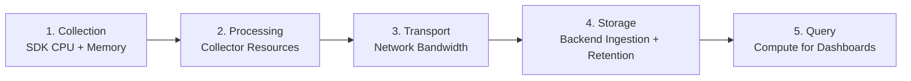

# How to Calculate the True Cost per Gigabyte of OpenTelemetry Data Across Your Pipeline

Author: [nawazdhandala](https://www.github.com/nawazdhandala)

Tags: OpenTelemetry, Cost Analysis, Pipeline, FinOps

Description: Break down the real cost of OpenTelemetry data by accounting for collection, processing, transport, storage, and query.

When someone asks "how much does our observability cost per GB?", the answer is almost never the vendor's listed ingestion price. The true cost includes CPU cycles for collection, network bandwidth for transport, processing overhead in the Collector, storage at the backend, and the compute required to query that data. Ignoring any of these components leads to underestimating your actual spend by 30-60%.

## The Five Cost Components

Every gigabyte of telemetry passes through five stages, each with its own cost:



## 1. Collection Cost (SDK Overhead)

The OpenTelemetry SDK consumes CPU and memory inside your application process. This cost is real but often invisible because it is bundled into your compute bill.

To measure SDK overhead, compare resource usage with and without instrumentation:

```python
# Benchmark script that measures the CPU overhead of the OTel SDK
# by timing a function with and without tracing enabled.
import time
from opentelemetry.sdk.trace import TracerProvider
from opentelemetry.sdk.trace.export import SimpleSpanProcessor, ConsoleSpanExporter

def work():
    """Simulate a unit of work."""
    total = 0
    for i in range(10000):
        total += i
    return total

# Baseline: no instrumentation
start = time.perf_counter()
for _ in range(10000):
    work()
baseline = time.perf_counter() - start

# With instrumentation
provider = TracerProvider()
provider.add_span_processor(SimpleSpanProcessor(ConsoleSpanExporter()))
tracer = provider.get_tracer("benchmark")

start = time.perf_counter()
for _ in range(10000):
    with tracer.start_as_current_span("work"):
        work()
instrumented = time.perf_counter() - start

overhead_pct = ((instrumented - baseline) / baseline) * 100
print(f"SDK overhead: {overhead_pct:.1f}%")
# Typical result: 1-5% CPU overhead per service
```

To convert this into dollars: if a service runs on a 4-vCPU instance costing $120/month and the SDK adds 3% overhead, that is $3.60/month per instance. Across 200 instances, that is $720/month just for collection.

## 2. Processing Cost (Collector Infrastructure)

The Collector needs its own compute. A common sizing rule is that one Collector instance with 2 vCPUs and 4 GB RAM can handle roughly 10,000 spans per second.

Here is a formula to estimate Collector cost:

```yaml
# Collector resource estimation worksheet.
# Fill in your values to calculate monthly Collector cost.
#
# throughput_spans_per_sec: 50000
# spans_per_collector: 10000
# collectors_needed: 50000 / 10000 = 5
# cost_per_collector_monthly: $95  (c5.large on AWS)
# total_collector_cost: 5 * $95 = $475/month
#
# For logs, a similar Collector handles ~20,000 records/sec.
# For metrics, throughput depends on series count more than volume.
```

## 3. Transport Cost (Network Bandwidth)

Telemetry data travels from your services to the Collector, and from the Collector to the backend. With compression enabled (zstd or gzip), OTLP data compresses at roughly 10:1 for traces and 15:1 for logs.

Estimate monthly network cost:

```python
# Calculate monthly network transfer cost for telemetry.
raw_gb_per_day = 500          # Uncompressed telemetry volume
compression_ratio = 10         # zstd compression for OTLP protobuf
compressed_gb_per_day = raw_gb_per_day / compression_ratio  # 50 GB/day

monthly_transfer_gb = compressed_gb_per_day * 30  # 1,500 GB/month

# AWS data transfer pricing (same-region)
intra_az_cost_per_gb = 0.01   # $0.01/GB within same AZ
cross_az_cost_per_gb = 0.02   # $0.02/GB across AZs

# If Collector runs in a different AZ than most services:
monthly_network_cost = monthly_transfer_gb * cross_az_cost_per_gb
print(f"Monthly network cost: ${monthly_network_cost:.2f}")
# Result: $30.00/month for intra-region transport
```

## 4. Storage Cost (Backend Ingestion and Retention)

This is the number most people focus on, and it varies wildly by vendor:

| Backend | Ingestion Cost per GB | Storage per GB/month | 30-day cost for 500 GB/day |
|---------|----------------------|---------------------|---------------------------|
| Managed vendor A | $0.30 | Included | $4,500 |
| Managed vendor B | $0.10 | $0.03 | $1,950 |
| Self-hosted ClickHouse | $0.00 (compute only) | $0.023 (EBS) | $800 (compute + storage) |
| S3 cold storage | N/A | $0.023 | $345 |

## 5. Query Cost (Dashboard and Alert Compute)

Every dashboard panel, every alert rule, and every ad-hoc query costs compute. For self-hosted backends, this is the CPU cost of your query nodes. For managed vendors, it may be bundled into the ingestion price or charged separately.

## Putting It All Together

Here is a complete cost-per-GB calculation for a hypothetical pipeline:

```python
# Full pipeline cost calculation for 500 GB/day raw telemetry.
daily_raw_gb = 500

# 1. Collection: 200 instances * $3.60/month SDK overhead
collection_monthly = 200 * 3.60  # $720

# 2. Processing: 5 Collector instances
processing_monthly = 5 * 95  # $475

# 3. Transport: compressed data across AZs
transport_monthly = (daily_raw_gb / 10) * 30 * 0.02  # $30

# 4. Storage: using a managed vendor at $0.15/GB ingested
storage_monthly = daily_raw_gb * 30 * 0.15  # $2,250

# 5. Query: 2 query nodes for dashboards and alerts
query_monthly = 2 * 200  # $400

total_monthly = (collection_monthly + processing_monthly +
                 transport_monthly + storage_monthly + query_monthly)
monthly_gb = daily_raw_gb * 30

true_cost_per_gb = total_monthly / monthly_gb
print(f"Total monthly cost: ${total_monthly:,.2f}")
print(f"True cost per GB: ${true_cost_per_gb:.4f}")
# Total monthly cost: $3,875.00
# True cost per GB: $0.2583
# Vendor-only cost per GB: $0.1500 (42% undercount)
```

## Automating Cost Tracking

Export these calculations as custom OpenTelemetry metrics so you can track cost trends alongside your telemetry:

```yaml
# Collector config that exposes pipeline cost metrics
# based on throughput measurements.
processors:
  transform/cost_metrics:
    metric_statements:
      - context: datapoint
        statements:
          # Tag all throughput metrics with the cost-center
          # for downstream aggregation in cost dashboards.
          - set(attributes["pipeline.stage"], "collector")
          - set(attributes["cost.model"], "per-gb")

exporters:
  prometheus:
    endpoint: 0.0.0.0:8889
```

Understanding the true cost per gigabyte gives you the data to make informed tradeoffs: sampling more aggressively, routing low-value data to cold storage, or renegotiating vendor contracts with actual volume projections. Without this visibility, you are optimizing in the dark.
