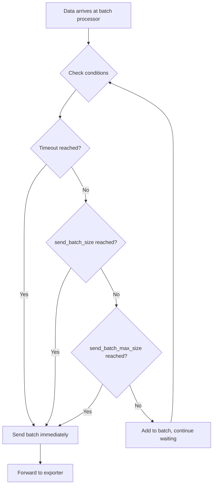

# How to Tune Batch Processor Settings for Optimal Collector Performance

Author: [nawazdhandala](https://www.github.com/nawazdhandala)

Tags: OpenTelemetry, Collector, Batch Processor, Performance, Optimization

Description: Master batch processor configuration in OpenTelemetry Collector to optimize throughput, reduce latency, and minimize resource consumption through proper tuning.

The batch processor is one of the most important components in the OpenTelemetry Collector pipeline. It aggregates telemetry data before sending it to exporters, significantly reducing the number of network calls and improving overall performance. However, improper batch configuration can lead to increased latency, memory pressure, or inefficient resource utilization.

This comprehensive guide explores how to tune batch processor settings for optimal performance across different workload patterns and infrastructure constraints.

## Understanding the Batch Processor

The batch processor accepts spans, metrics, and logs and groups them into batches before forwarding to the next component in the pipeline. This batching mechanism provides several benefits:

- **Reduced Network Overhead**: Fewer HTTP/gRPC calls mean less network overhead and connection management
- **Better Compression**: Larger payloads compress more efficiently, reducing bandwidth usage
- **Backend Optimization**: Backend systems can process batches more efficiently than individual data points
- **Cost Reduction**: Many backend services charge per API call, making batching more economical

Understanding how the batch processor makes decisions about when to send data is critical for proper tuning.

## Core Batch Processor Parameters

The batch processor uses several key parameters to determine when to send batched data:

```yaml
processors:
  batch:
    # Maximum time to wait before sending a batch, regardless of size
    # Lower values = lower latency, higher values = better batching efficiency
    timeout: 10s

    # Number of spans/metrics/logs after which to send a batch
    # Reaches this size = immediate send
    send_batch_size: 8192

    # Maximum number of items in a batch (hard limit)
    # Prevents extremely large batches that could cause memory issues
    send_batch_max_size: 16384

    # Additional metadata keys to use for creating separate batches
    # Useful for tenant isolation or routing
    metadata_keys: []

    # Cardinality limit for metadata keys
    metadata_cardinality_limit: 1000
```

Each parameter influences different aspects of performance and behavior. Finding the right balance requires understanding your workload characteristics.

## How Batch Processor Makes Sending Decisions

The batch processor sends data when any of these conditions are met:



Understanding this decision tree helps you predict how your configuration will behave under different load patterns.

## Tuning for Low-Latency Applications

Applications requiring low latency need telemetry data to reach backends quickly for real-time alerting and analysis.

```yaml
processors:
  batch/low-latency:
    # Send batches frequently to minimize delay
    timeout: 1s

    # Smaller batch size for faster throughput
    send_batch_size: 512

    # Still set a reasonable max to prevent oversized batches
    send_batch_max_size: 1024

exporters:
  otlp/backend:
    endpoint: backend.example.com:4317
    # Configure smaller sending queue since batches are smaller
    sending_queue:
      queue_size: 1000

service:
  pipelines:
    traces:
      receivers: [otlp]
      processors: [batch/low-latency]
      exporters: [otlp/backend]
```

This configuration prioritizes speed over efficiency. Data typically reaches the backend within 1-2 seconds of being received by the collector.

**Use case**: User-facing applications, real-time monitoring, SLA-sensitive services.

## Tuning for High-Throughput Applications

High-throughput environments benefit from larger batches that maximize efficiency and reduce per-request overhead.

```yaml
processors:
  batch/high-throughput:
    # Longer timeout allows more data to accumulate
    timeout: 30s

    # Large batch size for efficiency
    send_batch_size: 16384

    # Set maximum to prevent memory issues
    send_batch_max_size: 32768

exporters:
  otlp/backend:
    endpoint: backend.example.com:4317
    # Larger sending queue for burst handling
    sending_queue:
      queue_size: 10000
    # Enable compression for large batches
    compression: gzip

service:
  pipelines:
    traces:
      receivers: [otlp]
      processors: [batch/high-throughput]
      exporters: [otlp/backend]
```

This configuration maximizes batching efficiency, reducing the number of network calls and improving compression ratios.

**Use case**: Batch processing systems, high-volume APIs, cost-sensitive deployments.

## Tuning for Bursty Workloads

Applications with irregular traffic patterns need configurations that handle both quiet periods and traffic spikes effectively.

```yaml
processors:
  batch/bursty:
    # Moderate timeout handles both scenarios
    timeout: 5s

    # Moderate batch size
    send_batch_size: 4096

    # Higher max size absorbs bursts
    send_batch_max_size: 12288

exporters:
  otlp/backend:
    endpoint: backend.example.com:4317
    sending_queue:
      # Large queue absorbs spikes
      queue_size: 20000
      # Enable persistence for reliability
      storage: file_storage
    retry_on_failure:
      enabled: true
      initial_interval: 1s
      max_interval: 30s
      max_elapsed_time: 300s

extensions:
  file_storage:
    directory: /var/lib/otel-collector/storage
    timeout: 10s

service:
  extensions: [file_storage]
  pipelines:
    traces:
      receivers: [otlp]
      processors: [batch/bursty]
      exporters: [otlp/backend]
```

This configuration provides headroom for traffic spikes while maintaining reasonable latency during normal operations.

**Use case**: Web applications with daily traffic patterns, seasonal systems, event-driven architectures.

## Memory-Constrained Environments

When running the collector with limited memory, batch sizing must be carefully controlled to prevent out-of-memory errors.

```yaml
processors:
  batch/memory-limited:
    # Shorter timeout prevents excessive accumulation
    timeout: 5s

    # Conservative batch sizes
    send_batch_size: 2048

    # Strict maximum to control memory usage
    send_batch_max_size: 4096

  # Memory limiter should be placed BEFORE batch processor
  memory_limiter:
    check_interval: 1s
    # Trigger at 80% of available memory
    limit_mib: 1024
    # Start dropping at 90%
    spike_limit_mib: 1280

exporters:
  otlp/backend:
    endpoint: backend.example.com:4317
    sending_queue:
      # Smaller queue to conserve memory
      queue_size: 500

service:
  pipelines:
    traces:
      receivers: [otlp]
      # Memory limiter MUST come before batch
      processors: [memory_limiter, batch/memory-limited]
      exporters: [otlp/backend]
```

The memory limiter protects against excessive memory consumption by applying back-pressure when limits are approached.

**Important**: Always place the memory limiter before the batch processor in the pipeline to ensure it can effectively throttle incoming data.

## Multi-Tenant Batch Configuration

When handling data from multiple tenants, you may want separate batches per tenant for isolation or routing purposes.

```yaml
processors:
  batch/multi-tenant:
    timeout: 10s
    send_batch_size: 4096
    send_batch_max_size: 8192

    # Create separate batches based on tenant identifier
    metadata_keys:
      - tenant_id

    # Limit number of unique tenants to prevent memory issues
    metadata_cardinality_limit: 100

  # Extract tenant information from attributes
  resource:
    attributes:
      - key: tenant_id
        from_attribute: tenant.id
        action: insert

exporters:
  # Route different tenants to different backends if needed
  otlp/tenant-a:
    endpoint: tenant-a-backend.example.com:4317

  otlp/tenant-b:
    endpoint: tenant-b-backend.example.com:4317

  # Default backend for all others
  otlp/default:
    endpoint: default-backend.example.com:4317

service:
  pipelines:
    traces:
      receivers: [otlp]
      processors: [resource, batch/multi-tenant]
      exporters: [otlp/default]
```

The `metadata_keys` parameter ensures that telemetry from different tenants is batched separately, even if it arrives interleaved.

## Signal-Specific Batch Configurations

Different signal types (traces, metrics, logs) often have different characteristics and requirements.

```yaml
processors:
  # Traces: Balance latency and throughput
  batch/traces:
    timeout: 10s
    send_batch_size: 8192
    send_batch_max_size: 16384

  # Metrics: Can batch more aggressively
  batch/metrics:
    timeout: 60s
    send_batch_size: 16384
    send_batch_max_size: 32768

  # Logs: Quick delivery for alerting
  batch/logs:
    timeout: 2s
    send_batch_size: 4096
    send_batch_max_size: 8192

exporters:
  otlp/backend:
    endpoint: backend.example.com:4317

service:
  pipelines:
    traces:
      receivers: [otlp]
      processors: [batch/traces]
      exporters: [otlp/backend]

    metrics:
      receivers: [otlp]
      processors: [batch/metrics]
      exporters: [otlp/backend]

    logs:
      receivers: [otlp]
      processors: [batch/logs]
      exporters: [otlp/backend]
```

This approach optimizes each signal type independently based on its typical characteristics and usage patterns.

## Monitoring Batch Processor Performance

The batch processor exposes internal metrics that help you understand its behavior and tune settings.

```yaml
receivers:
  otlp:
    protocols:
      grpc:
        endpoint: 0.0.0.0:4317

  # Collect internal collector metrics
  prometheus:
    config:
      scrape_configs:
        - job_name: 'otel-collector'
          scrape_interval: 10s
          static_configs:
            - targets: ['localhost:8888']

processors:
  batch:
    timeout: 10s
    send_batch_size: 8192
    send_batch_max_size: 16384

exporters:
  otlp/backend:
    endpoint: backend.example.com:4317

  # Export collector's own metrics
  prometheusremotewrite:
    endpoint: http://prometheus:9090/api/v1/write

extensions:
  # Enable internal metrics endpoint
  zpages:
    endpoint: :55679

service:
  extensions: [zpages]
  telemetry:
    metrics:
      # Enable detailed internal metrics
      level: detailed
      address: :8888

  pipelines:
    # Application telemetry
    traces:
      receivers: [otlp]
      processors: [batch]
      exporters: [otlp/backend]

    # Collector's own metrics
    metrics/internal:
      receivers: [prometheus]
      exporters: [prometheusremotewrite]
```

Key metrics to monitor:

- `otelcol_processor_batch_batch_send_size`: Distribution of actual batch sizes sent
- `otelcol_processor_batch_timeout_trigger_send`: Number of batches sent due to timeout
- `otelcol_processor_batch_batch_size_trigger_send`: Number of batches sent due to size threshold
- `otelcol_processor_batch_metadata_cardinality`: Number of unique metadata key combinations

## Performance Testing and Optimization Workflow

Follow this systematic approach to find optimal batch settings for your environment:

1. **Establish Baseline**: Start with default settings and measure current performance
2. **Identify Bottleneck**: Use metrics to determine if you're limited by latency, throughput, or memory
3. **Make Incremental Changes**: Adjust one parameter at a time
4. **Measure Impact**: Monitor metrics for at least 24 hours to account for traffic variations
5. **Iterate**: Continue adjusting based on observed behavior

Here's a script to generate test load and measure batch processor behavior:

```bash
#!/bin/bash
# test-batch-performance.sh

COLLECTOR_ENDPOINT="localhost:4317"
DURATION=300  # 5 minutes
SPANS_PER_SECOND=1000

echo "Starting load test: ${SPANS_PER_SECOND} spans/sec for ${DURATION}s"

# Use telemetrygen to generate test load
docker run --rm --network host \
  ghcr.io/open-telemetry/opentelemetry-collector-contrib/telemetrygen:latest \
  traces \
  --otlp-endpoint ${COLLECTOR_ENDPOINT} \
  --otlp-insecure \
  --duration ${DURATION}s \
  --rate ${SPANS_PER_SECOND} \
  --workers 10

echo "Load test complete. Check collector metrics at http://localhost:8888/metrics"
```

## Common Batch Processor Anti-Patterns

Avoid these common mistakes when configuring the batch processor:

**Anti-pattern 1**: Setting `timeout` too high without considering latency requirements
```yaml
# Don't do this for low-latency applications
processors:
  batch:
    timeout: 5m  # Data could sit for 5 minutes!
```

**Anti-pattern 2**: Setting `send_batch_max_size` lower than `send_batch_size`
```yaml
# Invalid configuration
processors:
  batch:
    send_batch_size: 10000
    send_batch_max_size: 5000  # This doesn't make sense
```

**Anti-pattern 3**: Ignoring memory constraints
```yaml
# Dangerous in memory-limited environments
processors:
  batch:
    send_batch_size: 100000
    send_batch_max_size: 200000  # Could cause OOM
```

**Anti-pattern 4**: Using the same batch configuration for all signal types
```yaml
# Suboptimal: treats all signals the same
processors:
  batch:
    timeout: 30s  # Too slow for logs, unnecessary for metrics
```

## Production-Ready Batch Configuration

Here's a comprehensive, production-ready configuration that balances performance, reliability, and observability:

```yaml
receivers:
  otlp:
    protocols:
      grpc:
        endpoint: 0.0.0.0:4317
      http:
        endpoint: 0.0.0.0:4318

processors:
  # Memory protection comes first
  memory_limiter:
    check_interval: 1s
    limit_percentage: 75
    spike_limit_percentage: 20

  # Resource detection adds useful context
  resourcedetection:
    detectors: [env, system]
    timeout: 5s

  # Signal-specific batch configurations
  batch/traces:
    timeout: 10s
    send_batch_size: 8192
    send_batch_max_size: 16384

  batch/metrics:
    timeout: 30s
    send_batch_size: 12288
    send_batch_max_size: 24576

  batch/logs:
    timeout: 5s
    send_batch_size: 4096
    send_batch_max_size: 8192

exporters:
  otlp/production:
    endpoint: prod-backend.example.com:4317
    compression: gzip
    sending_queue:
      enabled: true
      queue_size: 10000
      storage: file_storage
    retry_on_failure:
      enabled: true
      initial_interval: 5s
      max_interval: 60s
      max_elapsed_time: 600s

extensions:
  health_check:
    endpoint: :13133

  file_storage:
    directory: /var/lib/otel-collector/storage

  zpages:
    endpoint: :55679

service:
  extensions: [health_check, file_storage, zpages]

  telemetry:
    metrics:
      level: detailed
      address: :8888

  pipelines:
    traces:
      receivers: [otlp]
      processors: [memory_limiter, resourcedetection, batch/traces]
      exporters: [otlp/production]

    metrics:
      receivers: [otlp]
      processors: [memory_limiter, resourcedetection, batch/metrics]
      exporters: [otlp/production]

    logs:
      receivers: [otlp]
      processors: [memory_limiter, resourcedetection, batch/logs]
      exporters: [otlp/production]
```

## Related Resources

For more information on optimizing your OpenTelemetry Collector deployment:

- [How to Configure Sending Queues and Retry Logic in the Collector](https://oneuptime.com/blog/post/2026-02-06-configure-sending-queues-retry-logic-collector/view)
- [How to Scale the OpenTelemetry Collector for High-Throughput Environments](https://oneuptime.com/blog/post/2026-02-06-scale-opentelemetry-collector-high-throughput/view)
- [How to Monitor the Collector with Its Internal Metrics](https://oneuptime.com/blog/post/2026-02-06-monitor-collector-internal-metrics/view)

Properly tuning the batch processor is fundamental to achieving optimal performance from your OpenTelemetry Collector deployment. By understanding how batch parameters interact with your workload characteristics and monitoring behavior through internal metrics, you can find the right balance between latency, throughput, and resource utilization for your specific requirements.
