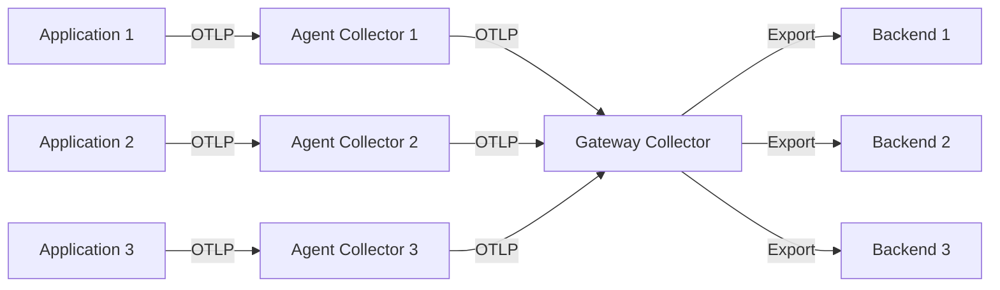

# How to Set Up a Two-Tier Collector Architecture (Agent + Gateway)

Author: [nawazdhandala](https://www.github.com/nawazdhandala)

Tags: OpenTelemetry, Collector, Architecture, Gateway, Agent, Deployment, Observability

Description: Learn how to implement a scalable two-tier OpenTelemetry Collector architecture with agents collecting telemetry locally and gateways aggregating data centrally for better performance and reliability.

When deploying the OpenTelemetry Collector at scale, a single-tier architecture can become a bottleneck. A two-tier collector architecture separates concerns by deploying agents close to your applications and gateways that handle aggregation, sampling, and export to backends. This pattern improves reliability, reduces network overhead, and enables centralized policy enforcement.

## Understanding the Two-Tier Architecture

The two-tier collector architecture consists of two distinct layers:

**Agent Collectors** run alongside your applications (as sidecars, DaemonSets, or local processes). They perform lightweight processing like basic filtering, resource detection, and batching before forwarding telemetry to gateway collectors.

**Gateway Collectors** act as centralized aggregation points. They handle heavy processing tasks such as tail-based sampling, metric aggregation, sensitive data redaction, and exporting to multiple backends.



This architecture provides several benefits:

- **Reduced network traffic**: Agents batch and compress data before sending to gateways
- **Improved reliability**: Agents buffer data locally if gateways are unavailable
- **Centralized control**: Apply organization-wide policies at the gateway level
- **Scalability**: Scale agents and gateways independently based on workload
- **Security**: Terminate TLS at gateways and manage backend credentials centrally

## Agent Collector Configuration

The agent collector should be lightweight and focused on initial data collection and forwarding. Here's a production-ready agent configuration:

```yaml
# agent-config.yaml
# Agent collectors run close to applications and perform minimal processing

receivers:
  # Receive telemetry from applications via OTLP
  otlp:
    protocols:
      grpc:
        endpoint: 0.0.0.0:4317
      http:
        endpoint: 0.0.0.0:4318

  # Collect host metrics (CPU, memory, disk, network)
  hostmetrics:
    collection_interval: 30s
    scrapers:
      cpu:
      memory:
      disk:
      network:
      filesystem:

processors:
  # Add resource attributes to identify the source
  resource:
    attributes:
      - key: deployment.environment
        value: production
        action: insert
      - key: collector.tier
        value: agent
        action: insert

  # Detect cloud provider and host information
  resourcedetection:
    detectors: [env, system, docker, ec2, gcp, azure]
    timeout: 5s

  # Batch telemetry to reduce network calls
  batch:
    timeout: 10s
    send_batch_size: 1024
    send_batch_max_size: 2048

  # Add memory limits to prevent OOM
  memory_limiter:
    check_interval: 1s
    limit_mib: 512
    spike_limit_mib: 128

exporters:
  # Forward all telemetry to gateway collectors
  otlp:
    endpoint: gateway-collector.observability.svc.cluster.local:4317
    tls:
      insecure: false
      ca_file: /etc/ssl/certs/ca.crt
    # Retry configuration for temporary failures
    retry_on_failure:
      enabled: true
      initial_interval: 5s
      max_interval: 30s
      max_elapsed_time: 300s
    # Queue telemetry if gateway is unavailable
    sending_queue:
      enabled: true
      num_consumers: 10
      queue_size: 5000

  # Debug exporter for troubleshooting (disable in production)
  # logging:
  #   verbosity: detailed

service:
  pipelines:
    traces:
      receivers: [otlp]
      processors: [memory_limiter, resource, resourcedetection, batch]
      exporters: [otlp]

    metrics:
      receivers: [otlp, hostmetrics]
      processors: [memory_limiter, resource, resourcedetection, batch]
      exporters: [otlp]

    logs:
      receivers: [otlp]
      processors: [memory_limiter, resource, resourcedetection, batch]
      exporters: [otlp]

  # Configure telemetry for the collector itself
  telemetry:
    logs:
      level: info
    metrics:
      address: 0.0.0.0:8888
```

Key considerations for agent collectors:

- Keep processing minimal to reduce CPU and memory overhead
- Enable persistent queues if you need guaranteed delivery during gateway outages
- Use the memory_limiter processor to prevent resource exhaustion
- Configure appropriate retry and queue settings based on your network reliability

## Gateway Collector Configuration

The gateway collector handles complex processing and exports to multiple backends. Here's a comprehensive gateway configuration:

```yaml
# gateway-config.yaml
# Gateway collectors perform heavy processing and export to backends

receivers:
  # Receive telemetry from agent collectors
  otlp:
    protocols:
      grpc:
        endpoint: 0.0.0.0:4317
        max_recv_msg_size_mib: 32
        max_concurrent_streams: 100
      http:
        endpoint: 0.0.0.0:4318

processors:
  # Memory protection for high-throughput scenarios
  memory_limiter:
    check_interval: 1s
    limit_mib: 2048
    spike_limit_mib: 512

  # Batch larger amounts of data for efficient export
  batch:
    timeout: 30s
    send_batch_size: 8192
    send_batch_max_size: 16384

  # Implement tail-based sampling for traces
  # Only traces with errors or long duration are kept
  tail_sampling:
    decision_wait: 10s
    num_traces: 100000
    expected_new_traces_per_sec: 1000
    policies:
      # Always sample traces with errors
      - name: error-traces
        type: status_code
        status_code:
          status_codes: [ERROR]

      # Sample slow traces (>1 second)
      - name: slow-traces
        type: latency
        latency:
          threshold_ms: 1000

      # Sample 10% of normal traces
      - name: probabilistic-sampling
        type: probabilistic
        probabilistic:
          sampling_percentage: 10

  # Filter out noisy metrics
  filter/metrics:
    metrics:
      exclude:
        match_type: regexp
        metric_names:
          - ".*test.*"
          - ".*debug.*"

  # Redact sensitive data from logs
  redaction:
    allow_all_keys: false
    blocked_values:
      - "password"
      - "api_key"
      - "secret"
      - "token"
      - "credit_card"

  # Transform metric names to match backend conventions
  metricstransform:
    transforms:
      - include: "^system\\.cpu\\..*"
        match_type: regexp
        action: update
        new_name: "host.cpu.$1"

  # Add gateway-specific resource attributes
  resource:
    attributes:
      - key: collector.tier
        value: gateway
        action: insert
      - key: collector.id
        value: ${HOSTNAME}
        action: insert

exporters:
  # Export to Prometheus for metrics
  prometheusremotewrite:
    endpoint: https://prometheus.example.com/api/v1/write
    tls:
      insecure: false
    headers:
      Authorization: Bearer ${PROM_TOKEN}
    retry_on_failure:
      enabled: true
      initial_interval: 5s
      max_interval: 60s

  # Export traces to Jaeger
  otlp/jaeger:
    endpoint: jaeger.example.com:4317
    tls:
      insecure: false
    retry_on_failure:
      enabled: true

  # Export logs to Loki
  loki:
    endpoint: https://loki.example.com/loki/api/v1/push
    tls:
      insecure: false
    headers:
      X-Scope-OrgID: "tenant-1"

  # Export to additional backend for redundancy
  otlp/backup:
    endpoint: backup-backend.example.com:4317
    tls:
      insecure: false

service:
  pipelines:
    traces:
      receivers: [otlp]
      processors: [memory_limiter, batch, tail_sampling, resource]
      exporters: [otlp/jaeger, otlp/backup]

    metrics:
      receivers: [otlp]
      processors: [memory_limiter, filter/metrics, batch, metricstransform, resource]
      exporters: [prometheusremotewrite, otlp/backup]

    logs:
      receivers: [otlp]
      processors: [memory_limiter, redaction, batch, resource]
      exporters: [loki, otlp/backup]

  telemetry:
    logs:
      level: info
    metrics:
      address: 0.0.0.0:8888
```

Gateway collectors should:

- Implement advanced sampling strategies like tail-based sampling
- Handle data transformation and enrichment
- Manage multiple backend exports with appropriate retry logic
- Apply security policies like data redaction
- Scale horizontally to handle increased throughput

## Deploying the Architecture on Kubernetes

Here's how to deploy both tiers in a Kubernetes environment:

```yaml
# agent-daemonset.yaml
# Deploy agent collectors as a DaemonSet (one per node)
apiVersion: apps/v1
kind: DaemonSet
metadata:
  name: otel-agent
  namespace: observability
spec:
  selector:
    matchLabels:
      app: otel-agent
  template:
    metadata:
      labels:
        app: otel-agent
    spec:
      containers:
      - name: otel-collector
        image: otel/opentelemetry-collector-contrib:0.93.0
        args:
          - --config=/conf/agent-config.yaml
        resources:
          requests:
            memory: 256Mi
            cpu: 100m
          limits:
            memory: 512Mi
            cpu: 500m
        ports:
        - containerPort: 4317
          name: otlp-grpc
          hostPort: 4317
        - containerPort: 4318
          name: otlp-http
          hostPort: 4318
        - containerPort: 8888
          name: metrics
        volumeMounts:
        - name: config
          mountPath: /conf
        - name: hostfs
          mountPath: /hostfs
          readOnly: true
        env:
        - name: HOSTNAME
          valueFrom:
            fieldRef:
              fieldPath: spec.nodeName
      volumes:
      - name: config
        configMap:
          name: otel-agent-config
      - name: hostfs
        hostPath:
          path: /
---
# gateway-deployment.yaml
# Deploy gateway collectors as a Deployment with horizontal scaling
apiVersion: apps/v1
kind: Deployment
metadata:
  name: otel-gateway
  namespace: observability
spec:
  replicas: 3
  selector:
    matchLabels:
      app: otel-gateway
  template:
    metadata:
      labels:
        app: otel-gateway
    spec:
      containers:
      - name: otel-collector
        image: otel/opentelemetry-collector-contrib:0.93.0
        args:
          - --config=/conf/gateway-config.yaml
        resources:
          requests:
            memory: 1Gi
            cpu: 500m
          limits:
            memory: 2Gi
            cpu: 2000m
        ports:
        - containerPort: 4317
          name: otlp-grpc
        - containerPort: 4318
          name: otlp-http
        - containerPort: 8888
          name: metrics
        volumeMounts:
        - name: config
          mountPath: /conf
        env:
        - name: HOSTNAME
          valueFrom:
            fieldRef:
              fieldPath: metadata.name
        - name: PROM_TOKEN
          valueFrom:
            secretKeyRef:
              name: backend-credentials
              key: prometheus-token
      volumes:
      - name: config
        configMap:
          name: otel-gateway-config
---
# gateway-service.yaml
# Expose gateway collectors via a Service
apiVersion: v1
kind: Service
metadata:
  name: gateway-collector
  namespace: observability
spec:
  selector:
    app: otel-gateway
  ports:
  - name: otlp-grpc
    port: 4317
    targetPort: 4317
  - name: otlp-http
    port: 4318
    targetPort: 4318
  - name: metrics
    port: 8888
    targetPort: 8888
  type: ClusterIP
```

## Load Balancing and High Availability

For production deployments, implement proper load balancing between agents and gateways:

**For agents forwarding to gateways**, use Kubernetes DNS with service load balancing. The gateway Service automatically distributes connections across gateway pods.

**For applications sending to agents**, use hostPort or hostNetwork to ensure each node exposes agent endpoints. Applications can send telemetry to `localhost:4317` which routes to the local agent.

**For gateway scaling**, use Horizontal Pod Autoscaler (HPA) based on CPU or custom metrics:

```yaml
apiVersion: autoscaling/v2
kind: HorizontalPodAutoscaler
metadata:
  name: otel-gateway-hpa
  namespace: observability
spec:
  scaleTargetRef:
    apiVersion: apps/v1
    kind: Deployment
    name: otel-gateway
  minReplicas: 3
  maxReplicas: 10
  metrics:
  - type: Resource
    resource:
      name: cpu
      target:
        type: Utilization
        averageUtilization: 70
  - type: Resource
    resource:
      name: memory
      target:
        type: Utilization
        averageUtilization: 80
```

## Monitoring Your Collector Architecture

Both agent and gateway collectors expose metrics on port 8888. Monitor these key metrics:

- `otelcol_receiver_accepted_spans`: Spans received by the collector
- `otelcol_receiver_refused_spans`: Spans rejected due to errors
- `otelcol_exporter_sent_spans`: Spans successfully exported
- `otelcol_exporter_send_failed_spans`: Failed exports requiring retry
- `otelcol_processor_batch_batch_send_size`: Batch sizes being sent
- `otelcol_exporter_queue_size`: Current queue depth (watch for backpressure)

Set up alerts for queue depth approaching limits and high failure rates, which indicate downstream issues or misconfigurations.

## Related Resources

For more information on deploying OpenTelemetry Collectors, check out:

- [How to Deploy the OpenTelemetry Collector with the Kubernetes Operator](https://oneuptime.com/blog/post/2026-02-06-deploy-opentelemetry-collector-kubernetes-operator/view)
- [How to Deploy the OpenTelemetry Collector as a StatefulSet in Kubernetes](https://oneuptime.com/blog/post/2026-02-06-deploy-opentelemetry-collector-statefulset-kubernetes/view)
- [How to Deploy the OpenTelemetry Collector on Docker and Docker Compose](https://oneuptime.com/blog/post/2026-02-06-deploy-opentelemetry-collector-docker-compose/view)

The two-tier collector architecture provides a scalable, reliable foundation for observability at any scale. By separating agent and gateway responsibilities, you can optimize resource usage, implement centralized policies, and maintain high availability for your telemetry pipeline.
