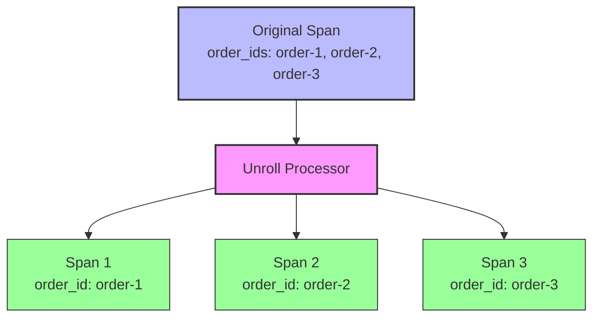

# How to Configure the Unroll Processor in the OpenTelemetry Collector

Author: [nawazdhandala](https://www.github.com/nawazdhandala)

Tags: OpenTelemetry, Collector, Processors, Unroll, Array Attributes, Data Transformation

Description: Master the Unroll processor in OpenTelemetry Collector to flatten array attributes into multiple telemetry records for easier querying and analysis.

The Unroll processor addresses a common challenge in telemetry data: handling array-valued attributes. Many backends and query engines struggle with array attributes, making it difficult to filter, aggregate, or visualize data containing arrays. The Unroll processor solves this by expanding each array element into a separate telemetry record, transforming one record with an array into multiple records with scalar values.

## Understanding the Unroll Operation

When telemetry contains array attributes, downstream systems often cannot efficiently query individual array elements. For example, a span tracking a batch operation might have an attribute `order_ids: ["order-1", "order-2", "order-3"]`. Most observability backends cannot easily answer "show me all spans involving order-2" without complex query syntax or custom processing.

The Unroll processor transforms this single span into three separate spans, each with a single order ID. This normalization enables straightforward filtering and aggregation on individual array elements.



## Basic Configuration

The Unroll processor requires minimal configuration: specify which array attribute to unroll and what name to give the resulting scalar attribute.

Here is a basic configuration:

```yaml
# Basic Unroll processor configuration
processors:
  unroll:
    # Specify the array attribute to unroll
    field: attributes.order_ids
    # Specify the name for the scalar attribute in resulting records
    new_field: attributes.order_id

service:
  pipelines:
    traces:
      receivers: [otlp]
      processors: [unroll, batch]
      exporters: [otlp]
```

This configuration takes any span with an `order_ids` array attribute and creates multiple spans, each with a single `order_id` scalar attribute.

Before processing:
```yaml
span:
  name: process_batch
  attributes:
    order_ids: ["order-1", "order-2", "order-3"]
    batch_size: 3
```

After processing:
```yaml
# Span 1
span:
  name: process_batch
  attributes:
    order_id: "order-1"
    batch_size: 3

# Span 2
span:
  name: process_batch
  attributes:
    order_id: "order-2"
    batch_size: 3

# Span 3
span:
  name: process_batch
  attributes:
    order_id: "order-3"
    batch_size: 3
```

Notice that non-array attributes like `batch_size` are duplicated across all resulting spans.

## Unrolling Metrics

The Unroll processor works with metrics as well as traces. This proves particularly useful when metrics have array-valued labels.

```yaml
# Unroll processor for metrics
processors:
  unroll:
    # Unroll container_ids array in metrics
    field: attributes.container_ids
    new_field: attributes.container_id

service:
  pipelines:
    metrics:
      receivers: [prometheus]
      processors: [unroll, batch]
      exporters: [otlp]
```

A metric like:
```yaml
metric:
  name: pod.cpu.usage
  attributes:
    pod_name: web-pod-1
    container_ids: ["container-a", "container-b"]
  value: 0.75
```

Becomes two metrics:
```yaml
# Metric 1
metric:
  name: pod.cpu.usage
  attributes:
    pod_name: web-pod-1
    container_id: "container-a"
  value: 0.75

# Metric 2
metric:
  name: pod.cpu.usage
  attributes:
    pod_name: web-pod-1
    container_id: "container-b"
  value: 0.75
```

## Conditional Unrolling

Apply the Unroll processor only to specific telemetry that matches certain conditions, avoiding unnecessary processing of records without array attributes.

```yaml
# Conditional unroll configuration
processors:
  unroll:
    field: attributes.order_ids
    new_field: attributes.order_id
    # Only unroll spans that have the order_ids attribute
    match:
      # Apply only if the field exists and is an array
      include:
        match_type: expr
        expressions:
          - attributes["order_ids"] != nil

service:
  pipelines:
    traces:
      receivers: [otlp]
      processors: [unroll, batch]
      exporters: [otlp]
```

This configuration processes only spans containing the `order_ids` attribute, leaving other spans untouched.

## Multiple Array Attributes

When telemetry contains multiple array attributes, you may need to unroll each one. Configure multiple Unroll processor instances in sequence.

```yaml
# Multiple unroll operations
processors:
  # First unroll: order IDs
  unroll/orders:
    field: attributes.order_ids
    new_field: attributes.order_id

  # Second unroll: product IDs
  unroll/products:
    field: attributes.product_ids
    new_field: attributes.product_id

service:
  pipelines:
    traces:
      receivers: [otlp]
      processors:
        - unroll/orders
        - unroll/products
        - batch
      exporters: [otlp]
```

Be cautious with multiple sequential unrolls as they multiply the number of output records. A span with arrays of lengths 3 and 4 produces 3 × 4 = 12 spans after both unroll operations.

Original span:
```yaml
attributes:
  order_ids: ["order-1", "order-2", "order-3"]
  product_ids: ["prod-a", "prod-b", "prod-b", "prod-c"]
```

After first unroll (3 spans):
```yaml
# Span 1: order_id=order-1, product_ids=[prod-a, prod-b, prod-c, prod-d]
# Span 2: order_id=order-2, product_ids=[prod-a, prod-b, prod-c, prod-d]
# Span 3: order_id=order-3, product_ids=[prod-a, prod-b, prod-c, prod-d]
```

After second unroll (12 spans):
```yaml
# Span 1: order_id=order-1, product_id=prod-a
# Span 2: order_id=order-1, product_id=prod-b
# Span 3: order_id=order-1, product_id=prod-c
# Span 4: order_id=order-1, product_id=prod-d
# ... and so on for order-2 and order-3
```

## Preserving Array Attributes

Sometimes you need both the unrolled scalar values and the original array. Configure the processor to preserve the original array attribute.

```yaml
# Preserve original array configuration
processors:
  unroll:
    field: attributes.order_ids
    new_field: attributes.order_id
    # Keep the original array attribute
    preserve_original: true

service:
  pipelines:
    traces:
      receivers: [otlp]
      processors: [unroll, batch]
      exporters: [otlp]
```

With `preserve_original: true`, the resulting spans contain both:
```yaml
attributes:
  order_ids: ["order-1", "order-2", "order-3"]  # Original array preserved
  order_id: "order-1"  # Scalar value for this span
```

This allows downstream analysis on both individual elements and the complete array.

## Handling Nested Arrays

For complex data structures with nested arrays, the Unroll processor can handle nested paths.

```yaml
# Nested array unroll configuration
processors:
  unroll:
    # Access nested array using dot notation
    field: attributes.transaction.line_items
    new_field: attributes.line_item

service:
  pipelines:
    traces:
      receivers: [otlp]
      processors: [unroll, batch]
      exporters: [otlp]
```

Original span with nested structure:
```yaml
attributes:
  transaction:
    id: "txn-123"
    line_items:
      - item_id: "item-1"
        quantity: 2
      - item_id: "item-2"
        quantity: 1
```

After unrolling:
```yaml
# Span 1
attributes:
  transaction:
    id: "txn-123"
  line_item:
    item_id: "item-1"
    quantity: 2

# Span 2
attributes:
  transaction:
    id: "txn-123"
  line_item:
    item_id: "item-2"
    quantity: 1
```

## Integration with Transform Processor

Combine the Unroll processor with the Transform processor for complex data normalization workflows.

```yaml
# Combined unroll and transform configuration
processors:
  # Transform to prepare data for unrolling
  transform/prepare:
    trace_statements:
      # Extract tags array from JSON-encoded attribute
      - context: span
        statements:
          - set(attributes["tags"], ParseJSON(attributes["tags_json"]))

  # Unroll the tags array
  unroll/tags:
    field: attributes.tags
    new_field: attributes.tag

  # Transform after unrolling
  transform/cleanup:
    trace_statements:
      # Normalize tag values
      - context: span
        statements:
          - set(attributes["tag"], Trim(attributes["tag"]))
          - delete_key(attributes, "tags_json")

service:
  pipelines:
    traces:
      receivers: [otlp]
      processors:
        - transform/prepare
        - unroll/tags
        - transform/cleanup
        - batch
      exporters: [otlp]
```

This pipeline:
1. Parses JSON to extract an array
2. Unrolls the array into individual values
3. Cleans up and normalizes the resulting values

## Use Cases

### Batch Processing Visibility

Track individual items in batch operations:

```yaml
processors:
  unroll:
    field: attributes.processed_files
    new_field: attributes.file

service:
  pipelines:
    traces:
      receivers: [otlp]
      processors: [unroll, batch]
      exporters: [otlp]
```

This enables queries like "show me all batch operations that processed file X" without complex array querying.

### Multi-Tenant Applications

Unroll tenant IDs to analyze cross-tenant operations:

```yaml
processors:
  unroll:
    field: attributes.tenant_ids
    new_field: attributes.tenant_id

service:
  pipelines:
    traces:
      receivers: [otlp]
      processors: [unroll, batch]
      exporters: [otlp]
```

Each resulting span represents the operation from a single tenant's perspective, simplifying per-tenant analysis.

### Microservice Communication

Expand arrays of called services:

```yaml
processors:
  unroll:
    field: attributes.downstream_services
    new_field: attributes.downstream_service

service:
  pipelines:
    traces:
      receivers: [otlp]
      processors: [unroll, batch]
      exporters: [otlp]
```

This transforms spans representing fan-out calls into individual spans for each downstream service, enabling service-specific analysis.

### Error Tracking

Unroll error codes or affected resources:

```yaml
processors:
  unroll:
    field: attributes.error_codes
    new_field: attributes.error_code

service:
  pipelines:
    traces:
      receivers: [otlp]
      processors: [unroll, batch]
      exporters: [otlp]
```

Each error code becomes a separate span, enabling error-specific dashboards and alerts.

## Performance Considerations

The Unroll processor multiplies the number of telemetry records proportional to array lengths. Consider these factors:

1. **Array Size**: Large arrays produce many output records. A span with a 1000-element array becomes 1000 spans.

2. **Pipeline Volume**: Unrolling increases data volume through the pipeline and to backends. Monitor throughput and adjust batch sizes accordingly.

3. **Backend Load**: Downstream systems receive more records. Ensure backends can handle the increased load.

4. **Sequential Unrolls**: Multiple unroll operations multiply records exponentially. Two arrays of size 10 each produce 100 records.

Implement safeguards for production deployments:

```yaml
# Production-ready unroll configuration with safeguards
processors:
  # Filter to limit array sizes before unrolling
  filter/limit_arrays:
    traces:
      span:
        # Only process arrays with reasonable sizes
        - len(attributes["order_ids"]) <= 100

  # Unroll with size limits
  unroll:
    field: attributes.order_ids
    new_field: attributes.order_id
    # Optional: limit maximum array size to process
    max_array_size: 100

  # Sample after unrolling to control volume
  probabilistic_sampler:
    sampling_percentage: 50

service:
  pipelines:
    traces:
      receivers: [otlp]
      processors:
        - filter/limit_arrays
        - unroll
        - probabilistic_sampler
        - batch
      exporters: [otlp]
```

## Log Unrolling

The processor works with logs as well, enabling analysis of log entries with array attributes.

```yaml
# Log unrolling configuration
processors:
  unroll:
    field: attributes.affected_users
    new_field: attributes.user_id

service:
  pipelines:
    logs:
      receivers: [filelog]
      processors: [unroll, batch]
      exporters: [otlp]
```

A log entry:
```yaml
log:
  body: "Password reset emails sent"
  attributes:
    affected_users: ["user1@example.com", "user2@example.com", "user3@example.com"]
```

Becomes three log entries:
```yaml
# Log 1
log:
  body: "Password reset emails sent"
  attributes:
    user_id: "user1@example.com"

# Log 2
log:
  body: "Password reset emails sent"
  attributes:
    user_id: "user2@example.com"

# Log 3
log:
  body: "Password reset emails sent"
  attributes:
    user_id: "user3@example.com"
```

## Troubleshooting

**No output records**: Verify the field path is correct and the attribute contains an array. Check processor logs for errors.

**Excessive data volume**: Implement filtering before unrolling to limit array sizes. Consider sampling after unrolling.

**Performance degradation**: Large arrays cause high CPU and memory usage. Monitor collector performance and set `max_array_size` limits.

**Backend errors**: Ensure downstream systems can handle the increased record count. Adjust batch sizes and export timeouts.

**Missing attributes**: Verify attribute names match exactly (case-sensitive). Check that the source attribute is truly an array type.

## Monitoring Unroll Operations

Monitor the processor to understand its impact:

```yaml
# Enable detailed telemetry
service:
  telemetry:
    logs:
      level: info
    metrics:
      level: detailed
      address: 0.0.0.0:8888

  pipelines:
    traces:
      receivers: [otlp]
      processors: [unroll, batch]
      exporters: [otlp]
```

Key metrics to monitor:
- Input record count vs output record count (unroll ratio)
- Processing latency
- Memory usage
- Dropped records due to size limits

## Related Resources

For more information on data transformation in OpenTelemetry Collector:

- [How to Write OTTL Statements for the Transform Processor](https://oneuptime.com/blog/post/ottl-statements-transform-processor-opentelemetry-collector/view)
- [How to Configure the Lookup Processor](https://oneuptime.com/blog/post/lookup-processor-opentelemetry-collector/view)
- [How to Filter Spans Using OTTL](https://oneuptime.com/blog/post/filter-spans-ottl-opentelemetry-collector/view)

The Unroll processor transforms array-valued attributes into multiple records with scalar values, enabling easier querying and analysis in downstream systems. While powerful, the processor multiplies data volume proportional to array sizes. Implement appropriate safeguards including size limits, filtering, and sampling to manage the impact on pipeline performance and backend load. Use conditional unrolling to process only relevant telemetry, and monitor the unroll ratio to understand the processor's impact on your observability infrastructure.
