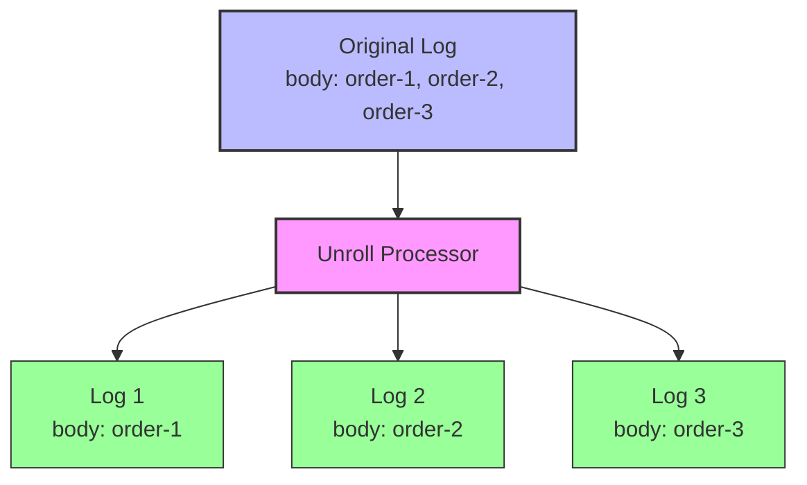

# How to Configure the Unroll Processor in the OpenTelemetry Collector

Author: [nawazdhandala](https://www.github.com/nawazdhandala)

Tags: OpenTelemetry, Collector, Processor, Unroll, Array Attributes, Data Transformation

Description: Master the Unroll processor in OpenTelemetry Collector to flatten array attributes into multiple telemetry records for easier querying and analysis.

The Unroll processor addresses a common challenge in log data: handling array-valued log bodies. Some log receivers or transform rules can produce a single log record whose body is a list. The Unroll processor expands each element of that list into a separate log record, transforming one log record with an array body into multiple log records with scalar or structured bodies.

## Understanding the Unroll Operation

When log data contains arrays in the body, downstream systems often cannot efficiently query individual array elements. For example, a log record tracking a batch operation might have a body like `["order-1", "order-2", "order-3"]`. Many observability backends are easier to query when each item is its own log record.

The Unroll processor transforms this single log record into three separate log records, each with one order ID as its body. This normalization enables straightforward filtering and aggregation on individual array elements.


```mermaid
graph TD
    A[Original Log<br/>body: order-1, order-2, order-3] --> B[Unroll Processor]
    B --> C[Log 1<br/>body: order-1]
    B --> D[Log 2<br/>body: order-2]
    B --> E[Log 3<br/>body: order-3]

    style A fill:#bbf,stroke:#333,stroke-width:2px
    style B fill:#f9f,stroke:#333,stroke-width:2px
    style C fill:#9f9,stroke:#333,stroke-width:1px
    style D fill:#9f9,stroke:#333,stroke-width:1px
    style E fill:#9f9,stroke:#333,stroke-width:1px
```

## Basic Configuration

The Unroll processor requires minimal configuration. It operates on log record bodies, and its only configuration option is whether to recursively unroll nested arrays.

Here is a basic configuration:

```yaml
# Basic Unroll processor configuration

processors:
  unroll:
    # Whether to recursively unroll nested slices
    recursive: false

service:
  pipelines:
    logs:
      receivers: [otlp]
      processors: [unroll, batch]
      exporters: [otlp]
```

This configuration takes any log record whose body is an array and creates multiple log records, one for each body element.

Before processing:
```yaml
log:
  body: ["order-1", "order-2", "order-3"]
  attributes:
    operation: process_batch
    batch_size: 3
```

After processing:
```yaml
# Log 1
log:
  body: "order-1"
  attributes:
    operation: process_batch
    batch_size: 3

# Log 2
log:
  body: "order-2"
  attributes:
    operation: process_batch
    batch_size: 3

# Log 3
log:
  body: "order-3"
  attributes:
    operation: process_batch
    batch_size: 3
```

Notice that log metadata such as timestamps and attributes like `batch_size` are duplicated across all resulting log records.

## Unrolling Metrics

The Unroll processor is currently a logs-only processor. It does not unroll metric datapoint attributes or trace span attributes.

If metrics have array-valued attributes, use a processor that supports metrics, such as the Transform processor, to reshape or normalize the datapoints before export. Do not configure the Unroll processor in a metrics pipeline:

```yaml
# Unroll processor for logs
processors:
  unroll:
    recursive: false

service:
  pipelines:
    logs:
      receivers: [otlp]
      processors: [unroll, batch]
      exporters: [otlp]
```

A log body like:
```yaml
log:
  body: ["container-a", "container-b"]
  attributes:
    pod_name: web-pod-1
```

Becomes two logs:
```yaml
# Log 1
log:
  body: "container-a"
  attributes:
    pod_name: web-pod-1

# Log 2
log:
  body: "container-b"
  attributes:
    pod_name: web-pod-1
```

## Conditional Unrolling

The Unroll processor does not have a `match` block or per-field condition. It only unrolls log records whose body is a list; log records with non-list bodies are not expanded.

If you need explicit control, use the Filter processor before Unroll to drop records that should not be processed.

```yaml
# Conditional unroll configuration
processors:
  filter/only_reasonable_lists:
    error_mode: ignore
    log_conditions:
      # Drop non-list bodies and very large lists before unrolling
      - not IsList(log.body)
      - IsList(log.body) and Len(log.body) > 100

  unroll:
    recursive: false

service:
  pipelines:
    logs:
      receivers: [otlp]
      processors: [filter/only_reasonable_lists, unroll, batch]
      exporters: [otlp]
```

This configuration only allows list-valued log bodies with 100 or fewer elements to reach the Unroll processor.

## Multiple Array Attributes

The Unroll processor does not select named array attributes. When telemetry contains array attributes, first use the Transform processor to copy or parse the array into the log body, then apply the Unroll processor.

```yaml
# Prepare a log attribute for unrolling
processors:
  transform/prepare:
    error_mode: ignore
    log_statements:
      - set(log.body, log.attributes["order_ids"]) where IsList(log.attributes["order_ids"])

  unroll/orders:
    recursive: false

service:
  pipelines:
    logs:
      receivers: [otlp]
      processors:
        - transform/prepare
        - unroll/orders
        - batch
      exporters: [otlp]
```

Be cautious when preparing multiple arrays for unrolling. The Unroll processor expands the current log body; it does not create a cross product of multiple named attributes. If you need to normalize multiple arrays, model the log body carefully before unrolling.

Original log:
```yaml
body: ["order-1", "order-2", "order-3"]
attributes:
  product_ids: ["prod-a", "prod-b", "prod-c", "prod-d"]
```

After unroll (3 logs):
```yaml
# Log 1: body=order-1, product_ids=[prod-a, prod-b, prod-c, prod-d]
# Log 2: body=order-2, product_ids=[prod-a, prod-b, prod-c, prod-d]
# Log 3: body=order-3, product_ids=[prod-a, prod-b, prod-c, prod-d]
```

If you need a true 3 x 4 expansion, use a custom transformation step before the Collector or a purpose-built processor that creates the desired records.

## Preserving Array Attributes

The Unroll processor always preserves log metadata from the original record, including attributes. It replaces the log body in each output record with one element from the original body array.

```yaml
# Preserve original array in an attribute before unrolling
processors:
  transform/preserve:
    error_mode: ignore
    log_statements:
      - set(log.attributes["original_body"], log.body) where IsList(log.body)

  unroll:
    recursive: false

service:
  pipelines:
    logs:
      receivers: [otlp]
      processors: [transform/preserve, unroll, batch]
      exporters: [otlp]
```

After this pipeline, the resulting logs contain both:
```yaml
body: "order-1"
attributes:
  original_body: ["order-1", "order-2", "order-3"]
```

This allows downstream analysis on both individual elements and the complete original array.

## Handling Nested Arrays

For complex data structures with nested arrays, enable recursive unrolling.

```yaml
# Nested array unroll configuration
processors:
  unroll:
    recursive: true

service:
  pipelines:
    logs:
      receivers: [otlp]
      processors: [unroll, batch]
      exporters: [otlp]
```

Original log with nested structure:
```yaml
body:
  - ["item-1", "item-2"]
  - ["item-3"]
attributes:
  transaction_id: "txn-123"
```

After unrolling with `recursive: true`:
```yaml
# Log 1
body: "item-1"
attributes:
  transaction_id: "txn-123"

# Log 2
body: "item-2"
attributes:
  transaction_id: "txn-123"

# Log 3
body: "item-3"
attributes:
  transaction_id: "txn-123"
```

With `recursive: false`, only the top-level array is expanded, so each output body can still be a nested array.

## Integration with Transform Processor

Combine the Unroll processor with the Transform processor for data normalization workflows.

```yaml
# Combined unroll and transform configuration
processors:
  # Transform to prepare data for unrolling
  transform/prepare:
    error_mode: ignore
    log_statements:
      # Extract tags array from a JSON-encoded log body
      - set(log.body, ParseJSON(log.body)) where IsString(log.body)

  # Unroll the log body array
  unroll/tags:
    recursive: false

  # Transform after unrolling
  transform/cleanup:
    error_mode: ignore
    log_statements:
      # Normalize tag values
      - set(log.body, Trim(log.body)) where IsString(log.body)

service:
  pipelines:
    logs:
      receivers: [otlp]
      processors:
        - transform/prepare
        - unroll/tags
        - transform/cleanup
        - batch
      exporters: [otlp]
```

This pipeline:
1. Parses JSON to produce an array body
2. Unrolls the array into individual log records
3. Cleans up and normalizes the resulting values

## Use Cases

### Batch Processing Visibility

Track individual items in batch operations:

```yaml
processors:
  transform/prepare:
    error_mode: ignore
    log_statements:
      - set(log.body, log.attributes["processed_files"]) where IsList(log.attributes["processed_files"])

  unroll:
    recursive: false

service:
  pipelines:
    logs:
      receivers: [otlp]
      processors: [transform/prepare, unroll, batch]
      exporters: [otlp]
```

This enables queries like "show me all batch operations that processed file X" when the backend indexes log bodies or when a later transform copies each body value into an attribute.

### Multi-Tenant Applications

Unroll tenant IDs to analyze cross-tenant operations:

```yaml
processors:
  transform/prepare:
    error_mode: ignore
    log_statements:
      - set(log.body, log.attributes["tenant_ids"]) where IsList(log.attributes["tenant_ids"])

  unroll:
    recursive: false

service:
  pipelines:
    logs:
      receivers: [otlp]
      processors: [transform/prepare, unroll, batch]
      exporters: [otlp]
```

Each resulting log record represents the operation from a single tenant's perspective, simplifying per-tenant analysis.

### Microservice Communication

Expand arrays of called services:

```yaml
processors:
  transform/prepare:
    error_mode: ignore
    log_statements:
      - set(log.body, log.attributes["downstream_services"]) where IsList(log.attributes["downstream_services"])

  unroll:
    recursive: false

service:
  pipelines:
    logs:
      receivers: [otlp]
      processors: [transform/prepare, unroll, batch]
      exporters: [otlp]
```

This transforms log records representing fan-out calls into individual log records for each downstream service, enabling service-specific analysis.

### Error Tracking

Unroll error codes or affected resources:

```yaml
processors:
  transform/prepare:
    error_mode: ignore
    log_statements:
      - set(log.body, log.attributes["error_codes"]) where IsList(log.attributes["error_codes"])

  unroll:
    recursive: false

service:
  pipelines:
    logs:
      receivers: [otlp]
      processors: [transform/prepare, unroll, batch]
      exporters: [otlp]
```

Each error code becomes a separate log record, enabling error-specific dashboards and alerts.

## Performance Considerations

The Unroll processor multiplies the number of log records proportional to array lengths. Consider these factors:

1. **Array Size**: Large arrays produce many output records. A log record with a 1000-element body array becomes 1000 log records.

2. **Pipeline Volume**: Unrolling increases data volume through the pipeline and to backends. Monitor throughput and adjust batch sizes accordingly.

3. **Backend Load**: Downstream systems receive more records. Ensure backends can handle the increased load.

4. **Recursive Unrolls**: Nested arrays can produce more records when `recursive: true` is enabled.

Implement safeguards for production deployments:

```yaml
# Production-ready unroll configuration with safeguards
processors:
  # Filter to limit array sizes before unrolling
  filter/limit_arrays:
    error_mode: ignore
    log_conditions:
      # Drop very large list bodies before unrolling
      - IsList(log.body) and Len(log.body) > 100

  unroll:
    recursive: false

service:
  pipelines:
    logs:
      receivers: [otlp]
      processors:
        - filter/limit_arrays
        - unroll
        - batch
      exporters: [otlp]
```

## Log Unrolling

The processor works with logs, enabling analysis of log entries with array bodies.

```yaml
# Log unrolling configuration
processors:
  transform/prepare:
    error_mode: ignore
    log_statements:
      - set(log.body, log.attributes["affected_users"]) where IsList(log.attributes["affected_users"])

  unroll:
    recursive: false

service:
  pipelines:
    logs:
      receivers: [filelog]
      processors: [transform/prepare, unroll, batch]
      exporters: [otlp]
```

A log entry:
```yaml
log:
  body: "Password reset emails sent"
  attributes:
    affected_users: ["user1@example.com", "user2@example.com", "user3@example.com"]
```

Becomes three log entries after the transform copies `affected_users` into the body and the Unroll processor expands it:
```yaml
# Log 1
log:
  body: "user1@example.com"
  attributes:
    affected_users: ["user1@example.com", "user2@example.com", "user3@example.com"]

# Log 2
log:
  body: "user2@example.com"
  attributes:
    affected_users: ["user1@example.com", "user2@example.com", "user3@example.com"]

# Log 3
log:
  body: "user3@example.com"
  attributes:
    affected_users: ["user1@example.com", "user2@example.com", "user3@example.com"]
```

## Troubleshooting

**No output records**: Verify that the log body contains an array. The Unroll processor does not unroll named attributes directly.

**Excessive data volume**: Implement filtering before unrolling to limit array sizes.

**Performance degradation**: Large arrays cause high CPU and memory usage. Monitor collector performance and limit list sizes before unrolling.

**Backend errors**: Ensure downstream systems can handle the increased record count. Adjust batch sizes and export timeouts.

**Missing attributes**: Remember that the processor replaces the log body with each array element while preserving metadata and attributes from the original log record.

## Monitoring Unroll Operations

Monitor the collector to understand the processor's impact:

```yaml
# Enable detailed internal metrics and expose them on 0.0.0.0:8888
service:
  telemetry:
    logs:
      level: info
    metrics:
      level: detailed
      readers:
        - pull:
            exporter:
              prometheus:
                host: 0.0.0.0
                port: 8888

  pipelines:
    logs:
      receivers: [otlp]
      processors: [unroll, batch]
      exporters: [otlp]
```

Key metrics to monitor:
- Input log record count vs output log record count
- Processing latency
- Memory usage
- Records dropped by any filter processors placed before unroll

## Related Resources

For more information on data transformation in OpenTelemetry Collector:

- [How to Write OTTL Statements for the Transform Processor](https://oneuptime.com/blog/post/2026-02-06-ottl-statements-transform-processor-opentelemetry-collector/view)
- [How to Configure the Lookup Processor](https://oneuptime.com/blog/post/2026-02-06-lookup-processor-opentelemetry-collector/view)
- [How to Filter Spans Using OTTL](https://oneuptime.com/blog/post/2026-02-06-filter-spans-ottl-opentelemetry-collector/view)

The Unroll processor transforms array-valued log bodies into multiple log records, enabling easier querying and analysis in downstream systems. While powerful, the processor multiplies data volume proportional to array sizes. Implement appropriate safeguards including filtering before unrolling to manage the impact on pipeline performance and backend load. Use transform rules when you need to prepare a log body for unrolling, and monitor the collector to understand the processor's impact on your observability infrastructure.
