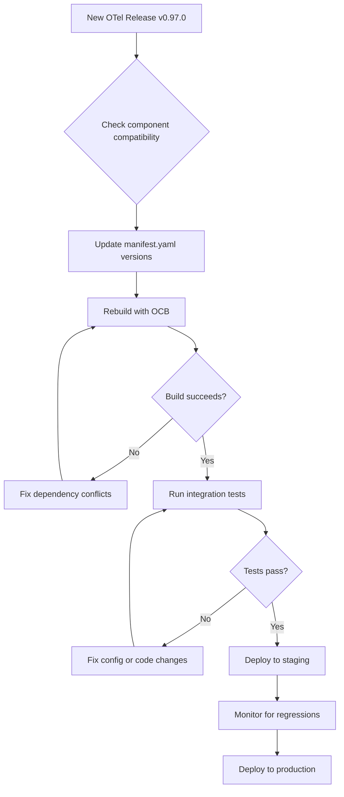
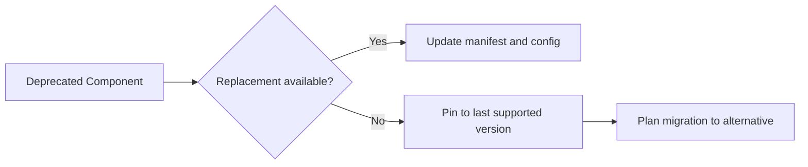

# How to Update and Maintain a Custom Collector Distribution

Author: [nawazdhandala](https://www.github.com/nawazdhandala)

Tags: OpenTelemetry, Collector, Maintenance, Upgrades, CI/CD

Description: Practical strategies for keeping your custom OpenTelemetry Collector distribution up to date with upstream releases and managing version upgrades safely.

---

Building a custom OpenTelemetry Collector is the easy part. Keeping it up to date across dozens of releases per year is where the real work lives. The OpenTelemetry project ships new collector versions roughly every two weeks, and each release can bring breaking changes, new features, security patches, and component deprecations. This post covers strategies for managing updates without losing your weekends.

## The Update Challenge

Here is why maintaining a custom distribution gets tricky:



## Understanding Version Alignment

Every component in your manifest must be compatible with the collector version you are targeting. The core collector and contrib components release in lockstep, so version numbers should match.

```yaml
# manifest.yaml - All versions must align
dist:
  otelcol_version: "0.96.0"

receivers:
  # These versions must match otelcol_version
  - gomod: go.opentelemetry.io/collector/receiver/otlpreceiver v0.96.0
  - gomod: github.com/open-telemetry/opentelemetry-collector-contrib/receiver/prometheusreceiver v0.96.0

processors:
  - gomod: go.opentelemetry.io/collector/processor/batchprocessor v0.96.0

exporters:
  - gomod: go.opentelemetry.io/collector/exporter/otlpexporter v0.96.0
```

When updating, you need to bump all version numbers together:

```yaml
# manifest.yaml - After updating to v0.97.0
dist:
  otelcol_version: "0.97.0"

receivers:
  # Every single version gets bumped
  - gomod: go.opentelemetry.io/collector/receiver/otlpreceiver v0.97.0
  - gomod: github.com/open-telemetry/opentelemetry-collector-contrib/receiver/prometheusreceiver v0.97.0

processors:
  - gomod: go.opentelemetry.io/collector/processor/batchprocessor v0.97.0

exporters:
  - gomod: go.opentelemetry.io/collector/exporter/otlpexporter v0.97.0
```

## Automating Version Updates

Manually editing version numbers across 15+ lines is error-prone. Write a script to do it:

```bash
#!/bin/bash
# update-versions.sh
# Updates all component versions in the manifest file to the target version

OLD_VERSION="${1:?Usage: $0 <old-version> <new-version>}"
NEW_VERSION="${2:?Usage: $0 <old-version> <new-version>}"
MANIFEST="manifest.yaml"

echo "Updating ${MANIFEST} from v${OLD_VERSION} to v${NEW_VERSION}..."

# Replace all occurrences of the old version with the new version
sed -i.bak "s/v${OLD_VERSION}/v${NEW_VERSION}/g" "${MANIFEST}"
sed -i.bak "s/\"${OLD_VERSION}\"/\"${NEW_VERSION}\"/g" "${MANIFEST}"

# Clean up backup file
rm -f "${MANIFEST}.bak"

echo "Updated. Changes:"
git diff "${MANIFEST}"
```

Usage:

```bash
# Update from 0.96.0 to 0.97.0
./update-versions.sh 0.96.0 0.97.0
```

## Reading the Changelog

Before updating, always read the changelog. The OpenTelemetry project maintains detailed release notes.

```bash
# Fetch the changelog for the latest release
gh release view v0.97.0 \
  --repo open-telemetry/opentelemetry-collector \
  --json body -q .body | head -100

# Also check the contrib changelog for component-specific changes
gh release view v0.97.0 \
  --repo open-telemetry/opentelemetry-collector-contrib \
  --json body -q .body | head -100
```

Key things to look for in changelogs:

- **Breaking changes** that require config modifications
- **Deprecated components** that will be removed in future versions
- **New components** you might want to add
- **Security fixes** that should be applied quickly

## Setting Up a CI Pipeline for Updates

Automate the build and test cycle with GitHub Actions:

```yaml
# .github/workflows/update-collector.yaml
name: Update Collector Version

on:
  # Run weekly to check for new versions
  schedule:
    - cron: '0 9 * * 1'  # Every Monday at 9 AM UTC
  # Allow manual triggers
  workflow_dispatch:
    inputs:
      target_version:
        description: 'Target OTel version (e.g., 0.97.0)'
        required: true

jobs:
  check-update:
    runs-on: ubuntu-latest
    outputs:
      new_version: ${{ steps.check.outputs.version }}
      update_needed: ${{ steps.check.outputs.update_needed }}
    steps:
      - uses: actions/checkout@v4

      - name: Check for new version
        id: check
        run: |
          # Get the current version from manifest
          CURRENT=$(grep 'otelcol_version' manifest.yaml | grep -oP '[\d.]+')
          echo "Current version: ${CURRENT}"

          # Get the latest release version
          if [ -n "${{ github.event.inputs.target_version }}" ]; then
            LATEST="${{ github.event.inputs.target_version }}"
          else
            LATEST=$(gh release list --repo open-telemetry/opentelemetry-collector-releases \
              --limit 1 --json tagName -q '.[0].tagName' | grep -oP '[\d.]+')
          fi
          echo "Latest version: ${LATEST}"

          if [ "${CURRENT}" != "${LATEST}" ]; then
            echo "update_needed=true" >> $GITHUB_OUTPUT
            echo "version=${LATEST}" >> $GITHUB_OUTPUT
          else
            echo "update_needed=false" >> $GITHUB_OUTPUT
          fi

  update-and-build:
    needs: check-update
    if: needs.check-update.outputs.update_needed == 'true'
    runs-on: ubuntu-latest
    steps:
      - uses: actions/checkout@v4

      - name: Set up Go
        uses: actions/setup-go@v5
        with:
          go-version: '1.22'

      - name: Install OCB
        run: go install go.opentelemetry.io/collector/cmd/builder@latest

      - name: Update versions
        run: |
          CURRENT=$(grep 'otelcol_version' manifest.yaml | grep -oP '[\d.]+')
          NEW=${{ needs.check-update.outputs.new_version }}
          ./update-versions.sh "${CURRENT}" "${NEW}"

      - name: Build collector
        run: builder --config manifest.yaml

      - name: Run validation
        run: ./dist/otelcol-custom validate --config config.yaml

      - name: Run smoke tests
        run: |
          # Start the collector in the background
          ./dist/otelcol-custom --config config-test.yaml &
          COLLECTOR_PID=$!
          sleep 5

          # Check health endpoint
          curl -f http://localhost:13133/health || exit 1

          # Send test telemetry
          # (your test script here)

          kill $COLLECTOR_PID

      - name: Create pull request
        uses: peter-evans/create-pull-request@v6
        with:
          title: "Update OTel Collector to v${{ needs.check-update.outputs.new_version }}"
          body: |
            Automated update of OpenTelemetry Collector components.
            - Previous version: (see diff)
            - New version: v${{ needs.check-update.outputs.new_version }}
            - Build: Passed
            - Config validation: Passed
            - Smoke tests: Passed
          branch: update-otel-${{ needs.check-update.outputs.new_version }}
```

## Handling Breaking Changes

Breaking changes in the OpenTelemetry Collector typically fall into a few categories.

### Configuration Format Changes

Sometimes a component renames or restructures its config:

```yaml
# Before v0.95.0 - the old format
processors:
  probabilistic_sampler:
    sampling_percentage: 10

# After v0.95.0 - the new format
processors:
  probabilistic_sampler:
    sampling_percentage: 10
    mode: proportional  # New required field
```

### Component Renames

Components occasionally get renamed:

```yaml
# Before - old component name
exporters:
  logging:
    loglevel: debug

# After - renamed component
exporters:
  debug:
    verbosity: detailed
```

### Removed Components

When a component is removed, you need to find a replacement:



## Version Pinning Strategy

Not every release needs to be adopted immediately. Here is a practical approach:

```yaml
# version-policy.yaml
# Document your version update policy

update_policy:
  # Security patches: update within 48 hours
  security:
    urgency: high
    max_delay: 48h

  # Bug fixes: update within 2 weeks
  bugfix:
    urgency: medium
    max_delay: 14d

  # Feature releases: evaluate quarterly
  feature:
    urgency: low
    max_delay: 90d

  # Skip versions that only add components we do not use
  skip_criteria:
    - no_changes_to_used_components
    - no_security_fixes
```

## Rollback Plan

Always have a way to revert to the previous version:

```bash
#!/bin/bash
# rollback.sh
# Rolls back the collector to the previous version

PREVIOUS_TAG="${1:?Usage: $0 <previous-tag>}"
DEPLOY_DIR="/opt/otel-collector"

echo "Rolling back to ${PREVIOUS_TAG}..."

# Stop the current collector
systemctl stop otel-collector

# Restore the previous binary from backup
cp "${DEPLOY_DIR}/backups/otelcol-custom-${PREVIOUS_TAG}" \
   "${DEPLOY_DIR}/otelcol-custom"

# Restore the previous config if needed
cp "${DEPLOY_DIR}/backups/config-${PREVIOUS_TAG}.yaml" \
   "${DEPLOY_DIR}/config.yaml"

# Start the collector
systemctl start otel-collector

# Verify it is running
sleep 3
if curl -sf http://localhost:13133/health > /dev/null; then
  echo "Rollback successful. Running version: ${PREVIOUS_TAG}"
else
  echo "ERROR: Collector failed to start after rollback"
  exit 1
fi
```

## Dependency Vulnerability Scanning

Keep your custom distribution secure by scanning for known vulnerabilities:

```yaml
# .github/workflows/security-scan.yaml
name: Security Scan

on:
  schedule:
    - cron: '0 6 * * *'  # Daily at 6 AM UTC

jobs:
  scan:
    runs-on: ubuntu-latest
    steps:
      - uses: actions/checkout@v4

      - name: Set up Go
        uses: actions/setup-go@v5
        with:
          go-version: '1.22'

      - name: Generate source without compiling
        run: |
          go install go.opentelemetry.io/collector/cmd/builder@latest
          builder --config manifest.yaml --skip-compilation

      - name: Run govulncheck
        working-directory: ./dist
        run: |
          go install golang.org/x/vuln/cmd/govulncheck@latest
          govulncheck ./...

      - name: Run Nancy for dependency audit
        working-directory: ./dist
        run: |
          go list -json -deps ./... > deps.json
          go install github.com/sonatype-nexus-community/nancy@latest
          nancy sleuth < deps.json
```

## Tracking Component Health

Maintain a document that tracks the health and status of each component in your distribution:

```yaml
# component-inventory.yaml
# Track which components we use and their status

components:
  - name: otlpreceiver
    type: receiver
    source: core
    stability: stable
    last_reviewed: "2026-01-15"
    notes: "Primary ingestion point for all services"

  - name: prometheusreceiver
    type: receiver
    source: contrib
    stability: beta
    last_reviewed: "2026-01-15"
    notes: "Used for scraping legacy services"
    risk: "Beta stability - watch for config changes"

  - name: batchprocessor
    type: processor
    source: core
    stability: stable
    last_reviewed: "2026-01-15"
    notes: "Standard batching for all pipelines"

  - name: tailsamplingprocessor
    type: processor
    source: contrib
    stability: beta
    last_reviewed: "2026-01-15"
    notes: "Critical for cost control"
    risk: "Complex config - test thoroughly on updates"
```

## Wrapping Up

Maintaining a custom collector distribution is an ongoing responsibility, but it does not have to be painful. Automate version bumps, run tests in CI, read changelogs carefully, and keep a rollback plan ready. The two-week release cadence of OpenTelemetry means you do not need to chase every release. Pick a cadence that works for your team, whether that is monthly, quarterly, or driven by security patches, and stick to it.
