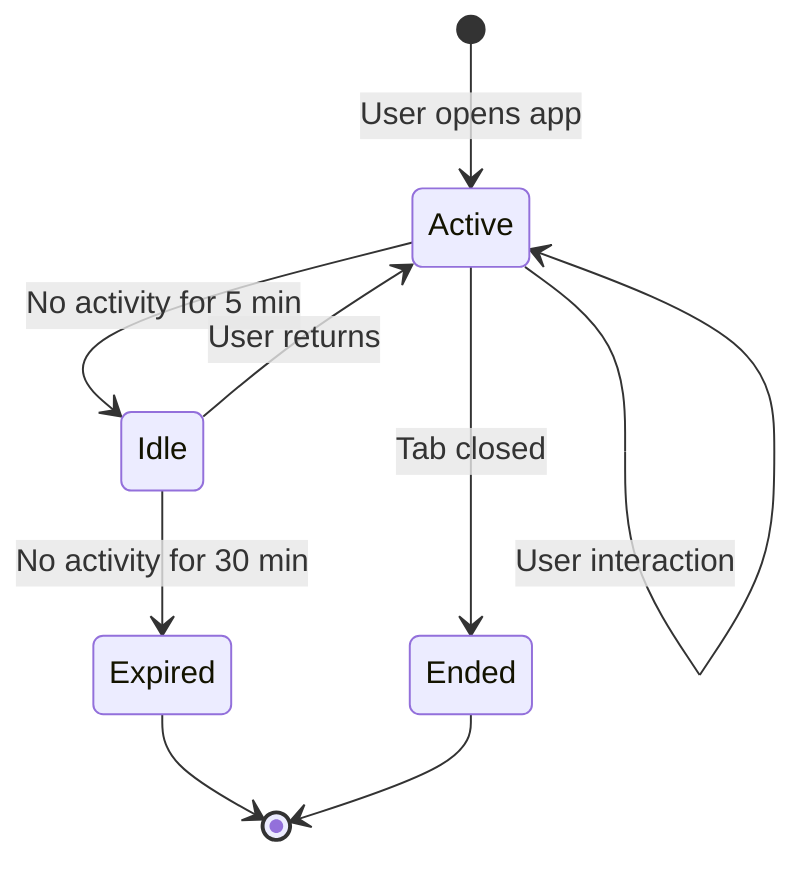

# How to Implement User Session Tracking with OpenTelemetry Browser SDK

Author: [nawazdhandala](https://www.github.com/nawazdhandala)

Tags: OpenTelemetry, Session Tracking, Browser SDK, User Analytics, Frontend Observability, Web Performance

Description: Learn how to implement user session tracking with the OpenTelemetry browser SDK, including session lifecycle management, activity detection, and user journey correlation.

---

Understanding how users interact with your application over the course of a session is fundamental to debugging issues and optimizing performance. A session groups together all the page views, clicks, API calls, and errors that happen during a single visit. Without session tracking, each span and trace exists in isolation, and you lose the ability to ask questions like "what did this user do before the error occurred" or "how many API calls does a typical session generate."

OpenTelemetry does not include a built-in session tracking concept, but the browser SDK gives you all the building blocks to implement one. This post covers creating a session manager, detecting user activity, propagating session context through spans, and building meaningful session-level metrics.

## Defining a Session

Before writing any code, you need to decide what a "session" means for your application. The most common definition is: a session starts when a user opens the application and ends after a period of inactivity (usually 30 minutes) or when they close the browser tab.



We will implement this with three states: active (user is interacting), idle (no recent activity but session is still valid), and expired (session timed out). Each state transition is recorded so you can analyze session patterns later.

## Building the Session Manager

The session manager is responsible for creating session IDs, tracking state transitions, and persisting session data across page navigations.

```javascript
// src/session/session-manager.js
import { v4 as uuidv4 } from 'uuid';

const SESSION_STORAGE_KEY = 'otel_session';
const IDLE_TIMEOUT_MS = 5 * 60 * 1000;     // 5 minutes to idle
const EXPIRE_TIMEOUT_MS = 30 * 60 * 1000;  // 30 minutes to expire

class SessionManager {
  constructor() {
    this.session = this.loadOrCreateSession();
    this.idleTimer = null;
    this.expireTimer = null;
    this.listeners = [];

    // Start watching for user activity
    this.setupActivityListeners();
    this.resetTimers();
  }

  // Load an existing session from sessionStorage or create a new one.
  // Sessions persist across page navigations within the same tab
  // but not across tabs or browser restarts.
  loadOrCreateSession() {
    try {
      const stored = sessionStorage.getItem(SESSION_STORAGE_KEY);
      if (stored) {
        const session = JSON.parse(stored);
        // Check if the stored session has expired
        const elapsed = Date.now() - session.lastActivity;
        if (elapsed < EXPIRE_TIMEOUT_MS) {
          session.pageViewCount = (session.pageViewCount || 0) + 1;
          session.state = 'active';
          this.persist(session);
          return session;
        }
      }
    } catch (e) {
      // sessionStorage might be unavailable in some contexts
    }

    return this.createNewSession();
  }

  createNewSession() {
    const session = {
      id: uuidv4(),
      startTime: Date.now(),
      lastActivity: Date.now(),
      state: 'active',
      pageViewCount: 1,
      interactionCount: 0,
      errorCount: 0,
    };
    this.persist(session);
    return session;
  }

  persist(session) {
    try {
      sessionStorage.setItem(SESSION_STORAGE_KEY, JSON.stringify(session));
    } catch (e) {
      // Silently fail if storage is unavailable
    }
  }

  getSessionId() {
    return this.session.id;
  }

  getSession() {
    return { ...this.session };
  }

  // Register a callback for session state changes
  onStateChange(callback) {
    this.listeners.push(callback);
  }

  // Called whenever the session state transitions
  notifyStateChange(oldState, newState) {
    this.listeners.forEach((cb) => cb(oldState, newState, this.session));
  }
}

export const sessionManager = new SessionManager();
```

The session is stored in `sessionStorage` so it survives page navigations and refreshes but is scoped to a single browser tab. This matches the intuitive meaning of a session: one user, one tab, one continuous visit.

## Detecting User Activity

The session manager needs to know when the user is actively interacting with the page so it can reset idle timers and track engagement.

```javascript
// src/session/session-manager.js (continued)

// Part of the SessionManager class

setupActivityListeners() {
  // These events indicate the user is actively engaged
  const activityEvents = [
    'mousedown',
    'keydown',
    'scroll',
    'touchstart',
    'click',
  ];

  // Throttle activity detection to avoid excessive updates.
  // We only need to know that the user is active, not track
  // every single interaction.
  let lastActivity = Date.now();
  const throttleMs = 5000;

  const onActivity = () => {
    const now = Date.now();
    if (now - lastActivity < throttleMs) return;
    lastActivity = now;

    this.recordActivity();
  };

  activityEvents.forEach((event) => {
    document.addEventListener(event, onActivity, { passive: true });
  });

  // Also detect when the tab becomes visible/hidden
  document.addEventListener('visibilitychange', () => {
    if (document.visibilityState === 'visible') {
      this.handleTabVisible();
    } else {
      this.handleTabHidden();
    }
  });
}

recordActivity() {
  const oldState = this.session.state;
  this.session.lastActivity = Date.now();
  this.session.interactionCount++;

  // If the session was idle, transition back to active
  if (oldState === 'idle') {
    this.session.state = 'active';
    this.notifyStateChange('idle', 'active');
  }

  this.persist(this.session);
  this.resetTimers();
}

handleTabVisible() {
  // When the user returns to the tab, check if the session expired
  const elapsed = Date.now() - this.session.lastActivity;
  if (elapsed >= EXPIRE_TIMEOUT_MS) {
    this.expireSession();
  } else {
    this.recordActivity();
  }
}

handleTabHidden() {
  // Pause the idle timer when the tab is hidden
  // since the user might come back
  clearTimeout(this.idleTimer);
}

resetTimers() {
  clearTimeout(this.idleTimer);
  clearTimeout(this.expireTimer);

  // Set the idle timeout
  this.idleTimer = setTimeout(() => {
    const oldState = this.session.state;
    this.session.state = 'idle';
    this.persist(this.session);
    this.notifyStateChange(oldState, 'idle');
  }, IDLE_TIMEOUT_MS);

  // Set the expiration timeout
  this.expireTimer = setTimeout(() => {
    this.expireSession();
  }, EXPIRE_TIMEOUT_MS);
}

expireSession() {
  const oldState = this.session.state;
  this.session.state = 'expired';
  this.persist(this.session);
  this.notifyStateChange(oldState, 'expired');

  // Start a new session automatically
  this.session = this.createNewSession();
  this.resetTimers();
  this.notifyStateChange('expired', 'active');
}
```

The throttled activity detection is important for performance. Without throttling, every mouse move or keystroke would trigger a session update. The 5-second throttle keeps the overhead negligible while still providing accurate enough activity detection.

## Connecting Sessions to OpenTelemetry Spans

Now create a span processor that attaches session metadata to every span produced by the OpenTelemetry SDK.

```javascript
// src/session/session-span-processor.js
import { sessionManager } from './session-manager';

// This processor runs on every span start and attaches
// session context as span attributes. This means every
// trace, whether it is a page load, API call, or user
// interaction, carries the session identifier.
export class SessionSpanProcessor {
  onStart(span) {
    const session = sessionManager.getSession();

    span.setAttribute('session.id', session.id);
    span.setAttribute('session.state', session.state);
    span.setAttribute('session.page_view_count', session.pageViewCount);
    span.setAttribute('session.interaction_count', session.interactionCount);
    span.setAttribute('session.error_count', session.errorCount);

    // Calculate how long this session has been running
    const durationMs = Date.now() - session.startTime;
    span.setAttribute('session.duration_ms', durationMs);
  }

  onEnd() {}

  shutdown() {
    return Promise.resolve();
  }

  forceFlush() {
    return Promise.resolve();
  }
}
```

Register this processor in your OpenTelemetry initialization alongside any other processors.

```javascript
// src/tracing/init.js
import { WebTracerProvider } from '@opentelemetry/sdk-trace-web';
import { BatchSpanProcessor } from '@opentelemetry/sdk-trace-base';
import { OTLPTraceExporter } from '@opentelemetry/exporter-trace-otlp-http';
import { ZoneContextManager } from '@opentelemetry/context-zone';
import { registerInstrumentations } from '@opentelemetry/instrumentation';
import { getWebAutoInstrumentations } from '@opentelemetry/auto-instrumentations-web';
import { Resource } from '@opentelemetry/resources';
import { SessionSpanProcessor } from '../session/session-span-processor';

const provider = new WebTracerProvider({
  resource: new Resource({
    'service.name': 'frontend-app',
  }),
});

// Add the session processor first so session attributes
// are available before spans are exported
provider.addSpanProcessor(new SessionSpanProcessor());

provider.addSpanProcessor(
  new BatchSpanProcessor(
    new OTLPTraceExporter({
      url: '/api/v1/traces',
    })
  )
);

provider.register({
  contextManager: new ZoneContextManager(),
});

registerInstrumentations({
  instrumentations: [getWebAutoInstrumentations()],
});
```

## Recording Session State Changes as Spans

Session state transitions are important events worth recording explicitly. When a session goes idle or expires, that context helps explain gaps in activity.

```javascript
// src/session/session-events.js
import { trace, SpanStatusCode } from '@opentelemetry/api';
import { sessionManager } from './session-manager';

const tracer = trace.getTracer('session-lifecycle', '1.0.0');

// Listen for session state changes and create explicit spans
// for each transition so they appear in the trace timeline
sessionManager.onStateChange((oldState, newState, session) => {
  const span = tracer.startSpan('session.state_change', {
    attributes: {
      'session.id': session.id,
      'session.previous_state': oldState,
      'session.new_state': newState,
      'session.duration_ms': Date.now() - session.startTime,
      'session.interaction_count': session.interactionCount,
      'session.page_view_count': session.pageViewCount,
    },
  });

  // If the session expired, record the final session metrics
  if (newState === 'expired') {
    span.setAttribute('session.total_duration_ms', Date.now() - session.startTime);
    span.setAttribute('session.total_interactions', session.interactionCount);
    span.setAttribute('session.total_errors', session.errorCount);
  }

  span.end();
});
```

These state change spans give you a timeline of session activity. You can query your trace backend for all `session.state_change` spans where `session.new_state` equals `expired` to analyze session durations and engagement patterns.

## Tracking Page Views Within a Session

Each page navigation within a session should be recorded as a span with the current session context.

```javascript
// src/session/page-tracker.js
import { trace } from '@opentelemetry/api';
import { sessionManager } from './session-manager';

const tracer = trace.getTracer('page-tracker', '1.0.0');
let previousUrl = null;

// Record page views as spans and update the session page count.
// This works for both traditional navigations and SPA route changes.
export function trackPageView(url) {
  const session = sessionManager.getSession();

  const span = tracer.startSpan('session.page_view', {
    attributes: {
      'page.url': url || window.location.href,
      'page.title': document.title,
      'page.referrer': previousUrl || document.referrer,
      'session.id': session.id,
      'session.page_view_number': session.pageViewCount,
    },
  });

  previousUrl = url || window.location.href;
  span.end();
}

// For single-page applications, listen for History API changes
const originalPushState = history.pushState;
history.pushState = function (...args) {
  originalPushState.apply(this, args);
  trackPageView(args[2]);
};

const originalReplaceState = history.replaceState;
history.replaceState = function (...args) {
  originalReplaceState.apply(this, args);
  trackPageView(args[2]);
};

window.addEventListener('popstate', () => {
  trackPageView(window.location.href);
});

// Track the initial page load
trackPageView();
```

The History API overrides catch SPA navigations that do not trigger a full page reload. Combined with the `popstate` listener for back/forward navigation, this captures every page view in a single-page application.

## Adding User Identity to Sessions

Once a user authenticates, associate their identity with the session so you can look up all sessions for a specific user.

```javascript
// src/session/user-identity.js
import { sessionManager } from './session-manager';
import { trace } from '@opentelemetry/api';

const tracer = trace.getTracer('user-identity', '1.0.0');

// Call this after the user logs in to bind their identity
// to the current session. Avoid storing PII in span attributes
// unless your data policies explicitly allow it.
export function identifyUser(user) {
  const session = sessionManager.getSession();
  session.userId = user.id;
  session.userPlan = user.plan || 'free';

  // Persist the user info in the session
  sessionManager.persist(session);

  // Create a span marking when the user was identified
  const span = tracer.startSpan('session.user_identified', {
    attributes: {
      'session.id': session.id,
      'enduser.id': user.id,
      'enduser.plan': user.plan || 'free',
      'session.anonymous_duration_ms': Date.now() - session.startTime,
    },
  });

  span.end();
}

// Enhance the session span processor to include user info
// when available. This is called from the SessionSpanProcessor.
export function getUserAttributes() {
  const session = sessionManager.getSession();
  if (session.userId) {
    return {
      'enduser.id': session.userId,
      'enduser.plan': session.userPlan,
    };
  }
  return {};
}
```

The `session.anonymous_duration_ms` attribute tells you how long the user interacted with your app before logging in. This is useful for understanding your authentication flow and identifying whether users are dropping off before completing sign-in.

## Querying Session Data

Once sessions are tracked, you can run queries against your trace backend to answer important questions.

```bash
# Find all spans for a specific session
# Useful when a user reports an issue and gives you their session ID
curl -s "http://localhost:16686/api/traces?service=frontend-app&tag=session.id:abc-123" \
  | jq '.data[].spans[] | {operation: .operationName, time: .startTime}'

# Find sessions with errors
# This query returns sessions where at least one error was recorded
curl -s "http://localhost:16686/api/traces?service=frontend-app&tag=session.error_count:1" \
  | jq '.data[].spans[0].tags[] | select(.key == "session.id") | .value' \
  | sort -u

# Find long-running sessions (over 30 minutes)
# These might indicate users having trouble completing a workflow
curl -s "http://localhost:16686/api/traces?service=frontend-app&operation=session.state_change&tag=session.new_state:expired" \
  | jq '.data[].spans[0].tags[] | select(.key == "session.total_duration_ms")'
```

## Summary

User session tracking with OpenTelemetry brings structure to the stream of spans your browser application produces. The session manager creates and persists session identifiers, detects user activity to manage session lifecycle, and exposes state changes as explicit events. The span processor ensures every span carries session context, making it possible to group all traces from a single visit together. Page view tracking and user identity binding round out the implementation, giving you a complete picture of what each user did during their session.

This data becomes especially powerful when combined with backend traces. Since the session ID propagates through trace context headers, you can follow a user's journey from their first page view through every API call to the backend services that processed their requests. The session is the thread that ties it all together.
