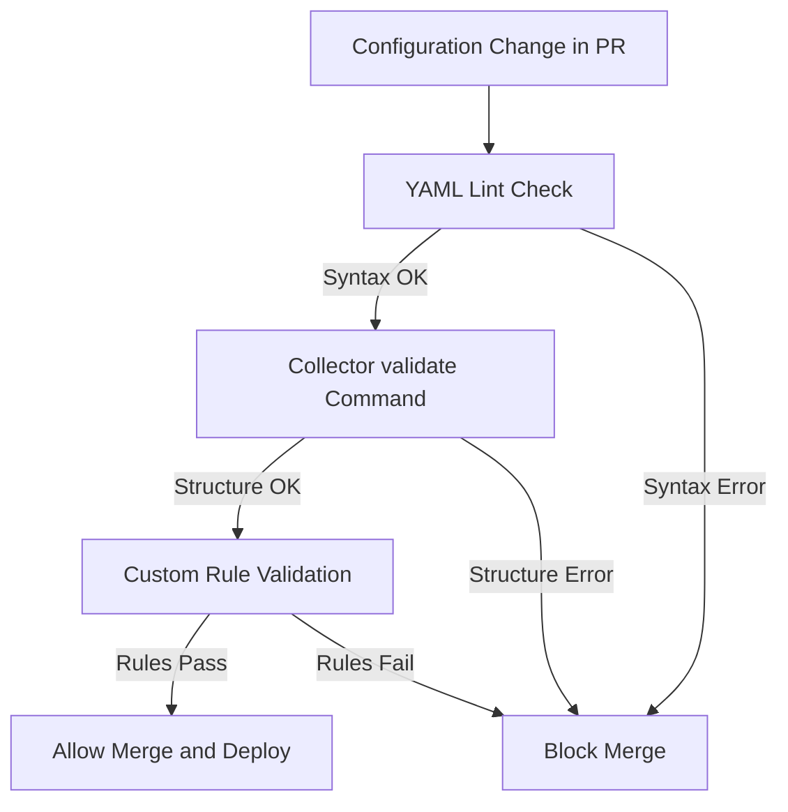

# How to Validate Collector Configurations Before Deploying to Production

Author: [nawazdhandala](https://www.github.com/nawazdhandala)

Tags: OpenTelemetry, Collector, Configuration, Validation, CI/CD, DevOps

Description: Learn how to validate OpenTelemetry Collector configurations before deploying them to production using built-in tools, linting, and CI pipeline integration.

---

A misconfigured OpenTelemetry Collector can silently drop telemetry data, crash on startup, or worse, send sensitive information to the wrong destination. These failures are painful in production but entirely preventable. The Collector ships with a built-in validation command, and you can layer additional checks on top of it to catch problems before they ever reach a live environment.

This guide walks through multiple approaches to validating Collector configurations, from simple command-line checks to automated CI/CD pipeline integration.

## The Cost of Bad Configurations

Configuration errors in the Collector fall into a few categories. Syntax errors in YAML will crash the Collector immediately. Semantic errors, like referencing a processor in a pipeline that is not defined in the processors section, will also cause startup failures. But the subtlest problems are logical errors: configurations that are technically valid but do not do what you intended.

For example, a batch processor with a timeout of 300 seconds instead of 300 milliseconds is valid YAML and passes semantic checks. But it means your telemetry data sits in a buffer for five minutes before being exported, which can look like data loss to anyone watching a dashboard.

Catching these issues requires a layered validation approach.

## Using the Built-in Validate Command

The Collector binary includes a `validate` subcommand that parses the configuration file and checks it for structural correctness. This catches YAML syntax errors, unknown component references, and pipeline wiring issues.

```bash
# Validate a single configuration file
# The --config flag points to the file you want to check
otelcol validate --config /etc/otelcol/config.yaml

# Validate with environment variable substitution
# This is important because production configs often use env vars
OTEL_BACKEND_ENDPOINT="https://backend.example.com:4317" \
  otelcol validate --config /etc/otelcol/config.yaml

# Validate a configuration that uses multiple config sources
# The collector merges them in order, left to right
otelcol validate \
  --config /etc/otelcol/base.yaml \
  --config /etc/otelcol/overrides.yaml
```

The validate command loads the configuration exactly the way the Collector would at startup. If validation succeeds, you get a clean exit with code 0. If it fails, you get a descriptive error message and a non-zero exit code, which makes it easy to use in scripts and pipelines.

## Common Validation Errors and Fixes

Let me walk through the most frequent configuration mistakes and what the validator reports for each one.

```yaml
# ERROR: Referencing a component that does not exist
# The validator will report: "processor \"memory_limiter\" is not configured"
service:
  pipelines:
    traces:
      receivers: [otlp]
      processors: [memory_limiter, batch]
      exporters: [otlp]

processors:
  # Notice: memory_limiter is missing from this section
  batch:
    timeout: 5s
```

The fix is straightforward: add the missing processor definition.

```yaml
# FIXED: All referenced components are now defined
receivers:
  otlp:
    protocols:
      grpc:
        endpoint: 0.0.0.0:4317

processors:
  # Memory limiter prevents OOM situations
  memory_limiter:
    check_interval: 1s
    limit_mib: 512
    spike_limit_mib: 128
  # Batch processor groups telemetry for efficient export
  batch:
    timeout: 5s
    send_batch_size: 1024

exporters:
  otlp:
    endpoint: backend.example.com:4317

service:
  pipelines:
    traces:
      receivers: [otlp]
      processors: [memory_limiter, batch]
      exporters: [otlp]
```

Another common issue is duplicate keys in YAML, which the parser silently resolves by taking the last value. This can cause unexpected behavior.

```yaml
# SUBTLE BUG: Duplicate "batch" key - second definition silently wins
processors:
  batch:
    timeout: 5s
    send_batch_size: 1024
  batch:
    timeout: 30s
    # send_batch_size is now unset (defaults to 8192)
```

The built-in validator will not catch this because the YAML parser resolves duplicates before validation. You need a YAML linter for this class of problem.

## Adding YAML Linting

A dedicated YAML linter catches issues that live below the Collector's validation layer: duplicate keys, incorrect indentation, and formatting inconsistencies.

```bash
# Install yamllint, a popular YAML linter
pip install yamllint

# Create a custom yamllint configuration for collector configs
cat > .yamllint.yaml << 'YAMLLINT_CONFIG'
extends: default
rules:
  # Allow long lines for endpoint URLs and descriptions
  line-length:
    max: 150
  # Enforce consistent indentation (2 spaces)
  indentation:
    spaces: 2
    indent-sequences: true
  # Catch duplicate keys that YAML silently resolves
  key-duplicates: enable
  # Allow truthy values like "on" in receiver configs
  truthy:
    allowed-values: ["true", "false", "yes", "no"]
YAMLLINT_CONFIG

# Lint all collector configuration files
yamllint -c .yamllint.yaml /etc/otelcol/*.yaml
```

Running yamllint before the Collector's validate command gives you a two-layer check: first the YAML structure, then the Collector-specific semantics.

## Writing Custom Validation Scripts

For organization-specific rules, you can write validation scripts that parse the config and check for patterns you want to enforce. This is where you catch the logical errors that no generic tool will find.

```python
#!/usr/bin/env python3
"""
Custom validator for OpenTelemetry Collector configurations.
Checks organization-specific rules beyond what the built-in
validator catches.
"""
import sys
import yaml


def load_config(path):
    """Load and parse the collector configuration file."""
    with open(path) as f:
        return yaml.safe_load(f)


def check_memory_limiter(config):
    """Ensure memory_limiter is present in all pipelines."""
    errors = []
    pipelines = config.get("service", {}).get("pipelines", {})

    for name, pipeline in pipelines.items():
        processors = pipeline.get("processors", [])
        if "memory_limiter" not in processors:
            errors.append(
                f"Pipeline '{name}' is missing memory_limiter processor. "
                f"This is required to prevent OOM kills in production."
            )
        elif processors[0] != "memory_limiter":
            errors.append(
                f"Pipeline '{name}' has memory_limiter but it is not the "
                f"first processor. It should be first to protect against "
                f"memory spikes during processing."
            )
    return errors


def check_batch_timeout(config):
    """Ensure batch processor timeout is reasonable."""
    errors = []
    processors = config.get("processors", {})

    for name, proc_config in processors.items():
        if name.startswith("batch") and proc_config:
            timeout = proc_config.get("timeout", "200ms")
            # Parse the timeout value
            if timeout.endswith("s") and not timeout.endswith("ms"):
                seconds = int(timeout.replace("s", ""))
                if seconds > 30:
                    errors.append(
                        f"Batch processor '{name}' has timeout of {timeout}. "
                        f"Values over 30s cause visible delays in dashboards."
                    )
    return errors


def check_tls_in_production(config):
    """Ensure TLS is configured for all external exporters."""
    errors = []
    exporters = config.get("exporters", {})

    for name, exp_config in exporters.items():
        if exp_config and "endpoint" in exp_config:
            endpoint = exp_config["endpoint"]
            tls = exp_config.get("tls", {})
            # Skip localhost endpoints
            if "localhost" in endpoint or "127.0.0.1" in endpoint:
                continue
            if not tls.get("insecure", False) and not tls:
                errors.append(
                    f"Exporter '{name}' targets '{endpoint}' without "
                    f"explicit TLS configuration. Set tls.insecure: true "
                    f"or provide TLS certificates."
                )
    return errors


def main():
    if len(sys.argv) != 2:
        print(f"Usage: {sys.argv[0]} <config-path>")
        sys.exit(1)

    config = load_config(sys.argv[1])

    # Run all checks and collect errors
    all_errors = []
    all_errors.extend(check_memory_limiter(config))
    all_errors.extend(check_batch_timeout(config))
    all_errors.extend(check_tls_in_production(config))

    if all_errors:
        print(f"Found {len(all_errors)} configuration issue(s):\n")
        for i, error in enumerate(all_errors, 1):
            print(f"  {i}. {error}")
        sys.exit(1)
    else:
        print("All custom validation checks passed.")
        sys.exit(0)


if __name__ == "__main__":
    main()
```

This script checks three rules: every pipeline must have a memory limiter as its first processor, batch timeouts must be reasonable, and external exporters must have TLS configuration. You can add more checks specific to your organization.

## CI/CD Pipeline Integration

Combining all these validation steps into a CI/CD pipeline ensures that no bad configuration reaches production. Here is a GitHub Actions workflow that runs the full validation suite.

```yaml
# .github/workflows/validate-collector-config.yml
name: Validate Collector Config

on:
  pull_request:
    paths:
      # Only run when collector configs change
      - "deploy/otelcol/**"
      - "config/collector/**"

jobs:
  validate:
    runs-on: ubuntu-latest
    steps:
      - uses: actions/checkout@v4

      - name: Install validation tools
        run: |
          pip install yamllint pyyaml
          # Download the collector binary for validation
          wget -q https://github.com/open-telemetry/opentelemetry-collector-releases/releases/download/v0.96.0/otelcol_0.96.0_linux_amd64.tar.gz
          tar xzf otelcol_0.96.0_linux_amd64.tar.gz
          chmod +x otelcol

      - name: YAML lint check
        run: yamllint -c .yamllint.yaml deploy/otelcol/*.yaml

      - name: Collector structural validation
        run: |
          for config in deploy/otelcol/*.yaml; do
            echo "Validating $config..."
            ./otelcol validate --config "$config"
          done

      - name: Custom rule validation
        run: |
          for config in deploy/otelcol/*.yaml; do
            echo "Checking custom rules for $config..."
            python scripts/validate_collector_config.py "$config"
          done
```

This workflow triggers only when Collector configuration files change, keeping your CI fast for unrelated pull requests. It runs three validation steps in sequence: YAML linting, built-in validation, and custom rule checks.

## Validation Flow Overview

Here is how the validation layers fit together.



Each layer catches a different class of problem. YAML linting catches syntax and formatting issues. The built-in validator catches component reference and pipeline wiring errors. Custom rules catch organizational policy violations and logical errors.

## Validating with Docker

If you do not want to install the Collector binary locally, you can run validation inside a Docker container. This also ensures you are testing against the exact same version you deploy.

```bash
# Validate using the same Docker image you use in production
# Mount your local config file into the container
docker run --rm \
  -v $(pwd)/config.yaml:/etc/otelcol/config.yaml:ro \
  otel/opentelemetry-collector-contrib:0.96.0 \
  validate --config /etc/otelcol/config.yaml

# Validate with environment variable substitution
docker run --rm \
  -v $(pwd)/config.yaml:/etc/otelcol/config.yaml:ro \
  -e OTEL_BACKEND_ENDPOINT="https://backend.example.com:4317" \
  -e OTEL_AUTH_TOKEN="placeholder-for-validation" \
  otel/opentelemetry-collector-contrib:0.96.0 \
  validate --config /etc/otelcol/config.yaml
```

Using Docker for validation has the added benefit of catching version-specific issues. A component that exists in the contrib distribution might not exist in the core distribution, and testing against the right image catches this before deployment.

## Wrapping Up

Configuration validation is one of those things that takes an hour to set up and saves you from countless production incidents. The built-in `validate` command handles the basics, YAML linting catches structural issues, and custom scripts enforce your organization's specific requirements. Wiring all three into a CI/CD pipeline means that bad configurations get caught at code review time, not at 2 AM when your pager goes off.

Start with the built-in validate command. Add yamllint. Then write custom checks for the rules that matter most in your environment. Each layer you add reduces the surface area for configuration-related outages.
