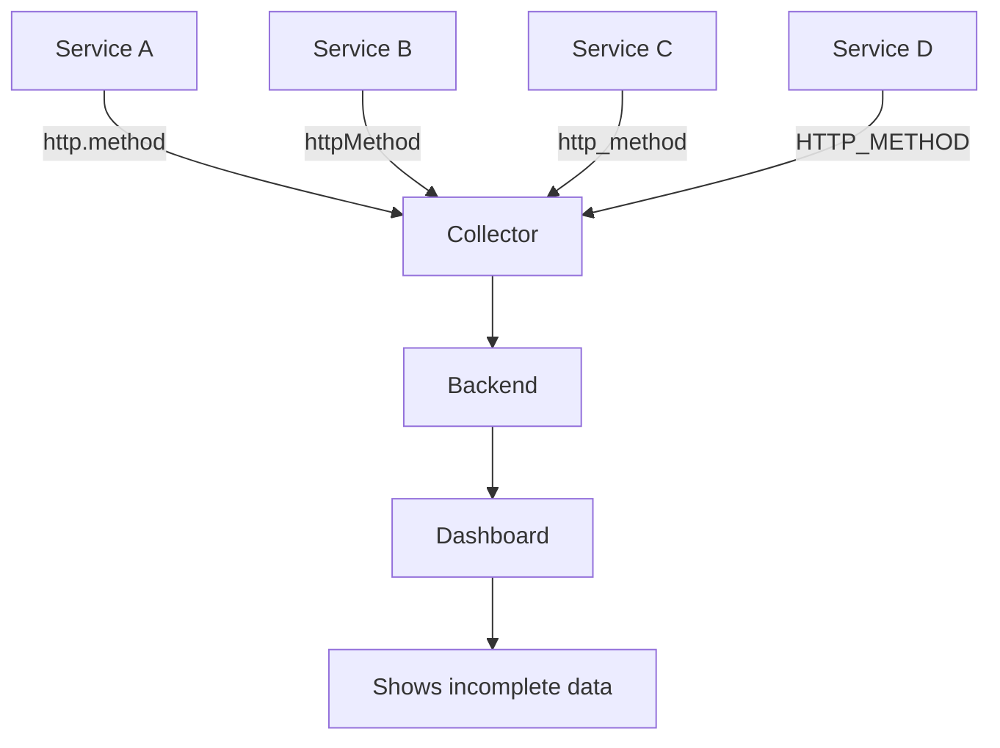
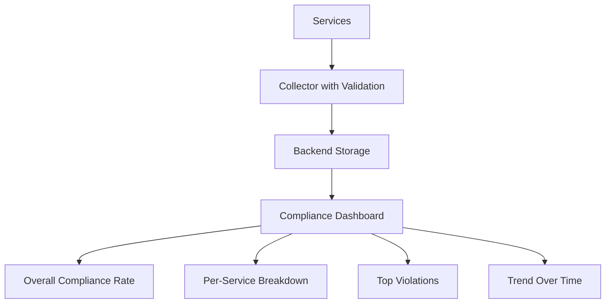

# How to Validate Semantic Convention Compliance in Your Telemetry

Author: [nawazdhandala](https://www.github.com/nawazdhandala)

Tags: OpenTelemetry, Semantic Conventions, Validation, Data Quality, Telemetry, Testing

Description: Build automated validation pipelines to ensure your OpenTelemetry telemetry data consistently follows semantic conventions across all services.

---

Defining semantic conventions is one thing. Ensuring that every service in your fleet actually follows them is another challenge entirely. Without validation, conventions drift over time. New developers join and guess at attribute names. Auto-instrumentation libraries emit attributes in formats you did not expect. Copy-paste errors introduce subtle inconsistencies that only surface when a dashboard goes blank at 2 AM.

This guide shows you how to build validation into your telemetry pipeline at multiple layers, from unit tests in application code to runtime checks in the collector and automated compliance reports.

## The Compliance Problem

Consider what happens in a system with 50 microservices and no convention validation. Each team instruments their service independently. After six months, you end up with attribute names like `http.method`, `httpMethod`, `http_method`, and `HTTP_METHOD` all representing the same concept. Queries that work for one service fail silently for others because the attribute names do not match.



Validation catches these problems before they reach production. The earlier you validate, the cheaper the fix.

## Unit Testing Attribute Names

The first layer of defense is in your application tests. Write tests that verify your instrumentation code uses the correct attribute names and value types.

```python
# test_instrumentation.py
# Unit tests that verify spans carry the correct semantic convention attributes.
# These run in CI and catch convention drift before code is deployed.

import unittest
from unittest.mock import MagicMock, patch
from opentelemetry import trace
from opentelemetry.sdk.trace import TracerProvider
from opentelemetry.sdk.trace.export.in_memory import InMemorySpanExporter

class TestOrderInstrumentation(unittest.TestCase):
    """Verify that the order service emits correct semantic convention attributes."""

    def setUp(self):
        # Set up an in-memory exporter to capture spans during tests
        self.exporter = InMemorySpanExporter()
        provider = TracerProvider()
        provider.add_span_processor(
            trace.get_tracer_provider()
            # SimpleSpanProcessor for synchronous test export
        )
        from opentelemetry.sdk.trace.export import SimpleSpanProcessor
        self.provider = TracerProvider()
        self.provider.add_span_processor(SimpleSpanProcessor(self.exporter))
        trace.set_tracer_provider(self.provider)

    def tearDown(self):
        self.exporter.clear()

    def test_http_span_has_required_attributes(self):
        """HTTP spans must include stable semantic convention attributes."""
        # Trigger the code that creates HTTP spans
        from myapp.handlers import handle_request
        handle_request(method="GET", path="/api/orders")

        spans = self.exporter.get_finished_spans()
        self.assertGreater(len(spans), 0, "Expected at least one span")

        span = spans[0]
        attrs = dict(span.attributes)

        # Verify stable convention attribute names are used
        self.assertIn("http.request.method", attrs,
            "Missing required attribute: http.request.method")
        self.assertIn("http.response.status_code", attrs,
            "Missing required attribute: http.response.status_code")
        self.assertIn("url.path", attrs,
            "Missing required attribute: url.path")

        # Verify deprecated attributes are NOT present
        self.assertNotIn("http.method", attrs,
            "Deprecated attribute found: http.method (use http.request.method)")
        self.assertNotIn("http.status_code", attrs,
            "Deprecated attribute found: http.status_code")

    def test_attribute_value_types(self):
        """Attribute values must match expected types from the convention."""
        from myapp.handlers import handle_request
        handle_request(method="GET", path="/api/orders")

        spans = self.exporter.get_finished_spans()
        span = spans[0]
        attrs = dict(span.attributes)

        # Status code must be an integer, not a string
        status = attrs.get("http.response.status_code")
        self.assertIsInstance(status, int,
            f"http.response.status_code should be int, got {type(status)}")

        # HTTP method must be uppercase
        method = attrs.get("http.request.method")
        self.assertEqual(method, method.upper(),
            f"http.request.method should be uppercase, got '{method}'")
```

These tests serve as living documentation of your conventions. When a developer modifies the instrumentation code and accidentally breaks a convention, the test suite catches it immediately.

## Schema-Based Validation

For more comprehensive validation, define your conventions as a schema and validate telemetry data against it programmatically.

```python
# convention_validator.py
# A reusable validator that checks span attributes against a convention schema.
# Can be used in tests, CI pipelines, or as a collector component.

from dataclasses import dataclass, field
from typing import Optional

@dataclass
class AttributeRule:
    """Defines validation rules for a single attribute."""
    name: str
    attr_type: type                    # Expected Python type
    required: bool = False             # Must be present on matching spans
    allowed_values: list = field(default_factory=list)  # Empty means any value
    deprecated_names: list = field(default_factory=list) # Old names to flag

@dataclass
class ConventionSchema:
    """A collection of attribute rules for a specific span kind."""
    span_name_pattern: str             # Regex to match span names
    rules: list                        # List of AttributeRule objects

# Define the schema for HTTP server spans
HTTP_SERVER_SCHEMA = ConventionSchema(
    span_name_pattern=r"^(GET|POST|PUT|DELETE|PATCH|HEAD|OPTIONS)\s",
    rules=[
        AttributeRule(
            name="http.request.method",
            attr_type=str,
            required=True,
            allowed_values=["GET", "POST", "PUT", "DELETE", "PATCH", "HEAD", "OPTIONS"],
            deprecated_names=["http.method"]
        ),
        AttributeRule(
            name="http.response.status_code",
            attr_type=int,
            required=True,
            deprecated_names=["http.status_code"]
        ),
        AttributeRule(
            name="url.path",
            attr_type=str,
            required=True,
            deprecated_names=["http.target"]
        ),
        AttributeRule(
            name="url.scheme",
            attr_type=str,
            required=False,
            allowed_values=["http", "https"],
            deprecated_names=["http.scheme"]
        ),
    ]
)

def validate_span(span_data: dict, schema: ConventionSchema) -> list:
    """Validate a span's attributes against a convention schema.

    Returns a list of violation descriptions. An empty list means compliance.
    """
    violations = []
    attrs = span_data.get("attributes", {})

    for rule in schema.rules:
        # Check for deprecated attribute names
        for dep_name in rule.deprecated_names:
            if dep_name in attrs:
                violations.append(
                    f"Deprecated attribute '{dep_name}' found. "
                    f"Use '{rule.name}' instead."
                )

        # Check required attributes
        if rule.required and rule.name not in attrs:
            violations.append(
                f"Required attribute '{rule.name}' is missing."
            )

        # Check type if attribute is present
        if rule.name in attrs:
            value = attrs[rule.name]
            if not isinstance(value, rule.attr_type):
                violations.append(
                    f"Attribute '{rule.name}' has type {type(value).__name__}, "
                    f"expected {rule.attr_type.__name__}."
                )

            # Check allowed values if specified
            if rule.allowed_values and value not in rule.allowed_values:
                violations.append(
                    f"Attribute '{rule.name}' has value '{value}', "
                    f"expected one of {rule.allowed_values}."
                )

    return violations
```

This schema-based approach scales well. You define the rules once and validate any number of spans against them. You can load schemas from YAML files, share them across teams, and version them alongside your convention definitions.

## Collector-Level Validation

The OpenTelemetry Collector sits at a natural chokepoint where all telemetry flows through. Adding validation here catches non-compliant data from any service, including third-party services and legacy systems you cannot easily modify.

```yaml
# collector-validation.yaml
# Uses the filter processor to detect and log non-compliant spans.
# Pairs with the transform processor to fix common issues.

processors:
  # Log warnings for spans missing required attributes
  filter/warn_missing_method:
    spans:
      # This processor can selectively drop or keep spans
      # For validation, use it with logging to flag issues
      include:
        match_type: regexp
        span_names: ["^(GET|POST|PUT|DELETE).*"]
      exclude:
        match_type: strict
        attributes:
          - key: http.request.method
            value: ""

  # Transform processor to fix known compliance issues
  transform/normalize:
    trace_statements:
      - context: span
        statements:
          # Fix common type errors: string status codes to integers
          # Some libraries incorrectly emit status_code as a string
          - set(attributes["http.response.status_code"],
              Int(attributes["http.response.status_code"]))
            where IsString(attributes["http.response.status_code"])

          # Normalize HTTP methods to uppercase
          - set(attributes["http.request.method"],
              ConvertCase(attributes["http.request.method"], "upper"))
            where attributes["http.request.method"] != nil

  # Attributes processor to flag non-compliant spans
  attributes/compliance_tag:
    actions:
      # Tag spans that are missing required attributes
      - key: _compliance.missing_method
        value: true
        action: insert
```

This configuration catches and fixes common issues automatically. String status codes get converted to integers. HTTP methods get normalized to uppercase. Spans with missing attributes get tagged so you can track compliance rates in your backend.

## Building a Compliance Dashboard

With compliance tags in place, build a dashboard that shows convention adherence across your fleet.



Query your telemetry backend for compliance metrics. Here is an example using a hypothetical query language.

```sql
-- Compliance rate by service over the last 24 hours
SELECT
    resource.attributes["service.name"] AS service,
    COUNT(*) AS total_spans,
    COUNT_IF(attributes["_compliance.violation"] IS NULL) AS compliant_spans,
    ROUND(compliant_spans * 100.0 / total_spans, 1) AS compliance_pct
FROM spans
WHERE timestamp > NOW() - INTERVAL '24 hours'
GROUP BY service
ORDER BY compliance_pct ASC
```

This gives you a clear view of which services need attention. Share the dashboard with engineering teams and set a target compliance rate. Many organizations aim for 95% or higher.

## CI Pipeline Integration

Add convention validation to your CI pipeline so non-compliant instrumentation never reaches production.

```python
# ci_validate_conventions.py
# Run as a CI step after integration tests.
# Collects spans from test runs and validates them against convention schemas.

import json
import sys
from convention_validator import validate_span, HTTP_SERVER_SCHEMA

def load_test_spans(filepath: str) -> list:
    """Load spans exported during integration tests."""
    with open(filepath, "r") as f:
        return json.load(f)

def run_validation(spans_file: str) -> bool:
    """Validate all spans and return True if all are compliant."""
    spans = load_test_spans(spans_file)
    total_violations = 0
    schemas = [HTTP_SERVER_SCHEMA]  # Add more schemas as needed

    for span in spans:
        for schema in schemas:
            violations = validate_span(span, schema)
            for v in violations:
                # Print violation details for CI output
                print(f"VIOLATION in span '{span.get('name', 'unknown')}': {v}")
                total_violations += 1

    print(f"\nValidation complete: {len(spans)} spans checked, "
          f"{total_violations} violations found.")
    return total_violations == 0

if __name__ == "__main__":
    spans_file = sys.argv[1] if len(sys.argv) > 1 else "test_spans.json"
    success = run_validation(spans_file)
    sys.exit(0 if success else 1)
```

Configure your CI system to run integration tests with an in-memory or file-based span exporter, then run this validation script against the exported spans. A non-zero exit code fails the build, preventing convention violations from being deployed.

## Automated Remediation

For large fleets, manual remediation does not scale. Build tooling that can automatically fix common violations.

```python
# auto_remediate.py
# Automatically generates code patches for common convention violations.
# Useful for running across many repositories in a migration campaign.

import re

# Patterns to find and replace in source code
REMEDIATIONS = [
    # Fix deprecated attribute names in Python instrumentation
    (r'set_attribute\("http\.method"', 'set_attribute("http.request.method"'),
    (r'set_attribute\("http\.status_code"', 'set_attribute("http.response.status_code"'),
    (r'set_attribute\("http\.url"', 'set_attribute("url.full"'),
    (r'set_attribute\("http\.target"', 'set_attribute("url.path"'),
    (r'set_attribute\("net\.peer\.name"', 'set_attribute("server.address"'),
    (r'set_attribute\("db\.statement"', 'set_attribute("db.query.text"'),
]

def remediate_file(filepath: str, dry_run: bool = True) -> list:
    """Apply remediations to a single file. Returns list of changes made."""
    with open(filepath, "r") as f:
        content = f.read()

    changes = []
    new_content = content

    for pattern, replacement in REMEDIATIONS:
        matches = re.findall(pattern, new_content)
        if matches:
            changes.append(f"  {pattern} -> {replacement} ({len(matches)} occurrences)")
            new_content = re.sub(pattern, replacement, new_content)

    if changes and not dry_run:
        with open(filepath, "w") as f:
            f.write(new_content)

    return changes
```

Run this in dry-run mode first to review the proposed changes, then apply them across your codebase. Pair it with automated test runs to verify that the changes do not break anything.

## Practical Recommendations

Start with the attributes that appear most frequently in your queries and dashboards. Fixing `http.request.method` and `http.response.status_code` gives you the most immediate value. Add validation incrementally rather than trying to cover every convention at once. Use the collector as a safety net for runtime validation while building out test-level validation. Track your compliance rate over time and celebrate improvements with the team.

Convention compliance is not a one-time project. It is an ongoing practice that requires tooling, culture, and consistent reinforcement. The payoff is telemetry data you can actually trust, dashboards that work across all services, and alert rules that catch real problems instead of missing them due to attribute mismatches.
