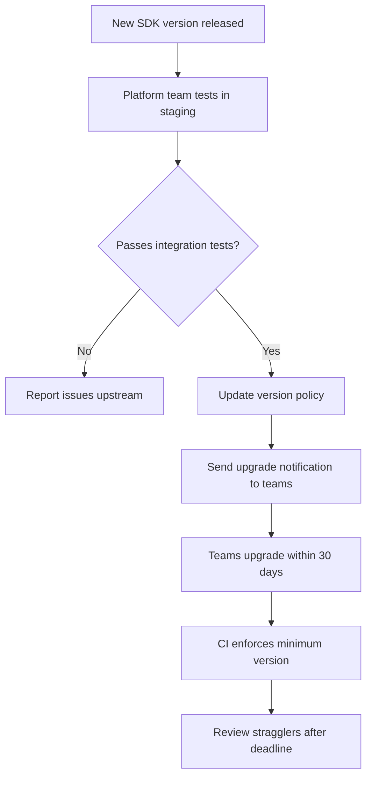

# How to Version and Manage OpenTelemetry SDK Upgrades Across Teams

Author: [nawazdhandala](https://www.github.com/nawazdhandala)

Tags: OpenTelemetry, SDK, Version Management, Dependency Management, DevOps, Upgrades

Description: Learn how to coordinate OpenTelemetry SDK version upgrades across multiple teams and services to avoid compatibility issues and minimize disruption.

---

OpenTelemetry SDKs release frequently. The Java SDK, the Python SDK, the Go SDK, and the Node.js SDK all have independent release cycles. Each release may include bug fixes, new features, performance improvements, and sometimes breaking changes. When you have dozens of teams maintaining hundreds of services, keeping everyone on a compatible set of SDK versions becomes a real coordination challenge.

If team A upgrades to the latest SDK while team B stays on a version from six months ago, you may see subtle incompatibilities in trace context propagation, different default behaviors for sampling, or mismatched semantic conventions. This post covers practical strategies for managing SDK versions across an organization.

## The Version Matrix Problem

Each language SDK has its own version number, and they do not stay in sync:

```
Java SDK:     1.36.0
Python SDK:   1.25.0
Go SDK:       1.28.0
Node.js SDK:  1.22.0
.NET SDK:     1.8.0
```

Each SDK also depends on the OpenTelemetry API package, the OTLP exporter, and various instrumentation libraries. A single service might depend on five or more OpenTelemetry packages, each with its own version.

The goal is not to have every service on the exact same version. That is impractical given different release cycles. The goal is to have every service within a compatible version range and to upgrade on a predictable schedule.

## Version Policy

Define a version policy that sets expectations for all teams:

```yaml
# otel-version-policy.yaml
# Organization-wide OpenTelemetry version policy.
# This defines the supported version ranges and upgrade cadence.
policy:
  # How often teams must upgrade to stay within the supported range
  upgrade_cadence: quarterly

  # Maximum age of SDK version (in months) before it is considered unsupported
  max_version_age_months: 6

  # Minimum supported versions (updated quarterly)
  minimum_versions:
    java:
      api: "1.34.0"
      sdk: "1.34.0"
      agent: "2.2.0"
    python:
      api: "1.23.0"
      sdk: "1.23.0"
    go:
      api: "1.26.0"
      sdk: "1.26.0"
    nodejs:
      api: "1.20.0"
      sdk: "0.50.0"

  # Recommended versions (latest tested and approved)
  recommended_versions:
    java:
      api: "1.36.0"
      sdk: "1.36.0"
      agent: "2.4.0"
    python:
      api: "1.25.0"
      sdk: "1.25.0"
    go:
      api: "1.28.0"
      sdk: "1.28.0"
    nodejs:
      api: "1.22.0"
      sdk: "0.52.0"
```

## Automated Version Checking

Build a CI check that runs in every service repository to verify SDK versions:

```python
# scripts/check_otel_versions.py
# CI script that checks if a service's OpenTelemetry SDK versions
# are within the organization's supported range.
import json
import sys
import subprocess
from packaging import version

# Load the version policy
with open("otel-version-policy.yaml") as f:
    import yaml
    policy = yaml.safe_load(f)

def check_python_versions():
    """Check Python OpenTelemetry package versions."""
    result = subprocess.run(
        ["pip", "list", "--format=json"],
        capture_output=True, text=True
    )
    installed = {p["name"]: p["version"] for p in json.loads(result.stdout)}

    min_versions = policy["policy"]["minimum_versions"]["python"]
    errors = []

    otel_packages = {
        "opentelemetry-api": min_versions["api"],
        "opentelemetry-sdk": min_versions["sdk"],
    }

    for package, min_ver in otel_packages.items():
        if package in installed:
            current = version.parse(installed[package])
            minimum = version.parse(min_ver)
            if current < minimum:
                errors.append(
                    f"{package} version {installed[package]} is below "
                    f"minimum {min_ver}. Please upgrade."
                )
        else:
            errors.append(f"{package} is not installed")

    return errors

def check_nodejs_versions():
    """Check Node.js OpenTelemetry package versions."""
    with open("package.json") as f:
        pkg = json.load(f)

    all_deps = {}
    all_deps.update(pkg.get("dependencies", {}))
    all_deps.update(pkg.get("devDependencies", {}))

    min_versions = policy["policy"]["minimum_versions"]["nodejs"]
    errors = []

    if "@opentelemetry/api" in all_deps:
        ver = all_deps["@opentelemetry/api"].lstrip("^~>=")
        if version.parse(ver) < version.parse(min_versions["api"]):
            errors.append(
                f"@opentelemetry/api {ver} is below minimum {min_versions['api']}"
            )

    return errors

# Run checks based on detected language
errors = []
import os
if os.path.exists("requirements.txt") or os.path.exists("setup.py"):
    errors.extend(check_python_versions())
if os.path.exists("package.json"):
    errors.extend(check_nodejs_versions())

if errors:
    for error in errors:
        print(f"ERROR: {error}")
    sys.exit(1)

print("All OpenTelemetry versions are within the supported range")
```

## Centralized Dependency Management

### For Node.js (Monorepo with Workspaces)

Use a shared dependency constraint at the root level:

```json
{
  "name": "my-org-monorepo",
  "private": true,
  "overrides": {
    "@opentelemetry/api": "1.22.0",
    "@opentelemetry/sdk-trace-base": "1.22.0",
    "@opentelemetry/sdk-trace-node": "1.22.0",
    "@opentelemetry/exporter-trace-otlp-http": "0.52.0"
  }
}
```

### For Python (pip constraints)

Maintain a shared constraints file:

```
# otel-constraints.txt
# Shared across all Python services. Reference with:
# pip install -c otel-constraints.txt -r requirements.txt
opentelemetry-api==1.25.0
opentelemetry-sdk==1.25.0
opentelemetry-exporter-otlp-proto-http==1.25.0
opentelemetry-instrumentation-flask==0.46b0
opentelemetry-instrumentation-requests==0.46b0
opentelemetry-instrumentation-sqlalchemy==0.46b0
```

### For Go (go.work or shared tooling)

```
// go.work
// Use a workspace to align Go module versions across services
go 1.22

use (
    ./services/api-gateway
    ./services/order-service
    ./services/user-service
)

// Each module's go.mod should reference the same OTel versions
```

### For Java (Maven BOM)

```xml
<!-- Use the OpenTelemetry BOM to align all Java OTel versions -->
<dependencyManagement>
    <dependencies>
        <dependency>
            <groupId>io.opentelemetry</groupId>
            <artifactId>opentelemetry-bom</artifactId>
            <version>1.36.0</version>
            <type>pom</type>
            <scope>import</scope>
        </dependency>
        <dependency>
            <groupId>io.opentelemetry.instrumentation</groupId>
            <artifactId>opentelemetry-instrumentation-bom</artifactId>
            <version>2.4.0</version>
            <type>pom</type>
            <scope>import</scope>
        </dependency>
    </dependencies>
</dependencyManagement>
```

## Upgrade Process

When it is time to upgrade, follow a structured process:



### Staging Validation

Before recommending a new version, test it in a staging environment:

```bash
#!/bin/bash
# scripts/test-sdk-upgrade.sh
# Tests a new SDK version against the integration test suite.
# Run this in staging before updating the version policy.

SDK_VERSION=$1
LANGUAGE=$2

echo "Testing OpenTelemetry $LANGUAGE SDK version $SDK_VERSION"

# Deploy test services with the new SDK version
kubectl set env deployment/test-$LANGUAGE-service \
  OTEL_SDK_VERSION=$SDK_VERSION \
  -n staging

# Wait for rollout
kubectl rollout status deployment/test-$LANGUAGE-service -n staging

# Run integration tests
./run-integration-tests.sh --target test-$LANGUAGE-service

# Check that traces are flowing correctly
SPAN_COUNT=$(curl -s "http://trace-backend/api/traces?service=test-$LANGUAGE-service&limit=100" | jq '.data | length')

if [ "$SPAN_COUNT" -lt 10 ]; then
  echo "FAIL: Expected at least 10 spans, got $SPAN_COUNT"
  exit 1
fi

echo "PASS: SDK version $SDK_VERSION for $LANGUAGE is verified"
```

## Automated Upgrade PRs

Use a bot to create upgrade pull requests for teams:

```yaml
# .github/workflows/otel-upgrade-bot.yaml
# Runs weekly and creates PRs for services that need SDK upgrades.
name: OpenTelemetry Upgrade Bot

on:
  schedule:
    - cron: '0 9 * * 1'  # Every Monday at 9am
  workflow_dispatch:

jobs:
  upgrade-python:
    runs-on: ubuntu-latest
    strategy:
      matrix:
        service: [order-service, user-service, billing-service]
    steps:
      - uses: actions/checkout@v4

      - name: Check current version
        id: check
        run: |
          CURRENT=$(grep opentelemetry-sdk services/${{ matrix.service }}/requirements.txt | cut -d= -f3)
          RECOMMENDED="1.25.0"
          echo "current=$CURRENT" >> $GITHUB_OUTPUT
          echo "recommended=$RECOMMENDED" >> $GITHUB_OUTPUT

      - name: Create upgrade PR
        if: steps.check.outputs.current != steps.check.outputs.recommended
        run: |
          git checkout -b otel-upgrade/${{ matrix.service }}
          sed -i "s/opentelemetry-sdk==.*/opentelemetry-sdk==${{ steps.check.outputs.recommended }}/" \
            services/${{ matrix.service }}/requirements.txt
          git add .
          git commit -m "Upgrade OpenTelemetry SDK to ${{ steps.check.outputs.recommended }}"
          git push origin otel-upgrade/${{ matrix.service }}
          gh pr create --title "Upgrade OTel SDK for ${{ matrix.service }}" \
            --body "Automated upgrade to recommended version"
```

## Tracking Compliance

Build a dashboard that shows SDK version adoption across the organization:

```python
# scripts/version_report.py
# Generates a report of OpenTelemetry SDK versions across all services.
# Run this to see which teams need to upgrade.
import json

services = load_service_catalog()
version_data = []

for service in services:
    versions = detect_otel_versions(service)
    compliant = check_compliance(versions)
    version_data.append({
        "service": service.name,
        "team": service.team,
        "language": service.language,
        "sdk_version": versions.get("sdk", "unknown"),
        "compliant": compliant,
    })

# Print summary
compliant_count = sum(1 for s in version_data if s["compliant"])
total = len(version_data)
print(f"Compliance: {compliant_count}/{total} services ({100*compliant_count/total:.1f}%)")
```

## Conclusion

Managing OpenTelemetry SDK versions across an organization is an ongoing process, not a one-time task. By defining a clear version policy, automating compliance checks in CI, providing centralized dependency management, and running an automated upgrade bot, you can keep hundreds of services on compatible SDK versions without becoming a bottleneck. The key is making upgrades easy and predictable rather than urgent and disruptive.
