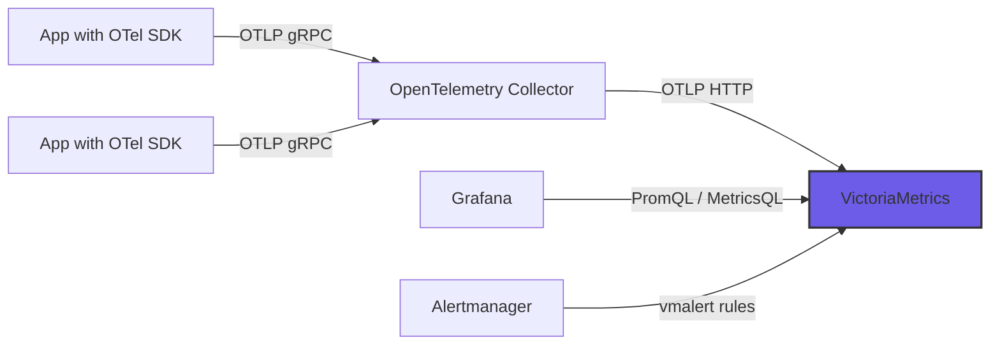

# How to Configure VictoriaMetrics as an OpenTelemetry Metrics Backend

Author: [nawazdhandala](https://www.github.com/nawazdhandala)

Tags: OpenTelemetry, VictoriaMetrics, Metrics, Time-Series, Prometheus, Backend

Description: Learn how to configure VictoriaMetrics as a high-performance OpenTelemetry metrics backend with native OTLP ingestion and long-term storage capabilities.

---

VictoriaMetrics is a fast, cost-effective time-series database that has become a popular alternative to Prometheus for long-term metrics storage. Starting with version 1.93, VictoriaMetrics supports native OTLP ingestion, which means you can send OpenTelemetry metrics directly to it without any translation layer. This makes it a compelling backend for teams already using OpenTelemetry who want a lightweight, high-performance metrics store. In this guide, we will deploy VictoriaMetrics, configure it to accept OpenTelemetry metrics, and set up the full pipeline from application instrumentation to querying.

## Why VictoriaMetrics for OpenTelemetry Metrics

VictoriaMetrics was originally designed as a Prometheus-compatible long-term storage solution, but it has evolved into a full-featured time-series database with several advantages for OpenTelemetry workloads.

It uses significantly less memory and disk space than Prometheus for the same data. VictoriaMetrics achieves this through aggressive compression and a storage engine optimized for time-series patterns. For teams generating large volumes of OpenTelemetry metrics, this translates directly into lower infrastructure costs.

The native OTLP endpoint means the OpenTelemetry Collector can send metrics directly to VictoriaMetrics without converting them to Prometheus remote write format first. This preserves OpenTelemetry semantic conventions and avoids the data loss that can happen during format conversion.

VictoriaMetrics also supports MetricsQL, a query language that is backward compatible with PromQL but adds useful extensions for analytics. You can use existing Grafana dashboards and alerting rules without modification.

## Architecture Overview

Here is the typical architecture for using VictoriaMetrics with OpenTelemetry:



Applications send metrics to the OpenTelemetry Collector over OTLP gRPC. The Collector processes and exports them to VictoriaMetrics using the OTLP HTTP endpoint. Grafana and alerting tools query VictoriaMetrics using PromQL-compatible queries.

## Deploying VictoriaMetrics

VictoriaMetrics comes in two editions: single-node and cluster. For most workloads handling up to millions of active time series, the single-node version is sufficient and simpler to operate.

Deploy VictoriaMetrics using Docker Compose:

```yaml
# docker-compose.yml for VictoriaMetrics with Grafana
version: "3"

services:
  # VictoriaMetrics single-node server
  victoriametrics:
    image: victoriametrics/victoria-metrics:v1.102.0
    ports:
      # HTTP API and OTLP ingestion endpoint
      - "8428:8428"
    volumes:
      - vm_data:/storage
    command:
      # Enable OpenTelemetry OTLP ingestion
      - "--openTelemetryListenAddr=:8428"
      # Data retention period (how long metrics are kept)
      - "--retentionPeriod=90d"
      # Memory limit for the storage engine
      - "--memory.allowedPercent=60"
      # Search settings for query performance
      - "--search.maxConcurrentRequests=16"
      - "--search.maxUniqueTimeseries=300000"
    restart: unless-stopped

  # Grafana for dashboards and visualization
  grafana:
    image: grafana/grafana:10.2.0
    ports:
      - "3000:3000"
    environment:
      GF_SECURITY_ADMIN_PASSWORD: admin
    volumes:
      - grafana_data:/var/lib/grafana
      - ./grafana/provisioning:/etc/grafana/provisioning
    depends_on:
      - victoriametrics

volumes:
  vm_data:
  grafana_data:
```

The `--openTelemetryListenAddr` flag enables the OTLP HTTP endpoint on the same port as the regular HTTP API. VictoriaMetrics accepts OTLP data at the `/opentelemetry/v1/metrics` path.

Start the services:

```bash
# Start VictoriaMetrics and Grafana
docker compose up -d

# Verify VictoriaMetrics is accepting connections
curl -s http://localhost:8428/health
# Should return "OK"

# Check OTLP endpoint availability
curl -s -X POST http://localhost:8428/opentelemetry/v1/metrics \
  -H "Content-Type: application/json" \
  -d '{}'
# Should return a response (even if empty data)
```

## Configuring the OpenTelemetry Collector

The Collector configuration uses the OTLP HTTP exporter to send metrics to VictoriaMetrics. This is straightforward since VictoriaMetrics exposes a standard OTLP endpoint.

```yaml
# otel-collector-config.yml
receivers:
  # Accept OTLP data from instrumented applications
  otlp:
    protocols:
      grpc:
        endpoint: 0.0.0.0:4317
      http:
        endpoint: 0.0.0.0:4318

  # Scrape Prometheus-style metrics from existing services
  prometheus:
    config:
      scrape_configs:
        - job_name: "node-exporter"
          scrape_interval: 15s
          static_configs:
            - targets: ["localhost:9100"]

processors:
  # Batch metrics for efficient network usage
  batch:
    timeout: 10s
    send_batch_size: 5000

  # Memory limiter to prevent OOM situations
  memory_limiter:
    check_interval: 1s
    limit_mib: 256
    spike_limit_mib: 64

  # Resource detection adds environment metadata automatically
  resourcedetection:
    detectors: [env, system]
    timeout: 5s
    override: false

exporters:
  # OTLP HTTP exporter pointing to VictoriaMetrics
  otlphttp/victoriametrics:
    # VictoriaMetrics OTLP endpoint
    endpoint: http://localhost:8428/opentelemetry
    # Disable TLS for local development
    tls:
      insecure: true
    # Retry settings for reliability
    retry_on_failure:
      enabled: true
      initial_interval: 5s
      max_interval: 30s
      max_elapsed_time: 300s

service:
  pipelines:
    metrics:
      receivers: [otlp, prometheus]
      processors: [memory_limiter, resourcedetection, batch]
      exporters: [otlphttp/victoriametrics]
```

Notice the endpoint path. VictoriaMetrics expects OTLP data at `/opentelemetry/v1/metrics`, and the OTLP HTTP exporter appends `/v1/metrics` automatically. So we set the base endpoint to `http://localhost:8428/opentelemetry`.

## Instrumenting a Go Application

Here is an example of a Go application that sends metrics to the OpenTelemetry Collector:

```go
// main.go - Go application with OpenTelemetry metrics
package main

import (
    "context"
    "log"
    "math/rand"
    "net/http"
    "time"

    "go.opentelemetry.io/otel"
    "go.opentelemetry.io/otel/exporters/otlp/otlpmetric/otlpmetricgrpc"
    "go.opentelemetry.io/otel/metric"
    sdkmetric "go.opentelemetry.io/otel/sdk/metric"
    "go.opentelemetry.io/otel/sdk/resource"
    semconv "go.opentelemetry.io/otel/semconv/v1.21.0"
)

func initMetrics() (*sdkmetric.MeterProvider, error) {
    ctx := context.Background()

    // Create the OTLP gRPC exporter
    // Connects to the OpenTelemetry Collector on port 4317
    exporter, err := otlpmetricgrpc.New(ctx,
        otlpmetricgrpc.WithEndpoint("localhost:4317"),
        otlpmetricgrpc.WithInsecure(),
    )
    if err != nil {
        return nil, err
    }

    // Define the service resource with semantic conventions
    res, err := resource.New(ctx,
        resource.WithAttributes(
            semconv.ServiceName("my-go-service"),
            semconv.ServiceVersion("1.0.0"),
            semconv.DeploymentEnvironment("production"),
        ),
    )
    if err != nil {
        return nil, err
    }

    // Create the meter provider with a periodic reader
    // Metrics are exported every 30 seconds
    mp := sdkmetric.NewMeterProvider(
        sdkmetric.WithResource(res),
        sdkmetric.WithReader(
            sdkmetric.NewPeriodicReader(exporter,
                sdkmetric.WithInterval(30*time.Second),
            ),
        ),
    )

    otel.SetMeterProvider(mp)
    return mp, nil
}

func main() {
    // Initialize the metrics pipeline
    mp, err := initMetrics()
    if err != nil {
        log.Fatal(err)
    }
    defer mp.Shutdown(context.Background())

    // Create a meter and register instruments
    meter := otel.Meter("my-go-service")

    // Counter for total HTTP requests
    requestCounter, _ := meter.Int64Counter("http.requests.total",
        metric.WithDescription("Total number of HTTP requests"),
        metric.WithUnit("{request}"),
    )

    // Histogram for request duration
    requestDuration, _ := meter.Float64Histogram("http.request.duration",
        metric.WithDescription("HTTP request duration in seconds"),
        metric.WithUnit("s"),
    )

    // Simple HTTP handler that records metrics
    http.HandleFunc("/", func(w http.ResponseWriter, r *http.Request) {
        start := time.Now()

        // Increment the request counter
        requestCounter.Add(r.Context(), 1)

        // Simulate some work
        time.Sleep(time.Duration(rand.Intn(100)) * time.Millisecond)

        // Record the request duration
        duration := time.Since(start).Seconds()
        requestDuration.Record(r.Context(), duration)

        w.Write([]byte("Hello from VictoriaMetrics + OpenTelemetry!"))
    })

    log.Println("Server starting on :8080")
    log.Fatal(http.ListenAndServe(":8080", nil))
}
```

## Querying Metrics in VictoriaMetrics

VictoriaMetrics exposes a Prometheus-compatible query API. You can query it directly or through Grafana.

OpenTelemetry metrics are stored with their original names but converted to Prometheus format. Dots in metric names are replaced with underscores, and the metric type suffix is appended automatically. For example, `http.request.duration` becomes `http_request_duration_seconds`.

Here are some useful MetricsQL queries:

```promql
# Average request duration over the last 5 minutes
# grouped by service name
avg by (service_name) (
  rate(http_request_duration_seconds_sum[5m])
  /
  rate(http_request_duration_seconds_count[5m])
)

# Request rate per second by service
# Uses the counter metric converted from OpenTelemetry
sum by (service_name) (
  rate(http_requests_total[5m])
)

# 95th percentile request duration using histogram buckets
histogram_quantile(0.95,
  sum by (le, service_name) (
    rate(http_request_duration_seconds_bucket[5m])
  )
)

# Top 10 services by request volume
# MetricsQL extension: topk_avg function
topk_avg(10,
  rate(http_requests_total[5m]),
  "service_name"
)
```

## Configuring Grafana

Add VictoriaMetrics as a Prometheus data source in Grafana:

```yaml
# grafana/provisioning/datasources/victoriametrics.yml
apiVersion: 1

datasources:
  - name: VictoriaMetrics
    type: prometheus
    access: proxy
    # VictoriaMetrics HTTP API endpoint
    url: http://victoriametrics:8428
    isDefault: true
    jsonData:
      # Set the query timeout
      timeInterval: "15s"
      # Enable custom query parameters if needed
      customQueryParameters: ""
```

Since VictoriaMetrics is fully compatible with the Prometheus API, you can use the standard Prometheus data source type in Grafana. All existing Prometheus dashboards work without modification.

## Setting Up Alerts with vmalert

VictoriaMetrics provides vmalert for evaluating alerting rules against metrics data. Here is an example alert configuration for OpenTelemetry metrics:

```yaml
# alert-rules.yml
groups:
  - name: opentelemetry-alerts
    interval: 30s
    rules:
      # Alert when request error rate exceeds 5%
      - alert: HighErrorRate
        expr: |
          sum by (service_name) (rate(http_requests_total{status_code=~"5.."}[5m]))
          /
          sum by (service_name) (rate(http_requests_total[5m]))
          > 0.05
        for: 5m
        labels:
          severity: critical
        annotations:
          summary: "High error rate for {{ $labels.service_name }}"

      # Alert when p95 latency exceeds 2 seconds
      - alert: HighLatency
        expr: |
          histogram_quantile(0.95,
            sum by (le, service_name) (
              rate(http_request_duration_seconds_bucket[5m])
            )
          ) > 2
        for: 5m
        labels:
          severity: warning
        annotations:
          summary: "High p95 latency for {{ $labels.service_name }}"
```

## Production Considerations

VictoriaMetrics is designed to run efficiently in production with minimal tuning, but there are a few things to pay attention to.

Set `--retentionPeriod` based on your compliance and debugging needs. Longer retention requires more disk space, but VictoriaMetrics compresses data aggressively so the cost scales sub-linearly.

For high-availability, deploy VictoriaMetrics in cluster mode with separate vmselect, vminsert, and vmstorage components. This allows independent scaling of ingestion and query workloads.

Monitor VictoriaMetrics itself using its built-in `/metrics` endpoint. Key metrics to watch include `vm_rows_inserted_total` for ingestion rate, `vm_slow_queries_total` for query performance, and `vm_free_disk_bytes` for storage capacity.

## Summary

VictoriaMetrics provides a high-performance, cost-effective backend for OpenTelemetry metrics. With native OTLP support, you get a clean pipeline from application instrumentation to long-term storage without format conversion overhead. The Prometheus compatibility means you can reuse existing dashboards, alerting rules, and tooling while benefiting from VictoriaMetrics' superior compression and query performance. For teams looking for a drop-in metrics backend that scales well and is easy to operate, VictoriaMetrics is a strong choice in the OpenTelemetry ecosystem.
