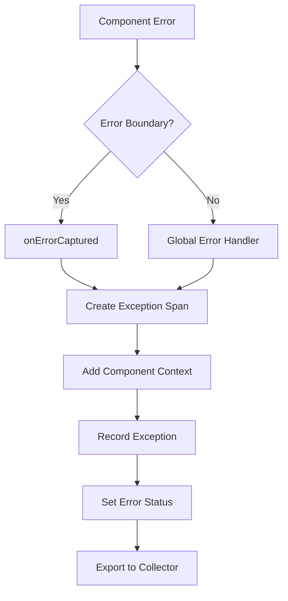

# How to Report Vue.js Error Boundaries to OpenTelemetry as Exception Spans

Author: [nawazdhandala](https://www.github.com/nawazdhandala)

Tags: OpenTelemetry, Vue.js, Error Boundaries, Exceptions, Spans, Error Tracking

Description: Learn how to capture and report Vue.js errors as OpenTelemetry exception spans, including component errors, async errors, and unhandled rejections for comprehensive error tracking.

Error handling in Vue.js applications often stops at console.error() or a basic error logging service. But errors are part of your application's execution flow, and they deserve the same level of observability as successful operations. OpenTelemetry exception spans connect errors to the traces where they occurred, giving you full context about what led to the failure.

## Understanding Vue Error Handling

Vue provides several hooks for catching errors at different levels of your application. The most important ones are:

- `app.config.errorHandler`: Global error handler for all component errors
- `onErrorCaptured`: Component-level error boundary hook
- `window.addEventListener('unhandledrejection')`: Catches unhandled promise rejections
- `window.addEventListener('error')`: Catches uncaught JavaScript errors

Each of these hooks gives you an opportunity to capture errors and report them as OpenTelemetry spans with full trace context.

## Setting Up Error Tracking

First, create a centralized error tracking module that integrates with OpenTelemetry:

```javascript
// src/utils/error-tracking.js
import { trace, SpanStatusCode, SpanKind } from '@opentelemetry/api';
import { getTracer } from './tracing';

class ErrorTracker {
  constructor() {
    this.tracer = getTracer();
    this.errorCount = 0;
  }

  // Report an error as an exception span
  reportError(error, context = {}) {
    this.errorCount++;

    // Create a new span for the error
    const span = this.tracer.startSpan('exception', {
      kind: SpanKind.INTERNAL,
      attributes: {
        'exception.type': error.name || 'Error',
        'exception.message': error.message,
        'exception.stacktrace': error.stack,
        'error.count': this.errorCount,
        ...this.sanitizeContext(context),
      },
    });

    // Record the exception in the span
    span.recordException(error);

    // Set error status
    span.setStatus({
      code: SpanStatusCode.ERROR,
      message: error.message,
    });

    // End the span immediately
    span.end();

    return span;
  }

  // Report error to active span if one exists
  reportToActiveSpan(error, context = {}) {
    const activeSpan = trace.getActiveSpan();

    if (activeSpan) {
      // Add error to existing span
      activeSpan.recordException(error);
      activeSpan.setStatus({
        code: SpanStatusCode.ERROR,
        message: error.message,
      });

      // Add context as attributes
      Object.entries(this.sanitizeContext(context)).forEach(([key, value]) => {
        activeSpan.setAttribute(key, value);
      });
    } else {
      // No active span, create a new one
      this.reportError(error, context);
    }
  }

  // Sanitize context to remove sensitive data and ensure valid attribute types
  sanitizeContext(context) {
    const sanitized = {};

    for (const [key, value] of Object.entries(context)) {
      // Skip sensitive keys
      if (this.isSensitiveKey(key)) {
        continue;
      }

      // Convert to string if needed
      if (typeof value === 'object' && value !== null) {
        sanitized[key] = JSON.stringify(value);
      } else if (typeof value === 'string' || typeof value === 'number' || typeof value === 'boolean') {
        sanitized[key] = value;
      }
    }

    return sanitized;
  }

  // Check if a key contains sensitive information
  isSensitiveKey(key) {
    const sensitivePatterns = [
      /password/i,
      /token/i,
      /secret/i,
      /api[_-]?key/i,
      /auth/i,
      /credit[_-]?card/i,
      /ssn/i,
    ];

    return sensitivePatterns.some(pattern => pattern.test(key));
  }

  // Get error statistics
  getStats() {
    return {
      totalErrors: this.errorCount,
    };
  }

  // Reset error count (useful for testing)
  reset() {
    this.errorCount = 0;
  }
}

export const errorTracker = new ErrorTracker();
```

## Implementing Global Error Handler

Set up Vue's global error handler to catch all component errors:

```javascript
// src/main.js
import { createApp } from 'vue';
import App from './App.vue';
import { initTracing } from './utils/tracing';
import { errorTracker } from './utils/error-tracking';

// Initialize tracing
initTracing({
  serviceName: 'vue-app',
  serviceVersion: '1.0.0',
});

const app = createApp(App);

// Configure global error handler
app.config.errorHandler = (error, instance, info) => {
  console.error('Vue error:', error);

  // Build context from Vue component info
  const context = {
    'vue.component': instance?.$options?.name || 'UnknownComponent',
    'vue.lifecycle': info,
    'vue.props': instance?.$.props ? JSON.stringify(instance.$.props) : undefined,
  };

  // Report error to OpenTelemetry
  errorTracker.reportError(error, context);
};

// Also set up warning handler for development
if (import.meta.env.DEV) {
  app.config.warnHandler = (msg, instance, trace) => {
    console.warn('Vue warning:', msg);

    // Optionally trace warnings in development
    const context = {
      'vue.warning': msg,
      'vue.component': instance?.$options?.name || 'UnknownComponent',
      'vue.trace': trace,
    };

    // Create a warning span (not an error)
    const tracer = getTracer();
    const span = tracer.startSpan('vue.warning', {
      attributes: context,
    });
    span.end();
  };
}

app.mount('#app');
```

## Creating Error Boundary Component

Build a reusable error boundary component that catches errors in its subtree:

```vue
<!-- src/components/ErrorBoundary.vue -->
<template>
  <div class="error-boundary">
    <slot v-if="!hasError"></slot>
    <div v-else class="error-fallback">
      <h2>Something went wrong</h2>
      <p v-if="showDetails">{{ errorMessage }}</p>
      <button @click="resetError">Try Again</button>
    </div>
  </div>
</template>

<script>
import { ref, onErrorCaptured, getCurrentInstance } from 'vue';
import { trace, SpanStatusCode } from '@opentelemetry/api';
import { errorTracker } from '../utils/error-tracking';
import { getTracer } from '../utils/tracing';

export default {
  name: 'ErrorBoundary',
  props: {
    fallback: {
      type: Function,
      default: null,
    },
    showDetails: {
      type: Boolean,
      default: false,
    },
    onError: {
      type: Function,
      default: null,
    },
  },
  setup(props) {
    const hasError = ref(false);
    const errorMessage = ref('');
    const instance = getCurrentInstance();
    const tracer = getTracer();

    // Capture errors from child components
    onErrorCaptured((error, errorInstance, info) => {
      // Create a span for this error boundary
      const span = tracer.startSpan('vue.error_boundary', {
        attributes: {
          'error_boundary.component': instance?.type?.name || 'ErrorBoundary',
          'error_boundary.caught': true,
          'vue.error_info': info,
          'vue.error_component': errorInstance?.$options?.name || 'Unknown',
        },
      });

      // Record the exception
      span.recordException(error);
      span.setStatus({
        code: SpanStatusCode.ERROR,
        message: error.message,
      });

      // Add event to mark error boundary activation
      span.addEvent('error_boundary_activated', {
        'component.name': errorInstance?.$options?.name || 'Unknown',
      });

      span.end();

      // Also report to error tracker for global tracking
      errorTracker.reportError(error, {
        'error_boundary': true,
        'vue.lifecycle': info,
      });

      // Update component state
      hasError.value = true;
      errorMessage.value = error.message;

      // Call custom error handler if provided
      if (props.onError) {
        props.onError(error, errorInstance, info);
      }

      // Return false to prevent error from propagating further
      return false;
    });

    const resetError = () => {
      hasError.value = false;
      errorMessage.value = '';

      // Create a span for error recovery
      const span = tracer.startSpan('vue.error_boundary.reset');
      span.addEvent('error_boundary_reset');
      span.end();
    };

    return {
      hasError,
      errorMessage,
      resetError,
    };
  },
};
</script>

<style scoped>
.error-fallback {
  padding: 20px;
  border: 2px solid #ff4444;
  border-radius: 8px;
  background-color: #ffeeee;
}

.error-fallback h2 {
  color: #cc0000;
  margin-top: 0;
}

.error-fallback button {
  margin-top: 10px;
  padding: 8px 16px;
  background-color: #0066cc;
  color: white;
  border: none;
  border-radius: 4px;
  cursor: pointer;
}
</style>
```

Use the error boundary to wrap components that might fail:

```vue
<!-- src/App.vue -->
<template>
  <div id="app">
    <ErrorBoundary :show-details="isDevelopment" @error="handleError">
      <UserDashboard />
    </ErrorBoundary>
  </div>
</template>

<script>
import { computed } from 'vue';
import ErrorBoundary from './components/ErrorBoundary.vue';
import UserDashboard from './components/UserDashboard.vue';

export default {
  components: {
    ErrorBoundary,
    UserDashboard,
  },
  setup() {
    const isDevelopment = computed(() => import.meta.env.DEV);

    const handleError = (error, instance, info) => {
      // Custom error handling logic
      console.log('Error boundary caught:', error);
    };

    return {
      isDevelopment,
      handleError,
    };
  },
};
</script>
```

## Tracking Async Errors

Vue's error handlers don't catch errors in async code or unhandled promise rejections. Set up additional handlers for these:

```javascript
// src/utils/async-error-handler.js
import { errorTracker } from './error-tracking';
import { trace } from '@opentelemetry/api';

export function setupAsyncErrorHandling() {
  // Catch unhandled promise rejections
  window.addEventListener('unhandledrejection', (event) => {
    console.error('Unhandled promise rejection:', event.reason);

    const error = event.reason instanceof Error
      ? event.reason
      : new Error(String(event.reason));

    const context = {
      'error.type': 'unhandled_rejection',
      'error.promise': event.promise?.toString(),
    };

    errorTracker.reportError(error, context);

    // Prevent default browser behavior
    event.preventDefault();
  });

  // Catch uncaught errors
  window.addEventListener('error', (event) => {
    console.error('Uncaught error:', event.error);

    const context = {
      'error.type': 'uncaught_error',
      'error.filename': event.filename,
      'error.lineno': event.lineno,
      'error.colno': event.colno,
    };

    errorTracker.reportError(event.error, context);

    // Prevent default browser behavior
    event.preventDefault();
  });
}
```

Initialize async error handling in your main.js:

```javascript
// src/main.js (additional code)
import { setupAsyncErrorHandling } from './utils/async-error-handler';

setupAsyncErrorHandling();
```

## Composable for Error Tracking

Create a composable that makes error tracking easy throughout your application:

```javascript
// src/composables/useErrorTracking.js
import { getCurrentInstance, onMounted } from 'vue';
import { trace, context, SpanStatusCode } from '@opentelemetry/api';
import { errorTracker } from '../utils/error-tracking';
import { getTracer } from '../utils/tracing';

export function useErrorTracking() {
  const instance = getCurrentInstance();
  const tracer = getTracer();
  const componentName = instance?.type?.name || 'UnknownComponent';

  // Wrap a function with error tracking
  const withErrorTracking = (fn, spanName) => {
    return async (...args) => {
      const span = tracer.startSpan(spanName || `${componentName}.operation`);

      return context.with(trace.setSpan(context.active(), span), async () => {
        try {
          const result = await fn(...args);
          span.setStatus({ code: SpanStatusCode.OK });
          return result;
        } catch (error) {
          span.recordException(error);
          span.setStatus({
            code: SpanStatusCode.ERROR,
            message: error.message,
          });

          errorTracker.reportToActiveSpan(error, {
            'component.name': componentName,
            'function.name': fn.name,
          });

          throw error;
        } finally {
          span.end();
        }
      });
    };
  };

  // Track an error with custom context
  const trackError = (error, context = {}) => {
    errorTracker.reportError(error, {
      'component.name': componentName,
      ...context,
    });
  };

  // Create a safe version of a function that catches errors
  const safe = (fn, fallback = null) => {
    return async (...args) => {
      try {
        return await fn(...args);
      } catch (error) {
        trackError(error, {
          'function.name': fn.name,
          'safe_call': true,
        });
        return fallback;
      }
    };
  };

  return {
    withErrorTracking,
    trackError,
    safe,
  };
}
```

Use the composable in your components:

```vue
<!-- src/components/DataTable.vue -->
<template>
  <div class="data-table">
    <table v-if="data">
      <thead>
        <tr>
          <th v-for="col in columns" :key="col">{{ col }}</th>
        </tr>
      </thead>
      <tbody>
        <tr v-for="row in data" :key="row.id">
          <td v-for="col in columns" :key="col">{{ row[col] }}</td>
        </tr>
      </tbody>
    </table>
    <p v-else>Loading...</p>
  </div>
</template>

<script>
import { ref, onMounted } from 'vue';
import { useErrorTracking } from '../composables/useErrorTracking';
import apiClient from '../api/client';

export default {
  name: 'DataTable',
  props: {
    endpoint: {
      type: String,
      required: true,
    },
  },
  setup(props) {
    const { withErrorTracking, trackError } = useErrorTracking();
    const data = ref(null);
    const columns = ref([]);

    // Wrap the fetch function with error tracking
    const fetchData = withErrorTracking(async () => {
      const response = await apiClient.get(props.endpoint);
      data.value = response.data;

      if (response.data.length > 0) {
        columns.value = Object.keys(response.data[0]);
      }
    }, 'DataTable.fetchData');

    onMounted(() => {
      fetchData().catch(error => {
        // Error is already tracked, but we can add additional handling
        console.error('Failed to fetch data:', error);
        trackError(error, { 'endpoint': props.endpoint });
      });
    });

    return {
      data,
      columns,
    };
  },
};
</script>
```

## Error Recovery Tracking

Track not just errors but also recovery attempts:

```javascript
// src/utils/error-recovery.js
import { trace, SpanStatusCode } from '@opentelemetry/api';
import { getTracer } from './tracing';

export class ErrorRecovery {
  constructor() {
    this.tracer = getTracer();
    this.recoveryAttempts = new Map();
  }

  // Track a recovery attempt
  async attempt(key, recoveryFn, maxAttempts = 3) {
    const attempts = this.recoveryAttempts.get(key) || 0;

    if (attempts >= maxAttempts) {
      throw new Error(`Max recovery attempts (${maxAttempts}) exceeded for ${key}`);
    }

    const span = this.tracer.startSpan('error.recovery', {
      attributes: {
        'recovery.key': key,
        'recovery.attempt': attempts + 1,
        'recovery.max_attempts': maxAttempts,
      },
    });

    try {
      const result = await recoveryFn();

      span.setStatus({ code: SpanStatusCode.OK });
      span.addEvent('recovery_successful', {
        'attempts': attempts + 1,
      });

      // Clear recovery attempts on success
      this.recoveryAttempts.delete(key);

      return result;
    } catch (error) {
      this.recoveryAttempts.set(key, attempts + 1);

      span.recordException(error);
      span.setStatus({ code: SpanStatusCode.ERROR });
      span.addEvent('recovery_failed', {
        'attempts': attempts + 1,
      });

      throw error;
    } finally {
      span.end();
    }
  }

  // Reset recovery attempts for a key
  reset(key) {
    this.recoveryAttempts.delete(key);
  }

  // Get current attempt count
  getAttempts(key) {
    return this.recoveryAttempts.get(key) || 0;
  }
}

export const errorRecovery = new ErrorRecovery();
```

Use error recovery in your API client:

```javascript
// src/api/client.js (enhanced with recovery)
import axios from 'axios';
import { errorRecovery } from '../utils/error-recovery';

const apiClient = axios.create({
  baseURL: import.meta.env.VITE_API_BASE_URL,
});

// Add retry logic with recovery tracking
apiClient.interceptors.response.use(
  response => response,
  async error => {
    const config = error.config;

    // Don't retry if we've explicitly disabled it
    if (config._noRetry) {
      return Promise.reject(error);
    }

    // Only retry on network errors or 5xx status codes
    const shouldRetry = !error.response ||
      (error.response.status >= 500 && error.response.status < 600);

    if (shouldRetry) {
      try {
        return await errorRecovery.attempt(
          `api_${config.method}_${config.url}`,
          () => {
            config._noRetry = true; // Prevent infinite retry loops
            return axios.request(config);
          },
          3 // max attempts
        );
      } catch (retryError) {
        return Promise.reject(retryError);
      }
    }

    return Promise.reject(error);
  }
);

export default apiClient;
```

## Error Context Flow

Here's how error context flows through the application:



## Best Practices

Follow these guidelines for effective error tracking:

**Preserve Context**: Always include component name, lifecycle stage, and relevant props in your error context. This information is invaluable when debugging production issues.

**Don't Swallow Errors**: Even when catching errors for tracking, re-throw them or handle them appropriately. Don't let error tracking hide bugs.

**Sanitize Sensitive Data**: Never include passwords, tokens, or PII in error attributes. Use the sanitization helpers to filter sensitive information.

**Track Recovery**: Don't just track failures. Track recovery attempts and successes to understand your application's resilience.

**Set Reasonable Limits**: Limit the size of error attributes, especially stack traces. Very large spans can cause performance issues.

**Use Error Boundaries Strategically**: Don't wrap every component. Place error boundaries at logical feature boundaries where you can show meaningful fallback UI.

**Monitor Error Rates**: Use your OpenTelemetry backend to monitor error rates over time. Set up alerts when error rates spike.

## Testing Error Boundaries

Write tests to ensure your error boundaries work correctly:

```javascript
// src/components/__tests__/ErrorBoundary.spec.js
import { mount } from '@vue/test-utils';
import ErrorBoundary from '../ErrorBoundary.vue';
import { errorTracker } from '../../utils/error-tracking';

describe('ErrorBoundary', () => {
  beforeEach(() => {
    errorTracker.reset();
  });

  it('catches and reports errors from child components', async () => {
    const FailingComponent = {
      template: '<div>{{ throwError() }}</div>',
      methods: {
        throwError() {
          throw new Error('Test error');
        },
      },
    };

    const wrapper = mount(ErrorBoundary, {
      slots: {
        default: FailingComponent,
      },
    });

    await wrapper.vm.$nextTick();

    // Check that error was tracked
    expect(errorTracker.getStats().totalErrors).toBe(1);

    // Check that fallback UI is shown
    expect(wrapper.text()).toContain('Something went wrong');
  });
});
```

OpenTelemetry exception spans give you complete visibility into errors throughout your Vue.js application. By connecting errors to traces, you get the full story of what happened before, during, and after each error. This context makes debugging production issues dramatically easier and helps you build more resilient applications.
