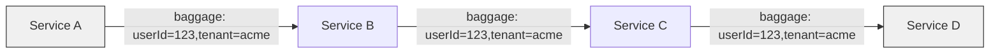

# How to Configure W3C Baggage Propagation in OpenTelemetry

Author: [nawazdhandala](https://www.github.com/nawazdhandala)

Tags: OpenTelemetry, W3C Baggage, Context Propagation, Distributed Tracing, Observability

Description: Learn how to configure and use W3C Baggage propagation in OpenTelemetry to pass custom key-value pairs across service boundaries in distributed systems.

---

When you work with distributed systems, you often need to carry more than just trace identity across service boundaries. Maybe you want every service in the request chain to know which customer tenant initiated the call, or which feature flag variant is active, or what region the request entered from. The W3C Baggage specification and its OpenTelemetry implementation solve this problem by letting you attach arbitrary key-value pairs that travel with the request context alongside trace headers. This post covers what baggage is, how to configure it in OpenTelemetry, and how to use it effectively without shooting yourself in the foot.

## What Is W3C Baggage?

W3C Baggage is a companion specification to W3C Trace Context. While Trace Context carries trace-id, span-id, and trace-flags, Baggage carries user-defined key-value pairs. These pairs propagate through the `baggage` HTTP header.

```
baggage: userId=12345,tenantId=acme-corp,region=us-east-1
```

Each entry is a key-value pair separated by commas. Values can include optional metadata properties delimited by semicolons. The entire header has a size limit of 8192 bytes, and each entry is capped at 4096 bytes.



The key insight is that baggage travels with the request, not with the trace. Every service in the chain can read and write baggage entries, and the updated baggage propagates to subsequent downstream calls.

## Why Baggage Matters

You might wonder why you would use baggage instead of just putting information in span attributes. The difference is scope and timing. Span attributes are local to a single span and only visible after the span is exported. Baggage is available in-flight, meaning any service handling the request can read it and make decisions based on the values.

Here are some practical use cases:

- Tenant isolation: Pass a tenant identifier so every service can apply the correct rate limits or route to the right database shard.
- Feature flags: Propagate feature flag assignments so downstream services render the same variant without re-evaluating the flag.
- Request routing: Carry a routing hint that tells service meshes or load balancers how to direct traffic.
- Cost attribution: Tag requests with a cost center so telemetry backends can break down resource usage by business unit.

## Enabling Baggage Propagation

By default, OpenTelemetry SDKs include both the W3C Trace Context propagator and the W3C Baggage propagator. But it is worth understanding how to configure them explicitly, especially when you need to combine them with other propagators.

```python
from opentelemetry import trace, baggage
from opentelemetry.sdk.trace import TracerProvider
from opentelemetry.sdk.trace.export import ConsoleSpanExporter, SimpleSpanProcessor
from opentelemetry.propagate import set_global_textmap
from opentelemetry.propagators.composite import CompositePropagator
from opentelemetry.trace.propagation import TraceContextTextMapPropagator
from opentelemetry.baggage.propagation import W3CBaggagePropagator

# Set up tracing
provider = TracerProvider()
provider.add_span_processor(SimpleSpanProcessor(ConsoleSpanExporter()))
trace.set_tracer_provider(provider)

# Explicitly configure both propagators
# This is what OpenTelemetry does by default, but being explicit is clearer
propagator = CompositePropagator([
    TraceContextTextMapPropagator(),  # Handles traceparent and tracestate
    W3CBaggagePropagator(),           # Handles the baggage header
])
set_global_textmap(propagator)
```

The `CompositePropagator` wraps multiple propagators so that both trace context and baggage are injected into and extracted from HTTP headers. The order does not matter for correctness, but putting trace context first is a common convention.

## Setting and Reading Baggage

Baggage in OpenTelemetry is managed through the context API. You set baggage entries on the current context, and the propagator takes care of serializing them into HTTP headers on outgoing requests.

```python
from opentelemetry import baggage, context
from opentelemetry.propagate import inject

# Set baggage entries on the current context
# Each call returns a new context token (contexts are immutable)
ctx = baggage.set_baggage("userId", "user-42")
ctx = baggage.set_baggage("tenantId", "acme-corp", context=ctx)
ctx = baggage.set_baggage("region", "us-east-1", context=ctx)

# Attach the context so it becomes the current active context
token = context.attach(ctx)

try:
    # Now when we inject headers, baggage will be included
    headers = {}
    inject(headers)

    print("Propagated headers:")
    for key, value in headers.items():
        print(f"  {key}: {value}")
    # Output includes:
    #   baggage: userId=user-42,tenantId=acme-corp,region=us-east-1
    #   traceparent: 00-...
finally:
    # Always detach when done to restore the previous context
    context.detach(token)
```

The `baggage.set_baggage()` function does not mutate the existing context. Instead, it returns a new context with the entry added. You must either pass this new context to subsequent calls or attach it to make it current.

Reading baggage on the receiving side works similarly.

```python
from opentelemetry import baggage
from opentelemetry.propagate import extract

# Simulate incoming request headers
incoming_headers = {
    "traceparent": "00-4bf92f3577b34da6a3ce929d0e0e4736-00f067aa0ba902b7-01",
    "baggage": "userId=user-42,tenantId=acme-corp,region=us-east-1"
}

# Extract context from incoming headers
ctx = extract(incoming_headers)

# Read individual baggage entries from the extracted context
user_id = baggage.get_baggage("userId", context=ctx)
tenant_id = baggage.get_baggage("tenantId", context=ctx)
region = baggage.get_baggage("region", context=ctx)

print(f"User: {user_id}")      # user-42
print(f"Tenant: {tenant_id}")  # acme-corp
print(f"Region: {region}")     # us-east-1

# Get all baggage entries at once
all_baggage = baggage.get_all(context=ctx)
for key, value in all_baggage.items():
    print(f"  {key} = {value}")
```

The `extract` function parses both `traceparent` and `baggage` headers, returning a context object that contains both the trace span context and the baggage entries.

## Using Baggage with Span Attributes

A powerful pattern is to automatically copy baggage entries into span attributes. This way, the baggage values show up in your tracing backend and you can filter and search traces by those values.

```python
from opentelemetry import trace, baggage, context
from opentelemetry.sdk.trace import TracerProvider, SpanProcessor

class BaggageSpanProcessor(SpanProcessor):
    """A span processor that copies baggage entries into span attributes."""

    def __init__(self, baggage_keys):
        # Only copy specific keys to avoid leaking sensitive data
        self.baggage_keys = baggage_keys

    def on_start(self, span, parent_context=None):
        # Read baggage from the parent context
        ctx = parent_context or context.get_current()
        for key in self.baggage_keys:
            value = baggage.get_baggage(key, context=ctx)
            if value is not None:
                # Set the baggage value as a span attribute
                span.set_attribute(f"baggage.{key}", value)

    def on_end(self, span):
        pass

    def shutdown(self):
        pass

    def force_flush(self, timeout_millis=None):
        return True

# Register the processor
provider = TracerProvider()
provider.add_span_processor(
    BaggageSpanProcessor(["userId", "tenantId", "region"])
)
trace.set_tracer_provider(provider)
```

This custom span processor listens for new spans and, when one starts, copies the specified baggage entries into span attributes prefixed with `baggage.`. This is a deliberate, opt-in approach. You explicitly list which keys to copy, which prevents accidentally leaking sensitive data into your observability backend.

## Baggage in HTTP Middleware

In a web framework like Flask or FastAPI, you typically extract baggage in middleware and make it available throughout the request lifecycle.

```python
# Flask middleware example
from flask import Flask, request, g
from opentelemetry import baggage
from opentelemetry.propagate import extract

app = Flask(__name__)

@app.before_request
def extract_baggage():
    """Extract baggage from incoming request headers."""
    # Extract the full context (trace + baggage) from request headers
    ctx = extract(dict(request.headers))

    # Store specific baggage values for easy access in handlers
    g.tenant_id = baggage.get_baggage("tenantId", context=ctx)
    g.user_id = baggage.get_baggage("userId", context=ctx)
    g.region = baggage.get_baggage("region", context=ctx)

@app.route("/api/data")
def get_data():
    # Baggage values are readily available
    tenant = g.tenant_id
    if tenant:
        # Route to the correct database shard based on tenant
        return {"data": f"Results for tenant {tenant}"}
    return {"data": "No tenant context available"}
```

This middleware pattern makes baggage values available as simple attributes on Flask's `g` object, so route handlers do not need to interact with the OpenTelemetry API directly.

## Security Considerations

Baggage is powerful, but it comes with serious security implications that you must think about before enabling it in production.

The `baggage` header is readable and writable by every service in the chain and by any proxy or middleware that handles the request. This means you should never put secrets, authentication tokens, or personally identifiable information in baggage. Treat baggage entries as if they will be logged, indexed, and visible to every system the request touches.

```python
# BAD: Never put sensitive data in baggage
# ctx = baggage.set_baggage("authToken", "secret-jwt-token-here")
# ctx = baggage.set_baggage("ssn", "123-45-6789")

# GOOD: Use opaque identifiers that require backend lookups
ctx = baggage.set_baggage("sessionId", "sess-abc123")
ctx = baggage.set_baggage("tenantId", "acme-corp")
```

You should also validate baggage on ingress. If your services trust baggage values from external callers without validation, an attacker could inject arbitrary values to influence routing, bypass rate limits, or pollute your telemetry data.

```python
# Validate baggage at the edge of your system
ALLOWED_TENANTS = {"acme-corp", "globex", "initech"}

def validate_tenant_baggage(ctx):
    """Validate that the tenant baggage value is legitimate."""
    tenant = baggage.get_baggage("tenantId", context=ctx)
    if tenant and tenant not in ALLOWED_TENANTS:
        # Strip invalid baggage or replace with a safe default
        ctx = baggage.set_baggage("tenantId", "unknown", context=ctx)
    return ctx
```

## Size Limits and Performance

The W3C Baggage specification limits the total header size to 8192 bytes and individual entries to 4096 bytes. In practice you should aim to keep baggage small. Every byte of baggage is copied to every downstream request, so large values multiply across your service graph.

If you have 50 services in a request chain and each request carries 4KB of baggage, that is 200KB of overhead just for context propagation. Keep baggage entries short. Use IDs rather than full objects, and limit the number of entries to what is genuinely needed.

## Wrapping Up

W3C Baggage propagation in OpenTelemetry gives you a standardized way to pass custom key-value pairs across service boundaries. It complements W3C Trace Context by carrying application-level data alongside trace identity. Configure it by including the `W3CBaggagePropagator` in your composite propagator setup, set entries using the baggage API, and read them on the receiving side after extraction.

The most important thing to remember is that baggage is visible to everything in the request path. Use it for non-sensitive identifiers and routing hints, validate it at your system boundaries, and keep it small. When used thoughtfully, baggage eliminates a whole class of problems around passing contextual information through deep service call chains.
