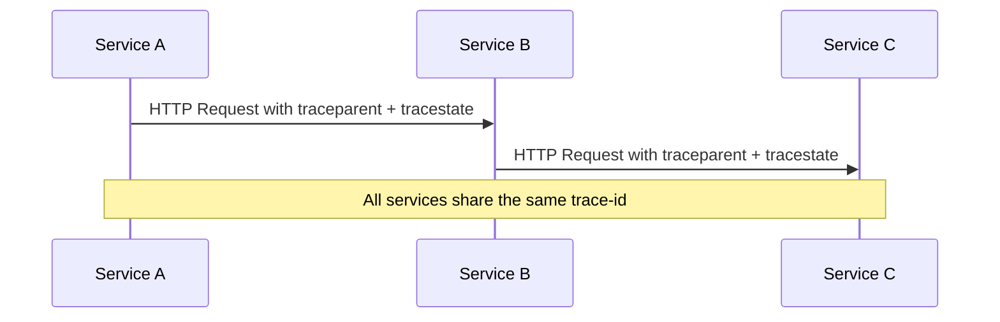

# How to Understand W3C Trace Context Format (traceparent and tracestate)

Author: [nawazdhandala](https://www.github.com/nawazdhandala)

Tags: OpenTelemetry, W3C Trace Context, Distributed Tracing, traceparent, tracestate, Context Propagation

Description: Learn how the W3C Trace Context standard works, including the traceparent and tracestate headers, and how OpenTelemetry uses them for distributed trace propagation.

---

Distributed tracing only works if trace context travels with every request as it hops between services. Without a shared format for that context, each vendor ends up inventing its own headers, and stitching traces together across different systems becomes painful. The W3C Trace Context specification solves this by defining two standard HTTP headers that every compliant tool can read and write. In this post we will break down the `traceparent` and `tracestate` headers field by field, look at how OpenTelemetry implements them, and walk through practical examples so you can confidently debug context propagation issues in your own stack.

## Why W3C Trace Context Exists

Before W3C Trace Context became a recommendation, tracing systems used proprietary headers. Zipkin relied on `X-B3-TraceId` and friends. Jaeger used `uber-trace-id`. AWS X-Ray shipped `X-Amzn-Trace-Id`. If your request passed through services instrumented by different vendors, the trace broke at every boundary.

The W3C Trace Context specification (published as a W3C Recommendation) gives the industry a single pair of headers that all vendors can agree on. OpenTelemetry adopted it as the default propagation format, which means any service instrumented with OTel automatically speaks this common language.



The diagram above shows the simplest case. Service A generates a trace context, attaches it to the outgoing request, and every downstream service reads, uses, and forwards that context.

## The traceparent Header

The `traceparent` header carries the core identification fields that every tracing system needs. It is a single string with four dash-separated parts.

```
traceparent: 00-4bf92f3577b34da6a3ce929d0e0e4736-00f067aa0ba902b7-01
              |  |                                |                |
              |  |                                |                +-- trace-flags
              |  |                                +-- parent-id (span-id)
              |  +-- trace-id
              +-- version
```

Let us look at each field individually.

### version

The version field is two hexadecimal characters. The current specification defines version `00`. Future versions might add fields or change semantics, but compliant parsers are expected to handle unknown versions gracefully by falling back to the fields they do understand. In practice you will almost always see `00` here.

### trace-id

The trace-id is a 32-character lowercase hexadecimal string representing 16 bytes. This value stays the same across every span in a single distributed trace. It is what ties together the work done by Service A, Service B, and every other participant.

```python
# A valid trace-id is 32 hex characters (16 bytes)
# It must not be all zeros, which is considered invalid
trace_id = "4bf92f3577b34da6a3ce929d0e0e4736"

# OpenTelemetry generates trace-ids automatically
# but you can inspect them for debugging
print(f"Trace ID length: {len(trace_id)} characters")
print(f"Byte length: {len(bytes.fromhex(trace_id))} bytes")
```

The trace-id is generated at the root of the trace, typically by the first service that handles an incoming request without existing context. OpenTelemetry SDKs generate this using a random 128-bit value, which provides enough entropy to avoid collisions even at very high throughput.

### parent-id (span-id)

The parent-id is a 16-character lowercase hexadecimal string representing 8 bytes. Despite the name "parent-id" in the spec, this field contains the span-id of the calling span. When Service B receives a request from Service A, the parent-id tells Service B which span in Service A initiated the call. Service B then creates its own span and sets this value as the parent.

### trace-flags

The trace-flags field is two hexadecimal characters (one byte). Currently only the least significant bit is defined, and it represents the "sampled" flag. When the value is `01`, the caller was recording this trace. When it is `00`, the caller was not sampling.

```python
# Parsing trace-flags to check the sampled bit
trace_flags = "01"
flags_byte = int(trace_flags, 16)

# Check the sampled bit (least significant bit)
is_sampled = bool(flags_byte & 0x01)
print(f"Sampled: {is_sampled}")  # True
```

Downstream services can use this flag to make their own sampling decisions. A common pattern is to honor the upstream decision, ensuring that if the root service decided to sample a trace, all downstream services also record their spans.

## The tracestate Header

While `traceparent` carries the mandatory fields that every system needs, `tracestate` is an optional header that lets vendors attach their own data. It is a comma-separated list of key-value pairs.

```
tracestate: rojo=00f067aa0ba902b7,congo=t61rcWkgMzE
```

Each key identifies a tracing system or vendor, and the value is opaque data that only that vendor needs to interpret. In the example above, a vendor identified as "rojo" stores one value while "congo" stores another.

```python
# Parsing the tracestate header
tracestate_raw = "rojo=00f067aa0ba902b7,congo=t61rcWkgMzE"

# Split into individual vendor entries
entries = [entry.strip() for entry in tracestate_raw.split(",")]
for entry in entries:
    key, value = entry.split("=", 1)
    print(f"Vendor: {key}, Value: {value}")

# Output:
# Vendor: rojo, Value: 00f067aa0ba902b7
# Vendor: congo, Value: t61rcWkgMzE
```

The tracestate header has a few important rules. The maximum number of entries is 32. When a vendor modifies the list, their entry must move to the front. This ensures that the most recently touched vendor entry is always first, which helps with truncation since backends may drop entries from the end if the header grows too long.

### How OpenTelemetry Uses tracestate

OpenTelemetry stores vendor-specific information in tracestate under its own key. For example, if you are using a probability-based sampler, OpenTelemetry might store the sampling probability so that downstream services or backends can reconstruct the correct sample rate.

```python
from opentelemetry import trace
from opentelemetry.sdk.trace import TracerProvider
from opentelemetry.sdk.trace.export import ConsoleSpanExporter, SimpleSpanProcessor

# Set up a basic tracer provider
provider = TracerProvider()
provider.add_span_processor(SimpleSpanProcessor(ConsoleSpanExporter()))
trace.set_tracer_provider(provider)

tracer = trace.get_tracer("tracestate-demo")

# Create a span and inspect its context
with tracer.start_as_current_span("example-operation") as span:
    ctx = span.get_span_context()
    print(f"Trace ID: {format(ctx.trace_id, '032x')}")
    print(f"Span ID: {format(ctx.span_id, '016x')}")
    print(f"Trace Flags: {format(ctx.trace_flags, '02x')}")
    print(f"Trace State: {ctx.trace_state}")
```

This code creates a span and prints out the full context including the trace state. The trace state object in OpenTelemetry is immutable, so to add entries you create a new trace state from the existing one.

## Putting It All Together: End-to-End Example

Let us trace a request through two Python services to see how the headers flow in practice.

```python
# Service A: The request originator
import requests
from opentelemetry import trace
from opentelemetry.sdk.trace import TracerProvider
from opentelemetry.sdk.trace.export import ConsoleSpanExporter, SimpleSpanProcessor
from opentelemetry.propagate import inject

# Initialize tracing
provider = TracerProvider()
provider.add_span_processor(SimpleSpanProcessor(ConsoleSpanExporter()))
trace.set_tracer_provider(provider)
tracer = trace.get_tracer("service-a")

# Create a span and propagate context via HTTP headers
with tracer.start_as_current_span("call-service-b") as span:
    headers = {}
    # inject() writes traceparent and tracestate into the headers dict
    inject(headers)

    print("Outgoing headers:")
    for key, value in headers.items():
        print(f"  {key}: {value}")

    # In production you would do:
    # response = requests.get("http://service-b/api", headers=headers)
```

When you run this, the `inject` function writes the `traceparent` header (and `tracestate` if applicable) into the headers dictionary. The output looks something like this:

```
Outgoing headers:
  traceparent: 00-a]b3c4d5e6f7a8b9c0d1e2f3a4b5c6d7e-1a2b3c4d5e6f7a8b-01
  tracestate:
```

On the receiving side, Service B extracts the context and creates a child span.

```python
# Service B: The request receiver
from opentelemetry import trace, context
from opentelemetry.propagate import extract

# Simulate incoming headers from Service A
incoming_headers = {
    "traceparent": "00-4bf92f3577b34da6a3ce929d0e0e4736-00f067aa0ba902b7-01"
}

# extract() reads the headers and returns a context object
ctx = extract(incoming_headers)

tracer = trace.get_tracer("service-b")

# Start a new span as a child of the extracted context
with tracer.start_as_current_span("handle-request", context=ctx) as span:
    span_ctx = span.get_span_context()
    # The trace-id matches what Service A sent
    print(f"Trace ID: {format(span_ctx.trace_id, '032x')}")
    # The span-id is new, unique to this span
    print(f"Span ID: {format(span_ctx.span_id, '016x')}")
```

Notice that the trace-id remains the same across both services. That is the whole point. The span-id changes because Service B creates its own span, but the trace-id links everything together.

## Validating traceparent Headers

When debugging trace propagation issues, it helps to validate `traceparent` headers programmatically. Here is a small validation function.

```python
import re

def validate_traceparent(header):
    """Validate a traceparent header string.

    Returns a dict with parsed fields or raises ValueError.
    """
    # The regex enforces the exact format: version-traceid-parentid-flags
    pattern = r'^([0-9a-f]{2})-([0-9a-f]{32})-([0-9a-f]{16})-([0-9a-f]{2})$'
    match = re.match(pattern, header)

    if not match:
        raise ValueError(f"Invalid traceparent format: {header}")

    version, trace_id, parent_id, trace_flags = match.groups()

    # trace-id must not be all zeros
    if trace_id == "0" * 32:
        raise ValueError("trace-id must not be all zeros")

    # parent-id must not be all zeros
    if parent_id == "0" * 16:
        raise ValueError("parent-id must not be all zeros")

    return {
        "version": version,
        "trace_id": trace_id,
        "parent_id": parent_id,
        "trace_flags": trace_flags,
        "sampled": bool(int(trace_flags, 16) & 0x01)
    }

# Test with a valid header
result = validate_traceparent("00-4bf92f3577b34da6a3ce929d0e0e4736-00f067aa0ba902b7-01")
print(result)
```

This function checks the format, ensures fields are the correct length, and rejects all-zero trace-ids and parent-ids (both are invalid per the spec).

## Common Pitfalls

There are a few mistakes that come up repeatedly when working with W3C Trace Context.

First, case sensitivity matters. The spec requires lowercase hexadecimal characters. Sending uppercase characters like `4BF92F35` instead of `4bf92f35` can cause parsers to reject the header.

Second, some HTTP libraries or proxies modify or strip custom headers. If your traces are breaking at a specific service boundary, check whether a proxy or API gateway is dropping the `traceparent` header. Load balancers and CDNs are common culprits.

Third, the `tracestate` header has ordering requirements. When your system modifies tracestate, your entry must be moved to the beginning of the list. Failing to do this can cause subtle bugs where stale vendor data persists longer than expected.

## Wrapping Up

The W3C Trace Context specification gives distributed systems a universal way to propagate trace identity across service boundaries. The `traceparent` header carries the four fields that every tracing system needs: version, trace-id, parent-id, and trace-flags. The `tracestate` header provides a sidecar for vendor-specific data that can travel alongside the core context without interfering with it.

OpenTelemetry uses W3C Trace Context as its default propagation format, so if you are using OTel SDKs, you get this behavior out of the box. Understanding the underlying format helps when you need to debug broken traces, write custom middleware, or integrate with systems that do not use OpenTelemetry natively. The next time you see a `traceparent` header in your logs or network inspector, you will know exactly what each field means and why it matters.
