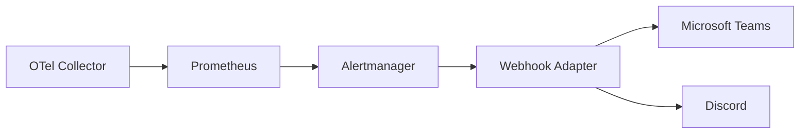

# How to Set Up Webhook-Based Alert Integrations from OpenTelemetry to Microsoft Teams and Discord

Author: [nawazdhandala](https://www.github.com/nawazdhandala)

Tags: OpenTelemetry, Webhooks, Microsoft Teams, Discord, Alertmanager

Description: Configure webhook integrations to send OpenTelemetry metric alerts to Microsoft Teams and Discord channels.

Not every team uses Slack or PagerDuty. Many organizations rely on Microsoft Teams for internal communication, and engineering teams frequently use Discord for real-time collaboration. Both platforms support incoming webhooks, which means you can route OpenTelemetry metric alerts to these channels with some Alertmanager configuration and a lightweight webhook adapter.

This post covers how to set up alert delivery from OpenTelemetry metrics to Microsoft Teams and Discord using Alertmanager's webhook receiver.

## Architecture

Alertmanager does not have native support for Teams or Discord. The solution is to use Alertmanager's generic webhook receiver to send alerts to a small adapter service that transforms the payload into the format each platform expects.



## Step 1: Get Webhook URLs from Teams and Discord

For Microsoft Teams, create an incoming webhook connector on the target channel:
1. Open the channel, click the three dots menu, select "Connectors"
2. Find "Incoming Webhook", click "Configure"
3. Name it "OTel Alerts" and copy the webhook URL

For Discord, create a webhook on the target channel:
1. Open Server Settings, go to Integrations, then Webhooks
2. Click "New Webhook", assign it to the target channel
3. Copy the webhook URL

## Step 2: Build the Webhook Adapter

This Python service receives Alertmanager webhook payloads and reformats them for Teams and Discord.

The adapter translates Alertmanager's JSON format into platform-specific message cards:

```python
#!/usr/bin/env python3
# webhook_adapter.py
# Transforms Alertmanager webhooks into Teams and Discord formats

from flask import Flask, request, jsonify
import requests
import json

app = Flask(__name__)

# Severity to color mapping (hex colors)
SEVERITY_COLORS = {
    "critical": "FF0000",  # Red
    "warning":  "FFA500",  # Orange
    "info":     "0000FF",  # Blue
}


@app.route("/teams", methods=["POST"])
def teams_webhook():
    """Receive Alertmanager webhook and forward to Microsoft Teams."""
    data = request.json
    alerts = data.get("alerts", [])
    status = data.get("status", "firing")
    group_labels = data.get("groupLabels", {})

    # Build Teams Adaptive Card payload
    severity = group_labels.get("severity", "info")
    color = SEVERITY_COLORS.get(severity, "808080")

    sections = []
    for alert in alerts:
        labels = alert.get("labels", {})
        annotations = alert.get("annotations", {})

        facts = [
            {"name": "Service", "value": labels.get("service_name", "unknown")},
            {"name": "Severity", "value": labels.get("severity", "unknown")},
            {"name": "Status", "value": alert.get("status", "unknown")},
        ]

        # Add dashboard link if present
        if annotations.get("dashboard_url"):
            facts.append({"name": "Dashboard", "value": annotations["dashboard_url"]})

        sections.append({
            "activityTitle": f"**{labels.get('alertname', 'Alert')}**",
            "activitySubtitle": annotations.get("summary", "No summary"),
            "facts": facts,
            "markdown": True,
        })

    teams_payload = {
        "@type": "MessageCard",
        "@context": "http://schema.org/extensions",
        "themeColor": color,
        "summary": f"Alert {status}: {group_labels.get('alertname', 'Unknown')}",
        "sections": sections,
    }

    # Forward to Teams webhook URL
    teams_url = app.config["TEAMS_WEBHOOK_URL"]
    resp = requests.post(teams_url, json=teams_payload, timeout=10)

    return jsonify({"status": "forwarded", "teams_response": resp.status_code}), 200


@app.route("/discord", methods=["POST"])
def discord_webhook():
    """Receive Alertmanager webhook and forward to Discord."""
    data = request.json
    alerts = data.get("alerts", [])
    status = data.get("status", "firing")
    group_labels = data.get("groupLabels", {})

    severity = group_labels.get("severity", "info")
    color_hex = SEVERITY_COLORS.get(severity, "808080")
    color_int = int(color_hex, 16)  # Discord expects integer color

    embeds = []
    for alert in alerts:
        labels = alert.get("labels", {})
        annotations = alert.get("annotations", {})

        fields = [
            {"name": "Service", "value": labels.get("service_name", "unknown"), "inline": True},
            {"name": "Severity", "value": labels.get("severity", "unknown"), "inline": True},
            {"name": "Status", "value": alert.get("status", "unknown"), "inline": True},
        ]

        # Add dashboard link as a field
        if annotations.get("dashboard_url"):
            fields.append({
                "name": "Dashboard",
                "value": f"[Open Dashboard]({annotations['dashboard_url']})",
                "inline": False,
            })

        embeds.append({
            "title": labels.get("alertname", "Alert"),
            "description": annotations.get("summary", "No summary provided"),
            "color": color_int,
            "fields": fields,
            "footer": {"text": f"Alert {status}"},
        })

    discord_payload = {
        "username": "OTel Alerts",
        "embeds": embeds[:10],  # Discord allows max 10 embeds per message
    }

    # Forward to Discord webhook URL
    discord_url = app.config["DISCORD_WEBHOOK_URL"]
    resp = requests.post(discord_url, json=discord_payload, timeout=10)

    return jsonify({"status": "forwarded", "discord_response": resp.status_code}), 200


if __name__ == "__main__":
    import os
    app.config["TEAMS_WEBHOOK_URL"] = os.environ["TEAMS_WEBHOOK_URL"]
    app.config["DISCORD_WEBHOOK_URL"] = os.environ["DISCORD_WEBHOOK_URL"]
    app.run(host="0.0.0.0", port=5002)
```

## Step 3: Deploy the Adapter

Run the adapter as a container alongside your Alertmanager:

```yaml
# docker-compose.yaml (relevant service)
services:
  webhook-adapter:
    build: ./webhook-adapter
    ports:
      - "5002:5002"
    environment:
      TEAMS_WEBHOOK_URL: "https://outlook.office.com/webhook/YOUR_TEAMS_WEBHOOK"
      DISCORD_WEBHOOK_URL: "https://discord.com/api/webhooks/YOUR_DISCORD_WEBHOOK"
    restart: unless-stopped
```

Or deploy to Kubernetes:

```yaml
# k8s-deployment.yaml
apiVersion: apps/v1
kind: Deployment
metadata:
  name: webhook-adapter
spec:
  replicas: 2
  selector:
    matchLabels:
      app: webhook-adapter
  template:
    metadata:
      labels:
        app: webhook-adapter
    spec:
      containers:
        - name: adapter
          image: webhook-adapter:latest
          ports:
            - containerPort: 5002
          env:
            - name: TEAMS_WEBHOOK_URL
              valueFrom:
                secretKeyRef:
                  name: webhook-secrets
                  key: teams-url
            - name: DISCORD_WEBHOOK_URL
              valueFrom:
                secretKeyRef:
                  name: webhook-secrets
                  key: discord-url
---
apiVersion: v1
kind: Service
metadata:
  name: webhook-adapter
spec:
  selector:
    app: webhook-adapter
  ports:
    - port: 5002
      targetPort: 5002
```

## Step 4: Configure Alertmanager Receivers

Point Alertmanager's webhook receivers at the adapter:

```yaml
# alertmanager.yaml
receivers:
  - name: teams-alerts
    webhook_configs:
      - url: "http://webhook-adapter:5002/teams"
        send_resolved: true
        max_alerts: 10

  - name: discord-alerts
    webhook_configs:
      - url: "http://webhook-adapter:5002/discord"
        send_resolved: true
        max_alerts: 10

route:
  receiver: discord-alerts
  group_by: ["alertname", "service_name"]
  group_wait: 30s
  group_interval: 5m
  repeat_interval: 4h

  routes:
    # Critical alerts go to both Teams and Discord
    - match:
        severity: critical
      receiver: teams-alerts
      continue: true
    - match:
        severity: critical
      receiver: discord-alerts

    # Warning alerts go to Discord only
    - match:
        severity: warning
      receiver: discord-alerts
```

## Step 5: Test the Integration

Send a test alert through Alertmanager to verify the full pipeline:

```bash
# Send a test alert to Alertmanager
curl -X POST http://alertmanager:9093/api/v2/alerts \
  -H "Content-Type: application/json" \
  -d '[
    {
      "labels": {
        "alertname": "TestAlert",
        "severity": "warning",
        "service_name": "test-service"
      },
      "annotations": {
        "summary": "This is a test alert from the webhook integration",
        "dashboard_url": "https://grafana.example.com/d/test"
      },
      "generatorURL": "http://prometheus:9090/test"
    }
  ]'
```

Check both your Teams channel and Discord channel for the formatted alert message. If the message does not appear, check the adapter's logs for errors and verify that the webhook URLs are correct and the channels have not been archived.

## Rate Limiting Considerations

Both Teams and Discord enforce rate limits on incoming webhooks. Teams allows roughly 4 messages per second per connector. Discord allows 30 requests per 60 seconds per webhook. If your alert volume exceeds these limits, add request queuing and backoff logic to the adapter, or use Alertmanager's `group_interval` and `repeat_interval` to reduce the notification rate before it reaches the webhook.
