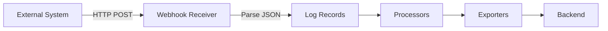

# How to Configure the Webhook Event Receiver in the OpenTelemetry Collector

Author: [nawazdhandala](https://www.github.com/nawazdhandala)

Tags: OpenTelemetry, Collector, Webhook, Events, Logs, HTTP

Description: Learn how to configure the Webhook Event Receiver in the OpenTelemetry Collector to receive events from external systems via HTTP webhooks.

---

The Webhook Event Receiver enables the OpenTelemetry Collector to receive events from external systems via HTTP POST requests. This receiver is ideal for ingesting events from CI/CD systems, monitoring tools, alerting platforms, and any system that can send HTTP webhooks.

For more on OpenTelemetry event handling, see our guide on [logs and events](https://oneuptime.com/blog/post/opentelemetry-logs-events/view).

## What is the Webhook Event Receiver?

The Webhook Event Receiver creates an HTTP endpoint that accepts POST requests containing event data. It converts these HTTP requests into OpenTelemetry log records, allowing you to collect, process, and export events from diverse sources through a unified pipeline.



Use cases include:
- Receiving alerts from monitoring systems
- Collecting deployment events from CI/CD pipelines
- Ingesting audit logs from applications
- Gathering incident notifications from on-call systems
- Capturing custom events from internal tools

## Basic Configuration

The simplest configuration creates an HTTP endpoint that accepts JSON payloads.

```yaml
receivers:
  webhookevent:
    # HTTP endpoint configuration
    endpoint: 0.0.0.0:8080

    # Path where webhook receives requests
    path: /events

exporters:
  # Export to stdout for testing
  debug:
    verbosity: detailed

service:
  pipelines:
    logs:
      receivers: [webhookevent]
      exporters: [debug]
```

With this configuration, send events using curl:

```bash
# Send a simple event
curl -X POST http://localhost:8080/events \
  -H "Content-Type: application/json" \
  -d '{
    "event_type": "deployment",
    "service": "api-gateway",
    "version": "v1.2.3",
    "timestamp": "2026-02-06T10:30:00Z"
  }'
```

## Endpoint Configuration

Configure the HTTP server behavior.

```yaml
receivers:
  webhookevent:
    # Bind address and port
    endpoint: 0.0.0.0:8080

    # URL path for webhook
    path: /events

    # TLS configuration for HTTPS
    tls:
      cert_file: /etc/certs/server.crt
      key_file: /etc/certs/server.key

    # CORS configuration
    cors:
      allowed_origins:
        - https://app.example.com
        - https://ci.example.com
      allowed_headers:
        - Content-Type
        - Authorization
      max_age: 3600

    # Maximum request body size (default: 20MB)
    max_request_body_size: 10485760  # 10MB

    # Read timeout for requests
    read_timeout: 30s

    # Write timeout for responses
    write_timeout: 30s
```

## Authentication

Secure your webhook endpoint with various authentication methods.

### Bearer Token Authentication

```yaml
receivers:
  webhookevent:
    endpoint: 0.0.0.0:8080
    path: /events

    # Require bearer token
    auth:
      authenticator: bearertokenauth

extensions:
  bearertokenauth:
    # Token value - use environment variable
    token: ${env:WEBHOOK_AUTH_TOKEN}

service:
  extensions: [bearertokenauth]
  pipelines:
    logs:
      receivers: [webhookevent]
      exporters: [debug]
```

Send authenticated requests:

```bash
curl -X POST http://localhost:8080/events \
  -H "Content-Type: application/json" \
  -H "Authorization: Bearer your-secret-token" \
  -d '{"event": "deployment"}'
```

### Basic Authentication

```yaml
receivers:
  webhookevent:
    endpoint: 0.0.0.0:8080
    path: /events
    auth:
      authenticator: basicauth

extensions:
  basicauth:
    # htpasswd file with username:password entries
    htpasswd:
      file: /etc/collector/htpasswd
      # inline: "user:$2y$10$..." for inline credentials

service:
  extensions: [basicauth]
  pipelines:
    logs:
      receivers: [webhookevent]
      exporters: [debug]
```

Create htpasswd file:

```bash
# Using htpasswd tool
htpasswd -c /etc/collector/htpasswd webhook_user

# Or use bcrypt online generators
# Add to htpasswd file: webhook_user:$2y$10$...
```

Send authenticated requests:

```bash
curl -X POST http://localhost:8080/events \
  -H "Content-Type: application/json" \
  -u webhook_user:password \
  -d '{"event": "deployment"}'
```

## Request Mapping

Configure how incoming HTTP requests map to log record attributes.

### Default Mapping

By default, the entire JSON body becomes the log record body.

```yaml
receivers:
  webhookevent:
    endpoint: 0.0.0.0:8080
    path: /events

    # Extract specific fields as attributes
    req_body_max_bytes: 1048576  # 1MB
```

Example request:

```bash
curl -X POST http://localhost:8080/events \
  -H "Content-Type: application/json" \
  -d '{
    "event_type": "deployment",
    "service": "api-gateway",
    "version": "v1.2.3",
    "environment": "production",
    "deployed_by": "john.doe@example.com"
  }'
```

This creates a log record with the entire JSON as the body.

### Extract Headers as Attributes

Extract HTTP headers and add them as log record attributes.

```yaml
receivers:
  webhookevent:
    endpoint: 0.0.0.0:8080
    path: /events

    # Extract headers
    include_metadata: true

processors:
  # Use transform processor to extract header values
  transform/headers:
    log_statements:
      - context: log
        statements:
          # Extract X-Event-Source header
          - set(attributes["event.source"], attributes["http.request.header.x-event-source"]) where attributes["http.request.header.x-event-source"] != nil

          # Extract X-Event-ID header
          - set(attributes["event.id"], attributes["http.request.header.x-event-id"]) where attributes["http.request.header.x-event-id"] != nil

          # Extract client IP
          - set(attributes["client.ip"], attributes["http.request.remote_addr"]) where attributes["http.request.remote_addr"] != nil

service:
  pipelines:
    logs:
      receivers: [webhookevent]
      processors: [transform/headers]
      exporters: [debug]
```

Send request with headers:

```bash
curl -X POST http://localhost:8080/events \
  -H "Content-Type: application/json" \
  -H "X-Event-Source: github" \
  -H "X-Event-ID: evt_123456" \
  -d '{"event": "deployment"}'
```

## Event Processing

Process webhook events using the transform processor.

### Extract and Structure Event Data

```yaml
receivers:
  webhookevent:
    endpoint: 0.0.0.0:8080
    path: /events

processors:
  # Parse and structure event data
  transform/events:
    log_statements:
      - context: log
        statements:
          # Extract event type from body
          - set(attributes["event.type"], body["event_type"]) where body["event_type"] != nil

          # Extract service name
          - set(attributes["service.name"], body["service"]) where body["service"] != nil

          # Extract version
          - set(attributes["service.version"], body["version"]) where body["version"] != nil

          # Extract environment
          - set(attributes["deployment.environment"], body["environment"]) where body["environment"] != nil

          # Extract timestamp and convert to ObservedTimestamp
          - set(time_unix_nano, UnixNano(body["timestamp"])) where body["timestamp"] != nil

          # Set severity based on event type
          - set(severity_text, "INFO") where attributes["event.type"] == "deployment"
          - set(severity_text, "WARN") where attributes["event.type"] == "rollback"
          - set(severity_text, "ERROR") where attributes["event.type"] == "failure"

  # Add resource attributes
  resource:
    attributes:
      - key: source
        value: webhook
        action: upsert
      - key: collector.name
        value: ${env:HOSTNAME}
        action: upsert

exporters:
  otlp:
    endpoint: ${env:OTEL_EXPORTER_OTLP_ENDPOINT}

service:
  pipelines:
    logs:
      receivers: [webhookevent]
      processors: [transform/events, resource]
      exporters: [otlp]
```

## Integration Examples

### GitHub Webhooks

Receive GitHub webhook events.

```yaml
receivers:
  webhookevent/github:
    endpoint: 0.0.0.0:8080
    path: /github/events
    auth:
      authenticator: bearertokenauth

extensions:
  bearertokenauth:
    token: ${env:GITHUB_WEBHOOK_SECRET}

processors:
  transform/github:
    log_statements:
      - context: log
        statements:
          # Extract GitHub event type from header
          - set(attributes["github.event"], attributes["http.request.header.x-github-event"]) where attributes["http.request.header.x-github-event"] != nil

          # Extract repository info
          - set(attributes["github.repository"], body["repository"]["full_name"]) where body["repository"]["full_name"] != nil

          # Extract sender
          - set(attributes["github.sender"], body["sender"]["login"]) where body["sender"]["login"] != nil

          # Handle push events
          - set(attributes["git.ref"], body["ref"]) where attributes["github.event"] == "push" and body["ref"] != nil
          - set(attributes["git.commits.count"], len(body["commits"])) where attributes["github.event"] == "push" and body["commits"] != nil

          # Handle pull request events
          - set(attributes["github.pr.number"], body["pull_request"]["number"]) where attributes["github.event"] == "pull_request" and body["pull_request"]["number"] != nil
          - set(attributes["github.pr.action"], body["action"]) where attributes["github.event"] == "pull_request" and body["action"] != nil

exporters:
  otlp:
    endpoint: ${env:OTEL_EXPORTER_OTLP_ENDPOINT}

service:
  extensions: [bearertokenauth]
  pipelines:
    logs:
      receivers: [webhookevent/github]
      processors: [transform/github]
      exporters: [otlp]
```

Configure GitHub webhook:
1. Go to repository Settings > Webhooks
2. Add webhook URL: `http://your-collector:8080/github/events`
3. Set Content type: `application/json`
4. Set Secret: Same as `GITHUB_WEBHOOK_SECRET` env var
5. Select events: Push, Pull request, Deployment

### CI/CD Pipeline Events

Receive deployment events from Jenkins, GitLab CI, or custom pipelines.

```yaml
receivers:
  webhookevent/cicd:
    endpoint: 0.0.0.0:8080
    path: /cicd/deployments

processors:
  transform/cicd:
    log_statements:
      - context: log
        statements:
          # Extract deployment info
          - set(attributes["deployment.service"], body["service"]) where body["service"] != nil
          - set(attributes["deployment.version"], body["version"]) where body["version"] != nil
          - set(attributes["deployment.environment"], body["environment"]) where body["environment"] != nil
          - set(attributes["deployment.status"], body["status"]) where body["status"] != nil

          # Extract pipeline info
          - set(attributes["cicd.pipeline"], body["pipeline"]) where body["pipeline"] != nil
          - set(attributes["cicd.job"], body["job"]) where body["job"] != nil
          - set(attributes["cicd.trigger.user"], body["triggered_by"]) where body["triggered_by"] != nil

          # Extract timing
          - set(attributes["deployment.duration_seconds"], body["duration"]) where body["duration"] != nil

          # Set severity based on status
          - set(severity_text, "INFO") where attributes["deployment.status"] == "success"
          - set(severity_text, "ERROR") where attributes["deployment.status"] == "failure"

          # Create structured log message
          - set(body, Concat([attributes["deployment.service"], " version ", attributes["deployment.version"], " deployed to ", attributes["deployment.environment"], " with status ", attributes["deployment.status"]], ""))

  # Add batch processing
  batch:
    timeout: 10s
    send_batch_size: 100

exporters:
  otlp:
    endpoint: ${env:OTEL_EXPORTER_OTLP_ENDPOINT}

service:
  pipelines:
    logs:
      receivers: [webhookevent/cicd]
      processors: [transform/cicd, batch]
      exporters: [otlp]
```

Send deployment event:

```bash
curl -X POST http://localhost:8080/cicd/deployments \
  -H "Content-Type: application/json" \
  -d '{
    "service": "api-gateway",
    "version": "v1.2.3",
    "environment": "production",
    "status": "success",
    "pipeline": "deploy-to-prod",
    "job": "deploy-api-gateway",
    "triggered_by": "john.doe@example.com",
    "duration": 120,
    "timestamp": "2026-02-06T10:30:00Z"
  }'
```

### Monitoring Alert Webhooks

Receive alerts from Prometheus Alertmanager, Grafana, or other monitoring tools.

```yaml
receivers:
  webhookevent/alerts:
    endpoint: 0.0.0.0:8080
    path: /alerts

processors:
  transform/alerts:
    log_statements:
      - context: log
        statements:
          # Handle Alertmanager format
          - set(attributes["alert.name"], body["alerts"][0]["labels"]["alertname"]) where body["alerts"] != nil and len(body["alerts"]) > 0
          - set(attributes["alert.severity"], body["alerts"][0]["labels"]["severity"]) where body["alerts"] != nil and len(body["alerts"]) > 0
          - set(attributes["alert.status"], body["alerts"][0]["status"]) where body["alerts"] != nil and len(body["alerts"]) > 0

          # Extract instance information
          - set(attributes["alert.instance"], body["alerts"][0]["labels"]["instance"]) where body["alerts"] != nil and len(body["alerts"]) > 0
          - set(attributes["alert.job"], body["alerts"][0]["labels"]["job"]) where body["alerts"] != nil and len(body["alerts"]) > 0

          # Extract annotations
          - set(attributes["alert.summary"], body["alerts"][0]["annotations"]["summary"]) where body["alerts"] != nil and len(body["alerts"]) > 0
          - set(attributes["alert.description"], body["alerts"][0]["annotations"]["description"]) where body["alerts"] != nil and len(body["alerts"]) > 0

          # Set severity based on alert severity
          - set(severity_text, "WARN") where attributes["alert.severity"] == "warning"
          - set(severity_text, "ERROR") where attributes["alert.severity"] == "critical"

  # Filter to only send critical alerts
  filter/critical:
    logs:
      log_record:
        - attributes["alert.severity"] == "critical"

exporters:
  otlp:
    endpoint: ${env:OTEL_EXPORTER_OTLP_ENDPOINT}

service:
  pipelines:
    # Pipeline for all alerts
    logs/all:
      receivers: [webhookevent/alerts]
      processors: [transform/alerts]
      exporters: [otlp]

    # Pipeline for critical alerts only
    logs/critical:
      receivers: [webhookevent/alerts]
      processors: [transform/alerts, filter/critical]
      exporters: [otlp]
```

## Multiple Webhook Endpoints

Configure multiple webhook receivers for different event sources.

```yaml
receivers:
  # GitHub events
  webhookevent/github:
    endpoint: 0.0.0.0:8080
    path: /webhooks/github

  # CI/CD events
  webhookevent/cicd:
    endpoint: 0.0.0.0:8080
    path: /webhooks/cicd

  # Monitoring alerts
  webhookevent/alerts:
    endpoint: 0.0.0.0:8080
    path: /webhooks/alerts

  # Custom application events
  webhookevent/custom:
    endpoint: 0.0.0.0:8080
    path: /webhooks/custom

processors:
  # Tag events with source
  transform/source:
    log_statements:
      - context: log
        statements:
          - set(resource.attributes["event.source"], "github") where attributes["http.request.path"] == "/webhooks/github"
          - set(resource.attributes["event.source"], "cicd") where attributes["http.request.path"] == "/webhooks/cicd"
          - set(resource.attributes["event.source"], "alerts") where attributes["http.request.path"] == "/webhooks/alerts"
          - set(resource.attributes["event.source"], "custom") where attributes["http.request.path"] == "/webhooks/custom"

exporters:
  otlp:
    endpoint: ${env:OTEL_EXPORTER_OTLP_ENDPOINT}

service:
  pipelines:
    logs:
      receivers: [webhookevent/github, webhookevent/cicd, webhookevent/alerts, webhookevent/custom]
      processors: [transform/source]
      exporters: [otlp]
```

## Error Handling

Configure how the receiver responds to errors.

```yaml
receivers:
  webhookevent:
    endpoint: 0.0.0.0:8080
    path: /events

    # Return custom error responses
    response_headers:
      X-Custom-Header: "Webhook-Receiver"

processors:
  # Validate required fields
  transform/validate:
    error_mode: propagate  # Fail pipeline if validation fails
    log_statements:
      - context: log
        statements:
          # Ensure event_type exists
          - set(attributes["valid"], true) where body["event_type"] != nil
          - set(attributes["valid"], false) where body["event_type"] == nil

  # Drop invalid events
  filter/valid:
    logs:
      log_record:
        - attributes["valid"] == true

exporters:
  otlp:
    endpoint: ${env:OTEL_EXPORTER_OTLP_ENDPOINT}

service:
  pipelines:
    logs:
      receivers: [webhookevent]
      processors: [transform/validate, filter/valid]
      exporters: [otlp]
```

## Complete Production Example

Full configuration with security, processing, and multiple endpoints.

```yaml
extensions:
  # Bearer token authentication
  bearertokenauth:
    token: ${env:WEBHOOK_AUTH_TOKEN}

  # Health check endpoint
  health_check:
    endpoint: 0.0.0.0:13133

receivers:
  # GitHub webhook events
  webhookevent/github:
    endpoint: 0.0.0.0:8443
    path: /webhooks/github
    auth:
      authenticator: bearertokenauth
    tls:
      cert_file: /etc/collector/certs/server.crt
      key_file: /etc/collector/certs/server.key
    max_request_body_size: 5242880  # 5MB

  # CI/CD deployment events
  webhookevent/deployments:
    endpoint: 0.0.0.0:8443
    path: /webhooks/deployments
    auth:
      authenticator: bearertokenauth
    tls:
      cert_file: /etc/collector/certs/server.crt
      key_file: /etc/collector/certs/server.key

processors:
  # Parse GitHub events
  transform/github:
    log_statements:
      - context: log
        statements:
          - set(attributes["event.source"], "github") where true
          - set(attributes["github.event"], attributes["http.request.header.x-github-event"]) where attributes["http.request.header.x-github-event"] != nil
          - set(attributes["github.repository"], body["repository"]["full_name"]) where body["repository"]["full_name"] != nil
          - set(severity_text, "INFO") where true

  # Parse deployment events
  transform/deployments:
    log_statements:
      - context: log
        statements:
          - set(attributes["event.source"], "cicd") where true
          - set(attributes["deployment.service"], body["service"]) where body["service"] != nil
          - set(attributes["deployment.environment"], body["environment"]) where body["environment"] != nil
          - set(attributes["deployment.status"], body["status"]) where body["status"] != nil
          - set(severity_text, "INFO") where attributes["deployment.status"] == "success"
          - set(severity_text, "ERROR") where attributes["deployment.status"] == "failure"

  # Add resource attributes
  resource:
    attributes:
      - key: collector.name
        value: ${env:HOSTNAME}
        action: upsert
      - key: collector.version
        value: ${env:COLLECTOR_VERSION}
        action: upsert

  # Batch for efficiency
  batch:
    timeout: 10s
    send_batch_size: 100

exporters:
  # Send to OTLP backend
  otlp:
    endpoint: ${env:OTEL_EXPORTER_OTLP_ENDPOINT}
    headers:
      authorization: Bearer ${env:OTEL_AUTH_TOKEN}
    compression: gzip

  # Debug output (disabled in production)
  debug:
    verbosity: detailed
    sampling_initial: 5
    sampling_thereafter: 200

service:
  extensions: [bearertokenauth, health_check]

  pipelines:
    # GitHub events pipeline
    logs/github:
      receivers: [webhookevent/github]
      processors: [transform/github, resource, batch]
      exporters: [otlp]

    # Deployment events pipeline
    logs/deployments:
      receivers: [webhookevent/deployments]
      processors: [transform/deployments, resource, batch]
      exporters: [otlp]

  telemetry:
    logs:
      level: info
      encoding: json
    metrics:
      address: 0.0.0.0:8888
```

## Summary

| Feature | Configuration |
|---------|--------------|
| **Endpoint** | Host, port, and URL path |
| **Authentication** | Bearer token, basic auth, custom |
| **TLS** | Certificate and key files |
| **Processing** | Transform, filter, enrich events |
| **Integration** | GitHub, CI/CD, monitoring tools |
| **Error Handling** | Validation, filtering, response codes |

The Webhook Event Receiver enables event collection from any system that can send HTTP POST requests. Combined with transform processors, you can normalize events from diverse sources into structured OpenTelemetry logs, providing unified observability across your entire toolchain.

For more on processing webhook events, see our guides on [transform processor](https://oneuptime.com/blog/post/transform-processor-opentelemetry-collector/view) and [filter processor](https://oneuptime.com/blog/post/filter-processor-opentelemetry-collector/view).
