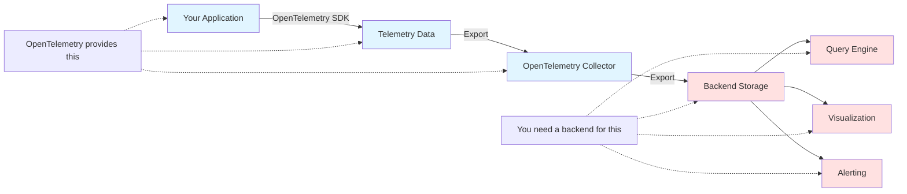

# How to Understand What OpenTelemetry Does NOT Do (It's Not a Backend)

Author: [nawazdhandala](https://www.github.com/nawazdhandala)

Tags: OpenTelemetry, Misconceptions, Architecture, Backend, Storage

Description: Clear up common misconceptions about OpenTelemetry by understanding what it doesn't do, especially the critical distinction that it is not an observability backend.

OpenTelemetry solves specific problems in observability, but understanding what it doesn't do is just as important as understanding what it does. The most critical misconception is thinking OpenTelemetry is a complete observability solution. It's not. OpenTelemetry is instrumentation and data collection infrastructure, not a backend for storing, querying, or visualizing that data.

## OpenTelemetry Is Not a Backend

This is the biggest source of confusion. OpenTelemetry does not store your telemetry data, provide a query interface, or give you dashboards and alerting.



OpenTelemetry handles:
- Generating telemetry data in your application
- Collecting and processing that data
- Exporting data to backends

OpenTelemetry does NOT handle:
- Storing telemetry data long-term
- Indexing data for fast queries
- Providing a query language (like PromQL or SQL)
- Building dashboards and visualizations
- Running alerts based on telemetry
- User authentication and access control
- Data retention policies
- Cost management and billing

You still need to choose and run an observability backend. Popular options include:

**Open source backends**:
- Jaeger for traces
- Prometheus for metrics
- Grafana Loki for logs
- SigNoz (all signals)
- Grafana (visualization)

**Commercial backends**:
- Datadog
- New Relic
- Honeycomb
- Lightstep
- Splunk
- OneUptime

**Cloud provider offerings**:
- AWS X-Ray and CloudWatch
- Google Cloud Trace and Monitoring
- Azure Monitor

OpenTelemetry's value is vendor neutrality. You instrument once with OpenTelemetry, then export to any compatible backend. If you switch backends later, you don't rewrite instrumentation.

## OpenTelemetry Does Not Store Data

The OpenTelemetry SDK and Collector process data in memory but don't persist it. Data flows through OpenTelemetry components and gets exported to backends for storage.

```python
from opentelemetry import trace
from opentelemetry.sdk.trace import TracerProvider
from opentelemetry.sdk.trace.export import BatchSpanProcessor
from opentelemetry.exporter.otlp.proto.grpc.trace_exporter import OTLPSpanExporter

# Configure OpenTelemetry to export to a backend
provider = TracerProvider()
processor = BatchSpanProcessor(
    OTLPSpanExporter(endpoint="http://backend:4317")
)
provider.add_span_processor(processor)
trace.set_tracer_provider(provider)

# Create spans
tracer = trace.get_tracer(__name__)
with tracer.start_as_current_span("operation"):
    do_work()
    # Span data exists in memory briefly
    # Then gets exported to the backend
    # OpenTelemetry doesn't keep it
```

The batch processor holds spans in memory until the batch size or timeout is reached, then exports them. Once exported successfully, the SDK discards them. If you want to query that data later, you query the backend, not OpenTelemetry.

The Collector similarly buffers data in memory during processing but doesn't persist it to disk:

```yaml
receivers:
  otlp:
    protocols:
      grpc:

processors:
  batch:
    timeout: 10s
    # Data buffered in memory only

exporters:
  otlp:
    endpoint: https://backend.example.com:4317

service:
  pipelines:
    traces:
      receivers: [otlp]
      processors: [batch]
      exporters: [otlp]  # Data leaves the collector
```

Some Collector extensions provide limited persistence for reliability (like the file storage extension), but these are temporary buffers during outages, not permanent storage.

## OpenTelemetry Does Not Provide Visualization

You can't point a web browser at OpenTelemetry and see your traces or metrics. There's no built-in UI, dashboard builder, or visualization tool.

When you instrument your application:

```go
import (
    "go.opentelemetry.io/otel"
    "go.opentelemetry.io/otel/attribute"
    "go.opentelemetry.io/otel/trace"
)

func processOrder(ctx context.Context, orderID string) {
    tracer := otel.Tracer("order-processor")
    ctx, span := tracer.Start(ctx, "processOrder")
    defer span.End()

    span.SetAttributes(
        attribute.String("order.id", orderID),
        attribute.String("order.status", "processing"),
    )

    // Do work...
}
```

The resulting spans are just data structures that get exported. To visualize them, you need:

1. A backend that receives and stores the spans (Jaeger, Tempo, Zipkin)
2. A UI that queries the backend and renders traces (Jaeger UI, Grafana)

OpenTelemetry provides neither. It's the plumbing that gets data from your app to those systems.

## OpenTelemetry Does Not Alert

You can't configure alerts or notifications in OpenTelemetry. It doesn't evaluate conditions like "error rate above 5%" or "p95 latency over 500ms" and send notifications.

Consider this metrics instrumentation:

```python
from opentelemetry import metrics

meter = metrics.get_meter(__name__)

request_counter = meter.create_counter(
    "http.server.requests",
    description="Number of HTTP requests"
)

request_duration = meter.create_histogram(
    "http.server.duration",
    unit="ms",
    description="HTTP request duration"
)

@app.route('/api/endpoint')
def endpoint():
    start = time.time()

    try:
        result = handle_request()
        request_counter.add(1, {"status": "success"})
        return result
    except Exception as e:
        request_counter.add(1, {"status": "error"})
        raise
    finally:
        duration = (time.time() - start) * 1000
        request_duration.record(duration)
```

This code captures metrics, but OpenTelemetry doesn't evaluate them for alerting conditions. Your backend does that. You configure alerts in Prometheus, Datadog, or whatever platform receives your metrics.

```yaml
# This alert configuration lives in your backend, not OpenTelemetry
# Example: Prometheus alert rules
groups:
- name: http_alerts
  rules:
  - alert: HighErrorRate
    expr: |
      sum(rate(http_server_requests{status="error"}[5m])) /
      sum(rate(http_server_requests[5m])) > 0.05
    for: 5m
    annotations:
      summary: "Error rate above 5%"
```

## OpenTelemetry Does Not Provide Analytics or Query Languages

OpenTelemetry doesn't offer ways to analyze your telemetry data. It doesn't have a query language, aggregation engine, or data analysis tools.

If you want to answer questions like:
- What's the p95 latency for API endpoints in the last hour?
- Which services have error rates above 1%?
- How many database queries took longer than 1 second?
- What are the top 10 slowest traces today?

You need a backend with query and analytics capabilities. Backends provide query languages:

**Prometheus** uses PromQL:
```promql
histogram_quantile(0.95,
  sum(rate(http_server_duration_bucket[5m])) by (le, endpoint)
)
```

**SQL-based backends** like ClickHouse:
```sql
SELECT
  endpoint,
  quantile(0.95)(duration) as p95_latency
FROM traces
WHERE timestamp > now() - INTERVAL 1 HOUR
GROUP BY endpoint
ORDER BY p95_latency DESC
```

**Specialized query languages** like TraceQL in Grafana Tempo:
```traceql
{ .http.status_code = 500 && duration > 1s }
```

OpenTelemetry's job ends when it exports data. The backend handles all analysis.

## OpenTelemetry Does Not Manage Costs

Data volume directly impacts observability costs. OpenTelemetry provides sampling to reduce volume, but it doesn't track costs, set budgets, or enforce limits.

You configure sampling in OpenTelemetry:

```python
from opentelemetry.sdk.trace.sampling import TraceIdRatioBased

# Sample 1% of traces
sampler = TraceIdRatioBased(0.01)
provider = TracerProvider(sampler=sampler)
```

But OpenTelemetry doesn't know or care about the cost implications. Your backend charges for ingestion and storage. You manage costs through:
- Backend configuration (retention policies, rate limits)
- OpenTelemetry sampling decisions (which you control)
- Infrastructure optimization (collector deployment)

## OpenTelemetry Does Not Handle Authentication or Authorization

OpenTelemetry can pass authentication headers to backends:

```bash
export OTEL_EXPORTER_OTLP_HEADERS="Authorization=Bearer token123"
```

But it doesn't authenticate users, manage permissions, or control access to data. If you have multiple teams, you need a backend with multi-tenancy and RBAC (Role-Based Access Control).

OpenTelemetry is a conduit for data, not a security system. Backend security features include:
- User authentication and SSO integration
- Team-based access control
- Data isolation between tenants
- Audit logs of who accessed what data
- API token management

## OpenTelemetry Does Not Automatically Instrument Everything

While automatic instrumentation covers frameworks and libraries, OpenTelemetry doesn't magically understand your business logic.

Automatic instrumentation gives you:

```python
# With auto-instrumentation, this is automatically traced
@app.route('/api/checkout')
def checkout():
    cart = get_cart()  # Database call traced automatically
    charge_payment()   # HTTP call traced automatically
    return {"success": True}
```

But it doesn't capture business-specific information:

```python
# You need manual instrumentation for business context
from opentelemetry import trace

tracer = trace.get_tracer(__name__)

@app.route('/api/checkout')
def checkout():
    with tracer.start_as_current_span("checkout") as span:
        cart = get_cart()

        # These business attributes require manual instrumentation
        span.set_attribute("cart.total", cart.total)
        span.set_attribute("cart.item_count", len(cart.items))
        span.set_attribute("customer.tier", get_customer_tier())
        span.set_attribute("promotion.applied", cart.promotion_code is not None)

        charge_payment()
        return {"success": True}
```

OpenTelemetry provides the API for manual instrumentation, but you write the code to capture what matters to your business.

## OpenTelemetry Does Not Make Architectural Decisions

OpenTelemetry is flexible, which means you make architectural choices:

**Where to run collectors**? Options include:
- Sidecar containers alongside each service
- Node-level agents (one per Kubernetes node)
- Centralized gateways
- No collector at all (direct export to backend)

**How to sample**? Options include:
- Head sampling (decide at trace start)
- Tail sampling (decide after trace completes)
- Sampling rate (1%, 10%, 100%?)
- Different rates for different services

**Which signals to collect**? You decide:
- Traces only
- Metrics only
- Traces and metrics
- Full observability (traces, metrics, logs)

**Which backend(s)**? You choose:
- Single vendor
- Multiple vendors (traces to one, metrics to another)
- Open source vs. commercial
- Self-hosted vs. SaaS

OpenTelemetry supports all these options but doesn't prescribe which to use. You design your observability architecture.

## OpenTelemetry Does Not Guarantee Delivery

The SDK and Collector make best-effort attempts to export data, but they don't guarantee every span or metric reaches the backend.

Scenarios where data can be lost:

**Application crashes**: If your app crashes before the batch processor exports queued spans, those spans are lost. The SDK doesn't persist them to disk by default.

**Export failures**: If the backend is unreachable and retries fail, data is eventually dropped to prevent unbounded memory growth.

**Sampling**: By design, sampled-out traces are never exported.

**Resource limits**: If you hit configured queue size limits, new spans are dropped.

```python
processor = BatchSpanProcessor(
    exporter,
    max_queue_size=2048,  # If queue fills, new spans are dropped
)
```

For higher reliability, deploy a Collector with persistent queuing:

```yaml
exporters:
  otlp:
    endpoint: https://backend.example.com:4317
    sending_queue:
      enabled: true
      storage: file_storage  # Persist queue to disk

extensions:
  file_storage:
    directory: /var/lib/otel-collector/queue
    timeout: 10s

service:
  extensions: [file_storage]
  pipelines:
    traces:
      receivers: [otlp]
      exporters: [otlp]
```

But even with persistence, there's no absolute guarantee. OpenTelemetry prioritizes application performance over telemetry delivery. It won't block your application or consume unlimited memory to preserve telemetry.

## OpenTelemetry Does Not Include Distributed Tracing Intelligence

OpenTelemetry captures and propagates trace context, but it doesn't analyze traces for you. It won't automatically identify the root cause of a slow request or surface anomalous patterns.

Consider a trace spanning multiple services:

```
API Gateway (50ms)
  ├─ Auth Service (10ms)
  └─ Order Service (1200ms)
      ├─ Inventory Service (200ms)
      ├─ Payment Service (980ms)
      │   └─ Database Query (950ms)  ← Bottleneck here
      └─ Notification Service (20ms)
```

OpenTelemetry captures this trace structure and timing, but determining that the database query is the bottleneck requires:
- A backend that stores and indexes the trace
- UI or analysis tools that visualize the trace
- Potentially, ML-based anomaly detection

Backends provide these capabilities. Some use AI to surface interesting traces, detect anomalies, or recommend optimizations. OpenTelemetry just captures the raw data.

## OpenTelemetry Does Not Replace APM Features

Traditional APM (Application Performance Monitoring) tools like New Relic, Datadog, or AppDynamics provide comprehensive feature sets beyond telemetry collection:

- Real User Monitoring (RUM)
- Synthetic monitoring
- Log aggregation and analysis
- Infrastructure monitoring
- Security monitoring
- Business analytics
- Incident management
- Collaboration features

OpenTelemetry replaces the instrumentation layer of APM tools but not the complete feature set. Many APM vendors now support OpenTelemetry as an alternative to their proprietary agents, letting you use OpenTelemetry for data collection while still accessing their platform features.

## What OpenTelemetry Actually Does

To clarify, OpenTelemetry provides:

**APIs for instrumentation**: Standard interfaces for creating spans, recording metrics, and emitting logs.

**SDKs for data collection**: Implementations of those APIs that capture telemetry in your application.

**Automatic instrumentation**: Agents and libraries that instrument frameworks and libraries without code changes.

**Data processing**: The Collector provides a pipeline for receiving, transforming, and routing telemetry.

**Protocol specification**: OTLP defines a standard format for transmitting telemetry between components.

**Context propagation**: Mechanisms for passing trace context across service boundaries.

**Vendor neutrality**: A common instrumentation layer that exports to many backends.

Understanding what OpenTelemetry doesn't do is critical for planning your observability strategy. OpenTelemetry is powerful instrumentation infrastructure, but you still need to choose, deploy, and operate an observability backend. The two work together: OpenTelemetry generates and delivers the data, while your backend stores, analyzes, visualizes, and alerts on it. Successful observability requires both components working in concert, each doing what it does best.
