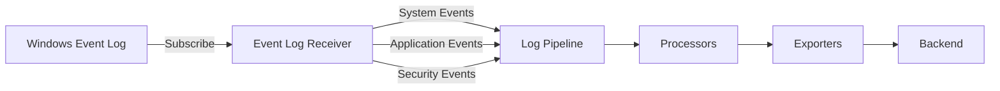

# How to Configure the Windows Event Log Receiver in the OpenTelemetry Collector

Author: [nawazdhandala](https://www.github.com/nawazdhandala)

Tags: OpenTelemetry, Collector, Windows, Event Log, Logs, Security

Description: Learn how to configure the Windows Event Log Receiver in the OpenTelemetry Collector to collect system, application, and security logs from Windows.

---

The Windows Event Log Receiver collects logs from Windows Event Log channels, enabling centralized log management and analysis for Windows systems. This receiver is essential for monitoring Windows servers, workstations, and applications, providing visibility into system events, security audits, application errors, and more.

For more on log collection, see our guide on [OpenTelemetry log receivers](https://oneuptime.com/blog/post/opentelemetry-log-receivers/view).

## What is the Windows Event Log Receiver?

The Windows Event Log Receiver subscribes to Windows Event Log channels and converts event log entries into OpenTelemetry log records. It uses the Windows Event Log API to efficiently stream events and supports filtering, batching, and structured attribute extraction.



Key features:
- Collect from any Windows Event Log channel
- Filter events by event ID, level, and provider
- Extract structured attributes from event data
- Support for custom event channels
- Efficient streaming with bookmarking

## Basic Configuration

Start with a simple configuration to collect system events.

```yaml
receivers:
  windowseventlog:
    # Collect from System channel
    channel: System

    # Start collecting from the most recent event
    start_at: end

exporters:
  debug:
    verbosity: detailed

service:
  pipelines:
    logs:
      receivers: [windowseventlog]
      exporters: [debug]
```

This collects all new events from the System channel.

## Channel Configuration

Windows Event Log has multiple channels for different event types.

### Common Channels

```yaml
receivers:
  # System events
  windowseventlog/system:
    channel: System
    start_at: end

  # Application events
  windowseventlog/application:
    channel: Application
    start_at: end

  # Security events (requires administrator privileges)
  windowseventlog/security:
    channel: Security
    start_at: end

  # Windows PowerShell events
  windowseventlog/powershell:
    channel: Windows PowerShell
    start_at: end

  # Windows Defender events
  windowseventlog/defender:
    channel: Microsoft-Windows-Windows Defender/Operational
    start_at: end

exporters:
  otlp:
    endpoint: ${env:OTEL_EXPORTER_OTLP_ENDPOINT}

service:
  pipelines:
    logs:
      receivers:
        - windowseventlog/system
        - windowseventlog/application
        - windowseventlog/security
        - windowseventlog/powershell
        - windowseventlog/defender
      exporters: [otlp]
```

### Finding Available Channels

List all available channels using PowerShell:

```powershell
# List all event log channels
Get-WinEvent -ListLog * | Select-Object LogName, RecordCount, IsEnabled

# Find channels with recent activity
Get-WinEvent -ListLog * | Where-Object { $_.RecordCount -gt 0 } | Select-Object LogName, RecordCount

# Search for specific channels
Get-WinEvent -ListLog *Security* | Select-Object LogName
```

## Start Position

Configure where the receiver starts collecting events.

```yaml
receivers:
  windowseventlog:
    channel: System

    # Start from the beginning (collect all historical events)
    start_at: beginning

    # OR start from the end (only new events)
    start_at: end
```

Use `beginning` for initial setup to collect historical events, then the receiver automatically bookmarks its position for subsequent runs.

## Event Filtering

Filter events to collect only relevant logs.

### Filter by Event Level

```yaml
receivers:
  windowseventlog:
    channel: System

    # Only collect errors and critical events
    # Levels: 0=LogAlways, 1=Critical, 2=Error, 3=Warning, 4=Information, 5=Verbose
    query: |
      <QueryList>
        <Query Id="0" Path="System">
          <Select Path="System">*[System[(Level=1 or Level=2)]]</Select>
        </Query>
      </QueryList>
```

### Filter by Event ID

```yaml
receivers:
  windowseventlog:
    channel: System

    # Only collect specific event IDs
    query: |
      <QueryList>
        <Query Id="0" Path="System">
          <Select Path="System">
            *[System[(EventID=1074 or EventID=6005 or EventID=6006 or EventID=6008)]]
          </Select>
        </Query>
      </QueryList>

# Event IDs:
# 1074 - System shutdown/restart
# 6005 - Event Log service started
# 6006 - Event Log service stopped
# 6008 - Unexpected shutdown
```

### Filter by Event Provider

```yaml
receivers:
  windowseventlog:
    channel: System

    # Only collect events from specific provider
    query: |
      <QueryList>
        <Query Id="0" Path="System">
          <Select Path="System">
            *[System[Provider[@Name='Microsoft-Windows-Kernel-Power']]]
          </Select>
        </Query>
      </QueryList>
```

### Complex Filtering

```yaml
receivers:
  windowseventlog:
    channel: Security

    # Collect failed login attempts (Event ID 4625)
    # and successful logins (Event ID 4624)
    # from the last 24 hours
    query: |
      <QueryList>
        <Query Id="0" Path="Security">
          <Select Path="Security">
            *[System[(EventID=4624 or EventID=4625) and TimeCreated[timediff(@SystemTime) &lt;= 86400000]]]
          </Select>
        </Query>
      </QueryList>
```

## Attribute Extraction

Extract structured data from event logs.

### Basic Attributes

The receiver automatically extracts these attributes:

```yaml
receivers:
  windowseventlog:
    channel: System

processors:
  # View extracted attributes
  transform/view_attributes:
    log_statements:
      - context: log
        statements:
          # Attributes automatically extracted:
          # - event.id: Event ID number
          # - event.level: Event level (Critical, Error, Warning, Info, Verbose)
          # - event.provider: Event provider name
          # - event.computer: Computer name
          # - event.user: User SID
          # - event.time_created: Event timestamp
          # - event.record_id: Event record ID
          # - event.channel: Channel name
          - set(attributes["extracted"], "true")

exporters:
  debug:
    verbosity: detailed

service:
  pipelines:
    logs:
      receivers: [windowseventlog]
      processors: [transform/view_attributes]
      exporters: [debug]
```

### Extract Event Data Fields

Extract specific fields from event data.

```yaml
receivers:
  windowseventlog:
    channel: Security

processors:
  # Extract login event details
  transform/security:
    log_statements:
      - context: log
        statements:
          # Extract fields from event data
          # Security event 4624 (successful login) structure:
          # - TargetUserName: Username
          # - IpAddress: Source IP
          # - LogonType: Logon type

          # Parse event data (assuming XML structure in body)
          - set(attributes["user.name"], body["EventData"]["TargetUserName"]) where body["EventData"]["TargetUserName"] != nil
          - set(attributes["source.ip"], body["EventData"]["IpAddress"]) where body["EventData"]["IpAddress"] != nil
          - set(attributes["logon.type"], body["EventData"]["LogonType"]) where body["EventData"]["LogonType"] != nil

          # Set severity based on event type
          - set(severity_text, "INFO") where attributes["event.id"] == 4624
          - set(severity_text, "WARN") where attributes["event.id"] == 4625

exporters:
  otlp:
    endpoint: ${env:OTEL_EXPORTER_OTLP_ENDPOINT}

service:
  pipelines:
    logs:
      receivers: [windowseventlog]
      processors: [transform/security]
      exporters: [otlp]
```

## Security Event Monitoring

Monitor Windows security events for audit and compliance.

### Failed Login Attempts

```yaml
receivers:
  windowseventlog/failed_logins:
    channel: Security

    # Event ID 4625: Failed login attempt
    query: |
      <QueryList>
        <Query Id="0" Path="Security">
          <Select Path="Security">*[System[(EventID=4625)]]</Select>
        </Query>
      </QueryList>

processors:
  transform/failed_logins:
    log_statements:
      - context: log
        statements:
          # Extract failed login details
          - set(attributes["security.event"], "failed_login")
          - set(attributes["user.name"], body["EventData"]["TargetUserName"]) where body["EventData"]["TargetUserName"] != nil
          - set(attributes["source.ip"], body["EventData"]["IpAddress"]) where body["EventData"]["IpAddress"] != nil
          - set(attributes["failure.reason"], body["EventData"]["FailureReason"]) where body["EventData"]["FailureReason"] != nil
          - set(severity_text, "WARN")

  # Filter to only IP-based attacks
  filter/remote_attacks:
    logs:
      log_record:
        - attributes["source.ip"] != nil and attributes["source.ip"] != "-"

exporters:
  otlp:
    endpoint: ${env:OTEL_EXPORTER_OTLP_ENDPOINT}

service:
  pipelines:
    logs:
      receivers: [windowseventlog/failed_logins]
      processors: [transform/failed_logins, filter/remote_attacks]
      exporters: [otlp]
```

### Account Changes

```yaml
receivers:
  windowseventlog/account_changes:
    channel: Security

    # Monitor account management events
    # 4720: Account created
    # 4722: Account enabled
    # 4723: Password change attempt
    # 4724: Password reset
    # 4725: Account disabled
    # 4726: Account deleted
    query: |
      <QueryList>
        <Query Id="0" Path="Security">
          <Select Path="Security">
            *[System[(EventID=4720 or EventID=4722 or EventID=4723 or EventID=4724 or EventID=4725 or EventID=4726)]]
          </Select>
        </Query>
      </QueryList>

processors:
  transform/account_changes:
    log_statements:
      - context: log
        statements:
          - set(attributes["security.event"], "account_change")
          - set(attributes["target.user"], body["EventData"]["TargetUserName"]) where body["EventData"]["TargetUserName"] != nil
          - set(attributes["changed.by"], body["EventData"]["SubjectUserName"]) where body["EventData"]["SubjectUserName"] != nil

          # Classify event type
          - set(attributes["change.type"], "created") where attributes["event.id"] == 4720
          - set(attributes["change.type"], "enabled") where attributes["event.id"] == 4722
          - set(attributes["change.type"], "password_changed") where attributes["event.id"] == 4723
          - set(attributes["change.type"], "password_reset") where attributes["event.id"] == 4724
          - set(attributes["change.type"], "disabled") where attributes["event.id"] == 4725
          - set(attributes["change.type"], "deleted") where attributes["event.id"] == 4726

          - set(severity_text, "INFO")

exporters:
  otlp:
    endpoint: ${env:OTEL_EXPORTER_OTLP_ENDPOINT}

service:
  pipelines:
    logs:
      receivers: [windowseventlog/account_changes]
      processors: [transform/account_changes]
      exporters: [otlp]
```

### Privilege Escalation

```yaml
receivers:
  windowseventlog/privilege_escalation:
    channel: Security

    # Monitor privilege use events
    # 4672: Special privileges assigned to new logon
    # 4673: Privileged service called
    # 4674: Operation attempted on privileged object
    query: |
      <QueryList>
        <Query Id="0" Path="Security">
          <Select Path="Security">
            *[System[(EventID=4672 or EventID=4673 or EventID=4674)]]
          </Select>
        </Query>
      </QueryList>

processors:
  transform/privilege_escalation:
    log_statements:
      - context: log
        statements:
          - set(attributes["security.event"], "privilege_use")
          - set(attributes["user.name"], body["EventData"]["SubjectUserName"]) where body["EventData"]["SubjectUserName"] != nil
          - set(attributes["privileges"], body["EventData"]["PrivilegeList"]) where body["EventData"]["PrivilegeList"] != nil
          - set(severity_text, "WARN")

exporters:
  otlp:
    endpoint: ${env:OTEL_EXPORTER_OTLP_ENDPOINT}

service:
  pipelines:
    logs:
      receivers: [windowseventlog/privilege_escalation]
      processors: [transform/privilege_escalation]
      exporters: [otlp]
```

## Application Event Monitoring

Monitor application errors and warnings.

### Application Crashes

```yaml
receivers:
  windowseventlog/application_errors:
    channel: Application

    # Application error events
    query: |
      <QueryList>
        <Query Id="0" Path="Application">
          <Select Path="Application">*[System[(Level=1 or Level=2)]]</Select>
        </Query>
      </QueryList>

processors:
  transform/app_errors:
    log_statements:
      - context: log
        statements:
          - set(attributes["event.type"], "application_error")
          - set(attributes["application.name"], attributes["event.provider"]) where attributes["event.provider"] != nil

          # Extract error code if present
          - set(attributes["error.code"], body["EventData"]["ErrorCode"]) where body["EventData"]["ErrorCode"] != nil

          # Set severity
          - set(severity_text, "CRITICAL") where attributes["event.level"] == "Critical"
          - set(severity_text, "ERROR") where attributes["event.level"] == "Error"

exporters:
  otlp:
    endpoint: ${env:OTEL_EXPORTER_OTLP_ENDPOINT}

service:
  pipelines:
    logs:
      receivers: [windowseventlog/application_errors]
      processors: [transform/app_errors]
      exporters: [otlp]
```

### IIS Web Server Logs

```yaml
receivers:
  windowseventlog/iis:
    channel: Microsoft-Windows-IIS-Logging/Logs

processors:
  transform/iis:
    log_statements:
      - context: log
        statements:
          - set(attributes["service.name"], "iis")
          - set(attributes["http.request_path"], body["EventData"]["RequestPath"]) where body["EventData"]["RequestPath"] != nil
          - set(attributes["http.status_code"], body["EventData"]["StatusCode"]) where body["EventData"]["StatusCode"] != nil
          - set(attributes["http.client_ip"], body["EventData"]["ClientIP"]) where body["EventData"]["ClientIP"] != nil

exporters:
  otlp:
    endpoint: ${env:OTEL_EXPORTER_OTLP_ENDPOINT}

service:
  pipelines:
    logs:
      receivers: [windowseventlog/iis]
      processors: [transform/iis]
      exporters: [otlp]
```

## System Event Monitoring

Monitor system health and operations.

### System Restarts and Shutdowns

```yaml
receivers:
  windowseventlog/system_power:
    channel: System

    # System power events
    # 1074: System shutdown/restart initiated by user/process
    # 6005: Event Log service started (system boot)
    # 6006: Event Log service stopped (clean shutdown)
    # 6008: Unexpected shutdown
    query: |
      <QueryList>
        <Query Id="0" Path="System">
          <Select Path="System">
            *[System[(EventID=1074 or EventID=6005 or EventID=6006 or EventID=6008)]]
          </Select>
        </Query>
      </QueryList>

processors:
  transform/system_power:
    log_statements:
      - context: log
        statements:
          - set(attributes["system.event"], "power")

          # Classify event
          - set(attributes["power.action"], "restart_initiated") where attributes["event.id"] == 1074
          - set(attributes["power.action"], "boot_complete") where attributes["event.id"] == 6005
          - set(attributes["power.action"], "shutdown_clean") where attributes["event.id"] == 6006
          - set(attributes["power.action"], "shutdown_unexpected") where attributes["event.id"] == 6008

          # Set severity
          - set(severity_text, "INFO") where attributes["event.id"] == 1074 or attributes["event.id"] == 6005 or attributes["event.id"] == 6006
          - set(severity_text, "ERROR") where attributes["event.id"] == 6008

exporters:
  otlp:
    endpoint: ${env:OTEL_EXPORTER_OTLP_ENDPOINT}

service:
  pipelines:
    logs:
      receivers: [windowseventlog/system_power]
      processors: [transform/system_power]
      exporters: [otlp]
```

### Service Events

```yaml
receivers:
  windowseventlog/services:
    channel: System

    # Service control manager events
    # 7034: Service terminated unexpectedly
    # 7035: Service started/stopped
    # 7036: Service entered state
    # 7040: Service start type changed
    query: |
      <QueryList>
        <Query Id="0" Path="System">
          <Select Path="System">
            *[System[Provider[@Name='Service Control Manager']]]
          </Select>
        </Query>
      </QueryList>

processors:
  transform/services:
    log_statements:
      - context: log
        statements:
          - set(attributes["system.event"], "service")
          - set(attributes["service.name"], body["EventData"]["ServiceName"]) where body["EventData"]["ServiceName"] != nil

          # Classify event
          - set(attributes["service.action"], "terminated_unexpectedly") where attributes["event.id"] == 7034
          - set(attributes["service.action"], "state_changed") where attributes["event.id"] == 7036
          - set(attributes["service.action"], "startup_type_changed") where attributes["event.id"] == 7040

          # Set severity
          - set(severity_text, "ERROR") where attributes["event.id"] == 7034
          - set(severity_text, "INFO") where attributes["event.id"] == 7035 or attributes["event.id"] == 7036 or attributes["event.id"] == 7040

exporters:
  otlp:
    endpoint: ${env:OTEL_EXPORTER_OTLP_ENDPOINT}

service:
  pipelines:
    logs:
      receivers: [windowseventlog/services]
      processors: [transform/services]
      exporters: [otlp]
```

## Resource Attributes

Add contextual information to logs.

```yaml
receivers:
  windowseventlog:
    channel: System

processors:
  # Add resource attributes
  resource/windows:
    attributes:
      - key: os.type
        value: windows
        action: upsert
      - key: host.name
        value: ${env:COMPUTERNAME}
        action: upsert
      - key: deployment.environment
        value: ${env:ENVIRONMENT}
        action: upsert

  # Detect additional host information
  resourcedetection:
    detectors: [system, env]
    timeout: 5s

exporters:
  otlp:
    endpoint: ${env:OTEL_EXPORTER_OTLP_ENDPOINT}

service:
  pipelines:
    logs:
      receivers: [windowseventlog]
      processors: [resource/windows, resourcedetection]
      exporters: [otlp]
```

## Complete Production Example

Full configuration for comprehensive Windows monitoring.

```yaml
receivers:
  # System events
  windowseventlog/system:
    channel: System
    start_at: end
    query: |
      <QueryList>
        <Query Id="0" Path="System">
          <Select Path="System">*[System[(Level=1 or Level=2 or Level=3)]]</Select>
        </Query>
      </QueryList>

  # Application errors
  windowseventlog/application:
    channel: Application
    start_at: end
    query: |
      <QueryList>
        <Query Id="0" Path="Application">
          <Select Path="Application">*[System[(Level=1 or Level=2)]]</Select>
        </Query>
      </QueryList>

  # Security events - Failed logins
  windowseventlog/security_failed_logins:
    channel: Security
    start_at: end
    query: |
      <QueryList>
        <Query Id="0" Path="Security">
          <Select Path="Security">*[System[(EventID=4625)]]</Select>
        </Query>
      </QueryList>

  # Security events - Account changes
  windowseventlog/security_account_changes:
    channel: Security
    start_at: end
    query: |
      <QueryList>
        <Query Id="0" Path="Security">
          <Select Path="Security">
            *[System[(EventID=4720 or EventID=4722 or EventID=4725 or EventID=4726)]]
          </Select>
        </Query>
      </QueryList>

  # Windows Defender
  windowseventlog/defender:
    channel: Microsoft-Windows-Windows Defender/Operational
    start_at: end

processors:
  # Process system events
  transform/system:
    log_statements:
      - context: log
        statements:
          - set(attributes["log.source"], "system") where resource.attributes["event.channel"] == "System"
          - set(severity_text, "CRITICAL") where attributes["event.level"] == "Critical"
          - set(severity_text, "ERROR") where attributes["event.level"] == "Error"
          - set(severity_text, "WARN") where attributes["event.level"] == "Warning"

  # Process application events
  transform/application:
    log_statements:
      - context: log
        statements:
          - set(attributes["log.source"], "application") where resource.attributes["event.channel"] == "Application"
          - set(attributes["application.name"], attributes["event.provider"])

  # Process security events
  transform/security:
    log_statements:
      - context: log
        statements:
          - set(attributes["log.source"], "security") where resource.attributes["event.channel"] == "Security"

          # Failed logins
          - set(attributes["security.event"], "failed_login") where attributes["event.id"] == 4625
          - set(attributes["user.name"], body["EventData"]["TargetUserName"]) where attributes["event.id"] == 4625 and body["EventData"]["TargetUserName"] != nil
          - set(attributes["source.ip"], body["EventData"]["IpAddress"]) where attributes["event.id"] == 4625 and body["EventData"]["IpAddress"] != nil

          # Account changes
          - set(attributes["security.event"], "account_change") where attributes["event.id"] == 4720 or attributes["event.id"] == 4722 or attributes["event.id"] == 4725 or attributes["event.id"] == 4726
          - set(attributes["target.user"], body["EventData"]["TargetUserName"]) where body["EventData"]["TargetUserName"] != nil

  # Add resource attributes
  resource/windows:
    attributes:
      - key: os.type
        value: windows
        action: upsert
      - key: host.name
        value: ${env:COMPUTERNAME}
        action: upsert
      - key: deployment.environment
        value: ${env:ENVIRONMENT}
        action: upsert
      - key: collector.version
        value: ${env:COLLECTOR_VERSION}
        action: upsert

  # Detect host information
  resourcedetection:
    detectors: [system, env]
    timeout: 5s

  # Batch processing
  batch:
    timeout: 10s
    send_batch_size: 1000

exporters:
  # Send to OTLP backend
  otlp:
    endpoint: ${env:OTEL_EXPORTER_OTLP_ENDPOINT}
    headers:
      authorization: Bearer ${env:OTEL_AUTH_TOKEN}
    compression: gzip

extensions:
  # Health check
  health_check:
    endpoint: 0.0.0.0:13133

service:
  extensions: [health_check]

  pipelines:
    logs:
      receivers:
        - windowseventlog/system
        - windowseventlog/application
        - windowseventlog/security_failed_logins
        - windowseventlog/security_account_changes
        - windowseventlog/defender
      processors:
        - transform/system
        - transform/application
        - transform/security
        - resource/windows
        - resourcedetection
        - batch
      exporters: [otlp]

  telemetry:
    logs:
      level: info
      encoding: json
    metrics:
      address: 0.0.0.0:8888
```

## Summary

| Feature | Configuration |
|---------|--------------|
| **Channels** | System, Application, Security, custom |
| **Filtering** | Event ID, level, provider, time range |
| **Security Monitoring** | Failed logins, account changes, privileges |
| **Application Monitoring** | Errors, crashes, IIS logs |
| **System Monitoring** | Restarts, shutdowns, services |
| **Attributes** | Automatic extraction + custom transform |

The Windows Event Log Receiver provides comprehensive visibility into Windows system activity. By collecting and processing events from system, application, and security channels, you can monitor system health, detect security threats, troubleshoot application issues, and maintain compliance. Combined with transform processors, you can extract structured data and create actionable alerts for your Windows infrastructure.

For more on log processing, see our guides on [transform processor](https://oneuptime.com/blog/post/2026-02-06-transform-processor-opentelemetry-collector/view) and [filter processor](https://oneuptime.com/blog/post/2026-02-06-filter-processor-opentelemetry-collector/view).
