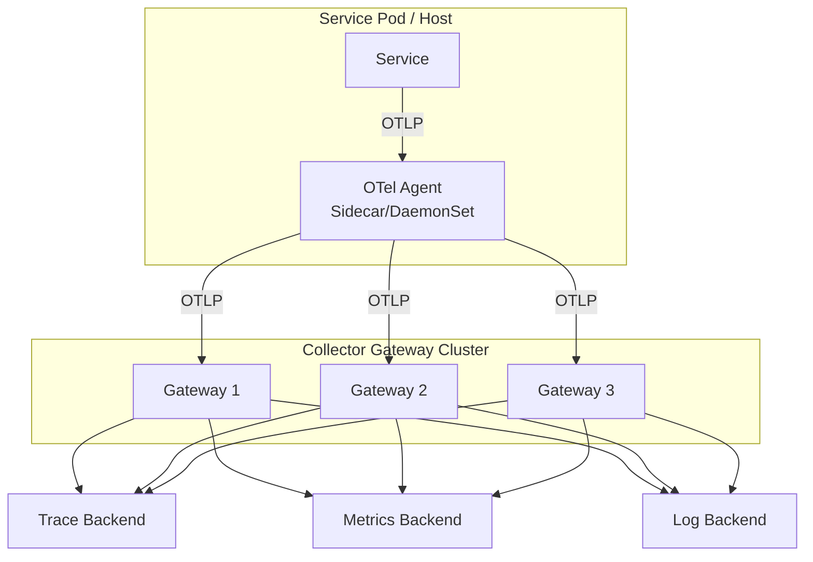
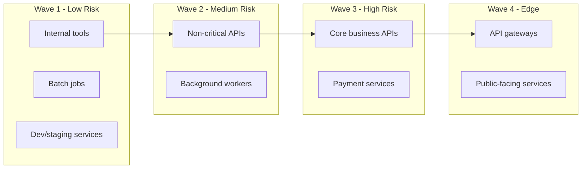

# How to Plan a Zero-Downtime Migration to OpenTelemetry for 100+ Microservices

Author: [nawazdhandala](https://www.github.com/nawazdhandala)

Tags: OpenTelemetry, Migration, Microservices, Observability, Planning, Zero Downtime, Strategy

Description: A comprehensive planning guide for migrating a large microservice fleet to OpenTelemetry without disrupting production, covering phased rollout, compatibility layers, and organizational coordination.

---

Migrating a handful of services to OpenTelemetry is straightforward. Migrating a hundred or more is a completely different challenge. It involves coordinating across teams, maintaining compatibility between services at different stages, ensuring no observability gaps, and doing it all without causing production incidents.

This guide lays out an approach for planning and executing a large-scale OpenTelemetry migration, covering organizational, architectural, and technical dimensions.

## Phase 0: Assessment and Inventory (Weeks 1 to 3)

Before writing a single line of migration code, you need a complete picture of what you are dealing with.

### Service Inventory

Build a spreadsheet or database that captures the following for every service:

```yaml
# Example service inventory entry
service_name: order-service
team: commerce
language: Java 17
framework: Spring Boot 3.2
current_instrumentation:
  tracing: Jaeger client 1.8
  metrics: Micrometer + Prometheus
  logging: Log4j2 + Fluentd sidecar
dependencies:
  calls: [payment-service, inventory-service, notification-service]
  called_by: [api-gateway, admin-dashboard]
deployment:
  platform: Kubernetes
  namespace: commerce
  replicas: 6
  deploy_frequency: "2x per week"
criticality: high
team_contact: alice@example.com
```

Automate as much of this inventory as possible. If you have a service mesh like Istio, pull the dependency graph from there. If you have Prometheus, query for active metrics to identify which instrumentation libraries each service uses.

### Define Success Criteria

Write down what "done" means before you start. All services should emit traces, metrics, and logs via OpenTelemetry. Distributed traces must be complete across service boundaries. Existing dashboards and alerts must continue working. No increase in P99 latency or error rate. Legacy libraries fully removed.

## Phase 1: Infrastructure Foundation (Weeks 3 to 6)

Set up the OpenTelemetry Collector infrastructure before touching any application code.

### Deploy a Two-Tier Collector Architecture

For a fleet of 100+ services, a single collector instance will not scale. Use a two-tier design with agents running as sidecars or DaemonSets, and a central gateway cluster for processing and export.



Agent configuration (runs on every node):

```yaml
# otel-agent.yaml - Lightweight agent that receives and forwards telemetry
receivers:
  otlp:
    protocols:
      grpc:
        endpoint: 0.0.0.0:4317
      http:
        endpoint: 0.0.0.0:4318
  # Accept legacy formats during migration
  jaeger:
    protocols:
      thrift_http:
        endpoint: 0.0.0.0:14268
      grpc:
        endpoint: 0.0.0.0:14250
  # StatsD receiver for services still using StatsD
  statsd:
    endpoint: 0.0.0.0:8125

processors:
  # Memory limiter prevents the agent from consuming too much memory
  memory_limiter:
    check_interval: 1s
    limit_mib: 512
    spike_limit_mib: 128
  batch:
    timeout: 5s
    send_batch_size: 256

exporters:
  # Forward everything to the gateway cluster via load balancer
  otlp:
    endpoint: "otel-gateway.observability.svc:4317"
    tls:
      insecure: false

service:
  pipelines:
    traces:
      receivers: [otlp, jaeger]
      processors: [memory_limiter, batch]
      exporters: [otlp]
    metrics:
      receivers: [otlp, statsd]
      processors: [memory_limiter, batch]
      exporters: [otlp]
    logs:
      receivers: [otlp]
      processors: [memory_limiter, batch]
      exporters: [otlp]
```

Notice that the agent accepts both OTLP and legacy formats (Jaeger, StatsD). This is essential during migration because services at different stages will speak different protocols. The agent normalizes everything to OTLP before forwarding to the gateway.

The gateway cluster receives OTLP from all agents and handles heavier processing: tail-based sampling (always keep errors and slow traces, sample a percentage of normal traffic), memory limiting, batching, and export to your trace, metrics, and log backends. Separate the gateway's pipelines by signal type so you can route traces, metrics, and logs to different backend systems.

## Phase 2: Create a Migration SDK Package (Weeks 4 to 7)

Do not ask every team to figure out OpenTelemetry configuration on their own. Create an internal SDK wrapper that encapsulates your organization's standard configuration.

```java
// com.yourcompany.observability.OtelBootstrap
// Internal SDK that standardizes OpenTelemetry setup across all Java services
public class OtelBootstrap {

    public static OpenTelemetry initialize(String serviceName) {
        // Resource identifies the service emitting telemetry
        Resource resource = Resource.getDefault().merge(
            Resource.create(Attributes.builder()
                .put("service.name", serviceName)
                .put("service.version", getServiceVersion())
                .put("deployment.environment", getEnvironment())
                .put("company.team", getTeamName())
                .build())
        );

        // Configure trace export with sensible defaults
        SdkTracerProvider tracerProvider = SdkTracerProvider.builder()
            .setResource(resource)
            .addSpanProcessor(BatchSpanProcessor.builder(
                OtlpGrpcSpanExporter.builder()
                    // Agent sidecar is always on localhost
                    .setEndpoint("http://localhost:4317")
                    .build()
                ).build())
            // Use parent-based sampling so the gateway's tail sampling works
            .setSampler(Sampler.parentBased(Sampler.alwaysOn()))
            .build();

        // Configure metrics export
        SdkMeterProvider meterProvider = SdkMeterProvider.builder()
            .setResource(resource)
            .registerMetricReader(
                PeriodicMetricReader.builder(
                    OtlpGrpcMetricExporter.builder()
                        .setEndpoint("http://localhost:4317")
                        .build()
                ).setInterval(Duration.ofSeconds(60))
                .build()
            ).build();

        // Configure log export
        SdkLoggerProvider loggerProvider = SdkLoggerProvider.builder()
            .setResource(resource)
            .addLogRecordProcessor(
                BatchLogRecordProcessor.builder(
                    OtlpGrpcLogRecordExporter.builder()
                        .setEndpoint("http://localhost:4317")
                        .build()
                ).build()
            ).build();

        // Assemble and return the fully configured OpenTelemetry instance
        return OpenTelemetrySdk.builder()
            .setTracerProvider(tracerProvider)
            .setMeterProvider(meterProvider)
            .setLoggerProvider(loggerProvider)
            .setPropagators(ContextPropagators.create(
                TextMapPropagator.composite(
                    W3CTraceContextPropagator.getInstance(),
                    W3CBaggagePropagator.getInstance()
                )
            )).buildAndRegisterGlobal();
    }
}
```

Publish this as an internal library. Teams add one dependency and call one method instead of configuring dozens of components from scratch.

## Phase 3: Phased Service Migration (Weeks 6 to 20+)

Migrate services in waves, ordered by criticality and dependency relationships.

### Wave Planning



**Wave 1 (weeks 6 to 9):** Start with internal tools, batch jobs, and services running in staging. These have low blast radius if something goes wrong. Use this wave to validate your migration SDK, documentation, and processes.

**Wave 2 (weeks 9 to 13):** Move to non-critical production APIs and background workers. These services handle real traffic but are not in the critical path for user-facing requests.

**Wave 3 (weeks 13 to 17):** Migrate core business services. By this point you have worked out the kinks and have confidence in the process. Deploy with extra caution: canary rollouts, careful monitoring of error rates and latency.

**Wave 4 (weeks 17 to 20+):** Finish with API gateways and edge services. These are often the most complex because they interact with the most downstream services and need to propagate context correctly to all of them.

### Per-Service Migration Checklist

Each service migration follows the same four stages: preparation (add SDK dependency, set up feature flag), implementation (initialize OTel SDK, configure auto-instrumentation, migrate manual spans and metrics, set up log bridge), validation (verify traces appear with correct service name, metrics match legacy pipeline within 5%, logs contain trace IDs, no increase in P99 latency or error rate), and cleanup (remove legacy libraries, remove old agent sidecars, remove feature flag).

## Handling Context Propagation During Mixed-State Migration

The trickiest part of a phased migration is maintaining distributed traces across services that use different instrumentation. Service A might already use OpenTelemetry with W3C Trace Context headers, while Service B still uses Jaeger's uber-trace-id header format.

Solve this by configuring multi-format propagation:

```java
// During migration, support both W3C and legacy propagation formats
// This ensures traces are not broken between migrated and unmigrated services
TextMapPropagator multiPropagator = TextMapPropagator.composite(
    // W3C Trace Context is the target format
    W3CTraceContextPropagator.getInstance(),
    // Jaeger propagation for services still on Jaeger client
    JaegerPropagator.getInstance(),
    // B3 propagation for services using Zipkin
    B3Propagator.injectingMultiHeaders()
);
```

Configure this at the collector agent level too, so agents extract and inject context in all supported header formats simultaneously.

## Monitoring the Migration Itself

Build a migration dashboard that tracks progress. The collector exposes `otelcol_receiver_accepted_spans` metrics broken down by receiver. Count distinct `service_name` labels per receiver to see how many services send via OTLP (migrated) vs Jaeger (not yet migrated). The ratio gives you a real-time migration percentage.

## Rollback Strategy

Every service migration should be reversible. The simplest approach is a feature flag that controls whether OpenTelemetry initializes:

```java
// Feature flag controls OpenTelemetry initialization
// If something goes wrong, flip the flag and the service reverts
// to its legacy instrumentation on the next restart
if (featureFlags.isEnabled("opentelemetry-enabled")) {
    OtelBootstrap.initialize(serviceName);
} else {
    // Fall back to legacy Jaeger/Prometheus/etc initialization
    LegacyTracing.initialize(serviceName);
}
```

Keep the legacy instrumentation code in place until the entire fleet has been migrated and running on OpenTelemetry for at least two weeks without issues. Only then remove the old code in a separate cleanup pass.

For a fleet of 100+ services, expect the full migration to take five to six months from assessment through final cleanup. Rushing leads to broken traces, alert gaps, and frustrated teams.

## Wrapping Up

A zero-downtime migration to OpenTelemetry at scale is fundamentally a coordination challenge. The technical pieces are well understood. What makes or breaks the migration is having a clear plan, a phased rollout starting with low-risk services, multi-format context propagation during the transition, and a way to track progress. Invest heavily in infrastructure and internal SDK phases, and each individual service migration becomes a small, well-defined task.
